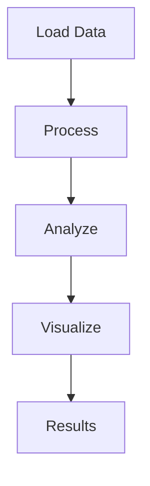

<!-- Copyright 2026 Clayton Young (borealBytes / Superior Byte Works, LLC) -->
<!-- Licensed under the Apache License, Version 2.0. -->

# Ld decay Example

## Overview

This example demonstrates ld decay analysis using open-source tools.

## Workflow



## Running the Example

```bash
cd examples/ld-decay
python run_*.py
```

## Output

Results saved to `output/` directory.

## QTLmax Equivalent

See QTLmax guide for ld decay procedure.
