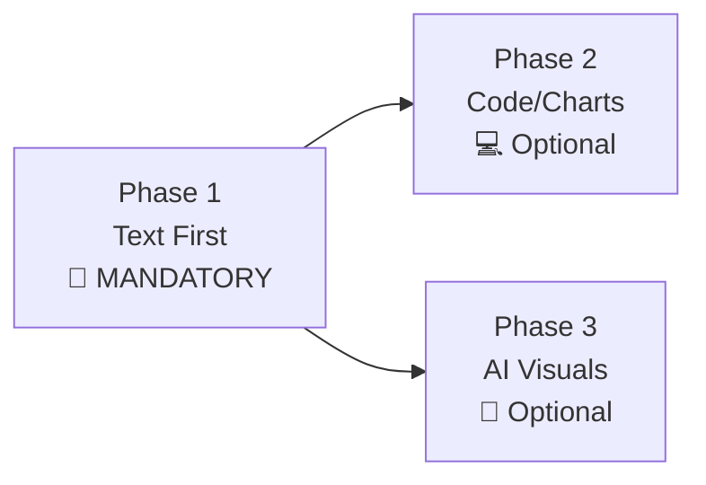

---
# WRIGHTER v0.1 - Publishable Meta-Skill
id: wrighter
layer: meta
version: "0.1.0"
source_model: omni
description: >
  Foundational writing skill for Omni. Generates domain skills
  through structured writing workflows. Phase 1 (text first) is mandatory.

input_schema:
  type: object
  properties:
    domain:
      type: string
      description: Target domain (stories, visuals, notation, prose, discovery, craft, schematics)
    task:
      type: string
      description: Writing task to accomplish
    phase:
      type: string
      enum: [1, 2, 3]
      description: Which phase to execute (1=mandatory, 2=code/charts, 3=AI visuals)
    context:
      type: object
      description: Additional context for the task
  required: [domain, task]

output_schema:
  type: object
  properties:
    content:
      type: string
      description: Generated content
    artifacts:
      type: array
      items:
        type: object
        properties:
          type: string
          path: string
          content: string
    next_phase:
      type: string
      description: Recommended next phase
  required: [content]

derives_from: []

imports: []

test_cases:
  - name: generate_documentation
    input:
      domain: stories
      task: "Create API documentation template"
    expected_output:
      content: "API documentation template"
      artifacts: [{ type: markdown, path: api-docs.md }]

confidence: 0.95
complexity: advanced
tags:
  - meta
  - writing
  - generation
  - templates

author: Omni Team
license: MIT
platform_profile: github-public
jurisdiction_profile: usa

# Provenance
source_date: 2025-03-01
prompt_hash: sha256:wrighter-v0.1-generation
---

# WRIGHTER v0.1

**Meta-skill for generating domain skills through writing workflows.**

## Purpose

WRIGHTER is the foundation of skill generation in Omni. It provides:

- Structured writing workflows (3 phases)
- Domain-specific generators (stories, visuals, notation, prose, discovery, craft, schematics)
- Template systems for consistent output
- Validation and quality gates

## Three-Phase Workflow



### Phase 1: Documentation (MANDATORY)

**Always comes first.** All work begins with comprehensive documentation:

- **Markdown text** - Structured, semantic content
- **Mermaid diagrams** - Visual representations
- **LaTeX math** - Inline and display equations
- **Lean proofs** - Formal verification where applicable

**Rule:** No code or visualization work begins until documentation is complete.

### Phase 2: Code/Charts (Optional)

**Only if needed.** Implementation and data visualization:

- Python charts and data visualization
- Code implementation
- Interactive elements
- Generated tables

**Trigger:** Only proceed when documentation alone cannot convey required information.

### Phase 3: AI Visuals (Optional/Downstream)

**Last resort.** AI-generated visual assets:

- AI-generated schematics
- Publication-ready images
- Complex diagrams beyond Mermaid's capabilities

**Constraint:** Most expensive option. Use only when Phases 1-2 are insufficient.

## Domains

| Domain         | Router                     | Purpose                 | Templates      |
| -------------- | -------------------------- | ----------------------- | -------------- |
| **stories**    | [stories/](stories/)       | Documents, templates    | 287+ templates |
| **visuals**    | [visuals/](visuals/)       | Diagrams, charts, flows | TBD            |
| **notation**   | [notation/](notation/)     | Math, logic, precision  | TBD            |
| **prose**      | [prose/](prose/)           | Writing patterns, style | TBD            |
| **discovery**  | [discovery/](discovery/)   | Research, synthesis     | TBD            |
| **craft**      | [craft/](craft/)           | Validation, tools       | TBD            |
| **schematics** | [schematics/](schematics/) | AI-generated visuals    | TBD            |

Shared: [\_shared/](_shared/)

## Transition Notes

- Markdown and Mermaid resources now route through `wrighter`.
- Legacy entrypoint [markdown-mermaid-writing](../.deprecated/markdown-mermaid-writing/SKILL.md) is deprecated.
- Primary Mermaid router: [visuals/mermaid/SKILL.md](visuals/mermaid/SKILL.md)

## Writing a Domain Skill

### Step 1: Choose Your Domain

```bash
# Select appropriate domain based on output type
DOMAIN=stories  # For document templates
DOMAIN=visuals  # For diagrams and charts
DOMAIN=notation # For mathematical content
```

### Step 2: Create Skill File

Use the template from `skills/_template.md`:

```yaml
---
id: your-skill-name
layer: leaf
version: "1.0.0"
source_model: your-model
description: "What this skill does"

input_schema: { ... }
output_schema: { ... }

parent_skill: skills/_core/wrighter
---
# Your Skill Title

## Purpose
...
```

### Step 3: Follow Phase Rules

1. **Phase 1** - Write all documentation first
2. **Phase 2** - Add code/charts only if needed
3. **Phase 3** - Generate AI visuals only if Phases 1-2 insufficient

### Step 4: Validate

```bash
# Check schema
omni validate --skill your-skill.md

# Run tests
omni test --skill your-skill.md

# Build manifest
python scripts/build-manifest.py
```

## Example: Creating a Template

### Input

```yaml
domain: stories
task: "Create a project proposal template"
phase: "1"
context:
  industry: software
  format: markdown
```

### Output

```markdown
---
template_id: proposal_software_001
category: business
type: project_proposal
---

# Project Proposal: {{PROJECT_NAME}}

## Executive Summary

{{EXECUTIVE_SUMMARY}}

## Scope

{{PROJECT_SCOPE}}

## Timeline

{{TIMELINE}}

## Budget

{{BUDGET}}
```

## Validation

WRIGHTER enforces:

- ✅ Phase 1 completion before Phase 2
- ✅ Phase 1-2 before Phase 3
- ✅ Schema compliance
- ✅ Template structure
- ✅ Documentation quality

## Testing

```bash
# Test skill generation
omni wrighter test \
  --domain stories \
  --task "Create API docs"

# Validate output
omni validate --output generated-skill.md
```

## Contributing

See [CONTRIBUTING.md](../../../CONTRIBUTING.md) for guidelines.

## Version History

- **v0.1.0** (2025-03-01): Initial publishable version
  - 7 domains defined
  - 287+ templates in stories/
  - 3-phase workflow documented
  - Schema validation

## See Also

- [Skill Template](../../_template.md)
- [Contributing Guide](../../../CONTRIBUTING.md)
- [Architecture](../../../ARCHITECTURE.md)
