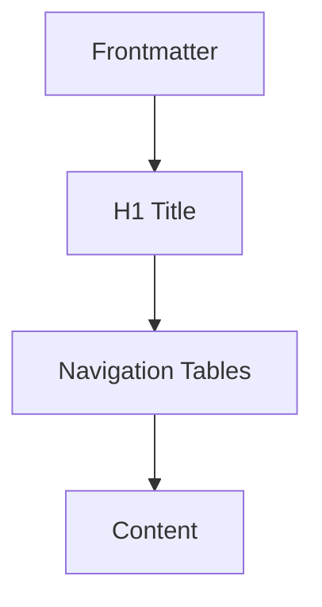

# Conventions

Standards for structure, naming, and formatting.

## Naming

| Pattern | Example | Use For |
|---------|---------|---------|
| kebab-case | `my-file.md` | File names |
| camelCase | `myVariable` | Code variables |
## Structure

## Formatting

- One H1 per document
- Emoji on H2 only
- Tables for navigation
