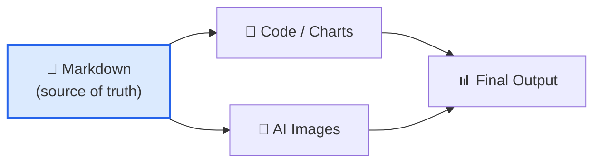

# Writing Principles

These principles apply to every document produced with the unified-writing skill, regardless of domain or format.

---

## ## 1. Reader First

Every decision — word choice, structure, diagram placement — is made for the reader, not the writer.

**Ask before writing:**

- Who is the primary reader?
- What do they already know?
- What decision or action does this document enable?

**Anti-patterns:**

- Writing to demonstrate expertise rather than transfer it
- Burying the conclusion at the end
- Using jargon without definition

---

## ## 2. Claim → Evidence → Implication

Every substantive paragraph follows this structure:

```
Claim:      State the point directly.
Evidence:   Support with data, citation, example, or derivation.
Implication: Explain what follows from the evidence.
```

**Example:**

> **Claim:** Transformer attention scales quadratically with sequence length.
> **Evidence:** The attention matrix $A = \text{softmax}(QK^T / \sqrt{d_k})$ has $O(n^2)$ entries for sequence length $n$.
> **Implication:** For sequences longer than ~4 k tokens, memory becomes the binding constraint, motivating sparse or linear attention variants.

---

## ## 3. One Idea Per Sentence

Long sentences hide weak reasoning. If a sentence contains more than one idea, split it.

| Before                                                                                                                                           | After                                                                                                                                                 |
| ------------------------------------------------------------------------------------------------------------------------------------------------ | ----------------------------------------------------------------------------------------------------------------------------------------------------- |
| "The model was trained on 1 T tokens using AdamW with a cosine schedule and achieved 72.4% on MMLU which is 3.1 points above the previous SOTA." | "The model was trained on 1 T tokens using AdamW with a cosine schedule. It achieved 72.4% on MMLU — 3.1 points above the previous state of the art." |

---

## ## 4. Figures Before Tables Before Text

Visual hierarchy: readers scan before they read.

1. **Figures** (diagrams, plots) — highest information density per second of attention
2. **Tables** — structured comparison, easy to scan
3. **Text** — narrative, context, nuance

Place the figure or table _before_ the paragraph that discusses it.

---

## ## 5. Concrete Before Abstract

Introduce a concept with a concrete example, then generalize.

**Wrong order:**

> "A monad is an endofunctor with two natural transformations satisfying coherence conditions. For example, the `Maybe` type in Haskell is a monad."

**Right order:**

> "In Haskell, `Maybe` wraps a value that might be absent: `Just 42` or `Nothing`. Operations chain without explicit null checks. This pattern — wrapping, chaining, unwrapping — is what a monad formalizes."

---

## ## 6. Precision Over Hedging

Hedging language ("it seems," "arguably," "in some sense") signals uncertainty. Use it only when genuine uncertainty exists. Otherwise, be direct.

| Hedged                                        | Precise                                          |
| --------------------------------------------- | ------------------------------------------------ |
| "The results seem to suggest an improvement." | "Accuracy improved by 4.2 pp (95% CI: 3.1–5.3)." |
| "This approach is arguably better."           | "This approach reduces latency by 40% at p99."   |

---

## ## 7. Structure Is Argument

The order of sections is itself a claim about what matters. Use structure deliberately:

- **IMRAD** (Introduction, Methods, Results, Discussion) for empirical science — see [../prose/scientific/manuscript-structure.md](../prose/scientific/manuscript-structure.md)
- **Problem → Solution → Evidence → Trade-offs** for engineering proposals — see [../templates/software/rfc.md](../templates/software/rfc.md)
- **Context → Task → Action → Result** for user guides — see [../prose/technical/user-guide.md](../prose/technical/user-guide.md)

---

## ## 8. Math Is Prose

Mathematical notation is a compressed form of prose. Every equation needs:

1. **Introduction** — what the equation expresses
2. **Definition** — every symbol defined on first use
3. **Interpretation** — what the equation means in plain language

**Example:**

> The Shannon entropy of a discrete distribution $p$ over $n$ outcomes is:
>
> $$H(p) = -\sum_{i=1}^{n} p_i \log_2 p_i$$
>
> where $p_i$ is the probability of outcome $i$. $H(p)$ measures average surprise in bits: a fair coin has $H = 1$ bit; a certain outcome has $H = 0$ bits.

---

## ## 9. Diagrams Earn Their Place

A diagram is justified when it conveys structure that prose cannot. Use Mermaid for:

- Flows with branching logic
- System component relationships
- Timelines and sequences
- State machines

Do not use diagrams for:

- Simple lists (use bullet points)
- Two-variable relationships (use a table)
- Decoration

See [../diagrams/mermaid/](../diagrams/mermaid/) for 24 diagram types with examples.

---

## ## 10. Documentation Is the Source of Truth

Code, charts, and AI images are derived from documentation — never the reverse.



If the markdown and the code disagree, fix the code.

---

## ## See Also

- [workflow.md](workflow.md) — When to use each phase
- [../prose/scientific/manuscript-structure.md](../prose/scientific/manuscript-structure.md) — IMRAD structure
- [../prose/technical/](../prose/technical/) — Technical documentation
- [../math/notation/index.md](../math/notation/index.md) — Math notation reference
