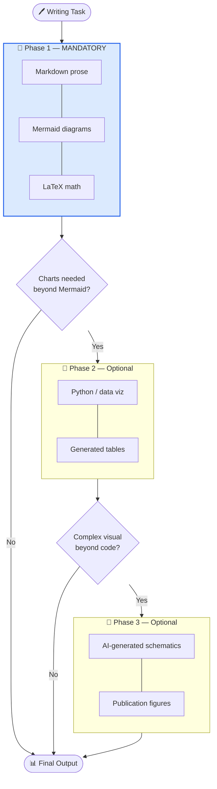
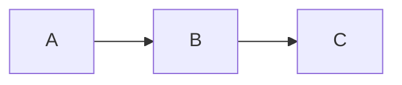
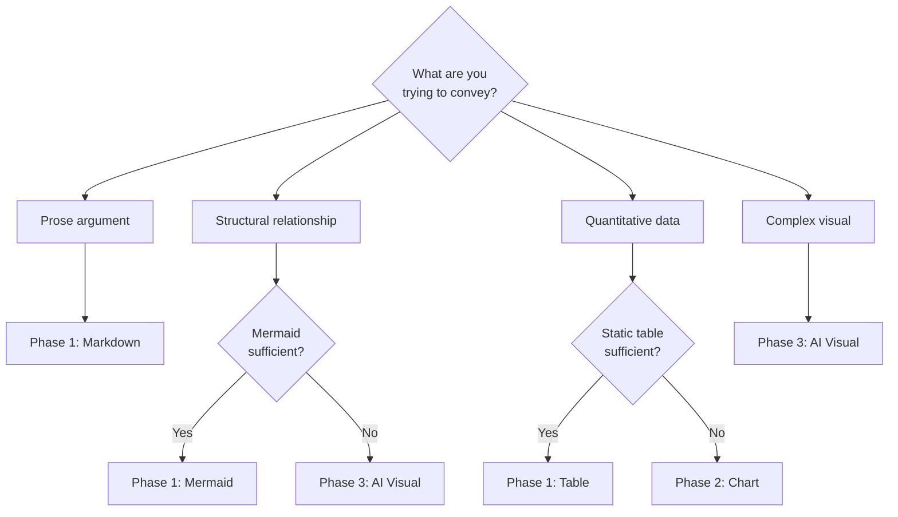

# Three-Phase Workflow

All writing in this skill follows a documentation-first, three-phase workflow. **Phase 1 is mandatory.** Phases 2 and 3 are triggered only when Phase 1 alone cannot convey the required information.

---

## ## Overview



---

## ## Phase 1 — Markdown + Mermaid + Math (Mandatory)

**Always start here.** Phase 1 produces the source of truth.

### What belongs in Phase 1

| Element                               | Tool                       | When to use                                       |
| ------------------------------------- | -------------------------- | ------------------------------------------------- |
| Prose                                 | Markdown                   | Always                                            |
| Flowcharts, sequences, state machines | Mermaid                    | Whenever structure has branching or relationships |
| Equations                             | LaTeX (`$...$`, `$$...$$`) | Whenever math appears                             |
| Tables                                | Markdown tables            | Structured comparisons                            |
| Code blocks                           | Fenced code                | Algorithms, configs, examples                     |

### Mermaid diagram rules

Every Mermaid block must include `accTitle` and `accDescr` for accessibility:

````markdown

````

See [../diagrams/mermaid/](../diagrams/mermaid/) for all 24 supported types.

### LaTeX math rules

- Inline: `$x^2 + y^2 = r^2$`
- Display: `$$\int_0^\infty e^{-x^2}\,dx = \frac{\sqrt{\pi}}{2}$$`
- Define every symbol on first use
- Follow with a plain-English interpretation

### Phase 1 checklist

- [ ] All claims supported by evidence or citation
- [ ] Every diagram has `accTitle` and `accDescr`
- [ ] Every equation has symbol definitions and plain-English interpretation
- [ ] Document structure matches the intended argument (see [principles.md](principles.md))
- [ ] Frontmatter complete (`name`, `description`, `version`, `author`)

---

## ## Phase 2 — Code / Charts (Optional)

**Trigger:** Phase 1 cannot convey quantitative relationships, distributions, or time-series data adequately.

### When to use Phase 2

| Situation                 | Phase 2 tool                              |
| ------------------------- | ----------------------------------------- |
| Statistical distributions | `matplotlib` / `seaborn` histogram or KDE |
| Time-series data          | `matplotlib` line chart                   |
| Correlation matrices      | `seaborn` heatmap                         |
| Benchmark comparisons     | `matplotlib` bar chart                    |
| Geographic data           | `folium` or `geopandas`                   |

### Phase 2 rules

1. The markdown description of the chart (Phase 1) is committed alongside the generated image.
2. Chart code is reproducible — include all data or data-loading logic.
3. Charts use colorblind-safe palettes (e.g., `viridis`, `cividis`, or Okabe-Ito).
4. Every chart has a caption that states the conclusion, not just the content.

**Caption anti-pattern:** "Figure 1: Accuracy vs. epoch."  
**Caption correct:** "Figure 1: Validation accuracy plateaus after epoch 12, suggesting early stopping at epoch 15 wastes compute without benefit."

---

## ## Phase 3 — AI Visuals (Optional)

**Trigger:** The required visual is beyond Mermaid's capabilities and cannot be generated by code (e.g., neural network architecture schematics, biological pathway diagrams, publication-quality conceptual figures).

### When to use Phase 3

| Situation                   | Phase 3 tool                |
| --------------------------- | --------------------------- |
| Neural network architecture | scientific-schematics skill |
| Biological pathway          | scientific-schematics skill |
| Conceptual illustration     | generate-image skill        |
| Publication figure          | scientific-schematics skill |

### Phase 3 rules

1. Phase 1 markdown description of the figure is always committed — the AI image is supplementary.
2. Provide a detailed text prompt derived from the Phase 1 description.
3. Review generated image against Phase 1 description for accuracy.
4. Store generated images in `assets/` alongside the markdown source.

---

## ## Decision Guide



---

## ## Common Mistakes

| Mistake                                            | Correction                                                    |
| -------------------------------------------------- | ------------------------------------------------------------- |
| Starting with a chart before writing the prose     | Write Phase 1 first; charts are derived                       |
| Using AI images for simple flowcharts              | Use Mermaid — it's faster, version-controlled, and accessible |
| Omitting `accTitle`/`accDescr` from Mermaid        | Required for accessibility and screen readers                 |
| Committing only the image, not the markdown source | Always commit both                                            |
| Using Phase 3 for data that could be a table       | Tables are Phase 1 and sufficient for most comparisons        |

---

## ## See Also

- [principles.md](principles.md) — Writing principles
- [../diagrams/mermaid/](../diagrams/mermaid/) — Mermaid diagram reference
- [../math/notation/index.md](../math/notation/index.md) — Math notation
- [../visuals/](../visuals/) — AI schematic generation guide
- [../prose/scientific/manuscript-structure.md](../prose/scientific/manuscript-structure.md) — IMRAD structure
