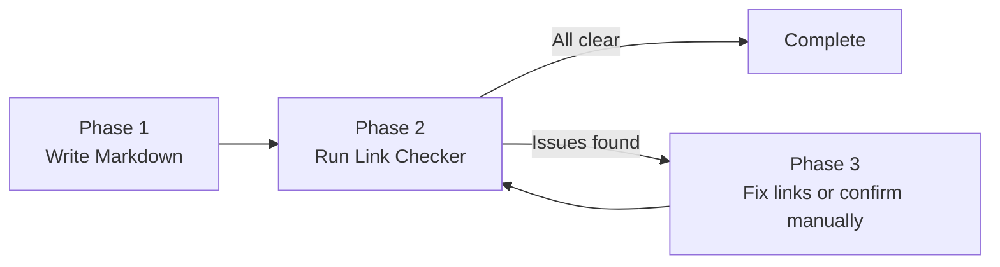

# Unified Writing Link Checker

## Navigation

| Target             | Path                               |
| ------------------ | ---------------------------------- |
| Parent Craft Skill | [../SKILL.md](../SKILL.md)         |
| Tool Script        | [link-checker.sh](link-checker.sh) |
| Tool Config        | [config.toml](config.toml)         |
| Tool README        | [README.md](README.md)             |

## Purpose

This tool adds a repeatable link-check step for the unified-writing workflow.
It wraps `lychee` with markdown report generation and a memory-based override
system for known false positives (for example, sites that block bot requests
with `403` or `429`).

## Three-Phase Integration



- Phase 1: author markdown content.
- Phase 2: run `link-checker.sh` to validate links.
- Phase 3: fix broken links or manually verify bot-blocked links, then re-run.

## Inputs and Outputs

- **Input**: markdown files (`**/*.md`) in a target directory.
- **Output**: `link-check-report.md` and `link-check-report.json`.
- **Memory file**: `.sisyphus/memory/link-overrides.json`.

## Behavior

1. Scans markdown files.
2. Uses `lychee` to validate external and internal links.
3. Separates issues into:
   - broken links (must be fixed)
   - rate-limited/bot-blocked links (`403`, `429`)
4. Optionally prompts for manual verification of `403`/`429` links.
5. Stores verified links in memory for future runs.
6. Generates a markdown report with actionable next steps.

## Override Memory Format

```json
{
  "link-overrides": {
    "https://example.com/page": {
      "status": "manually_verified",
      "verified_by": "user",
      "date": "2026-02-28",
      "notes": "Site blocks bots but works in browser"
    }
  }
}
```

## Usage

Run from repo root:

```bash
bash skills/_core/wrighter/craft/link-checker/link-checker.sh
```

Common options:

- `--target <dir>`: directory to scan.
- `--non-interactive`: do not prompt for manual verification.
- `--report <file>`: markdown report path.
- `--json-report <file>`: machine-readable report path.
- `--memory <file>`: override memory path.
- `--config <file>`: lychee config file.

## Exit Behavior

- Exit `0`: no unresolved broken links.
- Exit `1`: one or more broken links remain.
- `403`/`429` links are reported as warnings unless manually marked broken.
