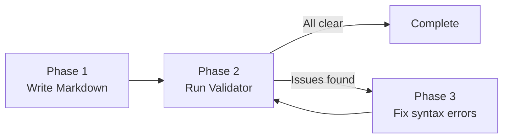

# Unified Writing Mermaid Validator

## Navigation

| Target             | Path                                         |
| ------------------ | -------------------------------------------- |
| Parent Craft Skill | [../SKILL.md](../SKILL.md)                   |
| Tool Script        | [mermaid-validator.sh](mermaid-validator.sh) |
| Tool README        | [README.md](README.md)                       |

## Purpose

This tool validates Mermaid diagrams in markdown files to ensure they render correctly and follow best practices.

It checks for:

- Valid diagram types (flowchart, sequenceDiagram, pie, etc.)
- Correct syntax and structure
- Accessibility (accTitle/accDescr)
- Common mistakes (typos, invalid syntax)

## Three-Phase Integration



- Phase 1: Author markdown with Mermaid diagrams
- Phase 2: Run `mermaid-validator.sh` to validate
- Phase 3: Fix any errors, then re-run

## Inputs and Outputs

- **Input**: Markdown files (`**/*.md`) in target directory
- **Output**: `mermaid-validation-report.md` and `mermaid-validation-report.json`
- **Memory file**: `.sisyphus/memory/mermaid-overrides.json`

## What It Checks

### Syntax Validation

- Valid diagram types (flowchart, sequenceDiagram, pie, gantt, etc.)
- Flowchart direction (TB, TD, LR, RL, BT)
- Subgraph balancing (equal `subgraph` and `end` statements)

### Common Errors

- Typos: `flowhchart`, `seqenceDiagram`, `gant`
- accTitle/accDescr on same line as diagram type
- Using `\n` instead of `<br/>` for line breaks in node labels

- `architecture-beta` → should be `flowchart`
- `radar-beta` → should be `pie` or other valid type
- Typos: `flowhchart`, `seqenceDiagram`, `gant`
- accTitle/accDescr on same line as diagram type

### Accessibility

- Presence of accTitle (title for screen readers)
- Presence of accDescr (description for screen readers)

### Warnings

- Missing accessibility attributes
- Unusual patterns that may indicate errors

## Usage

Run from repo root:

```bash
bash skills/_core/wrighter/craft/mermaid-validator/mermaid-validator.sh
```

Common options:

- `--target <dir>`: directory to scan
- `--non-interactive`: skip prompts
- `--report <file>`: markdown report path
- `--json-report <file>`: JSON report path
- `--memory <file>`: override memory path

## Report Sections

1. **Summary** - Total files, diagrams, errors, warnings
2. **Errors** - Critical issues that prevent rendering
3. **Warnings** - Suggestions for improvement
4. **Sample Valid Diagrams** - Reference for correct patterns
5. **Recommendations** - How to fix common issues

## Exit Codes

- `0`: All diagrams valid (or warnings only)
- `1`: One or more diagrams have errors

## Supported Diagram Types

- flowchart/graph (most common)
- sequenceDiagram
- classDiagram
- stateDiagram / stateDiagram-v2
- erDiagram
- pie
- gantt
- mindmap
- journey
- quadrantChart
- xychart / xychart-beta
- requirementDiagram
- gitgraph
- C4Context / C4Container / C4Component / C4Dynamic / C4Deployment

## Common Fixes

````bash
# Replace invalid architecture-beta
sed -i 's/architecture-beta/flowchart LR/g' file.md

# Fix typos
sed -i 's/flowhchart/flowchart/g' file.md
sed -i 's/seqenceDiagram/sequenceDiagram/g' file.md

# Move accTitle to separate line
# BEFORE:
# ```mermaid
# flowchart TB accTitle: My Diagram
# ```
# AFTER:
# ```mermaid
# flowchart TB
# accTitle: My Diagram
# ```
````
