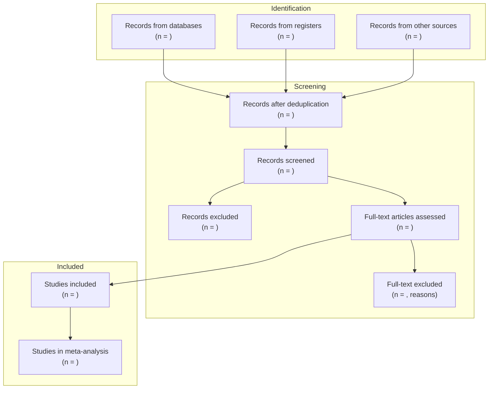

# PRISMA Template

PRISMA (Preferred Reporting Items for Systematic Reviews and Meta-Analyses) is the standard reporting guideline for systematic reviews. The 2020 update (PRISMA 2020) is the current version.

**Citation:** Page MJ, et al. The PRISMA 2020 statement: an updated guideline for reporting systematic reviews. _BMJ_. 2021;372:n71.

---

## ## PRISMA 2020 Flow Diagram



---

## ## Markdown Flow Diagram Template

Use this template to fill in your actual numbers:

```markdown
## PRISMA Flow

**Identification**

- Records from databases: [n]
- Records from registers: [n]
- Records from other sources: [n]
- **Total records identified:** [n]

**Screening**

- Records after deduplication: [n] ([n] duplicates removed)
- Records screened (title/abstract): [n]
- Records excluded at title/abstract: [n]
- Full-text articles assessed: [n]
- Full-text articles excluded: [n]
  - Wrong population: [n]
  - Wrong intervention: [n]
  - Wrong outcome: [n]
  - Wrong study design: [n]
  - Duplicate publication: [n]
  - Other: [n]

**Included**

- Studies included in qualitative synthesis: [n]
- Studies included in meta-analysis: [n]
```

---

## ## PRISMA 2020 Checklist (Abbreviated)

### Title and Abstract

- [ ] **Title:** Identify as systematic review (and meta-analysis if applicable)
- [ ] **Abstract:** Structured abstract with background, objectives, eligibility criteria, sources, methods, results, limitations, conclusions, registration

### Introduction

- [ ] **Rationale:** Describe rationale for review in context of existing knowledge
- [ ] **Objectives:** State explicit question(s) using PICO or equivalent

### Methods

- [ ] **Eligibility criteria:** Specify inclusion/exclusion criteria
- [ ] **Information sources:** Databases, registers, other sources with dates
- [ ] **Search strategy:** Full search string for at least one database
- [ ] **Selection process:** Describe screening process (number of reviewers, independence)
- [ ] **Data extraction:** Describe data extraction process
- [ ] **Risk of bias:** Describe tool used (e.g., Cochrane RoB 2, ROBINS-I)
- [ ] **Effect measures:** Specify effect measure(s) used (RR, OR, MD, SMD)
- [ ] **Synthesis methods:** Describe statistical methods (fixed/random effects, heterogeneity)
- [ ] **Certainty assessment:** Describe method (e.g., GRADE)

### Results

- [ ] **Study selection:** PRISMA flow diagram
- [ ] **Study characteristics:** Table of included study characteristics
- [ ] **Risk of bias:** Results of risk of bias assessment
- [ ] **Results of syntheses:** Results for each outcome with effect estimates and CIs
- [ ] **Heterogeneity:** I² statistic and interpretation
- [ ] **Publication bias:** Funnel plot or statistical test if ≥10 studies

### Discussion

- [ ] **Certainty of evidence:** GRADE summary of findings table
- [ ] **Limitations:** Study-level and review-level limitations
- [ ] **Conclusions:** General interpretation consistent with evidence

### Other

- [ ] **Registration:** PROSPERO or OSF registration number
- [ ] **Funding:** Sources of funding and role of funders
- [ ] **Competing interests:** Declared for all authors

---

## ## Heterogeneity Interpretation

| I² value | Interpretation             |
| -------- | -------------------------- |
| 0–25%    | Low heterogeneity          |
| 25–50%   | Moderate heterogeneity     |
| 50–75%   | Substantial heterogeneity  |
| > 75%    | Considerable heterogeneity |

When I² > 50%, consider:

- Subgroup analysis by pre-specified moderators
- Meta-regression
- Narrative synthesis instead of pooled estimate

---

## ## GRADE Evidence Certainty

| Certainty | Symbol | Meaning                                                       |
| --------- | ------ | ------------------------------------------------------------- |
| High      | ⊕⊕⊕⊕   | Very confident the true effect is close to the estimate       |
| Moderate  | ⊕⊕⊕○   | Moderately confident; true effect likely close but may differ |
| Low       | ⊕⊕○○   | Limited confidence; true effect may differ substantially      |
| Very low  | ⊕○○○   | Very little confidence; true effect likely different          |

**Downgrade for:** Risk of bias, inconsistency, indirectness, imprecision, publication bias  
**Upgrade for:** Large effect, dose-response, all plausible confounders would reduce effect

---

## ## Registration

Register your systematic review before data collection:

| Registry          | URL                                                             | Cost | Best for        |
| ----------------- | --------------------------------------------------------------- | ---- | --------------- |
| PROSPERO          | [crd.york.ac.uk/prospero](https://www.crd.york.ac.uk/prospero/) | Free | Health/clinical |
| OSF               | [osf.io](https://osf.io)                                        | Free | Any domain      |
| Research Registry | [researchregistry.com](https://www.researchregistry.com)        | Free | Any domain      |

---

## ## See Also

- [systematic-review.md](systematic-review.md) — Full systematic review workflow
- [search-strategy.md](search-strategy.md) — Database search strategy
- [synthesis-methods.md](synthesis-methods.md) — Meta-analysis methods
- [../../templates/scientific/study_protocol.md](../../templates/scientific/study_protocol.md) — Study protocol
