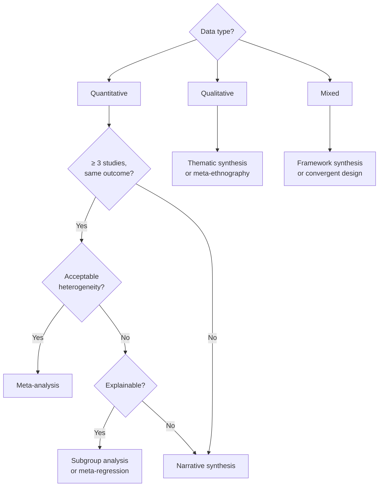

# Evidence Synthesis Methods

Evidence synthesis combines findings from multiple studies into a coherent summary. The method depends on the type of data, number of studies, and degree of heterogeneity.

---

## ## Synthesis Method Selection



---

## ## Meta-Analysis

### Effect measures by outcome type

| Outcome type                  | Effect measure        | Formula                                           |
| ----------------------------- | --------------------- | ------------------------------------------------- |
| Binary (events)               | Risk ratio (RR)       | $RR = \frac{p_1}{p_0}$                            |
| Binary (events)               | Odds ratio (OR)       | $OR = \frac{p_1/(1-p_1)}{p_0/(1-p_0)}$            |
| Binary (events)               | Risk difference (RD)  | $RD = p_1 - p_0$                                  |
| Continuous                    | Mean difference (MD)  | $MD = \bar{x}_1 - \bar{x}_0$                      |
| Continuous (different scales) | Standardized MD (SMD) | $SMD = \frac{\bar{x}_1 - \bar{x}_0}{SD_{pooled}}$ |
| Time-to-event                 | Hazard ratio (HR)     | From Cox model                                    |

### Fixed vs. random effects

| Model              | Assumption                                     | When to use                                               |
| ------------------ | ---------------------------------------------- | --------------------------------------------------------- |
| **Fixed effects**  | All studies estimate the same true effect      | Studies are identical in design, population, intervention |
| **Random effects** | Studies estimate different but related effects | Studies vary in design, population, or intervention       |

**In practice:** Use random effects for most clinical and social science meta-analyses. Fixed effects is rarely justified.

### Pooled effect calculation (random effects)

The DerSimonian-Laird estimator:

$$\hat{\theta}_{RE} = \frac{\sum_i w_i^* \hat{\theta}_i}{\sum_i w_i^*}$$

where $w_i^* = \frac{1}{\sigma_i^2 + \hat{\tau}^2}$, $\sigma_i^2$ is the within-study variance, and $\hat{\tau}^2$ is the between-study variance (heterogeneity).

### Heterogeneity statistics

**Cochran's Q:**
$$Q = \sum_i w_i (\hat{\theta}_i - \hat{\theta})^2$$

Under the null hypothesis of homogeneity, $Q \sim \chi^2_{k-1}$ where $k$ is the number of studies.

**I² statistic:**
$$I^2 = \frac{Q - (k-1)}{Q} \times 100\%$$

| I²     | Interpretation |
| ------ | -------------- |
| 0–25%  | Low            |
| 25–50% | Moderate       |
| 50–75% | Substantial    |
| > 75%  | Considerable   |

**τ² (tau-squared):** Absolute measure of between-study variance. More interpretable than I² when effect sizes are large.

---

## ## Forest Plot Interpretation

```
Study          Effect (95% CI)     Weight
Smith 2018     ─●─                 12.3%
Jones 2019       ─●──              8.7%
Lee 2020       ──●──               15.2%
Chen 2021        ─●─               11.8%
Kumar 2022     ──●───              9.4%
─────────────────────────────────────────
Pooled         ──◆──               100%
               |    |    |
              0.5   1.0  2.0
              ← Favors treatment | Favors control →
```

**Reading a forest plot:**

- Each row = one study
- Box size = study weight (larger = more weight)
- Horizontal line = 95% CI
- Diamond = pooled estimate (width = 95% CI)
- Vertical line at 1.0 (RR/OR) or 0 (MD) = null effect
- If CI crosses null line → not statistically significant

---

## ## Publication Bias Assessment

### Funnel plot

A funnel plot plots effect size (x-axis) against precision (y-axis, typically SE or 1/SE). In the absence of publication bias, studies should be symmetrically distributed around the pooled estimate.

**Asymmetry suggests:**

- Publication bias (small negative studies not published)
- Heterogeneity
- Chance (especially with < 10 studies)

### Statistical tests

| Test          | When to use         | Null hypothesis                           |
| ------------- | ------------------- | ----------------------------------------- |
| Egger's test  | Continuous outcomes | No small-study effect                     |
| Begg's test   | Any outcome         | No rank correlation between effect and SE |
| Trim and fill | Any outcome         | Estimates missing studies                 |

**Minimum studies for funnel plot:** 10. With fewer studies, tests have low power.

---

## ## Subgroup Analysis

Pre-specified subgroup analyses explore whether the effect differs by:

- Study design (RCT vs. observational)
- Population characteristics (age, sex, disease severity)
- Intervention characteristics (dose, duration)
- Setting (country, healthcare system)

**Test for interaction (not separate p-values):**

$$Q_{between} = Q_{total} - \sum_j Q_j$$

where $Q_j$ is the within-subgroup Q statistic. $Q_{between} \sim \chi^2_{g-1}$ where $g$ is the number of subgroups.

**Caution:** Subgroup analyses are exploratory. Multiple testing inflates false positive rate. Pre-register subgroup hypotheses.

---

## ## Narrative Synthesis

When meta-analysis is not appropriate, use structured narrative synthesis:

### 1. Tabulate results

Create a table of all included studies with:

- Study ID, design, N
- Population characteristics
- Intervention details
- Outcome measure and result
- Risk of bias judgment

### 2. Describe direction and magnitude

For each outcome:

- How many studies found a positive/negative/null effect?
- What is the range of effect sizes?
- Are results consistent across study designs?

### 3. Explain variation

Identify factors that might explain differences:

- Population differences
- Intervention differences
- Outcome measurement differences
- Risk of bias

### 4. Assess certainty (GRADE)

See [prisma-template.md](prisma-template.md) for GRADE guidance.

---

## ## Software

| Software                  | Cost | Strengths                           |
| ------------------------- | ---- | ----------------------------------- |
| **RevMan**                | Free | Cochrane standard; forest plots     |
| **R (`meta`, `metafor`)** | Free | Flexible; publication-quality plots |
| **Stata (`metan`)**       | Paid | Widely used in epidemiology         |
| **JASP**                  | Free | GUI; Bayesian meta-analysis         |
| **OpenMeta[Analyst]**     | Free | User-friendly GUI                   |

**R example (random effects meta-analysis):**

```r
library(meta)

# Data: yi = effect sizes, sei = standard errors
result <- metagen(
  TE = yi,
  seTE = sei,
  studlab = study_id,
  data = my_data,
  sm = "RR",           # Summary measure
  method.tau = "DL",   # DerSimonian-Laird
  hakn = TRUE          # Hartung-Knapp adjustment
)

forest(result)
funnel(result)
```

---

## ## See Also

- [systematic-review.md](systematic-review.md) — Full systematic review workflow
- [prisma-template.md](prisma-template.md) — PRISMA reporting
- [../../math/notation/](../../math/notation/) — Statistical notation
- [../../prose/scientific/results-section.md](../../prose/scientific/results-section.md) — Reporting synthesis results
