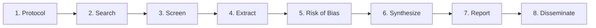
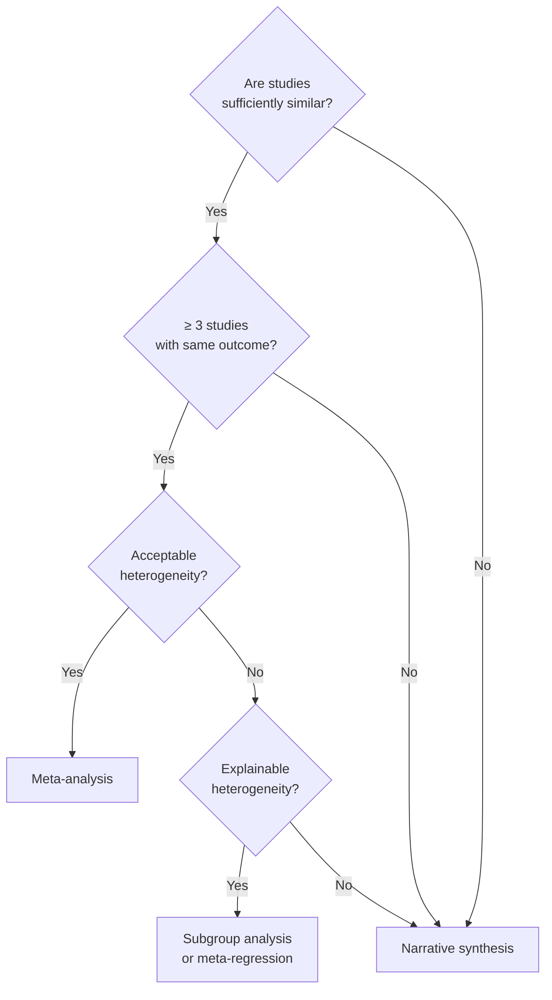

# Systematic Review Workflow

A systematic review uses explicit, reproducible methods to identify, select, and synthesize all available evidence on a defined question. It is the highest level of evidence synthesis.

---

## ## Workflow Overview



---

## ## Stage 1: Protocol Development

**Before searching, write and register a protocol.**

A protocol specifies in advance:

- Research question (PICO/SPIDER)
- Eligibility criteria
- Search strategy
- Screening process
- Data extraction fields
- Risk of bias tool
- Synthesis methods
- Subgroup analyses

**Register at:** PROSPERO ([crd.york.ac.uk/prospero](https://www.crd.york.ac.uk/prospero/)) or OSF ([osf.io](https://osf.io))

**Why register?** Prevents outcome reporting bias and selective reporting. Reviewers who change their methods after seeing results must disclose this.

---

## ## Stage 2: Systematic Search

See [search-strategy.md](search-strategy.md) for full guidance.

**Minimum requirements:**

- ≥ 2 databases searched
- Full search string documented for at least one database
- Grey literature searched (ClinicalTrials.gov, WHO ICTRP)
- Search date recorded

**Output:** Deduplicated record set in reference manager (Endnote, Zotero, Rayyan)

---

## ## Stage 3: Screening

### Two-stage screening

**Stage 3a: Title/abstract screening**

- Two independent reviewers screen all records
- Apply eligibility criteria
- Resolve disagreements by discussion or third reviewer
- Record reasons for exclusion

**Stage 3b: Full-text screening**

- Retrieve full text for all records not excluded at title/abstract
- Two independent reviewers apply eligibility criteria
- Record specific reason for each exclusion

**Tools:** Rayyan (free), Covidence (paid), Abstrackr (free)

**Interrater reliability:** Calculate Cohen's κ or percentage agreement. κ > 0.6 is acceptable; κ > 0.8 is good.

### Eligibility criteria template

```markdown
**Inclusion criteria:**

- Population: [specific definition]
- Intervention: [specific definition]
- Comparator: [specific definition or "any"]
- Outcomes: [primary and secondary outcomes]
- Study design: [e.g., RCTs only; or RCTs and cohort studies]
- Date range: [e.g., 2000–present]
- Language: [e.g., English only — justify restriction]

**Exclusion criteria:**

- [Specific exclusion 1]
- [Specific exclusion 2]
```

---

## ## Stage 4: Data Extraction

### Data extraction form

Design the form before extraction. Extract:

**Study characteristics:**

- Author, year, country
- Study design, setting
- Sample size, follow-up duration
- Funding source

**Population characteristics:**

- Age (mean ± SD or median [IQR])
- Sex distribution
- Baseline disease severity
- Inclusion/exclusion criteria applied

**Intervention details:**

- Dose, frequency, duration
- Comparator details
- Co-interventions

**Outcomes:**

- Primary outcome: measure, timing, result (n/N or mean ± SD)
- Secondary outcomes
- Adverse events

**Process:**

- Two independent extractors
- Resolve disagreements by discussion
- Contact authors for missing data

**Tools:** REDCap, Excel, Covidence, or custom form

---

## ## Stage 5: Risk of Bias Assessment

### Tools by study design

| Study design           | Tool           | Reference                                                                |
| ---------------------- | -------------- | ------------------------------------------------------------------------ |
| RCT                    | Cochrane RoB 2 | [training.cochrane.org/rob2](https://training.cochrane.org/rob2)         |
| Non-randomized studies | ROBINS-I       | [training.cochrane.org/robins-i](https://training.cochrane.org/robins-i) |
| Diagnostic accuracy    | QUADAS-2       | [quadas.org](http://www.quadas.org)                                      |
| Prognostic studies     | PROBAST        | [probast.org](https://www.probast.org)                                   |
| Qualitative studies    | CASP           | [casp-uk.net](https://casp-uk.net)                                       |

### Cochrane RoB 2 domains (RCTs)

| Domain                                     | Assesses                                       |
| ------------------------------------------ | ---------------------------------------------- |
| D1: Randomization                          | Sequence generation and allocation concealment |
| D2: Deviations from intended interventions | Blinding of participants and personnel         |
| D3: Missing outcome data                   | Completeness of outcome data                   |
| D4: Outcome measurement                    | Blinding of outcome assessors                  |
| D5: Selection of reported results          | Selective outcome reporting                    |

**Overall judgment:** Low / Some concerns / High risk of bias

---

## ## Stage 6: Synthesis

See [synthesis-methods.md](synthesis-methods.md) for statistical details.

### Decision tree



### Narrative synthesis structure

When meta-analysis is not appropriate:

1. **Tabulate** study characteristics and results
2. **Describe** direction and magnitude of effects across studies
3. **Explain** sources of variation
4. **Assess** overall certainty of evidence (GRADE)

---

## ## Stage 7: Reporting

Follow PRISMA 2020 — see [prisma-template.md](prisma-template.md).

**Key reporting elements:**

- PRISMA flow diagram with exact numbers
- Table of included study characteristics
- Risk of bias summary figure
- Forest plot (if meta-analysis)
- GRADE summary of findings table
- Sensitivity analyses

---

## ## Stage 8: Dissemination

| Channel                  | Audience            | Format                 |
| ------------------------ | ------------------- | ---------------------- |
| Peer-reviewed journal    | Researchers         | Full manuscript        |
| Cochrane Database        | Clinicians          | Cochrane review format |
| Policy brief             | Policymakers        | 2-page summary         |
| Plain language summary   | Public              | Lay summary            |
| Preprint (medRxiv, SSRN) | Rapid dissemination | Preprint               |

---

## ## Timeline Estimate

| Stage                    | Duration       |
| ------------------------ | -------------- |
| Protocol development     | 2–4 weeks      |
| Database searching       | 1–2 weeks      |
| Title/abstract screening | 2–6 weeks      |
| Full-text screening      | 2–4 weeks      |
| Data extraction          | 4–8 weeks      |
| Risk of bias assessment  | 2–4 weeks      |
| Synthesis and writing    | 4–8 weeks      |
| **Total**                | **4–9 months** |

---

## ## See Also

- [search-strategy.md](search-strategy.md) — Database search strategy
- [prisma-template.md](prisma-template.md) — PRISMA flow diagram
- [synthesis-methods.md](synthesis-methods.md) — Meta-analysis methods
- [citation-management.md](citation-management.md) — Reference management
- [../../prose/scientific/manuscript-structure.md](../../prose/scientific/manuscript-structure.md) — Writing the manuscript
