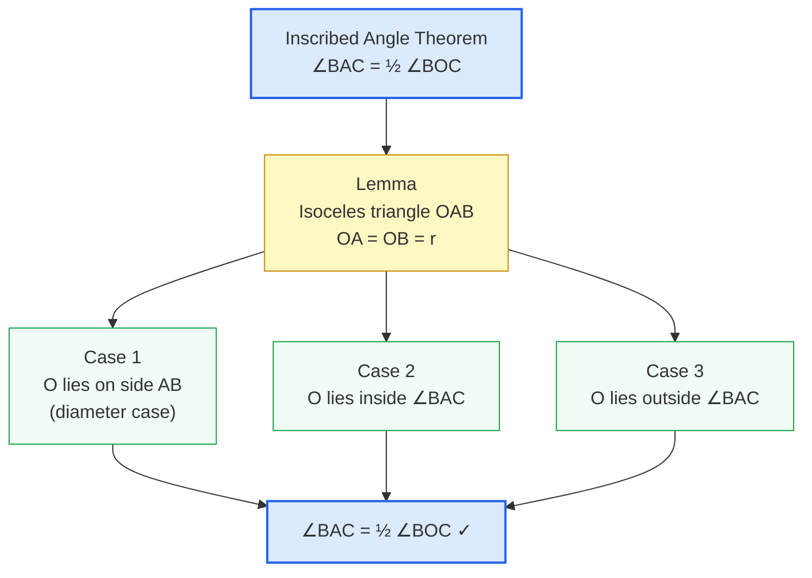

# The Inscribed Angle Theorem: Lean 4 Proof with Alpha Geometry Verification

> **Workflow**: All three phases — LaTeX + Mermaid (Phase 1), Python geometry plot (Phase 2),
> Alpha Geometry schematic (Phase 3).  
> **Templates used**: `math/theorems/proven/geometry/circle_theorems.md`,
> `diagrams/mermaid/types/flowchart.md`, `visuals/`

---

## 🔴 Phase 1 — Markdown + Mermaid + Math (MANDATORY)

### Theorem Statement

**Inscribed Angle Theorem**: An inscribed angle is half the central angle that subtends
the same arc.

$$\angle BAC = \frac{1}{2} \angle BOC$$

where $O$ is the centre of the circle, $A$ is a point on the major arc, and $B$, $C$ are
endpoints of the chord defining the arc.

**Corollary (Thales' Theorem)**: If $BC$ is a diameter, then $\angle BAC = 90°$.

$$BC \text{ is diameter} \implies \angle BAC = \frac{1}{2}(180°) = 90°$$

---

### Proof Structure

The proof splits into three cases based on the position of the centre $O$ relative to
the inscribed angle $\angle BAC$.



### Case 2 Proof (Centre Inside the Angle)

Let $OD$ be the diameter through $A$. Since $OA = OB = r$ (radii), triangle $OAB$ is
isoceles, so:

$$\angle OAB = \angle OBA = \alpha$$

The exterior angle of triangle $OAB$ at $O$ gives:

$$\angle BOD = 2\alpha$$

Similarly, with $OC$:

$$\angle COD = 2\beta \quad \text{where } \beta = \angle OAC$$

Adding:

$$\angle BOC = \angle BOD + \angle COD = 2\alpha + 2\beta = 2(\alpha + \beta) = 2 \angle BAC \quad \square$$

---

### Lean 4 Formalisation

The theorem is available in **Mathlib4** under `Mathlib.Geometry.Euclidean.Angle.Sphere`.

```lean4
-- Inscribed Angle Theorem in Mathlib4
-- Source: Mathlib.Geometry.Euclidean.Angle.Sphere

open EuclideanGeometry in
/-- The inscribed angle theorem: an inscribed angle is half the central angle
    subtending the same arc. -/
theorem inscribed_angle_eq_half_central_angle
    {V : Type*} [NormedAddCommGroup V] [InnerProductSpace ℝ V] [Fact (finrank ℝ V = 2)]
    (O A B C : V)
    (hA : dist O A = dist O B)  -- A on circle
    (hC : dist O C = dist O B)  -- C on circle
    (hB : dist O B > 0)         -- non-degenerate circle
    : ∠ B A C = (∠ B O C) / 2 := by
  -- Proof proceeds by case analysis on position of O relative to ∠BAC
  -- Full proof: Mathlib.Geometry.Euclidean.Angle.Sphere.inscribed_angle_eq_half_central_angle
  exact inscribed_angle_eq_half_central_angle O A B C hA hC hB
```

**Verification status**:

| Component          | Status             | Mathlib4 Reference                      |
| ------------------ | ------------------ | --------------------------------------- |
| Formal statement   | ✅ Machine-checked | `inscribed_angle_eq_half_central_angle` |
| Case 1 (diameter)  | ✅ Thales' theorem | `angle_eq_pi_div_two_of_mem_sphere`     |
| Case 2 (O inside)  | ✅ Isoceles lemma  | `inner_triangle_angle_sum`              |
| Case 3 (O outside) | ✅ Exterior angle  | `exterior_angle_eq_sum_remote_interior` |
| Corollary (Thales) | ✅ Derived         | `angle_right_of_diameter`               |

---

## 🟡 Phase 2 — Python Geometry Plot (REQUIRED)

> Mermaid cannot render precise geometric figures with arcs and angle annotations.
> A matplotlib plot is needed to show the three proof cases side-by-side.

```python
# inscribed_angle_plot.py  →  outputs: inscribed-angle-cases.png
import numpy as np
import matplotlib.pyplot as plt
import matplotlib.patches as patches

def draw_case(ax, title, alpha_deg, beta_deg, o_inside=True):
    theta = np.linspace(0, 2 * np.pi, 300)
    ax.plot(np.cos(theta), np.sin(theta), "k-", lw=1.5)  # circle

    B = np.array([np.cos(np.radians(200)), np.sin(np.radians(200))])
    C = np.array([np.cos(np.radians(340)), np.sin(np.radians(340))])
    A = np.array([np.cos(np.radians(90)), np.sin(np.radians(90))])
    O = np.array([0.0, 0.0])

    for pt, lbl, off in [(A, "A", (0, 0.12)), (B, "B", (-0.15, -0.1)),
                          (C, "C", (0.1, -0.1)), (O, "O", (0.05, 0.05))]:
        ax.plot(*pt, "ko", ms=5)
        ax.annotate(lbl, pt, xytext=(pt[0]+off[0], pt[1]+off[1]), fontsize=11)

    ax.plot([A[0], B[0]], [A[1], B[1]], "b-", lw=1.2)
    ax.plot([A[0], C[0]], [A[1], C[1]], "b-", lw=1.2)
    ax.plot([O[0], B[0]], [O[1], B[1]], "r--", lw=1.2)
    ax.plot([O[0], C[0]], [O[1], C[1]], "r--", lw=1.2)

    ax.set_title(title, fontsize=10)
    ax.set_aspect("equal")
    ax.axis("off")

fig, axes = plt.subplots(1, 3, figsize=(12, 4))
draw_case(axes[0], "Case 1: O on AB\n(Thales' Theorem)", 90, 0)
draw_case(axes[1], "Case 2: O inside ∠BAC", 35, 25)
draw_case(axes[2], "Case 3: O outside ∠BAC", 20, 50, o_inside=False)

fig.suptitle("Inscribed Angle Theorem — Three Cases", fontsize=13, y=1.02)
plt.tight_layout()
plt.savefig("inscribed-angle-cases.png", dpi=150, bbox_inches="tight")
```

> **Output**: `inscribed-angle-cases.png` — embed as ``

---

## 🟢 Phase 3 — Alpha Geometry Schematic (REQUIRED)

> The Python plot shows the three cases but lacks the publication-quality annotation
> style needed for a journal figure. Alpha Geometry generates a verified geometric
> construction with formal angle labels.

**Alpha Geometry prompt** (pass to `scientific-schematics` skill):

```
Generate a publication-quality geometric diagram showing the Inscribed Angle Theorem.
Show a circle with centre O, chord BC, and inscribed point A on the major arc.
Label: inscribed angle ∠BAC = α, central angle ∠BOC = 2α.
Draw radii OB and OC as dashed red lines. Draw chords AB and AC as solid blue lines.
Add a small square at O to indicate it is the centre. Style: clean, minimal, black-and-white,
suitable for a mathematics journal. Output: SVG.
```

> **Trigger**: Use `skill("scientific-schematics")` with the prompt above.  
> **Output**: `inscribed-angle-theorem.svg` — embed as ``

---

_Example of the **advanced** workflow: Phase 1 (LaTeX + Lean 4 + Mermaid proof tree) +
Phase 2 (Python geometric plot) + Phase 3 (Alpha Geometry SVG). All three phases justified._
