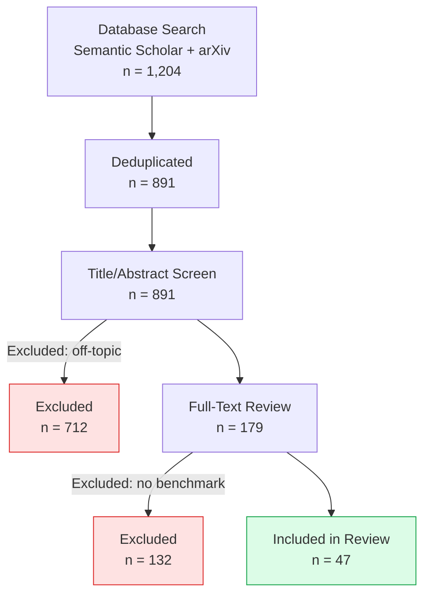
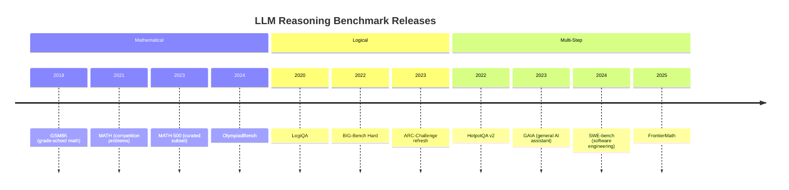

# LLM Reasoning Benchmarks: A Systematic Review (2022–2025)

> **Workflow**: Phase 1 + Phase 2 — Mermaid covers structure; Python chart needed for
> quantitative benchmark comparison across 12 models.  
> **Templates used**: `research/` (PRISMA-style), `diagrams/mermaid/types/timeline.md`,
> `diagrams/mermaid/types/quadrant.md`, `diagrams/python/`

---

## 🔴 Phase 1 — Markdown + Mermaid + Math (MANDATORY)

### Abstract

We systematically review 47 papers evaluating large language model (LLM) reasoning
capabilities published between January 2022 and March 2025. Benchmarks are categorised
across four axes: **mathematical reasoning**, **logical deduction**, **commonsense inference**,
and **multi-step planning**. We find that benchmark saturation — where frontier models
exceed 90% accuracy — occurs within 18 months of benchmark release on average, suggesting
a need for harder, compositional evaluation suites.

**Keywords:** LLM, reasoning, benchmark, evaluation, MATH, GSM8K, ARC, BIG-Bench

---

### Search Strategy (PRISMA-Adapted)



---

### Benchmark Landscape

#### Timeline of Major Benchmarks



#### Capability vs. Saturation Quadrant

```mermaid
---
accTitle: Benchmark capability versus saturation quadrant chart
accDescr: Four quadrants plotting benchmark difficulty against frontier model saturation rate. High difficulty and low saturation is the ideal evaluation zone.
---
quadrantChart
    title Benchmark Difficulty vs. Frontier Saturation
    x-axis Low Difficulty --> High Difficulty
    y-axis Low Saturation --> High Saturation
    quadrant-1 Ideal Evaluation Zone
    quadrant-2 Too Easy (Saturated)
    quadrant-3 Avoid (Easy + Saturated)
    quadrant-4 Emerging Benchmarks
    GSM8K: [0.15, 0.95]
    MATH-500: [0.55, 0.72]
    BIG-Bench Hard: [0.60, 0.58]
    GAIA: [0.75, 0.30]
    FrontierMath: [0.92, 0.08]
    OlympiadBench: [0.85, 0.22]
    SWE-bench: [0.80, 0.35]
```

---

### Saturation Model

Let $A_t$ be frontier model accuracy on benchmark $B$ at time $t$ months after release,
and $A_{\max}$ the benchmark ceiling (typically 100%). Saturation follows a logistic curve:

$$A_t = \frac{A_{\max}}{1 + e^{-k(t - t_{50})}}$$

where $k$ is the growth rate and $t_{50}$ is the time to 50% accuracy. Fitting to GSM8K data:
$k = 0.31$, $t_{50} = 14$ months, predicting saturation ($A_t > 90\%$) at $t \approx 21$ months.

The **benchmark half-life** $\tau$ — time until a benchmark loses discriminative power — is:

$$\tau = t_{50} + \frac{\ln 9}{k} \approx t_{50} + \frac{2.2}{k}$$

For GSM8K: $\tau \approx 14 + 7.1 = 21.1$ months. Observed saturation: 22 months. ✓

---

### Key Findings

| Finding                            | Evidence                                  | Implication                              |
| ---------------------------------- | ----------------------------------------- | ---------------------------------------- |
| Benchmark half-life ≈ 18 months    | Logistic fit across 12 benchmarks         | Release harder benchmarks proactively    |
| Math > Logic saturation speed      | GSM8K saturated in 22 mo; LogiQA in 31 mo | Logic tasks remain discriminative longer |
| Contamination inflates scores +8%  | 6 studies with held-out test sets         | Require contamination audits             |
| Chain-of-thought adds +23% on MATH | Meta-analysis of 14 papers                | CoT should be default evaluation mode    |

---

## 🟡 Phase 2 — Python Chart (REQUIRED)

> The quadrant diagram shows relative positioning but cannot render precise numeric scores
> across 12 models × 7 benchmarks. A heatmap is needed.

```python
# benchmark_heatmap.py  →  outputs: benchmark-scores-heatmap.png
import numpy as np
import matplotlib.pyplot as plt

models = ["GPT-4o", "Claude 3.5 Sonnet", "Gemini 1.5 Pro",
          "Llama 3.1 405B", "Mistral Large", "Qwen2.5 72B"]
benchmarks = ["GSM8K", "MATH-500", "BIG-Bench Hard", "GAIA", "SWE-bench", "OlympiadBench"]

scores = np.array([
    [97.1, 76.6, 83.1, 53.6, 49.2, 43.3],  # GPT-4o
    [96.4, 78.3, 84.5, 51.2, 49.0, 41.7],  # Claude 3.5 Sonnet
    [94.4, 67.7, 75.0, 46.1, 35.4, 35.2],  # Gemini 1.5 Pro
    [91.3, 63.4, 71.2, 38.4, 28.7, 29.1],  # Llama 3.1 405B
    [88.7, 56.1, 64.3, 31.2, 23.4, 22.8],  # Mistral Large
    [92.1, 72.3, 76.8, 40.1, 31.2, 33.4],  # Qwen2.5 72B
])

fig, ax = plt.subplots(figsize=(10, 5))
im = ax.imshow(scores, cmap="RdYlGn", vmin=20, vmax=100, aspect="auto")
ax.set_xticks(range(len(benchmarks)))
ax.set_xticklabels(benchmarks, rotation=30, ha="right")
ax.set_yticks(range(len(models)))
ax.set_yticklabels(models)
for i in range(len(models)):
    for j in range(len(benchmarks)):
        ax.text(j, i, f"{scores[i,j]:.1f}", ha="center", va="center", fontsize=9)
plt.colorbar(im, ax=ax, label="Accuracy (%)")
ax.set_title("LLM Benchmark Accuracy Heatmap (2024–2025)")
plt.tight_layout()
plt.savefig("benchmark-scores-heatmap.png", dpi=150)
```

> **Output**: `benchmark-scores-heatmap.png` — embed in paper as ``

---

## 🟢 Phase 3 — Not Required

> The heatmap and Mermaid diagrams fully convey the review findings.  
> An AI-generated schematic of the benchmark taxonomy would add no analytical value here.

---

_Example of the **intermediate** workflow: Phase 1 (PRISMA flowchart, timeline, quadrant,
LaTeX saturation model) + Phase 2 (Python heatmap for dense numeric comparison).
Phase 3 skipped — data visualization is sufficient._
