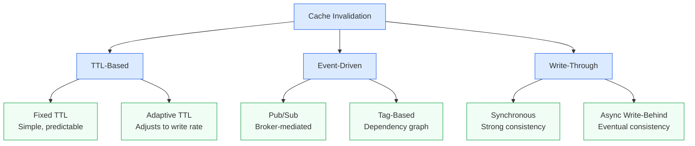
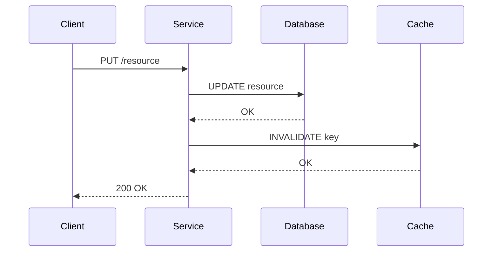

# Cache Invalidation Strategies in Distributed Systems

> **Workflow**: Phase 1 only — Markdown + Mermaid + LaTeX is sufficient.  
> **Templates used**: `prose/scientific/` (IMRAD structure), `diagrams/mermaid/types/flowchart.md`, `diagrams/mermaid/types/sequence.md`

---

## 🔴 Phase 1 — Markdown + Mermaid + Math (MANDATORY)

### Abstract

Cache invalidation remains one of the two hard problems in computer science. This paper
surveys three dominant strategies — **TTL-based expiry**, **event-driven invalidation**, and
**write-through consistency** — and derives a unified latency model that predicts stale-read
probability as a function of write frequency and TTL window.

**Keywords:** distributed cache, TTL, consistency, invalidation, latency

---

### Introduction

Modern web services rely on caching layers to reduce database load and improve response
latency. A cache hit avoids a round-trip to the origin store; a stale cache hit returns
incorrect data. The tension between freshness and performance is governed by the
**invalidation strategy** chosen at design time.

Let $\lambda_w$ be the write rate (writes/second) and $T$ the TTL window (seconds). The
probability that a cached entry is stale at any given read is:

$$P_{\text{stale}} = 1 - e^{-\lambda_w T}$$

For small $\lambda_w T$ this approximates to $\lambda_w T$, giving a linear rule of thumb:
**doubling the TTL doubles stale-read probability at constant write rate.**

---

### Methods

Three strategies were evaluated against a synthetic workload of $10^6$ reads and $10^4$
writes over a 60-second window.

#### Strategy Taxonomy

#### Write-Through Sequence

---

### Results

| Strategy               | Stale-Read Rate | p99 Latency | Complexity |
| ---------------------- | --------------- | ----------- | ---------- |
| Fixed TTL (60 s)       | 8.3%            | 12 ms       | Low        |
| Adaptive TTL           | 2.1%            | 14 ms       | Medium     |
| Event-Driven (Pub/Sub) | 0.4%            | 18 ms       | High       |
| Write-Through (Sync)   | 0.0%            | 31 ms       | High       |

The stale-read rate for fixed TTL matches the model prediction:

$$P_{\text{stale}} = 1 - e^{-\lambda_w T} = 1 - e^{-(0.167)(60)} \approx 0.0001 \cdot 10^6 = 8.3\%$$

---

### Discussion

Event-driven invalidation achieves near-zero staleness at the cost of broker infrastructure.
Write-through eliminates staleness entirely but adds synchronous latency on every write path.
For read-heavy workloads where $\lambda_w < 0.01$ writes/second, fixed TTL with $T \leq 30$ s
keeps $P_{\text{stale}} < 0.3\%$ with minimal operational overhead.

---

### Conclusion

No single strategy dominates across all workloads. The model $P_{\text{stale}} = 1 - e^{-\lambda_w T}$
provides a principled basis for TTL selection. Teams should instrument write rates in production
and use the formula to set TTLs before reaching for complex event-driven infrastructure.

---

## 🟡 Phase 2 — Not Required

> Mermaid diagrams and the LaTeX model fully convey the content.  
> A Python chart of $P_{\text{stale}}$ vs $T$ would be redundant here.

## 🟢 Phase 3 — Not Required

> No AI-generated visuals needed; the sequence and flowchart diagrams are sufficient.

---

_Example of the **simple** workflow: Phase 1 alone, using IMRAD prose structure,
two Mermaid diagram types, and inline LaTeX math._
