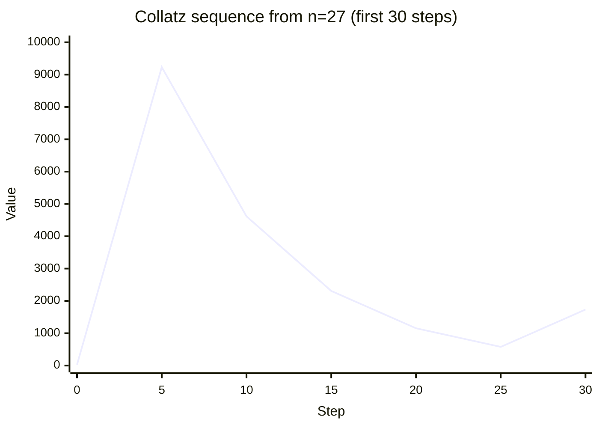
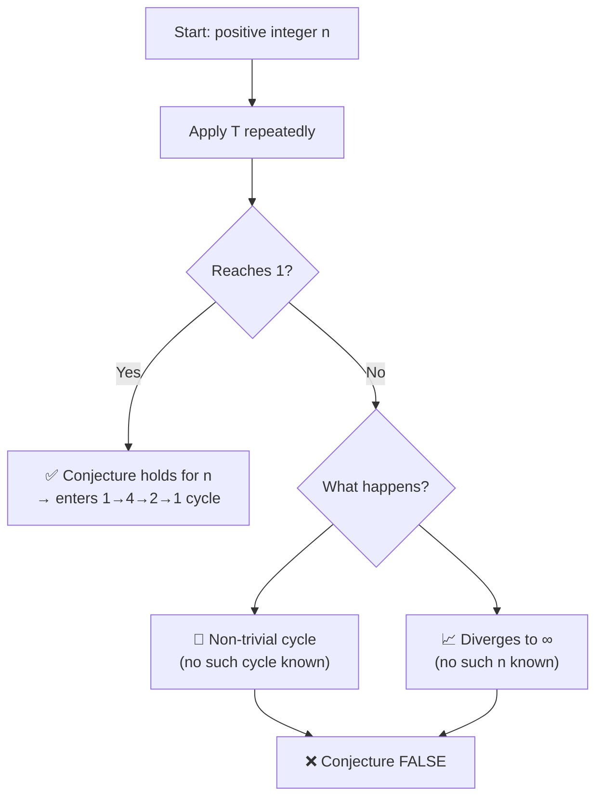

# The Collatz Conjecture

**Status**: Open — unproven since 1937  
**Area**: Number Theory / Dynamical Systems  
**Difficulty**: Legendary — Paul Erdős said "mathematics is not yet ready for such problems"

---

## ## The Statement

Define the function $T: \mathbb{Z}^+ \to \mathbb{Z}^+$ by:

$$T(n) = \begin{cases} n/2 & \text{if } n \text{ is even} \\ 3n + 1 & \text{if } n \text{ is odd} \end{cases}$$

Apply $T$ repeatedly, starting from any positive integer $n$. The **Collatz conjecture** states:

$$\text{For every positive integer } n, \text{ the sequence } n, T(n), T(T(n)), \ldots \text{ eventually reaches } 1.$$

---

## ## Plain English

Pick any positive whole number. Now follow two rules:

- **If it's even**: divide it by 2
- **If it's odd**: multiply by 3 and add 1

Keep going. The conjecture says: no matter what number you start with, you will _always_ eventually reach 1.

Once you reach 1, the sequence cycles: $1 \to 4 \to 2 \to 1 \to 4 \to 2 \to \ldots$

---

## ## Examples

**Starting from 6:**
$$6 \to 3 \to 10 \to 5 \to 16 \to 8 \to 4 \to 2 \to 1$$

**Starting from 27** (famously long):
$$27 \to 82 \to 41 \to 124 \to 62 \to 31 \to 94 \to 47 \to 142 \to 71 \to 214 \to 107 \to \ldots$$

The sequence from 27 takes **111 steps** to reach 1, and peaks at **9232** before descending. Starting from 27, you go _up_ dramatically before coming back down.

**Starting from 1:**
$$1 \to 4 \to 2 \to 1 \quad \text{(immediate cycle)}$$

---

## ## The Stopping Time

The **stopping time** of $n$ is the number of steps to reach 1. Some numbers have surprisingly long stopping times:

| Starting value | Steps to reach 1 | Peak value    |
| -------------- | ---------------- | ------------- |
| 1              | 0                | 1             |
| 2              | 1                | 2             |
| 3              | 7                | 16            |
| 6              | 8                | 16            |
| 27             | 111              | 9,232         |
| 703            | 170              | 250,504       |
| 871            | 178              | 190,996       |
| 6,171          | 261              | 975,400       |
| 837,799        | 524              | 1,410,123,943 |

The sequence from 837,799 takes 524 steps and reaches a peak of over 1.4 billion before descending to 1. Yet it does descend.

---

## ## History

### ## Origins

The conjecture is attributed to Lothar Collatz, a German mathematician who reportedly thought of it in 1937. However, the exact origin is murky — similar ideas may have circulated earlier. Collatz did not publish the problem; it spread through mathematical folklore.

The problem goes by many names: the **3n+1 problem**, the **Syracuse problem**, **Kakutani's problem**, **Hasse's algorithm**, and **Ulam's conjecture** — each name reflecting a different mathematician who encountered and popularized it.

### ## Spread Through Mathematics

Paul Erdős, one of the most prolific mathematicians of the 20th century, encountered the problem and became fascinated — and frustrated. He offered a prize for its solution and made his famous remark about mathematical readiness. The problem spread through mathematical departments worldwide, consuming significant time from researchers who found it irresistible.

### ## The Danger

The Collatz conjecture has a reputation for being a "mathematical trap" — easy to state, easy to experiment with, and capable of consuming enormous amounts of time without yielding to standard techniques. Graduate students are sometimes warned away from it.

---

## ## Attempts and Partial Results

### ## Computational Verification

The conjecture has been verified computationally for all starting values up to approximately $2^{68} \approx 2.95 \times 10^{20}$.

| Year | Verified up to                       |
| ---- | ------------------------------------ |
| 1992 | $5.6 \times 10^{13}$                 |
| 2008 | $5 \times 10^{18}$                   |
| 2020 | $2^{68} \approx 2.95 \times 10^{20}$ |

No counterexample has ever been found. But as with all such conjectures, computational verification cannot substitute for proof.

### ## Terras's Theorem (1976)

Riho Terras proved that "almost all" positive integers have a finite stopping time — meaning the set of potential counterexamples has density zero. This is progress, but density zero does not mean empty.

### ## Tao's Result (2019)

Terence Tao — widely considered the greatest living mathematician — proved a remarkable result: for any function $f(n)$ that grows to infinity (however slowly), almost all positive integers $n$ have a Collatz iterate below $f(n)$.

In other words, the sequence almost always gets very small. This is the strongest result to date, but it still falls short of proving the sequence reaches exactly 1.

Tao's paper was celebrated as a major breakthrough — and as a demonstration of how far we still are from a complete proof.

### ## What Doesn't Work

- **Induction**: Standard induction fails because the sequence is not monotone — it goes up and down unpredictably.
- **Modular arithmetic**: The behavior of the sequence depends on the full binary expansion of $n$, not just its residue modulo any fixed number.
- **Ergodic theory**: The sequence behaves like a random walk in some respects, but the "randomness" is not genuine — it is deterministic, and the tools of probability theory cannot be applied directly.

---

## ## Current Research Status

Research continues on multiple fronts:

1. **Probabilistic heuristics**: The sequence behaves statistically like a random walk that drifts downward. Heuristic arguments strongly suggest the conjecture is true, but heuristics are not proofs.

2. **Generalizations**: Mathematicians study the $5n+1$ problem, the $3n-1$ problem, and other variants. Some variants have cycles other than $1 \to 4 \to 2 \to 1$; some have sequences that diverge to infinity. Understanding why $3n+1$ is special (if it is) might illuminate the original problem.

3. **Connections to automata theory**: The Collatz function can be described in terms of 2-adic integers and cellular automata. These connections are active research areas.

4. **Computational search**: Ongoing projects continue to verify the conjecture for larger and larger starting values, both to build confidence and to search for counterexamples.

---

## ## Why It's Hard

### ## Unpredictable Dynamics

The Collatz sequence is a **dynamical system** — a rule applied repeatedly. Most dynamical systems we can analyze have some structure: they are monotone, or periodic, or have a conserved quantity. The Collatz sequence has none of these. It goes up and down in a way that appears chaotic, even though it is completely deterministic.

### ## Two Competing Operations

The sequence alternates between two operations with opposite effects:

- Division by 2 **shrinks** the number
- Multiplication by 3 and adding 1 **grows** the number (roughly by a factor of 3)

On average, even numbers are twice as common as odd numbers in the sequence (because applying $3n+1$ to an odd number always gives an even number). So the sequence divides by 2 roughly twice as often as it multiplies by 3. Since $2^2 = 4 > 3$, the sequence should drift downward on average.

But "on average" is not "always." The sequence could, in principle, find a path that avoids this average behavior — either cycling without reaching 1, or diverging to infinity.

### ## The Two Possible Counterexamples

There are exactly two ways the conjecture could be false:

1. **A divergent sequence**: Some starting value $n$ produces a sequence that grows without bound, never reaching 1.
2. **A non-trivial cycle**: Some starting value $n$ produces a sequence that cycles back to $n$ without passing through 1.

Both seem unlikely given computational evidence, but neither has been ruled out by proof.

### ## No Known Invariant

For most mathematical problems, progress comes from finding an **invariant** — a quantity that is preserved or changes monotonically under the operation. For Collatz, no useful invariant is known. The sequence has no obvious conserved quantity, no obvious potential function, no obvious structure to exploit.

### ## 2-adic Perspective

In the 2-adic integers (a number system where powers of 2 are "small"), the Collatz function has a cleaner form. But even in this setting, the conjecture remains open. The 2-adic approach has produced beautiful mathematics without producing a proof.

---

## ## Connection to Other Problems

### ## Dynamical Systems

The Collatz conjecture is fundamentally a question about a discrete dynamical system. It asks whether a particular orbit (sequence of iterates) is bounded. Similar questions in continuous dynamical systems — whether orbits are bounded, periodic, or chaotic — are central to modern mathematics and physics.

### ## Computability and Decidability

The Collatz conjecture is related to questions in theoretical computer science. The general problem — given a rule like Collatz, does every starting value eventually reach a fixed point? — is **undecidable** in general (Conway proved this for a generalization). This doesn't mean Collatz itself is undecidable, but it suggests the problem may be fundamentally resistant to algorithmic approaches.

### ## Goldbach's Conjecture

Both Goldbach and Collatz are elementary to state, verified computationally for enormous ranges, and resistant to all known proof techniques. Both may require new mathematical frameworks. But they are otherwise quite different: Goldbach is about additive prime structure; Collatz is about multiplicative dynamics.

### ## The Riemann Hypothesis

Tao's 2019 result used techniques from analytic number theory — the same toolkit used to study the Riemann Hypothesis. This suggests a deeper connection between the distribution of primes and the behavior of the Collatz sequence, though the nature of this connection is not yet understood.

---

## ## The Psychological Dimension

The Collatz conjecture has a unique hold on mathematical imagination. It is:

- **Accessible**: Anyone can understand it and experiment with it
- **Addictive**: The sequences are fun to compute and full of surprises
- **Humbling**: Every approach fails, often in unexpected ways
- **Mysterious**: We don't even know _why_ it's hard

Mathematicians who have spent years on the problem describe a particular frustration: the problem seems like it _should_ be solvable, that there must be some simple insight being missed. This feeling may be an illusion. The problem may be genuinely deep, requiring tools that don't yet exist.

Or it may yield tomorrow to a clever undergraduate who sees something everyone else missed.

That uncertainty is part of what makes it beautiful.

---

_See also: [Goldbach's Conjecture](goldbach_conjecture.md) · [Twin Prime Conjecture](twin_prime_conjecture.md) · [Open Problems Index](index.md)_
