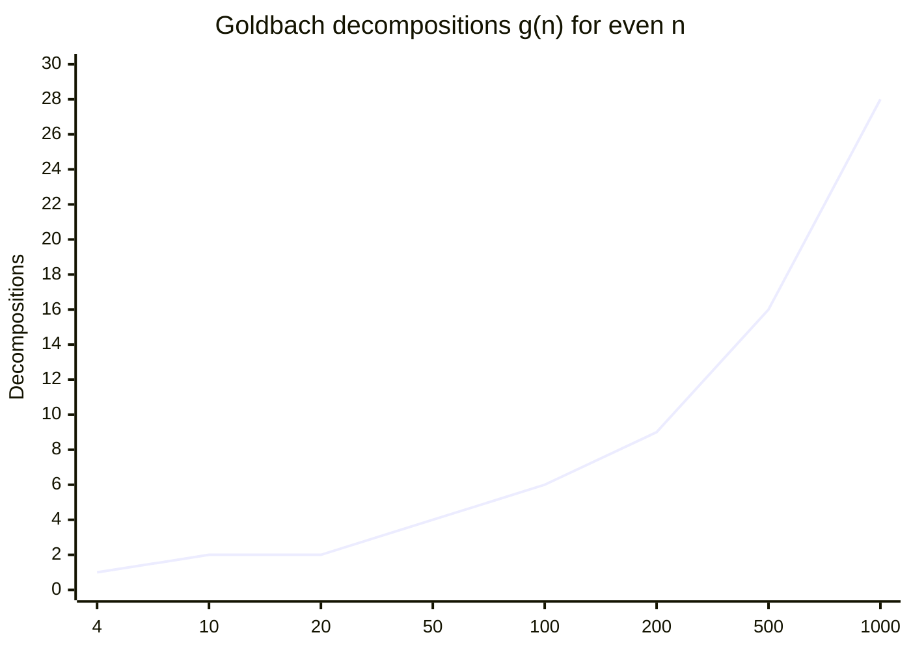

# Goldbach's Conjecture

**Status**: Open — unproven since 1742  
**Area**: Number Theory (additive)  
**Difficulty**: Extremely hard — partial results exist, full proof elusive

---

## ## The Statement

$$\text{Every even integer } n > 2 \text{ can be written as the sum of two prime numbers.}$$

More formally: for every integer $n$ with $n > 2$ and $n$ even, there exist primes $p$ and $q$ such that

$$n = p + q.$$

---

## ## Plain English

Take any even number greater than 2. Split it into two pieces. Goldbach's conjecture says you can always find a way to split it so that _both pieces are prime_.

A prime number is a number with no divisors other than 1 and itself: 2, 3, 5, 7, 11, 13, 17, 19, 23, ...

The conjecture says: no matter how large an even number you pick, it can always be expressed as the sum of two primes.

---

## ## Examples

| Even number | Goldbach decomposition(s)                           |
| ----------- | --------------------------------------------------- |
| 4           | $2 + 2$                                             |
| 6           | $3 + 3$                                             |
| 8           | $3 + 5$                                             |
| 10          | $3 + 7 = 5 + 5$                                     |
| 20          | $3 + 17 = 7 + 13$                                   |
| 100         | $3 + 97 = 11 + 89 = 29 + 71 = 41 + 59 = 47 + 53$    |
| 1000        | $3 + 997 = 17 + 983 = \ldots$ (many decompositions) |

Notice that larger numbers tend to have _more_ Goldbach decompositions, not fewer. This is part of why mathematicians believe the conjecture is true — but belief is not proof.

---

## ## History

### ## The Letter

On June 7, 1742, Christian Goldbach wrote a letter to Leonhard Euler. In it, he proposed (in a slightly different form) that every integer greater than 2 is the sum of three primes. Euler reformulated this into the version we know today — every even integer greater than 2 is the sum of two primes — and noted that this stronger statement implies Goldbach's original.

Euler believed the conjecture was certainly true but admitted he could not prove it. He wrote back: _"I regard this as a completely certain theorem, although I cannot prove it."_

This exchange is one of the most famous in mathematical history. Two of the greatest mathematicians of the 18th century — and neither could crack it.

### ## The Name

The conjecture is named after Goldbach, though Euler's reformulation is what mathematicians actually work on. The original Goldbach conjecture (every integer $> 2$ is a sum of three primes) is now called the **ternary** or **weak** Goldbach conjecture. The Euler version (two primes) is the **binary** or **strong** Goldbach conjecture.

### ## Early Progress

For nearly two centuries after 1742, essentially no progress was made. The problem seemed to require tools that didn't yet exist.

---

## ## Attempts and Partial Results

### ## The Sieve Methods (Early 20th Century)

The first real progress came with the development of **sieve theory** — a way of counting numbers with certain prime properties by systematically eliminating composites.

**1919 — Brun's theorem**: Viggo Brun proved that the sum of reciprocals of twin primes converges (unlike the sum of all prime reciprocals, which diverges). This was the first major sieve result, and it opened the door to attacking Goldbach.

**1923 — Hardy and Littlewood**: Using the **circle method** (a technique from analytic number theory), Hardy and Littlewood proved that _if_ the Generalized Riemann Hypothesis is true, then every sufficiently large even number is the sum of two primes. This was conditional progress — it showed the problem was connected to deep questions about the Riemann zeta function.

### ## Vinogradov's Theorem (1937)

Ivan Vinogradov proved the **ternary Goldbach conjecture** for sufficiently large odd numbers: every sufficiently large odd integer is the sum of three primes. This was unconditional — no hypothesis required.

"Sufficiently large" originally meant astronomically large (around $e^{e^{11.5}}$). Over decades, this bound was reduced. In 2013, Harald Helfgott proved the ternary conjecture completely for all odd numbers greater than 5, closing that chapter.

### ## Chen's Theorem (1966)

Jingrun Chen proved a landmark result: every sufficiently large even number is the sum of a prime and a **semiprime** (a number that is either prime or the product of exactly two primes).

$$n = p + q \quad \text{where } p \text{ is prime and } q \text{ has at most 2 prime factors}$$

This is tantalizingly close to Goldbach. The gap between "at most 2 prime factors" and "exactly 1 prime factor" seems small — but bridging it has defeated every attempt.

### ## Computational Verification

| Year | Verified up to     |
| ---- | ------------------ |
| 1938 | $10^5$             |
| 1964 | $10^8$             |
| 1998 | $10^{14}$          |
| 2014 | $4 \times 10^{18}$ |

As of 2024, Goldbach's conjecture has been verified for every even number up to $4 \times 10^{18}$. No counterexample has ever been found.

---

## ## Current Research Status

The conjecture remains open. Current research focuses on:

1. **Improving Chen's theorem**: Can we show the second summand has at most 1 prime factor? This would prove Goldbach, but no one has succeeded.

2. **Conditional results**: Under the Riemann Hypothesis or its generalizations, stronger results are known.

3. **Almost-all results**: It is known that "almost all" even numbers satisfy Goldbach — the set of exceptions (if any exist) has density zero. But density zero does not mean empty.

4. **Goldbach's comet**: The function $g(n)$ counting the number of Goldbach decompositions of $n$ has been studied extensively. It grows roughly as $n / (\ln n)^2$, suggesting the conjecture is true with room to spare — but this is heuristic, not proof.

---

## ## Why It's Hard

### ## The Additive-Multiplicative Divide

Primes are defined **multiplicatively** — a prime has no non-trivial multiplicative factors. But Goldbach is an **additive** statement — it's about sums. Number theory has powerful tools for multiplicative structure (factorization, divisibility, the Riemann zeta function) but far weaker tools for additive structure.

Bridging this divide is the central difficulty. We know a great deal about how primes multiply; we know far less about how they add.

### ## The Parity Problem

Sieve methods — our most powerful tool for counting primes — suffer from a fundamental limitation called the **parity problem**. Sieves cannot distinguish between numbers with an odd number of prime factors and numbers with an even number. This is precisely the distinction needed to go from Chen's theorem (at most 2 prime factors) to Goldbach (exactly 1 prime factor).

The parity problem is not a technical obstacle to be overcome with cleverness — it is a provable limitation of the sieve method as currently understood. Any proof of Goldbach must either transcend sieve methods or find a fundamentally new approach.

### ## No Algebraic Structure

Unlike many problems in number theory, Goldbach has no obvious algebraic structure to exploit. There is no group, no ring, no symmetry that makes the problem tractable. It is a statement about raw arithmetic, and raw arithmetic is hard.

---

## ## Connection to Other Problems

### ## Riemann Hypothesis

The distribution of primes is controlled by the zeros of the Riemann zeta function $\zeta(s)$. The Riemann Hypothesis (RH) states that all non-trivial zeros lie on the line $\text{Re}(s) = 1/2$. If RH is true, we have much better control over prime gaps, which would make Goldbach-type results easier to prove.

Hardy and Littlewood's 1923 result showed: RH $\Rightarrow$ Goldbach for large $n$. So Goldbach is, in a sense, a consequence of RH — but RH itself is unproven.

### ## Twin Prime Conjecture

Both Goldbach and Twin Primes ask about primes in additive configurations. Both are attacked with sieve methods. Both suffer from the parity problem. Progress on one often suggests approaches for the other.

### ## Waring's Problem

Waring's problem asks: for each $k$, can every positive integer be written as the sum of at most $g(k)$ perfect $k$-th powers? This is the multiplicative analog of Goldbach's additive question. Waring's problem is solved; Goldbach's is not. The contrast illuminates how much harder additive prime problems are.

### ## The Ternary Conjecture (Now Solved)

The ternary Goldbach conjecture — every odd number $> 5$ is the sum of three primes — was proved by Helfgott in 2013. The binary conjecture (two primes) remains open. This shows that adding one more prime to the sum makes the problem tractable; removing it makes it intractable. The gap between 2 and 3 summands is enormous.

---

## ## The Goldbach Comet

When you plot the number of Goldbach decompositions $g(n)$ for even $n$, you get a striking pattern called the **Goldbach comet** — a fan-shaped cloud of points that grows and oscillates in a structured way. Numbers divisible by many small primes tend to have more decompositions; numbers near large prime gaps tend to have fewer.

The comet has never dipped to zero. If it ever did, that would be a counterexample to Goldbach. The visual evidence is compelling — but mathematics requires proof, not pictures.

---

## ## What a Proof Would Require

Any proof of Goldbach must:

1. **Handle all even numbers simultaneously** — not just large ones, not just "almost all"
2. **Overcome the parity problem** — either by transcending sieve methods or finding a new approach
3. **Connect additive and multiplicative structure** — bridging the fundamental divide in number theory

Most experts believe Goldbach is true. Most also believe a proof is decades away, if not longer. The problem may require a revolution in our understanding of prime numbers — a revolution that hasn't happened yet.

---

_See also: [Twin Prime Conjecture](twin_prime_conjecture.md) · [Perfect Numbers](perfect_numbers.md) · [Open Problems Index](index.md)_
