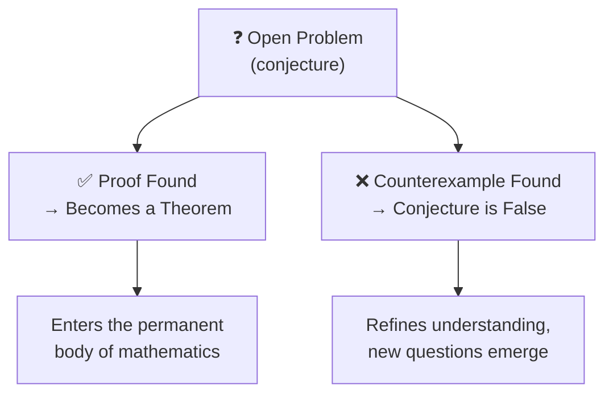
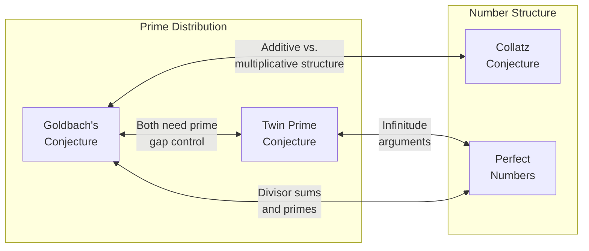

# Open Problems in Mathematics

Some of the most profound questions in mathematics can be stated in a single sentence — yet have resisted proof for centuries. These are not obscure technicalities. They are questions about the fundamental nature of numbers that anyone can understand, yet no one has answered.

## ## What Makes a Problem "Open"?

An open problem is a mathematical question for which no proof or disproof is known. Unlike unsolved puzzles in other fields, mathematical open problems have a precise meaning: either the statement is true for all cases (and we need a proof), or there exists a counterexample (and we need to find it). There is no middle ground.

---

## ## The Problems Covered Here

| Problem                                           | Statement                                         | Open Since | Difficulty |
| ------------------------------------------------- | ------------------------------------------------- | ---------- | ---------- |
| [Goldbach's Conjecture](goldbach_conjecture.md)   | Every even integer $> 2$ is the sum of two primes | 1742       | ★★★★☆      |
| [Collatz Conjecture](collatz_conjecture.md)       | The $3n+1$ sequence always reaches 1              | 1937       | ★★★★★      |
| [Twin Prime Conjecture](twin_prime_conjecture.md) | Infinitely many primes differ by 2                | ~300 BCE   | ★★★★☆      |
| [Odd Perfect Numbers](perfect_numbers.md)         | Does any odd perfect number exist?                | ~100 CE    | ★★★★☆      |

---

## ## Why These Problems Matter

### ## Accessibility vs. Depth

These four problems share a rare quality: their statements require no advanced mathematics to understand. A curious ten-year-old can grasp what is being asked. Yet the world's greatest mathematicians — armed with centuries of accumulated theory — have not resolved them.

This gap between simplicity of statement and depth of difficulty is itself a clue. It suggests that our current mathematical tools are missing something fundamental about the structure of numbers.

### ## What They Reveal About Primes

Three of the four problems (Goldbach, Twin Primes, and Goldbach's connection to Collatz) are fundamentally about **prime numbers** — the atoms of arithmetic. Despite knowing primes for over 2,000 years, we still cannot predict their distribution with enough precision to answer basic questions about them.

---

## ## A Brief History of Attempts

### ## Ancient Roots

The study of perfect numbers dates to ancient Greece. Euclid (~300 BCE) proved a formula for even perfect numbers. The question of odd perfect numbers has lingered ever since.

### ## The Enlightenment Era

Goldbach wrote his famous letter to Euler in 1742. Euler, the greatest mathematician of his age, could not prove it — but believed it was true. This set the tone for centuries of failed attempts by brilliant minds.

### ## The Modern Era

The 20th century brought powerful new tools: analytic number theory, sieve methods, and eventually computers. Progress was made on weaker versions of these problems:

- **1937**: Vinogradov proved every _sufficiently large_ odd number is the sum of three primes (Goldbach-adjacent)
- **1966**: Chen proved every sufficiently large even number is the sum of a prime and a _semiprime_ (product of at most two primes)
- **2013**: Zhang proved there are infinitely many prime pairs differing by at most 70,000,000 (Twin Prime-adjacent)
- **2014**: The Polymath project reduced Zhang's bound to 246

### ## The Computational Era

Modern computers have verified these conjectures for astronomically large numbers:

- Goldbach verified up to $4 \times 10^{18}$
- Collatz verified up to $2^{68}$
- Twin primes found with hundreds of thousands of digits

Yet verification is not proof. No finite check can establish a statement about _all_ numbers.

---

## ## Why These Are Hard

### ## The Infinity Problem

All four conjectures make claims about _infinitely many_ numbers. Computers can check cases, but cannot check all cases. A proof must work by logic alone, covering every possible number simultaneously.

### ## The Randomness of Primes

Primes appear to be distributed somewhat randomly among the integers. We have good statistical models (the Prime Number Theorem, Cramér's model), but these are approximations. The conjectures require exact statements, and the "random" behavior of primes makes exact proofs elusive.

### ## Missing Structure

Paul Erdős, who worked on many of these problems, said of the Collatz conjecture: _"Mathematics is not yet ready for such problems."_ This is not pessimism — it is a recognition that we may need entirely new mathematical frameworks before these questions yield.

---

## ## The Value of Unsolved Problems

Open problems serve mathematics in ways that solved problems cannot:

1. **They drive tool development.** The attempt to prove Fermat's Last Theorem (open for 358 years) created entire new fields of mathematics before Andrew Wiles finally proved it in 1995.

2. **They test the limits of methods.** When a powerful technique fails on a simple problem, it reveals the technique's true boundaries.

3. **They unify disparate areas.** Each of these problems connects number theory, analysis, combinatorics, and sometimes geometry — forcing mathematicians to build bridges between fields.

4. **They inspire.** A problem anyone can understand but no one can solve is an invitation. It says: _the frontier is closer than you think._

---

## ## How to Read These Documents

Each problem document follows the same structure:

1. **The Statement** — Precise mathematical formulation
2. **Plain English** — What it means without jargon
3. **Examples** — Concrete numbers to build intuition
4. **History** — How the problem arose and evolved
5. **Attempts** — What has been tried and why it fell short
6. **Current Status** — Where research stands today
7. **Why It's Hard** — The specific obstacles
8. **Connections** — Links to other problems and areas of math

Start with whichever problem intrigues you most. They are independent — no prior reading required.

---

_These documents are part of the unified-writing mathematics collection. For notation conventions and diagram standards, see the parent [math index](../index.md)._
