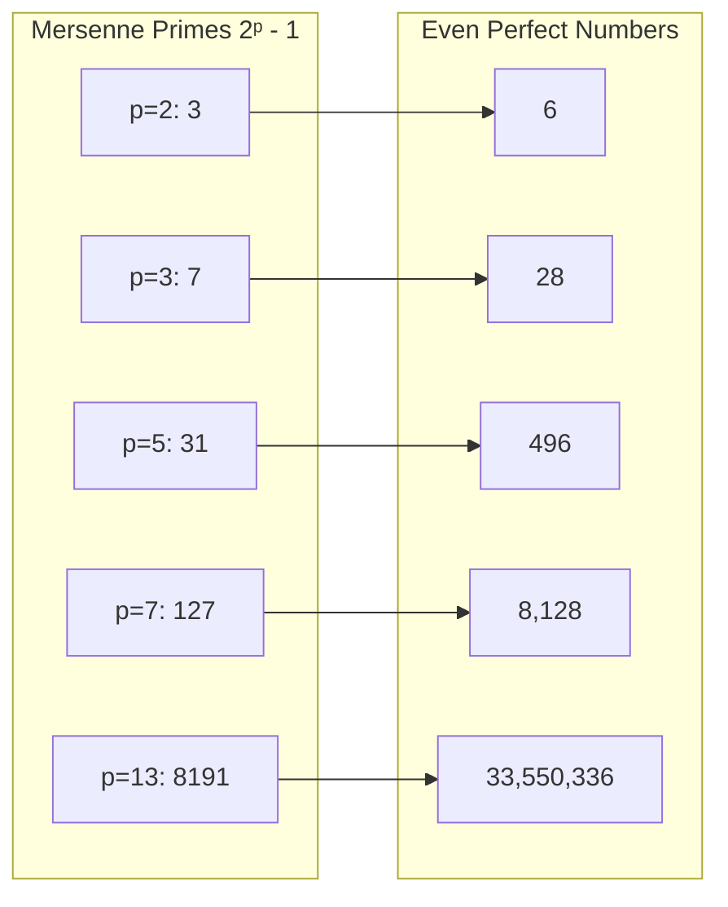
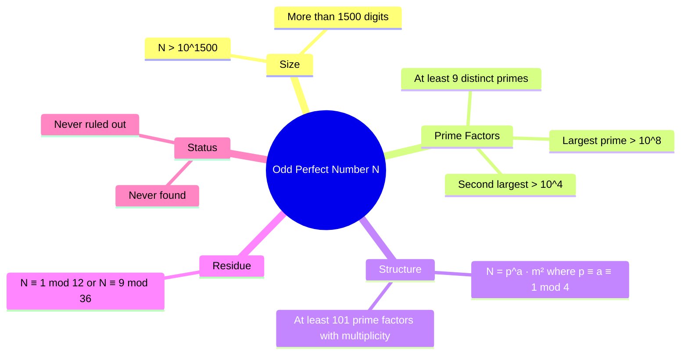

# Perfect Numbers and the Odd Perfect Number Problem

**Status**: Open — no odd perfect number found or ruled out; problem dates to antiquity  
**Area**: Number Theory (divisor theory)  
**Difficulty**: Very hard — over 2,000 years old, massive constraints known, existence unresolved

---

## ## The Statement

A **perfect number** is a positive integer equal to the sum of its proper divisors (all divisors except itself).

The **Odd Perfect Number Problem** asks:

$$\text{Does there exist an odd perfect number?}$$

No odd perfect number has ever been found. None has been proved impossible. The question has been open for over two millennia.

---

## ## Plain English

A perfect number is a number that equals the sum of all its factors (not counting itself).

Take 6: its factors (other than itself) are 1, 2, and 3. And $1 + 2 + 3 = 6$. Perfect.

Take 28: its factors are 1, 2, 4, 7, 14. And $1 + 2 + 4 + 7 + 14 = 28$. Perfect.

Every perfect number we've ever found is even. The question is: could there be an odd perfect number hiding somewhere? A number that is odd, yet equals the sum of its own factors?

---

## ## Examples of Perfect Numbers

| Perfect number | Proper divisors                                         | Sum     |
| -------------- | ------------------------------------------------------- | ------- |
| 6              | 1, 2, 3                                                 | 6 ✓     |
| 28             | 1, 2, 4, 7, 14                                          | 28 ✓    |
| 496            | 1, 2, 4, 8, 16, 31, 62, 124, 248                        | 496 ✓   |
| 8,128          | 1, 2, 4, 8, 16, 32, 64, 127, 254, 508, 1016, 2032, 4064 | 8,128 ✓ |

The next perfect number is 33,550,336. Then 8,589,869,056. They grow rapidly and become extremely rare.

---

## ## The Sigma Function

Mathematicians use the **sum-of-divisors function** $\sigma(n)$ — the sum of _all_ divisors of $n$, including $n$ itself.

A number $n$ is perfect if and only if:

$$\sigma(n) = 2n$$

This is because $\sigma(n)$ includes $n$ itself, so the sum of _proper_ divisors is $\sigma(n) - n$, and we want this to equal $n$.

**Examples**:

- $\sigma(6) = 1 + 2 + 3 + 6 = 12 = 2 \times 6$ ✓
- $\sigma(28) = 1 + 2 + 4 + 7 + 14 + 28 = 56 = 2 \times 28$ ✓

---

## ## History

### ## Ancient Greece

The ancient Greeks were fascinated by perfect numbers. Euclid (~300 BCE) proved a beautiful theorem:

> If $2^{p-1}(2^p - 1)$ is a positive integer and $2^p - 1$ is prime, then $2^{p-1}(2^p - 1)$ is perfect.

For example:

- $p = 2$: $2^1 \times (2^2 - 1) = 2 \times 3 = 6$ ✓
- $p = 3$: $2^2 \times (2^3 - 1) = 4 \times 7 = 28$ ✓
- $p = 5$: $2^4 \times (2^5 - 1) = 16 \times 31 = 496$ ✓

The primes of the form $2^p - 1$ are called **Mersenne primes**. Euclid's theorem connects perfect numbers to Mersenne primes.

### ## Euler's Theorem (18th Century)

Leonhard Euler proved the converse for even numbers: **every even perfect number has the form $2^{p-1}(2^p - 1)$ where $2^p - 1$ is prime.**

This completely characterizes even perfect numbers. They are in perfect correspondence with Mersenne primes.

Euler also proved several constraints on odd perfect numbers — if they exist, they must have a specific form. But he could not prove they don't exist.

### ## The Medieval Period

Perfect numbers had mystical significance in medieval mathematics and theology. The number 6 was considered perfect in a divine sense (God created the world in 6 days). Augustine wrote about perfect numbers. This cultural weight kept the problem alive even when mathematical progress stalled.

### ## Modern Era

The 20th and 21st centuries brought powerful computational tools and new theoretical constraints. The problem has been attacked from many angles, with increasingly strong necessary conditions established — but no proof of impossibility.

---

## ## Even Perfect Numbers: Completely Understood

Thanks to Euclid and Euler, even perfect numbers are completely classified:

$$\text{Even perfect numbers} \longleftrightarrow \text{Mersenne primes}$$

A Mersenne prime is a prime of the form $M_p = 2^p - 1$. The first few are:

| $p$ | $M_p = 2^p - 1$ | Prime? | Perfect number |
| --- | --------------- | ------ | -------------- |
| 2   | 3               | ✓      | 6              |
| 3   | 7               | ✓      | 28             |
| 5   | 31              | ✓      | 496            |
| 7   | 127             | ✓      | 8,128          |
| 11  | 2,047 = 23 × 89 | ✗      | —              |
| 13  | 8,191           | ✓      | 33,550,336     |

As of 2024, **51 Mersenne primes** are known, giving 51 known perfect numbers. Whether there are infinitely many Mersenne primes (and hence infinitely many even perfect numbers) is itself an open problem.

---

## ## Odd Perfect Numbers: The Mystery

No odd perfect number has ever been found. But we cannot prove they don't exist. What we _do_ know is a long list of necessary conditions — properties any odd perfect number _must_ have.

### ## Known Constraints

If an odd perfect number $N$ exists, then:

1. **Size**: $N > 10^{1500}$ (Ochem and Rao, 2012)
2. **Prime factorization form**: $N = p^a \cdot q_1^{2b_1} \cdot q_2^{2b_2} \cdots q_k^{2b_k}$ where $p \equiv a \equiv 1 \pmod{4}$ (Euler)
3. **Number of distinct prime factors**: $N$ has at least 9 distinct prime factors (Nielsen, 2015)
4. **Largest prime factor**: The largest prime factor of $N$ exceeds $10^8$ (Goto and Ohno, 2008)
5. **Second largest prime factor**: Exceeds $10^4$
6. **Total prime factors with multiplicity**: $N$ has at least 101 prime factors counted with multiplicity (Chein, 1979)
7. **Not divisible by**: 105 (i.e., not divisible by $3 \times 5 \times 7$)

These constraints are remarkable. An odd perfect number, if it exists, must be:

- Astronomically large (more than 1,500 digits)
- Divisible by at least 9 different primes
- Structured in a very specific way

Yet none of these constraints rule it out entirely.

---

## ## Attempts and Partial Results

### ## Euler's Form (1747)

Euler proved that any odd perfect number must have the form:

$$N = p^a \cdot m^2$$

where $p$ is prime, $p \equiv a \equiv 1 \pmod{4}$, and $\gcd(p, m) = 1$.

This is called the **Euler prime** of $N$. It is the unique prime factor of $N$ that appears to an odd power.

### ## Computational Searches

Computers have verified that no odd perfect number exists below $10^{1500}$. This is an enormous range — but the number line is infinite, and $10^{1500}$ is nothing compared to infinity.

### ## Touchard's Theorem (1953)

Jacques Touchard proved that any odd perfect number must be of the form $12k + 1$ or $36k + 9$ for some integer $k$. This restricts the residue class but does not eliminate the possibility.

### ## The Abundancy Index

The **abundancy index** of $n$ is $\sigma(n)/n$. For a perfect number, this equals 2. For odd numbers, the abundancy index tends to be smaller than for even numbers (because odd numbers miss the factor 2 and its powers). This is a heuristic reason to expect odd perfect numbers to be rare or nonexistent — but heuristics are not proofs.

---

## ## Current Research Status

Research continues on multiple fronts:

1. **Improving lower bounds**: The bound $N > 10^{1500}$ continues to be pushed higher. Each improvement requires significant computational and theoretical work.

2. **Improving factor count bounds**: The minimum number of distinct prime factors has been raised over decades. Current best: at least 9.

3. **Special cases**: Researchers prove that odd perfect numbers cannot have certain specific forms, gradually narrowing the possibilities.

4. **Connections to other problems**: The structure of odd perfect numbers is connected to questions about multiplicative functions and the distribution of $\sigma(n)/n$.

---

## ## Why It's Hard

### ## No Algebraic Obstruction

For even perfect numbers, Euler found a complete characterization. For odd numbers, no analogous structure exists. There is no known algebraic reason why odd perfect numbers cannot exist — only the empirical observation that none has been found.

### ## The Sigma Function is Multiplicative but Not Simple

The function $\sigma(n)$ is **multiplicative**: $\sigma(mn) = \sigma(m)\sigma(n)$ when $\gcd(m,n) = 1$. This is useful, but it means the condition $\sigma(N) = 2N$ is a global constraint on all prime factors simultaneously. Satisfying it for one prime factor makes it harder to satisfy for others.

### ## The Parity Barrier

Odd numbers have a fundamentally different divisor structure than even numbers. The factor 2 and its powers contribute significantly to $\sigma(n)$ for even $n$. Odd numbers miss this contribution, making it harder (but not impossible) to achieve $\sigma(n) = 2n$.

### ## The Constraints Are Necessary but Not Sufficient

Every constraint we prove (size, number of factors, etc.) is a _necessary_ condition. We need a _sufficient_ condition for impossibility — a property that all odd numbers have but perfect numbers cannot. No one has found such a property.

### ## The Problem May Be Undecidable

Some mathematicians speculate that the odd perfect number problem may be independent of the standard axioms of mathematics (ZFC). This would mean it is neither provably true nor provably false within our current mathematical framework. This is speculative — but the problem's resistance to all known techniques makes such speculation understandable.

---

## ## Connection to Other Problems

### ## Mersenne Primes

Even perfect numbers are completely determined by Mersenne primes. Whether there are infinitely many Mersenne primes is itself open. The two problems are linked: resolving one would shed light on the other.

### ## Goldbach's Conjecture

Both problems involve the structure of integers under arithmetic operations (addition for Goldbach, divisor sums for perfect numbers). Both have been open for centuries. Both have been verified computationally for enormous ranges. The techniques are different, but the flavor of difficulty is similar.

### ## Amicable Numbers

Two numbers $m$ and $n$ are **amicable** if $\sigma(m) = m + n$ and $\sigma(n) = m + n$ — each equals the sum of the other's proper divisors. The smallest amicable pair is $(220, 284)$. Perfect numbers are the "self-amicable" case. The study of amicable numbers and perfect numbers are closely related.

### ## Abundant and Deficient Numbers

- A number $n$ is **abundant** if $\sigma(n) > 2n$ (sum of divisors exceeds twice the number)
- A number $n$ is **deficient** if $\sigma(n) < 2n$
- A number $n$ is **perfect** if $\sigma(n) = 2n$

Most odd numbers are deficient. The question of odd perfect numbers is asking whether any odd number achieves the exact balance of perfection.

### ## The Riemann Hypothesis

The distribution of values of $\sigma(n)/n$ is connected to the Riemann zeta function. Specifically, the average value of $\sigma(n)/n$ over all $n \leq N$ is $\pi^2/6 \approx 1.645$ — which is $\zeta(2)$. The Riemann Hypothesis controls the error terms in such averages. This connection is indirect but real.

---

## ## The Philosophical Dimension

The odd perfect number problem is unique among the open problems in this collection. While Goldbach, Collatz, and Twin Primes all have strong heuristic reasons to be true, the odd perfect number problem is genuinely ambiguous.

Most mathematicians believe no odd perfect number exists — but this belief is based on the failure to find one, not on a compelling theoretical reason. The constraints we've proved are consistent with both existence and nonexistence.

This makes the problem philosophically interesting: it is a question where our intuition is uncertain, where the evidence is purely negative (no example found), and where the theoretical tools have produced constraints but not resolution.

If an odd perfect number were found, it would be one of the most surprising discoveries in the history of mathematics. If it were proved impossible, the proof would likely reveal deep new structure in the theory of divisors.

Either outcome would be extraordinary.

---

## ## Summary of Known Facts

---

_See also: [Goldbach's Conjecture](goldbach_conjecture.md) · [Twin Prime Conjecture](twin_prime_conjecture.md) · [Open Problems Index](index.md)_
