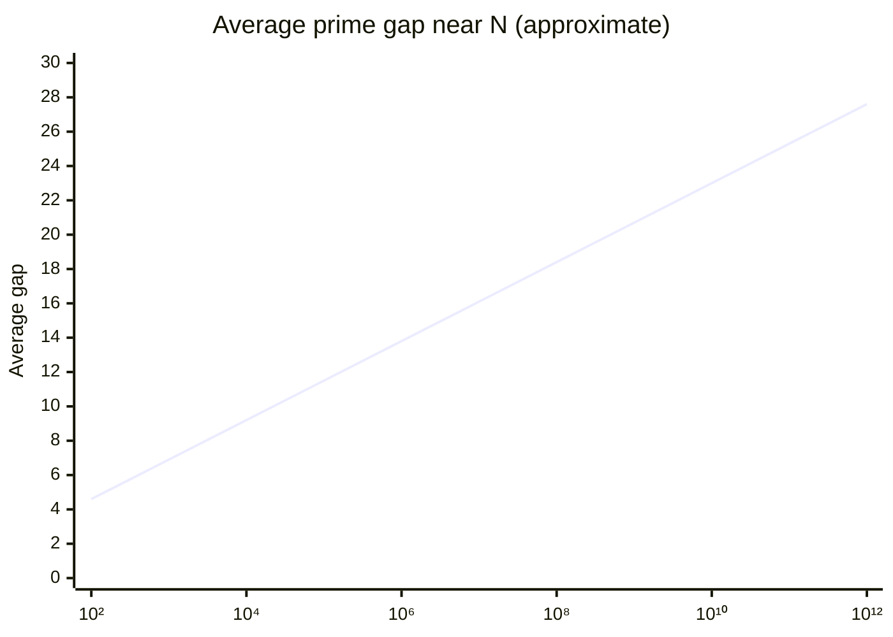
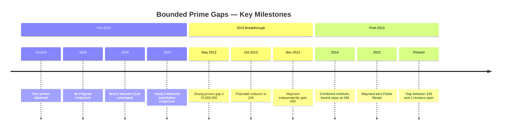

# The Twin Prime Conjecture

**Status**: Open — conjectured since antiquity, formalized ~1849  
**Area**: Number Theory (prime distribution)  
**Difficulty**: Very hard — dramatic recent progress, full proof still out of reach

---

## ## The Statement

Two primes are called **twin primes** if they differ by exactly 2. Examples: $(3, 5)$, $(5, 7)$, $(11, 13)$, $(17, 19)$, $(29, 31)$.

The **Twin Prime Conjecture** states:

$$\text{There are infinitely many pairs of primes } (p, p+2).$$

---

## ## Plain English

As you count higher and higher, prime numbers become rarer. They thin out. But occasionally, two primes appear right next to each other (with only one even number between them). These are twin primes.

The question is: do twin primes keep appearing forever, no matter how far you count? Or do they eventually stop — is there a _last_ pair of twin primes?

Almost every mathematician believes they go on forever. No one has proved it.

---

## ## Examples

The first twin prime pairs:

$$(3, 5), \quad (5, 7), \quad (11, 13), \quad (17, 19), \quad (29, 31), \quad (41, 43), \quad (59, 61), \quad (71, 73)$$

They become rarer as numbers grow, but they keep appearing:

- $(1,000,000,007 \text{ and } 1,000,000,009)$ — both prime
- $(2,003,663,613 \times 2^{195,000} - 1)$ and $(2,003,663,613 \times 2^{195,000} + 1)$ — a twin prime pair with 58,711 digits each (found 2007)

The largest known twin prime pair (as of 2024) has over 388,000 digits.

---

## ## Why Primes Thin Out

The **Prime Number Theorem** (proved 1896) tells us that the number of primes up to $N$ is approximately $N / \ln N$. This means primes become less dense as $N$ grows — the average gap between consecutive primes near $N$ is about $\ln N$.

Near $N = 10^6$, the average prime gap is about 14. Near $N = 10^{100}$, it's about 230. The gaps grow, but twin primes (gap = 2) keep appearing — at least as far as we've checked.

---

## ## History

### ## Ancient Roots

The Greeks knew about prime numbers and likely noticed twin primes. Euclid's proof that there are infinitely many primes (~300 BCE) is one of the most beautiful proofs in mathematics. But the question of twin primes specifically was not formalized until much later.

### ## de Polignac's Conjecture (1849)

Alphonse de Polignac conjectured in 1849 that for every even number $k$, there are infinitely many prime pairs $(p, p+k)$. The twin prime conjecture is the special case $k = 2$.

### ## Hardy and Littlewood (1923)

Hardy and Littlewood formulated a precise quantitative conjecture: the number of twin prime pairs up to $N$ is approximately

$$\pi_2(N) \approx 2C_2 \frac{N}{(\ln N)^2}$$

where $C_2 \approx 0.6601618\ldots$ is the **twin prime constant**:

$$C_2 = \prod_{p \geq 3, p \text{ prime}} \frac{p(p-2)}{(p-1)^2} \approx 0.6601618\ldots$$

This is the **Hardy-Littlewood conjecture** (Conjecture B). It implies the twin prime conjecture and gives a precise rate. Computational evidence strongly supports it.

### ## Brun's Theorem (1919)

Viggo Brun proved that the sum of reciprocals of twin primes converges:

$$\frac{1}{3} + \frac{1}{5} + \frac{1}{5} + \frac{1}{7} + \frac{1}{11} + \frac{1}{13} + \cdots \approx 1.9021605\ldots$$

This is **Brun's constant** $B_2$. The convergence of this sum (unlike the divergent sum of all prime reciprocals) shows that twin primes are "sparse" even if infinite. But it does not prove they are infinite — a finite set also has a convergent sum of reciprocals.

---

## ## The 2013 Breakthrough: Zhang's Theorem

### ## The Result

In May 2013, Yitang Zhang — a relatively unknown mathematician working at the University of New Hampshire — submitted a paper to the _Annals of Mathematics_ that stunned the mathematical world.

Zhang proved: **there are infinitely many pairs of primes that differ by at most 70,000,000.**

This was the first time anyone had proved that prime gaps are bounded infinitely often. The specific bound of 70 million was not optimal — Zhang chose it for simplicity of proof — but the existence of _any_ finite bound was a breakthrough.

### ## The Polymath Project

Within weeks, mathematicians worldwide began collaborating online (the Polymath8 project) to reduce Zhang's bound. Progress was rapid:

| Date             | Bound      |
| ---------------- | ---------- |
| May 2013 (Zhang) | 70,000,000 |
| June 2013        | 4,680      |
| July 2013        | 924        |
| August 2013      | 576        |
| October 2013     | 246        |

The bound 246 is where the Polymath project stalled. Getting below 6 (which would prove the twin prime conjecture) requires new ideas.

### ## Maynard's Contribution (2013)

James Maynard, then a postdoctoral researcher, independently developed a different approach that gave a bound of 600 and was more flexible. Maynard's method also proved that there are infinitely many prime $k$-tuples for any $k$ — a much stronger result.

Maynard was awarded the Fields Medal in 2022, partly for this work.

---

## ## Current Research Status

The current best unconditional result: there are infinitely many prime pairs differing by at most **246**.

The gap between 246 and 2 is the remaining obstacle. Current research focuses on:

1. **Improving the sieve**: The Maynard-Tao sieve is the current state of the art. Refinements continue, but the parity problem (see below) creates a hard barrier.

2. **Elliott-Halberstam conjecture**: If this conjecture about prime distribution in arithmetic progressions is true, the bound can be reduced to 6. A bound of 6 would prove there are infinitely many prime pairs differing by 2, 4, or 6 — very close to twin primes.

3. **Conditional results**: Under various unproven hypotheses, the bound can be reduced further. The full twin prime conjecture follows from the Elliott-Halberstam conjecture plus one additional assumption.

---

## ## Why It's Hard

### ## The Parity Problem (Again)

As with Goldbach's conjecture, the **parity problem** is the central obstacle. Sieve methods cannot distinguish between numbers with an odd number of prime factors and numbers with an even number. This is precisely the distinction needed to prove that a number is prime (exactly one prime factor: itself).

Zhang's breakthrough used a clever modification of the sieve that partially circumvents the parity problem — but only partially. Getting from 246 to 2 requires fully overcoming it.

### ## The Randomness of Primes

Primes appear to be distributed somewhat randomly. The twin prime conjecture is essentially asking: does this "random" distribution produce infinitely many pairs at distance 2? Heuristically, yes — the Hardy-Littlewood conjecture gives a precise prediction. But heuristics are not proofs.

### ## The Difficulty of Small Gaps

Proving that prime gaps are _large_ is relatively easy (the prime number theorem does this). Proving that prime gaps are _small_ infinitely often is much harder. Small gaps require primes to "cooperate" in a way that large gaps do not.

### ## What Zhang's Method Cannot Do

Zhang's method proves that _some_ gap size $\leq 246$ occurs infinitely often. It does not prove that the gap size 2 specifically occurs infinitely often. To prove the twin prime conjecture, we need to pin down the gap to exactly 2 — and current methods cannot do this.

---

## ## Connection to Other Problems

### ## Goldbach's Conjecture

Both conjectures are about primes in additive configurations. Both suffer from the parity problem. The techniques developed for one (sieve methods, circle method) are applied to the other. Progress on bounded prime gaps (Zhang, Maynard) has not yet translated into progress on Goldbach, but the tools are related.

### ## The Riemann Hypothesis

The distribution of primes is controlled by the zeros of the Riemann zeta function. If the Riemann Hypothesis is true, we have much better control over prime gaps, which would strengthen results toward the twin prime conjecture. Under RH, the gap between consecutive primes near $N$ is at most $O(\sqrt{N} \ln N)$ — much smaller than the unconditional bound.

### ## Dirichlet's Theorem and Arithmetic Progressions

Dirichlet proved (1837) that every arithmetic progression $a, a+d, a+2d, \ldots$ with $\gcd(a,d) = 1$ contains infinitely many primes. The twin prime conjecture is asking about the progression $p, p+2$ — but here $p$ itself must be prime, which Dirichlet's theorem doesn't address.

### ## The Elliott-Halberstam Conjecture

This conjecture about the distribution of primes in arithmetic progressions is a key input to sieve methods. If true, it would reduce the bounded gap result to 6. It is widely believed but unproven.

### ## Polignac's Conjecture

The full de Polignac conjecture — infinitely many prime pairs at every even distance — implies the twin prime conjecture. It is also open. Zhang's theorem proves a weak version: _some_ even distance has infinitely many prime pairs.

---

## ## The Hardy-Littlewood Prediction

The Hardy-Littlewood conjecture predicts not just that twin primes are infinite, but _how many_ there are up to $N$:

$$\pi_2(N) \sim 2C_2 \frac{N}{(\ln N)^2} \approx 1.3203 \frac{N}{(\ln N)^2}$$

Computational evidence matches this prediction extremely well. The ratio of actual twin prime counts to the predicted value approaches 1 as $N$ grows.

| $N$       | Actual $\pi_2(N)$ | Predicted  | Ratio   |
| --------- | ----------------- | ---------- | ------- |
| $10^6$    | 35,006            | 33,489     | 1.045   |
| $10^8$    | 440,312           | 440,368    | 0.9999  |
| $10^{10}$ | 27,412,679        | 27,411,417 | 1.00005 |

The agreement is striking. But agreement is not proof.

---

## ## What a Proof Would Require

Any proof of the twin prime conjecture must:

1. **Overcome the parity problem** — the fundamental barrier in sieve theory
2. **Control prime gaps precisely** — not just on average, but for specific gap sizes
3. **Handle all primes simultaneously** — not just large primes, not just "almost all"

The 2013 breakthrough showed that bounded prime gaps are provable. The remaining question is whether the bound can be reduced to 2. Most experts believe it can — but the tools to do so don't yet exist.

The twin prime conjecture may be the problem that forces the creation of those tools.

---

_See also: [Goldbach's Conjecture](goldbach_conjecture.md) · [Perfect Numbers](perfect_numbers.md) · [Open Problems Index](index.md)_
