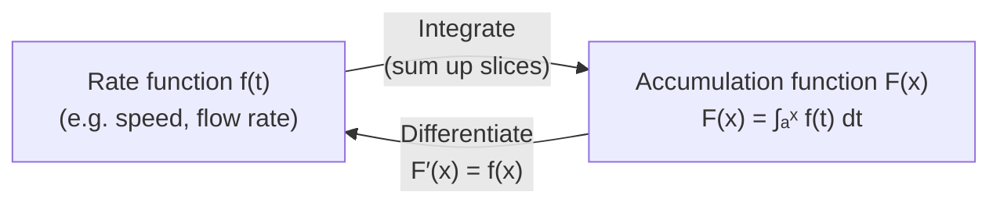

# Fundamental Theorem of Calculus — Part 1

## 📋 Formal Statement

If $f$ is continuous on the closed interval $[a, b]$, and $F$ is defined by

$$F(x) = \int_a^x f(t)\, dt$$

then $F$ is differentiable on the open interval $(a, b)$, and

$$F'(x) = f(x)$$

### Compact Form

$$\frac{d}{dx}\!\left[\int_a^x f(t)\, dt\right] = f(x)$$

---

## 🔣 Legend — Every Symbol Explained

| Symbol                 | Name                                   | Meaning                                                                                              | Domain / Notes                                    |
| ---------------------- | -------------------------------------- | ---------------------------------------------------------------------------------------------------- | ------------------------------------------------- |
| $f$                    | Integrand function                     | The function being integrated; describes a rate or density                                           | Must be continuous on $[a, b]$                    |
| $F$                    | Accumulation function                  | A new function built by integrating $f$ from $a$ up to a moving endpoint $x$                         | $F : [a,b] \to \mathbb{R}$                        |
| $x$                    | Upper limit variable                   | The moving right endpoint of integration; the input to $F$                                           | $x \in [a, b]$                                    |
| $t$                    | Dummy variable of integration          | A placeholder variable that ranges from $a$ to $x$ inside the integral; disappears after integration | $t \in [a, x]$                                    |
| $a$                    | Lower limit of integration             | The fixed starting point of the accumulation                                                         | Any real number                                   |
| $[a, b]$               | Closed interval                        | All real numbers from $a$ to $b$, **including** both endpoints                                       | $a \leq t \leq b$                                 |
| $(a, b)$               | Open interval                          | All real numbers strictly between $a$ and $b$, **excluding** endpoints                               | $a < x < b$                                       |
| $\int_a^x$             | Definite integral from $a$ to $x$      | Signed area under the curve $f(t)$ between $t = a$ and $t = x$                                       | The elongated "S" stands for _summa_ (Latin: sum) |
| $\int$                 | Integral sign                          | Elongated "S"; represents an infinite sum of infinitely thin slices                                  | Introduced by Leibniz (1675)                      |
| $dt$                   | Differential of $t$                    | An infinitesimally thin width element; tells the integral which variable is being summed over        | Leibniz notation; $dt \to 0$ in the limit         |
| $f(t)\, dt$            | Infinitesimal area element             | Height $f(t)$ times infinitesimal width $dt$; one thin rectangular slice of area                     | Units: [f] × [t]                                  |
| $F'(x)$                | Derivative of $F$ at $x$               | The instantaneous rate of change of $F$ with respect to $x$                                          | Prime notation (Lagrange)                         |
| $\frac{d}{dx}$         | Differentiation operator               | "Take the derivative with respect to $x$"; measures how fast the quantity inside changes             | Leibniz notation                                  |
| $\frac{d}{dx}[\cdots]$ | Derivative of the bracketed expression | Apply the differentiation operator to everything inside the brackets                                 | —                                                 |
| $=$                    | Equals                                 | Both sides are identical for all valid $x$                                                           | —                                                 |
| $\mathbb{R}$           | Real numbers                           | The set of all real numbers (the entire number line)                                                 | —                                                 |
| continuous             | Continuity condition                   | $f$ has no jumps or holes; you can draw it without lifting your pen                                  | Required for the theorem to hold                  |

> **What is a "dummy variable"?** The variable $t$ inside $\int_a^x f(t)\,dt$ is just a label — it could be called $s$, $u$, or anything else. It vanishes once the integral is evaluated, leaving a function of $x$ only. Think of it like a loop counter in programming: it matters inside the loop but not outside.

> **What is a "differential" $dt$?** Imagine slicing the interval $[a, x]$ into $n$ equal pieces of width $\Delta t = (x-a)/n$. The integral is the limit of the sum $\sum f(t_i)\,\Delta t$ as $n \to \infty$ and $\Delta t \to 0$. The symbol $dt$ is that infinitesimal width in the limit.

---

## 💬 Plain English Explanation

**The big idea**: Differentiation and integration are exact opposites — they undo each other.

Imagine you are filling a bathtub. The function $f(t)$ tells you the **flow rate** of water at time $t$ (litres per second). The integral $F(x) = \int_a^x f(t)\,dt$ tells you the **total volume** of water in the tub at time $x$.

Part 1 says: if you ask "how fast is the volume changing right now?", the answer is simply the current flow rate — $F'(x) = f(x)$.

**Step by step**:

1. Start with any continuous rate function $f$ (flow rate, speed, power, …).
2. Build the accumulation function $F(x)$ by integrating $f$ from a fixed start $a$ to a moving endpoint $x$.
3. Differentiate $F$. You get $f$ back — exactly.

This is profound: it means that to find the area under a curve, you don't need to sum infinitely many rectangles directly. You just need an antiderivative.

**Concrete example** — constant flow rate:

Let $f(t) = 3$ (constant 3 litres/sec), $a = 0$.

$$F(x) = \int_0^x 3\, dt = 3x$$

$$F'(x) = \frac{d}{dx}(3x) = 3 = f(x) \checkmark$$

**Example with a non-constant rate**:

Let $f(t) = t^2$, $a = 0$.

$$F(x) = \int_0^x t^2\, dt = \frac{x^3}{3}$$

$$F'(x) = \frac{d}{dx}\!\left(\frac{x^3}{3}\right) = x^2 = f(x) \checkmark$$

---

## 🌍 Real-World Significance

| Application                              | How Part 1 is used                                                                                                           |
| ---------------------------------------- | ---------------------------------------------------------------------------------------------------------------------------- |
| **Physics — kinematics**                 | Velocity $v(t)$ integrated gives position $s(t)$; differentiating $s$ recovers $v$ — confirming the model is self-consistent |
| **Engineering — signal processing**      | Running integrals of sensor data (e.g., accelerometers) are differentiated to verify calibration                             |
| **Economics**                            | Marginal cost $MC(q)$ integrated gives total cost $C(q)$; Part 1 confirms $C'(q) = MC(q)$                                    |
| **Biology — population dynamics**        | Birth-rate functions integrated give population totals; Part 1 links the two representations                                 |
| **Computer science — numerical methods** | Adaptive quadrature algorithms exploit the derivative relationship to estimate integration error                             |
| **Control theory**                       | PID controllers use integration and differentiation; Part 1 guarantees their inverse relationship                            |

---

## 📜 History

| Period    | Event                                                                                                                                             |
| --------- | ------------------------------------------------------------------------------------------------------------------------------------------------- |
| ~1666     | **Isaac Newton** (England) develops the method of fluxions, recognising that "quadrature" (area) and "fluxion" (rate of change) are inverses      |
| ~1675     | **Gottfried Wilhelm Leibniz** (Germany) independently discovers the same relationship and introduces the $\int$ and $d$ notation still used today |
| 1684–1686 | Leibniz publishes _Nova Methodus_ — the first printed calculus paper                                                                              |
| 1687      | Newton publishes _Principia Mathematica_, using calculus to derive planetary motion                                                               |
| 1823      | **Augustin-Louis Cauchy** gives the first rigorous proof using the definition of the definite integral                                            |
| 1854      | **Bernhard Riemann** formalises the integral (Riemann integral), placing Part 1 on solid foundations                                              |
| 20th c.   | Extended to **Lebesgue integration** — Part 1 holds almost everywhere for a much wider class of functions                                         |

The Newton–Leibniz priority dispute was one of history's bitterest scientific controversies, lasting decades and splitting European mathematics into rival camps.

---

## 🖼️ Visual Intuition

```
f(t)
  │         ╭──────╮
  │        ╱        ╲
  │       ╱          ╲
  │──────╱            ╲──────
  └──────────────────────────▶ t
         a      x

F(x) = shaded area from a to x

As x increases by a tiny Δx:
  ΔF ≈ f(x) · Δx          (thin rectangle of height f(x), width Δx)
  ΔF/Δx ≈ f(x)
  lim_{Δx→0} ΔF/Δx = F'(x) = f(x)
```



---

## ✅ Lean 4 Status

| Item             | Status                                                                                 |
| ---------------- | -------------------------------------------------------------------------------------- |
| Formal statement | ✅ Available in Mathlib4 as `MeasureTheory.intervalIntegral.integral_hasDerivAt_right` |
| Proof            | ✅ Machine-checked via Lebesgue differentiation theorem                                |
| Verified         | ✅ Holds for continuous functions; extended results for a.e.-continuous functions      |

**Mathlib4 sketch** (illustrative):

```lean4
-- FTC Part 1: differentiating an integral recovers the integrand
-- In Mathlib4, the key result is:
theorem ftc_part1 {f : ℝ → ℝ} {a x : ℝ} (hf : ContinuousOn f (Set.Icc a x)) :
    HasDerivAt (fun x => ∫ t in a..x, f t) (f x) x := by
  exact intervalIntegral.integral_hasDerivAt_right
    (hf.intervalIntegrable_of_Icc (le_refl x))
    (hf.continuousAt (Icc_mem_nhds (lt_irrefl x)))
```

---

## 🔗 Related Theorems

- **FTC Part 2** — uses Part 1 to evaluate definite integrals via antiderivatives: $\int_a^b f(x)\,dx = F(b) - F(a)$
- **Mean Value Theorem** — the derivative equals the average rate of change; Part 1 is proved using MVT ideas
- **Chain Rule** — needed when the upper limit is a function of $x$: $\frac{d}{dx}\int_a^{g(x)} f(t)\,dt = f(g(x))\cdot g'(x)$
- **Lebesgue Differentiation Theorem** — the measure-theoretic generalisation of Part 1
