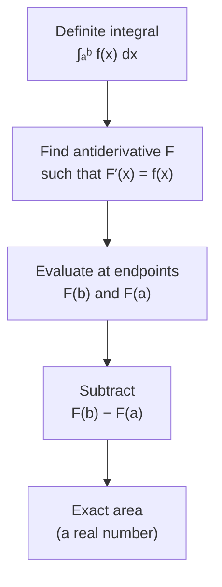

# Fundamental Theorem of Calculus — Part 2

## 📋 Formal Statement

If $f$ is continuous on the closed interval $[a, b]$, and $F$ is **any** antiderivative of $f$ on $[a, b]$ — meaning $F'(x) = f(x)$ for all $x \in [a, b]$ — then

$$\int_a^b f(x)\, dx = F(b) - F(a)$$

### Shorthand Notation

The expression $F(b) - F(a)$ is often written using the **evaluation bar**:

$$\int_a^b f(x)\, dx = \Big[F(x)\Big]_a^b$$

---

## 🔣 Legend — Every Symbol Explained

| Symbol               | Name                              | Meaning                                                                                           | Domain / Notes                                                      |
| -------------------- | --------------------------------- | ------------------------------------------------------------------------------------------------- | ------------------------------------------------------------------- |
| $f$                  | Integrand                         | The function whose area under the curve is being computed                                         | Must be continuous on $[a, b]$                                      |
| $F$                  | Antiderivative                    | Any function satisfying $F'(x) = f(x)$; also called a _primitive_ or _indefinite integral_ of $f$ | Unique up to an additive constant $C$                               |
| $x$                  | Variable of integration           | The placeholder variable inside the integral; disappears after evaluation                         | $x \in [a, b]$                                                      |
| $a$                  | Lower limit of integration        | The left endpoint of the interval; the starting point of accumulation                             | Any real number; $a \leq b$                                         |
| $b$                  | Upper limit of integration        | The right endpoint of the interval; the ending point of accumulation                              | Any real number; $b \geq a$                                         |
| $[a, b]$             | Closed interval                   | All real numbers from $a$ to $b$, **including** both endpoints $a$ and $b$                        | $a \leq x \leq b$                                                   |
| $\int_a^b$           | Definite integral from $a$ to $b$ | Signed area under the curve $f(x)$ between $x = a$ and $x = b$                                    | The elongated "S" stands for _summa_ (Latin: sum)                   |
| $\int$               | Integral sign                     | Elongated "S"; represents the limit of a Riemann sum (infinite sum of infinitely thin slices)     | Introduced by Leibniz (1675)                                        |
| $dx$                 | Differential of $x$               | An infinitesimally thin width element; specifies that $x$ is the variable of integration          | Leibniz notation; $dx \to 0$ in the limit                           |
| $f(x)\, dx$          | Infinitesimal area element        | Height $f(x)$ times infinitesimal width $dx$; one thin rectangular slice                          | Units: [f] × [x]                                                    |
| $F(b)$               | $F$ evaluated at $b$              | Plug the upper limit $b$ into the antiderivative $F$                                              | A single real number                                                |
| $F(a)$               | $F$ evaluated at $a$              | Plug the lower limit $a$ into the antiderivative $F$                                              | A single real number                                                |
| $F(b) - F(a)$        | Net change                        | The difference in the antiderivative's values at the two endpoints; equals the signed area        | Also written $\Delta F$                                             |
| $\Big[F(x)\Big]_a^b$ | Evaluation bar                    | Shorthand for $F(b) - F(a)$; evaluate $F$ at the top limit, subtract $F$ at the bottom limit      | Standard textbook notation                                          |
| $F'(x)$              | Derivative of $F$                 | The instantaneous rate of change of $F$; must equal $f(x)$ for $F$ to be an antiderivative        | Prime notation (Lagrange)                                           |
| $=$                  | Equals                            | Both sides are identical real numbers                                                             | —                                                                   |
| continuous           | Continuity condition              | $f$ has no jumps or holes on $[a, b]$; required for the Riemann integral to exist                 | Sufficient but not necessary — Riemann-integrable functions suffice |

> **Why does the constant $C$ vanish?** Every antiderivative of $f$ has the form $F(x) + C$ for some constant $C$. When you compute $[F(x)+C]_a^b = (F(b)+C) - (F(a)+C) = F(b) - F(a)$, the $C$ cancels. So the choice of antiderivative doesn't matter — any one works.

> **Signed area**: If $f(x) < 0$ on part of $[a,b]$, the integral counts that region as **negative** area. The theorem still holds — $F(b) - F(a)$ correctly accounts for sign.

---

## 💬 Plain English Explanation

**The big idea**: To find the exact area under a curve, you don't need to sum millions of tiny rectangles. Just find any antiderivative, plug in the two endpoints, and subtract.

**Analogy — odometer and speedometer**:

Suppose your car's speedometer reads $f(t)$ km/h at time $t$. The total distance driven from time $a$ to time $b$ is $\int_a^b f(t)\,dt$. But your odometer already tracks total distance — that's the antiderivative $F(t)$. Part 2 says:

$$\text{distance driven} = F(b) - F(a) = \text{odometer at end} - \text{odometer at start}$$

You don't need to watch the speedometer every millisecond and add it all up. Just read the odometer twice.

**Step by step**:

1. Identify the integrand $f(x)$ and the limits $a$, $b$.
2. Find an antiderivative $F$ such that $F'(x) = f(x)$.
3. Evaluate: compute $F(b) - F(a)$.

**Example 1** — polynomial:

$$\int_1^3 x^2\, dx$$

Antiderivative: $F(x) = \dfrac{x^3}{3}$ (since $F'(x) = x^2$).

$$\left[\frac{x^3}{3}\right]_1^3 = \frac{27}{3} - \frac{1}{3} = 9 - \frac{1}{3} = \frac{26}{3} \approx 8.67$$

**Example 2** — trigonometric:

$$\int_0^{\pi} \sin(x)\, dx$$

Antiderivative: $F(x) = -\cos(x)$ (since $\frac{d}{dx}(-\cos x) = \sin x$).

$$\Big[-\cos(x)\Big]_0^{\pi} = (-\cos\pi) - (-\cos 0) = (1) - (-1) = 2$$

This is the area of exactly one arch of the sine curve.

**Example 3** — exponential:

$$\int_0^1 e^x\, dx = \Big[e^x\Big]_0^1 = e^1 - e^0 = e - 1 \approx 1.718$$

---

## 🌍 Real-World Significance

| Application                      | How Part 2 is used                                                                                                 |
| -------------------------------- | ------------------------------------------------------------------------------------------------------------------ |
| **Physics — work**               | Work done by a variable force: $W = \int_a^b F(x)\,dx = [P(x)]_a^b$ where $P$ is potential energy                  |
| **Engineering — fluid flow**     | Total volume of fluid through a pipe: $V = \int_{t_1}^{t_2} Q(t)\,dt$ computed via antiderivative of flow rate $Q$ |
| **Probability — CDF**            | Cumulative distribution function: $P(a \leq X \leq b) = \int_a^b f(x)\,dx = F(b) - F(a)$                           |
| **Economics — consumer surplus** | Area between demand curve and price line computed analytically via antiderivatives                                 |
| **Medicine — drug dosage**       | Total drug absorbed: $\int_0^T C(t)\,dt$ where $C(t)$ is blood concentration; computed via antiderivative          |
| **Computer graphics**            | Arc length, surface area, and volume integrals all evaluated using Part 2                                          |

---

## 📜 History

| Period     | Event                                                                                                                      |
| ---------- | -------------------------------------------------------------------------------------------------------------------------- |
| ~1666–1676 | **Newton** and **Leibniz** independently discover that antidifferentiation solves the area problem                         |
| 1684       | Leibniz publishes the first calculus paper, introducing $\int$ and $d$ notation                                            |
| 1696       | **Johann Bernoulli** and **Guillaume de l'Hôpital** systematise antiderivative techniques                                  |
| 1823       | **Cauchy** gives the first rigorous proof of Part 2 using his definition of the definite integral                          |
| 1854       | **Riemann** formalises the integral; Part 2 is proved for all Riemann-integrable functions with continuous antiderivatives |
| 1902       | **Lebesgue** extends the theorem to a vastly larger class of functions via measure theory                                  |
| 20th c.    | Part 2 becomes the engine of all analytic integration in science and engineering                                           |

---

## 🖼️ Visual Intuition

```
f(x)
  │         ╭──────╮
  │        ╱ SHADED ╲
  │       ╱  AREA    ╲
  │──────╱            ╲──────
  └──────┬─────────────┬────▶ x
         a             b

Shaded area = ∫ₐᵇ f(x) dx = F(b) − F(a)

F(x) is the "height" of the accumulated area function.
At x = a: F(a) = 0 (if we start accumulating from a)
At x = b: F(b) = total area
Net change = F(b) − F(a)
```



---

## ✅ Lean 4 Status

| Item             | Status                                                                       |
| ---------------- | ---------------------------------------------------------------------------- |
| Formal statement | ✅ Available in Mathlib4 as `intervalIntegral.integral_eq_sub_of_hasDerivAt` |
| Proof            | ✅ Machine-checked                                                           |
| Verified         | ✅ Holds for continuous functions; extended results available                |

**Mathlib4 sketch** (illustrative):

```lean4
-- FTC Part 2: definite integral equals antiderivative difference
-- Key Mathlib4 theorem:
theorem ftc_part2 {f F : ℝ → ℝ} {a b : ℝ} (hab : a ≤ b)
    (hF : ∀ x ∈ Set.Icc a b, HasDerivAt F (f x) x)
    (hf : ContinuousOn f (Set.Icc a b)) :
    ∫ x in a..b, f x = F b - F a :=
  intervalIntegral.integral_eq_sub_of_hasDerivAt
    (fun x hx => hF x hx) hf.intervalIntegrable
```

---

## 🔗 Related Theorems

- **FTC Part 1** — the companion result: differentiating an integral recovers the integrand, $\frac{d}{dx}\int_a^x f(t)\,dt = f(x)$
- **Integration by Parts** — $\int_a^b u\,dv = [uv]_a^b - \int_a^b v\,du$; uses the evaluation bar directly
- **Substitution Rule** — changes variables inside an integral; relies on Part 2 for evaluation
- **Net Change Theorem** — a restatement: $\int_a^b F'(x)\,dx = F(b) - F(a)$; total change equals integral of rate of change
- **Improper Integrals** — extend Part 2 to unbounded intervals or unbounded integrands via limits
