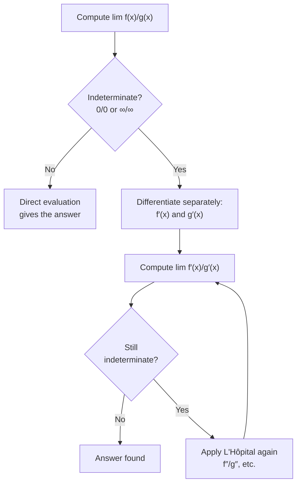

# L'Hôpital's Rule

## 📋 Formal Statement

### Standard Form ($\tfrac{0}{0}$ and $\tfrac{\infty}{\infty}$)

Suppose $f$ and $g$ are differentiable on an open interval containing $a$ (except possibly at $a$ itself), and $g'(x) \neq 0$ near $a$. If the limit produces an indeterminate form $\tfrac{0}{0}$ or $\tfrac{\infty}{\infty}$, then:

$$\lim_{x \to a} \frac{f(x)}{g(x)} = \lim_{x \to a} \frac{f'(x)}{g'(x)}$$

provided the right-hand limit exists (or equals $\pm\infty$).

### One-Sided and Infinite Limits

The rule applies equally when $a$ is replaced by $a^+$, $a^-$, $+\infty$, or $-\infty$:

$$\lim_{x \to \infty} \frac{f(x)}{g(x)} = \lim_{x \to \infty} \frac{f'(x)}{g'(x)}$$

### Iterated Application

If $\dfrac{f'(x)}{g'(x)}$ is still indeterminate, apply the rule again:

$$\lim_{x \to a} \frac{f(x)}{g(x)} = \lim_{x \to a} \frac{f'(x)}{g'(x)} = \lim_{x \to a} \frac{f''(x)}{g''(x)} = \cdots$$

---

## 🔣 Legend — Every Symbol Explained

| Symbol                   | Name                                      | Meaning                                                                                                    | Domain / Notes                                                      |
| ------------------------ | ----------------------------------------- | ---------------------------------------------------------------------------------------------------------- | ------------------------------------------------------------------- |
| $\lim_{x \to a}$         | Limit as $x$ approaches $a$               | The value that an expression approaches as $x$ gets arbitrarily close to $a$ (but need not equal $a$)      | $a$ can be a real number, $+\infty$, or $-\infty$                   |
| $\lim$                   | Limit operator                            | Short for _limes_ (Latin: boundary); the fundamental concept of approaching a value                        | Introduced by Cauchy; notation standardised in 19th c.              |
| $x \to a$                | $x$ approaches $a$                        | $x$ gets closer and closer to $a$ from both sides, but never necessarily equals $a$                        | Read: "$x$ tends to $a$"                                            |
| $x \to a^+$              | Right-hand limit                          | $x$ approaches $a$ from values **greater** than $a$ (from the right on the number line)                    | Superscript $+$ means "from above"                                  |
| $x \to a^-$              | Left-hand limit                           | $x$ approaches $a$ from values **less** than $a$ (from the left on the number line)                        | Superscript $-$ means "from below"                                  |
| $x \to +\infty$          | $x$ grows without bound                   | $x$ increases through all positive real numbers, becoming arbitrarily large                                | $+\infty$ is not a real number; it is a limit concept               |
| $x \to -\infty$          | $x$ decreases without bound               | $x$ decreases through all negative real numbers, becoming arbitrarily large in magnitude                   | —                                                                   |
| $f(x)$                   | Numerator function                        | The function in the top of the fraction whose limit is sought                                              | Must be differentiable near $a$                                     |
| $g(x)$                   | Denominator function                      | The function in the bottom of the fraction                                                                 | Must be differentiable near $a$; $g(x) \neq 0$ near $a$             |
| $\dfrac{f(x)}{g(x)}$     | Ratio of functions                        | The fraction whose limit is indeterminate without L'Hôpital's rule                                         | The problematic expression                                          |
| $f'(x)$                  | Derivative of $f$                         | The instantaneous rate of change of $f$ with respect to $x$                                                | Prime notation (Lagrange)                                           |
| $g'(x)$                  | Derivative of $g$                         | The instantaneous rate of change of $g$ with respect to $x$                                                | Must be nonzero near $a$ for the rule to apply                      |
| $\dfrac{f'(x)}{g'(x)}$   | Ratio of derivatives                      | The new fraction after applying L'Hôpital's rule; often easier to evaluate                                 | **Not** the derivative of $f/g$ — do not use the quotient rule here |
| $f''(x)$                 | Second derivative of $f$                  | Derivative of $f'$; used when one application of the rule is insufficient                                  | Double prime notation                                               |
| $g''(x)$                 | Second derivative of $g$                  | Derivative of $g'$                                                                                         | —                                                                   |
| $=$                      | Equals (in limit context)                 | The two limits have the same value                                                                         | —                                                                   |
| $\tfrac{0}{0}$           | Zero-over-zero indeterminate form         | Both $f(x) \to 0$ and $g(x) \to 0$ as $x \to a$; the ratio's limit is not determined by this alone         | One of seven indeterminate forms                                    |
| $\tfrac{\infty}{\infty}$ | Infinity-over-infinity indeterminate form | Both $f(x) \to \infty$ and $g(x) \to \infty$; again the ratio's limit is not determined                    | —                                                                   |
| $\pm\infty$              | Plus or minus infinity                    | The limit may be $+\infty$ or $-\infty$; L'Hôpital's rule still applies                                    | —                                                                   |
| differentiable           | Differentiability condition               | $f$ and $g$ have well-defined derivatives near $a$; no sharp corners or discontinuities                    | Required for the rule to be valid                                   |
| $g'(x) \neq 0$           | Non-vanishing derivative condition        | $g'$ must not be zero near $a$ (except possibly at $a$ itself); prevents division by zero in the new ratio | Critical hypothesis — rule fails if violated                        |

> **What is an "indeterminate form"?** When you plug $x = a$ directly into $f(x)/g(x)$ and get $0/0$ or $\infty/\infty$, the ratio's limit is genuinely ambiguous — it could be any number, or $\pm\infty$. L'Hôpital's rule resolves the ambiguity by examining the _rates_ at which numerator and denominator approach their limits.

> **The seven indeterminate forms**: $\tfrac{0}{0}$, $\tfrac{\infty}{\infty}$, $0 \cdot \infty$, $\infty - \infty$, $0^0$, $1^\infty$, $\infty^0$. L'Hôpital's rule directly handles the first two; the others are converted to $\tfrac{0}{0}$ or $\tfrac{\infty}{\infty}$ by algebraic manipulation before applying the rule.

> **Critical warning**: $\dfrac{f'(x)}{g'(x)}$ is **not** the quotient rule. You differentiate numerator and denominator **separately**, not as a single fraction. The quotient rule gives $\dfrac{f'g - fg'}{g^2}$, which is completely different.

---

## 💬 Plain English Explanation

**The big idea**: When a limit produces a meaningless $0/0$ or $\infty/\infty$, replace the functions with their derivatives and try again. The derivatives reveal which function is "winning the race" to zero or infinity.

**Racing analogy**:

Imagine two runners, $f$ and $g$, both sprinting toward zero. The ratio $f/g$ asks: "Who reaches zero faster?" If both reach zero at the same instant, the ratio depends on their _speeds_ — their derivatives. L'Hôpital's rule says: look at the ratio of speeds $f'/g'$ instead of positions $f/g$.

**Step by step**:

1. Compute $\lim_{x\to a} f(x)$ and $\lim_{x\to a} g(x)$.
2. If the result is $0/0$ or $\infty/\infty$, apply L'Hôpital: differentiate top and bottom separately.
3. Evaluate the new limit $\lim_{x\to a} f'(x)/g'(x)$.
4. If still indeterminate, repeat.

**Example 1** — classic $\tfrac{0}{0}$:

$$\lim_{x \to 0} \frac{\sin x}{x}$$

Direct substitution: $\sin(0)/0 = 0/0$ — indeterminate.

Apply L'Hôpital: differentiate top ($\cos x$) and bottom ($1$):

$$\lim_{x \to 0} \frac{\cos x}{1} = \frac{\cos 0}{1} = \frac{1}{1} = 1$$

**Example 2** — $\tfrac{\infty}{\infty}$:

$$\lim_{x \to \infty} \frac{\ln x}{x}$$

Direct substitution: $\infty/\infty$ — indeterminate.

Apply L'Hôpital: differentiate top ($1/x$) and bottom ($1$):

$$\lim_{x \to \infty} \frac{1/x}{1} = \lim_{x \to \infty} \frac{1}{x} = 0$$

Logarithm grows slower than any linear function.

**Example 3** — iterated application:

$$\lim_{x \to 0} \frac{1 - \cos x}{x^2}$$

First application: $\dfrac{\sin x}{2x}$ — still $0/0$.

Second application: $\dfrac{\cos x}{2} \to \dfrac{1}{2}$.

**Example 4** — converting $0 \cdot \infty$:

$$\lim_{x \to 0^+} x \ln x = \lim_{x \to 0^+} \frac{\ln x}{1/x} \xrightarrow{\text{L'H}} \lim_{x \to 0^+} \frac{1/x}{-1/x^2} = \lim_{x \to 0^+} (-x) = 0$$

---

## 🌍 Real-World Significance

| Application                                   | How L'Hôpital's Rule is used                                                                              |
| --------------------------------------------- | --------------------------------------------------------------------------------------------------------- |
| **Physics — wave optics**                     | The sinc function $\frac{\sin x}{x}$ appears in diffraction; its value at $x=0$ is 1, proved by L'Hôpital |
| **Information theory**                        | $\lim_{p \to 0} p \ln p = 0$ (entropy of a zero-probability event); proved via L'Hôpital                  |
| **Probability — moment generating functions** | Limits of MGFs at boundary cases resolved using the rule                                                  |
| **Engineering — control systems**             | Transfer function limits at poles and zeros; stability analysis                                           |
| **Economics — elasticity**                    | Marginal rate of substitution limits at corner solutions                                                  |
| **Numerical analysis**                        | Verifying that numerical methods converge to correct limits at singular points                            |
| **Biology — population models**               | Logistic growth limits as carrying capacity $K \to \infty$                                                |
| **Thermodynamics**                            | Limits of thermodynamic quantities near phase transitions                                                 |

---

## 📜 History

| Period  | Event                                                                                                                                                                                         |
| ------- | --------------------------------------------------------------------------------------------------------------------------------------------------------------------------------------------- |
| 1694    | **Johann Bernoulli** (Switzerland) discovers the rule and communicates it to his student Guillaume de l'Hôpital                                                                               |
| 1696    | **Guillaume François Antoine, Marquis de l'Hôpital** (France) publishes _Analyse des Infiniment Petits_, the first calculus textbook, containing the rule — crediting Bernoulli in a footnote |
| 1694    | Bernoulli had sold his mathematical discoveries to l'Hôpital for a monthly stipend; the rule bears l'Hôpital's name by historical convention                                                  |
| 1823    | **Cauchy** provides the first rigorous proof using the Cauchy Mean Value Theorem                                                                                                              |
| 1868    | **Ossian Bonnet** clarifies the conditions under which the rule is valid                                                                                                                      |
| 20th c. | The rule is extended to complex analysis, distributions, and non-standard analysis                                                                                                            |

The naming controversy is one of mathematics' most famous attribution disputes. Bernoulli complained bitterly in later life that the rule should bear his name.

---

## 🖼️ Visual Intuition

```
f(x) and g(x) both → 0 as x → a:

f(x)
  │╲
  │  ╲  ← f approaches 0 steeply (fast)
  │    ╲
  │─────╲──────────────────▶ x
         a

g(x)
  │╲
  │  ╲  ← g approaches 0 gently (slow)
  │    ╲
  │─────╲──────────────────▶ x
         a

Ratio f/g: fast/slow → large number
Ratio f'/g': steep slope / gentle slope → same large number

L'Hôpital: the SLOPES (derivatives) determine the ratio's limit.
```



---

## ✅ Lean 4 Status

| Item             | Status                                                                         |
| ---------------- | ------------------------------------------------------------------------------ |
| Formal statement | ✅ Available in Mathlib4 as `HasDerivAt.lhopital_zero_nhds` and related lemmas |
| Proof            | ✅ Machine-checked via Cauchy Mean Value Theorem                               |
| Verified         | ✅ Standard result in Mathlib analysis library                                 |

**Mathlib4 sketch** (illustrative):

```lean4
-- L'Hôpital's Rule (0/0 case) in Mathlib4
-- Key result: lhopital_zero_nhds
theorem lhopital_zero_nhds {f g f' g' : ℝ → ℝ} {a L : ℝ}
    (hf : Tendsto f (𝓝 a) (𝓝 0))
    (hg : Tendsto g (𝓝 a) (𝓝 0))
    (hf' : ∀ᶠ x in 𝓝 a, HasDerivAt f (f' x) x)
    (hg' : ∀ᶠ x in 𝓝 a, HasDerivAt g (g' x) x)
    (hg'_ne : ∀ᶠ x in 𝓝[≠] a, g' x ≠ 0)
    (hratio : Tendsto (fun x => f' x / g' x) (𝓝[≠] a) (𝓝 L)) :
    Tendsto (fun x => f x / g x) (𝓝[≠] a) (𝓝 L) :=
  lhopital_zero_nhds hf hg hf' hg' hg'_ne hratio
```

---

## 🔗 Related Theorems

- **Cauchy Mean Value Theorem** — the rigorous foundation of L'Hôpital's rule: $\frac{f(b)-f(a)}{g(b)-g(a)} = \frac{f'(c)}{g'(c)}$
- **Mean Value Theorem** — special case of Cauchy MVT; both underpin L'Hôpital's proof
- **Taylor's Theorem** — alternative method for evaluating indeterminate limits by comparing leading terms of Taylor expansions
- **Squeeze Theorem** — another technique for evaluating limits; sometimes simpler than L'Hôpital
- **Limit Laws** — algebraic rules for limits; L'Hôpital's rule handles cases where limit laws break down
- **Big-O Notation** — formalises the "rate of growth" comparison that L'Hôpital's rule exploits
