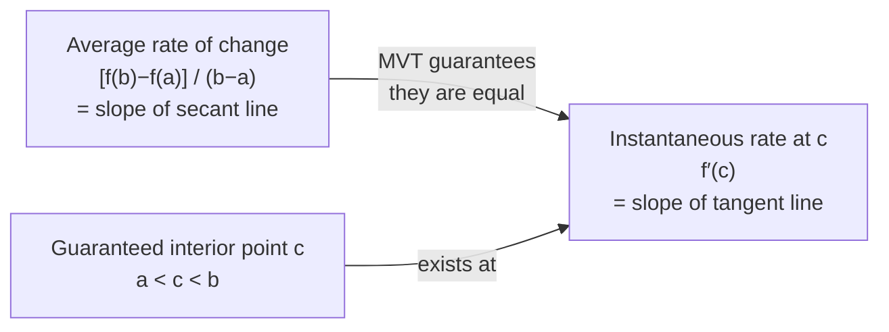

# Mean Value Theorem

## 📋 Formal Statement

If $f$ is continuous on the closed interval $[a, b]$ and differentiable on the open interval $(a, b)$, then there exists at least one point $c \in (a, b)$ such that

$$f'(c) = \frac{f(b) - f(a)}{b - a}$$

### Equivalent Form — Net Change

$$f(b) - f(a) = f'(c)\,(b - a)$$

### Geometric Reading

The instantaneous slope of $f$ at some interior point $c$ equals the slope of the **secant line** connecting the endpoints $(a,\, f(a))$ and $(b,\, f(b))$.

---

## 🔣 Legend — Every Symbol Explained

| Symbol                   | Name                      | Meaning                                                                                                          | Domain / Notes                                            |
| ------------------------ | ------------------------- | ---------------------------------------------------------------------------------------------------------------- | --------------------------------------------------------- |
| $f$                      | Function                  | The curve whose average and instantaneous rates are being compared                                               | Must be continuous on $[a,b]$, differentiable on $(a,b)$  |
| $f(a)$                   | $f$ at $a$                | The value (output) of the function at the left endpoint $a$                                                      | A real number                                             |
| $f(b)$                   | $f$ at $b$                | The value (output) of the function at the right endpoint $b$                                                     | A real number                                             |
| $f(b) - f(a)$            | Net change                | How much the function's output changes from $a$ to $b$                                                           | Can be positive, negative, or zero                        |
| $a$                      | Left endpoint             | The starting $x$-value of the interval                                                                           | Any real number; $a < b$                                  |
| $b$                      | Right endpoint            | The ending $x$-value of the interval                                                                             | Any real number; $b > a$                                  |
| $b - a$                  | Length of interval        | The total horizontal span from $a$ to $b$                                                                        | Always positive since $b > a$                             |
| $[a, b]$                 | Closed interval           | All real numbers from $a$ to $b$, **including** both endpoints                                                   | Continuity required here                                  |
| $(a, b)$                 | Open interval             | All real numbers strictly between $a$ and $b$, **excluding** endpoints                                           | Differentiability required here                           |
| $c$                      | Guaranteed interior point | A specific (but possibly non-unique) $x$-value strictly between $a$ and $b$ where the theorem's conclusion holds | $a < c < b$; existence guaranteed, location not specified |
| $\in$                    | Element of / belongs to   | "$c \in (a,b)$" means $c$ is a number inside the open interval $(a,b)$                                           | Set membership symbol                                     |
| $f'(c)$                  | Derivative of $f$ at $c$  | The instantaneous rate of change (slope of the tangent line) of $f$ at the point $x = c$                         | Prime notation (Lagrange)                                 |
| $\dfrac{f(b)-f(a)}{b-a}$ | Average rate of change    | Rise over run between the two endpoints; slope of the secant line                                                | Also called the **difference quotient** over $[a,b]$      |
| $=$                      | Equals                    | The instantaneous rate at $c$ is numerically identical to the average rate over $[a,b]$                          | —                                                         |
| continuous               | Continuity                | $f$ has no jumps or holes; you can draw it without lifting your pen                                              | Needed on the **closed** interval $[a,b]$                 |
| differentiable           | Differentiability         | $f$ has a well-defined tangent slope at every interior point; no sharp corners or cusps                          | Needed on the **open** interval $(a,b)$                   |
| "there exists"           | Existential quantifier    | At least one such $c$ is guaranteed to exist; there may be more than one                                         | The theorem guarantees existence, not uniqueness          |

> **Secant line**: A straight line drawn through two points on a curve. Here it connects $(a, f(a))$ to $(b, f(b))$. Its slope is $\dfrac{f(b)-f(a)}{b-a}$ — rise divided by run.

> **Tangent line**: A straight line that just touches the curve at one point $c$ and has the same slope as the curve there. Its slope is $f'(c)$.

> **Why open vs. closed?** Continuity on the closed interval $[a,b]$ ensures no gaps at the endpoints. Differentiability on the open interval $(a,b)$ is weaker — we don't require a derivative at the endpoints themselves (e.g., $f(x) = \sqrt{x}$ on $[0,1]$ has no derivative at $0$ but MVT still applies).

---

## 💬 Plain English Explanation

**The big idea**: On any smooth, connected curve, there is always at least one point where the curve's instantaneous slope matches its overall average slope.

**Driving analogy** (the most famous):

You drive from city A to city B, a distance of 120 km, in exactly 2 hours. Your **average speed** is $\frac{120}{2} = 60$ km/h. The Mean Value Theorem guarantees that at some moment during the trip, your **speedometer read exactly 60 km/h** — even if you sped up, slowed down, or stopped for coffee.

This is not just intuition — it is a mathematical certainty, provided your speed was a continuous, differentiable function of time.

**Step by step**:

1. Compute the average rate of change: $\dfrac{f(b)-f(a)}{b-a}$ (slope of the secant line).
2. The theorem guarantees a point $c$ where $f'(c)$ equals that average.
3. Geometrically: the tangent line at $c$ is parallel to the secant line.

**Example 1** — polynomial:

Let $f(x) = x^2$ on $[1, 3]$.

Average rate: $\dfrac{f(3)-f(1)}{3-1} = \dfrac{9-1}{2} = 4$.

Find $c$: $f'(x) = 2x$, so $2c = 4 \Rightarrow c = 2$.

Check: $c = 2 \in (1, 3)$ ✓. The tangent at $x=2$ is parallel to the secant from $(1,1)$ to $(3,9)$.

**Example 2** — trigonometric:

Let $f(x) = \sin(x)$ on $[0, \pi]$.

Average rate: $\dfrac{\sin\pi - \sin 0}{\pi - 0} = \dfrac{0-0}{\pi} = 0$.

Find $c$: $f'(x) = \cos(x) = 0 \Rightarrow c = \pi/2$.

Check: $c = \pi/2 \in (0, \pi)$ ✓. The sine curve has a horizontal tangent at its peak.

---

## 🌍 Real-World Significance

| Application              | How MVT is used                                                                                                                                 |
| ------------------------ | ----------------------------------------------------------------------------------------------------------------------------------------------- |
| **Traffic enforcement**  | Average-speed cameras: if you cover a known distance in less time than the speed limit allows, MVT proves you exceeded the limit at some moment |
| **Physics — kinematics** | Guarantees that a moving object achieves its average velocity as an instantaneous velocity at some moment                                       |
| **Error analysis**       | Bounds the error in numerical approximations: $\|f(b)-f(a)\| \leq \max\|f'\| \cdot (b-a)$                                                       |
| **Economics**            | Proves that marginal cost equals average cost at some production level                                                                          |
| **Numerical methods**    | Underpins convergence proofs for Newton's method and finite difference schemes                                                                  |
| **Cryptography**         | Used in proofs about discrete logarithm hardness via analytic number theory                                                                     |
| **Medicine**             | Guarantees a moment of peak drug concentration between two measurements                                                                         |

---

## 📜 History

| Period  | Event                                                                                                                |
| ------- | -------------------------------------------------------------------------------------------------------------------- |
| 1691    | **Michel Rolle** proves a special case (Rolle's Theorem): if $f(a) = f(b)$, then $f'(c) = 0$ for some $c \in (a,b)$  |
| 1797    | **Joseph-Louis Lagrange** states the general Mean Value Theorem in _Théorie des fonctions analytiques_               |
| 1823    | **Augustin-Louis Cauchy** gives the first rigorous proof using his definition of continuity and the derivative       |
| 1868    | **Ossian Bonnet** proves the Cauchy Mean Value Theorem (generalised form with two functions)                         |
| 20th c. | MVT becomes a cornerstone of real analysis; used to prove monotonicity, L'Hôpital's rule, Taylor's theorem, and more |

---

## 🖼️ Visual Intuition

```
f(x)
  │                    ● (b, f(b))
  │                  ╱ ← secant line (slope = average rate)
  │         ╭───────╯
  │        ╱  ↑ tangent at c (slope = f′(c))
  │       ╱   ║ parallel to secant!
  │      ╱    ║
  │─────╯     c
  ● (a, f(a))
  └──────────────────────────────▶ x
         a         c         b

The tangent line at c is parallel to the secant line from a to b.
```



---

## ✅ Lean 4 Status

| Item             | Status                                              |
| ---------------- | --------------------------------------------------- |
| Formal statement | ✅ Available in Mathlib4 as `exists_deriv_eq_slope` |
| Proof            | ✅ Machine-checked via Rolle's theorem              |
| Verified         | ✅ Standard result in Mathlib real analysis library |

**Mathlib4 sketch** (illustrative):

```lean4
-- Mean Value Theorem in Mathlib4
-- Key result: exists_deriv_eq_slope
theorem mean_value_theorem {f : ℝ → ℝ} {a b : ℝ} (hab : a < b)
    (hf : ContinuousOn f (Set.Icc a b))
    (hf' : DifferentiableOn ℝ f (Set.Ioo a b)) :
    ∃ c ∈ Set.Ioo a b, deriv f c = (f b - f a) / (b - a) :=
  exists_deriv_eq_slope f hab hf hf'
```

---

## 🔗 Related Theorems

- **Rolle's Theorem** — the special case where $f(a) = f(b)$; guarantees $f'(c) = 0$; used to prove MVT
- **Cauchy Mean Value Theorem** — generalisation: $\frac{f(b)-f(a)}{g(b)-g(a)} = \frac{f'(c)}{g'(c)}$; used to prove L'Hôpital's Rule
- **L'Hôpital's Rule** — proved using the Cauchy MVT; resolves indeterminate limits
- **Taylor's Theorem** — a higher-order generalisation of MVT; approximates functions with polynomials
- **Monotonicity Theorem** — consequence of MVT: if $f'(x) > 0$ on $(a,b)$, then $f$ is strictly increasing
- **FTC Part 2** — MVT ideas underpin the proof that $\int_a^b f'(x)\,dx = f(b) - f(a)$
