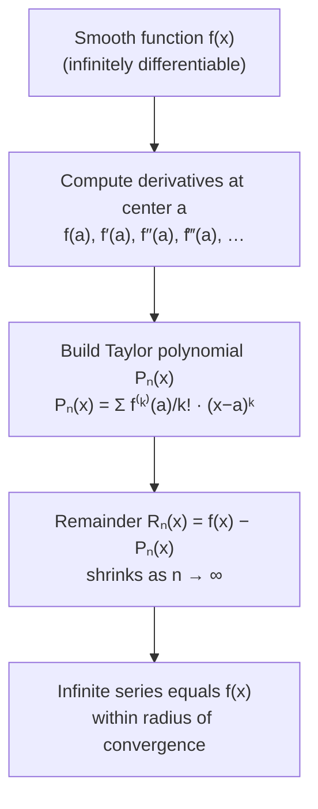

# Taylor's Theorem and Taylor Series

## 📋 Formal Statement

### Taylor's Theorem (finite form with remainder)

If $f$ is $n+1$ times differentiable on an open interval containing $a$, then for any $x$ in that interval:

$$f(x) = \sum_{k=0}^{n} \frac{f^{(k)}(a)}{k!}(x - a)^k + R_n(x)$$

where the **Lagrange remainder** is:

$$R_n(x) = \frac{f^{(n+1)}(c)}{(n+1)!}(x-a)^{n+1}$$

for some $c$ strictly between $a$ and $x$.

### Taylor Series (infinite form)

If $f$ is infinitely differentiable and the remainder $R_n(x) \to 0$ as $n \to \infty$:

$$f(x) = \sum_{k=0}^{\infty} \frac{f^{(k)}(a)}{k!}(x - a)^k$$

### Maclaurin Series (special case $a = 0$)

$$f(x) = \sum_{k=0}^{\infty} \frac{f^{(k)}(0)}{k!}\, x^k = f(0) + f'(0)\,x + \frac{f''(0)}{2!}\,x^2 + \frac{f'''(0)}{3!}\,x^3 + \cdots$$

---

## 🔣 Legend — Every Symbol Explained

| Symbol                                   | Name                            | Meaning                                                                                        | Domain / Notes                                                               |
| ---------------------------------------- | ------------------------------- | ---------------------------------------------------------------------------------------------- | ---------------------------------------------------------------------------- | --- | ------------------------ |
| $f$                                      | Function                        | The function being approximated by a polynomial                                                | Must be sufficiently differentiable near $a$                                 |
| $f(x)$                                   | Function value at $x$           | The exact output of $f$ at the point $x$                                                       | The quantity being approximated                                              |
| $a$                                      | Center of expansion             | The point around which the Taylor series is built; the approximation is most accurate near $a$ | Any point where $f$ is differentiable; $a=0$ gives Maclaurin series          |
| $x$                                      | Evaluation point                | The point at which we want to approximate $f$                                                  | Should be "close" to $a$ for good accuracy                                   |
| $x - a$                                  | Displacement from center        | How far $x$ is from the expansion center $a$                                                   | Small $                                                                      | x-a | $ → better approximation |
| $k$                                      | Summation index                 | A non-negative integer counting which term of the series we are on: $k = 0, 1, 2, 3, \ldots$   | $k \in \{0, 1, 2, \ldots, n\}$ for finite; $k \in \mathbb{N}_0$ for infinite |
| $\sum_{k=0}^{n}$                         | Finite sum                      | Add up all terms from $k=0$ to $k=n$                                                           | Greek capital sigma $\Sigma$ = "sum"                                         |
| $\sum_{k=0}^{\infty}$                    | Infinite series                 | Add up infinitely many terms; converges if the partial sums approach a finite limit            | Convergence is not guaranteed for all $x$                                    |
| $f^{(k)}(a)$                             | $k$-th derivative of $f$ at $a$ | Differentiate $f$ exactly $k$ times, then evaluate at $x = a$                                  | $f^{(0)}(a) = f(a)$; $f^{(1)}(a) = f'(a)$; $f^{(2)}(a) = f''(a)$; etc.       |
| $f^{(0)}(a)$                             | Zeroth derivative               | Just $f(a)$ itself — no differentiation                                                        | The constant term of the series                                              |
| $f'(a)$                                  | First derivative at $a$         | Instantaneous rate of change of $f$ at $a$; slope of tangent line                              | Controls the linear term                                                     |
| $f''(a)$                                 | Second derivative at $a$        | Rate of change of the rate of change; measures curvature                                       | Controls the quadratic term                                                  |
| $f'''(a)$                                | Third derivative at $a$         | Rate of change of curvature                                                                    | Controls the cubic term                                                      |
| $k!$                                     | $k$ factorial                   | $k! = k \times (k-1) \times \cdots \times 2 \times 1$; by convention $0! = 1$                  | Grows very fast: $5! = 120$, $10! = 3{,}628{,}800$                           |
| $\dfrac{f^{(k)}(a)}{k!}$                 | Taylor coefficient              | The coefficient of the $k$-th term; encodes how much the $k$-th derivative contributes         | Dividing by $k!$ corrects for the repeated differentiation of $(x-a)^k$      |
| $(x-a)^k$                                | Power term                      | $(x-a)$ raised to the $k$-th power; the polynomial basis function                              | $(x-a)^0 = 1$; $(x-a)^1 = x-a$; etc.                                         |
| $n$                                      | Degree of approximation         | The highest power included in the finite Taylor polynomial                                     | Larger $n$ → better approximation (usually)                                  |
| $R_n(x)$                                 | Remainder (error term)          | The difference between the exact value $f(x)$ and the degree-$n$ Taylor polynomial             | $R_n(x) = f(x) - P_n(x)$; measures approximation error                       |
| $c$                                      | Lagrange remainder point        | An unknown point strictly between $a$ and $x$; its existence is guaranteed by MVT              | $c \in (a, x)$ or $(x, a)$; exact value unknown                              |
| $\frac{f^{(n+1)}(c)}{(n+1)!}(x-a)^{n+1}$ | Lagrange remainder formula      | Exact expression for the error; useful for bounding the error even without knowing $c$         | Named after Lagrange                                                         |
| $\to 0$                                  | Converges to zero               | The remainder shrinks to zero as $n$ increases (for analytic functions)                        | Required for the infinite series to equal $f(x)$                             |
| $\cdots$                                 | Ellipsis                        | "And so on" — the pattern continues indefinitely                                               | —                                                                            |

> **What is a factorial?** $k!$ counts the number of ways to arrange $k$ objects. $0! = 1$ by convention. $1! = 1$, $2! = 2$, $3! = 6$, $4! = 24$, $5! = 120$. It grows explosively, which is why higher-order Taylor terms become tiny for small $|x-a|$.

> **Why divide by $k!$?** If you differentiate $(x-a)^k$ exactly $k$ times, you get $k!$. Dividing by $k!$ ensures that the $k$-th derivative of the Taylor polynomial at $x=a$ equals $f^{(k)}(a)$ — the polynomial is "tuned" to match $f$ and all its derivatives at the center.

> **Radius of convergence**: The infinite Taylor series converges only within a certain distance of $a$, called the radius of convergence $R$. For $|x-a| < R$ the series equals $f(x)$; outside, it may diverge.

---

## 💬 Plain English Explanation

**The big idea**: Any smooth function can be approximated — to any desired accuracy — by a polynomial, using only the function's derivatives at a single point.

**Analogy — GPS map zoom**:

Imagine zooming into a smooth curve on a map. At any zoom level, the curve looks more and more like a straight line (first-order Taylor), then like a parabola (second-order), then like a cubic, and so on. Taylor's theorem makes this precise: the more derivatives you include, the better the polynomial fits the curve near the center point.

**Building the approximation term by term**:

| Term     | Polynomial piece           | What it captures                       |
| -------- | -------------------------- | -------------------------------------- |
| $k=0$    | $f(a)$                     | The function's value at $a$ (constant) |
| $k=1$    | $f'(a)(x-a)$               | The slope at $a$ (linear trend)        |
| $k=2$    | $\frac{f''(a)}{2}(x-a)^2$  | The curvature at $a$ (bending)         |
| $k=3$    | $\frac{f'''(a)}{6}(x-a)^3$ | The rate of bending (skewness)         |
| $\vdots$ | $\vdots$                   | Each term refines the fit              |

**Famous Maclaurin series** (centered at $a=0$):

$$e^x = 1 + x + \frac{x^2}{2!} + \frac{x^3}{3!} + \frac{x^4}{4!} + \cdots = \sum_{k=0}^{\infty} \frac{x^k}{k!}$$

$$\sin(x) = x - \frac{x^3}{3!} + \frac{x^5}{5!} - \frac{x^7}{7!} + \cdots = \sum_{k=0}^{\infty} \frac{(-1)^k\, x^{2k+1}}{(2k+1)!}$$

$$\cos(x) = 1 - \frac{x^2}{2!} + \frac{x^4}{4!} - \frac{x^6}{6!} + \cdots = \sum_{k=0}^{\infty} \frac{(-1)^k\, x^{2k}}{(2k)!}$$

$$\frac{1}{1-x} = 1 + x + x^2 + x^3 + \cdots = \sum_{k=0}^{\infty} x^k \quad (|x| < 1)$$

**Euler's identity** emerges from these series:

$$e^{i\pi} + 1 = 0$$

---

## 🌍 Real-World Significance

| Application                             | How Taylor series is used                                                                                                   |
| --------------------------------------- | --------------------------------------------------------------------------------------------------------------------------- |
| **Calculators and computers**           | $\sin$, $\cos$, $e^x$, $\ln$ are computed using truncated Taylor series (or Chebyshev approximations derived from them)     |
| **Physics — small-angle approximation** | $\sin\theta \approx \theta$ for small $\theta$ (first-order Taylor); used in pendulum equations, optics, and wave mechanics |
| **Engineering — control systems**       | Linearisation of nonlinear systems around an operating point uses first-order Taylor expansion                              |
| **Quantum mechanics**                   | Perturbation theory expands energy levels as Taylor series in a small coupling constant                                     |
| **Finance — options pricing**           | Greeks (Delta, Gamma, Vega) are Taylor coefficients of option price with respect to underlying variables                    |
| **Numerical analysis**                  | Finite difference formulas (for derivatives) are derived by truncating Taylor series                                        |
| **Special relativity**                  | $\gamma = (1-v^2/c^2)^{-1/2} \approx 1 + \frac{v^2}{2c^2}$ for $v \ll c$ — classical kinetic energy recovered               |
| **Signal processing**                   | Z-transform and Laplace transform analysis uses series expansions                                                           |

---

## 📜 History

| Period  | Event                                                                                                                             |
| ------- | --------------------------------------------------------------------------------------------------------------------------------- |
| 1671    | **James Gregory** (Scotland) discovers series for $\arctan$, $\sin$, and $\cos$                                                   |
| 1715    | **Brook Taylor** (England) publishes _Methodus Incrementorum_, stating the general theorem                                        |
| 1742    | **Colin Maclaurin** (Scotland) popularises the special case $a=0$ in _Treatise of Fluxions_                                       |
| 1797    | **Lagrange** provides the remainder formula $R_n(x)$, making error analysis rigorous                                              |
| 1821    | **Cauchy** gives rigorous convergence criteria and introduces the concept of radius of convergence                                |
| 1748    | **Euler** uses series to derive $e^{i\theta} = \cos\theta + i\sin\theta$ (Euler's formula)                                        |
| 19th c. | **Weierstrass** constructs a continuous nowhere-differentiable function — showing not all continuous functions have Taylor series |
| 20th c. | Taylor series extended to complex analysis (Laurent series), several variables, and Banach spaces                                 |

---

## 🖼️ Visual Intuition

```
f(x) = sin(x) approximated by Taylor polynomials at a = 0:

  f(x)
  1 │    ╭──╮
    │   ╱    ╲
    │  ╱      ╲
  0 │─╱────────╲────────────▶ x
    │╱    π     ╲   2π
 -1 │             ╲──╯

P₁(x) = x                    (linear — good near 0)
P₃(x) = x − x³/6             (cubic — better)
P₅(x) = x − x³/6 + x⁵/120   (quintic — even better)
P₇(x) = x − x³/6 + x⁵/120 − x⁷/5040  (excellent near 0)

Each additional term extends the accurate region further from 0.
```



---

## ✅ Lean 4 Status

| Item              | Status                                                                         |
| ----------------- | ------------------------------------------------------------------------------ |
| Formal statement  | ✅ Available in Mathlib4 as `taylor_mean_remainder` and `HasFTaylorSeriesUpTo` |
| Taylor polynomial | ✅ `Polynomial.taylorExpansion` and related results                            |
| Remainder bound   | ✅ Lagrange remainder formalised                                               |
| Verified          | ✅ Machine-checked                                                             |

**Mathlib4 sketch** (illustrative):

```lean4
-- Taylor's theorem with Lagrange remainder in Mathlib4
-- Key result: taylor_mean_remainder
theorem taylor_theorem {f : ℝ → ℝ} {a x : ℝ} {n : ℕ}
    (hf : ContDiff ℝ (n + 1) f) :
    ∃ c ∈ Set.Ioo (min a x) (max a x),
    f x = ∑ k in Finset.range (n + 1), (f.iteratedDeriv k a / k.factorial) * (x - a)^k
        + (f.iteratedDeriv (n + 1) c / (n + 1).factorial) * (x - a)^(n + 1) :=
  taylor_mean_remainder hf
```

---

## 🔗 Related Theorems

- **Mean Value Theorem** — the $n=0$ case of Taylor's theorem; MVT is used in the proof of the remainder formula
- **L'Hôpital's Rule** — can be derived from Taylor series by comparing leading terms of numerator and denominator
- **Euler's Formula** — $e^{ix} = \cos x + i\sin x$; proved by comparing Maclaurin series of $e^x$, $\sin x$, $\cos x$
- **Binomial Series** — $(1+x)^\alpha = \sum_{k=0}^\infty \binom{\alpha}{k} x^k$; a Taylor series for non-integer powers
- **Laurent Series** — generalisation to complex analysis allowing negative powers; handles poles
- **Stone–Weierstrass Theorem** — every continuous function on a closed interval can be uniformly approximated by polynomials (broader than Taylor)
