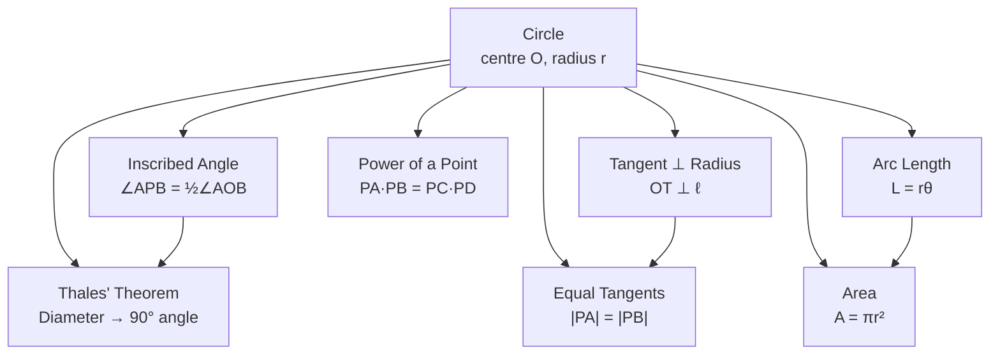

# Circle Theorems

## 📋 Formal Statements

A circle is the set of all points in a plane at a fixed distance (the radius) from a fixed point (the centre). The following theorems describe fundamental properties of circles and angles within them.

### Theorem 1 — Inscribed Angle Theorem

$$\angle APB = \tfrac{1}{2}\,\angle AOB$$

The inscribed angle is half the central angle that subtends the same arc.

### Theorem 2 — Angle in a Semicircle (Thales' Theorem)

$$\text{If } AB \text{ is a diameter, then } \angle APB = 90°$$

### Theorem 3 — Tangent-Radius Perpendicularity

$$OT \perp \ell \quad \text{where } T \text{ is the point of tangency}$$

### Theorem 4 — Equal Tangent Lengths

$$|PA| = |PB|$$

where $P$ is an external point and $A$, $B$ are the two points of tangency on the circle.

### Theorem 5 — Chord Length Formula

$$\text{chord} = 2r\sin\!\left(\frac{\theta}{2}\right)$$

### Theorem 6 — Arc Length and Area

$$L = r\theta \qquad (\theta \text{ in radians})$$

$$A_{\text{sector}} = \tfrac{1}{2}\,r^2\,\theta \qquad (\theta \text{ in radians})$$

$$A_{\text{circle}} = \pi r^2$$

### Theorem 7 — Power of a Point

For a point $P$ and a circle, if two chords (or secants) through $P$ intersect the circle at points $A, B$ and $C, D$ respectively:

$$PA \cdot PB = PC \cdot PD$$

---

## 🔣 Legend — Every Symbol Explained

| Symbol              | Name                             | Meaning                                                                               | Units                  | Domain                                                             |
| ------------------- | -------------------------------- | ------------------------------------------------------------------------------------- | ---------------------- | ------------------------------------------------------------------ | ---------------- | --- | --- | ---- |
| $O$                 | Centre                           | The fixed point equidistant from all points on the circle                             | —                      | —                                                                  |
| $r$                 | Radius                           | The fixed distance from the centre $O$ to any point on the circle                     | Any length unit        | $r > 0$                                                            |
| $P$                 | Point on circle / external point | A point either on the circle or outside it, depending on context                      | —                      | —                                                                  |
| $A, B$              | Points on circle                 | Specific points where a chord, secant, or tangent meets the circle                    | —                      | —                                                                  |
| $\angle APB$        | Inscribed angle                  | The angle formed at point $P$ on the circle, with rays going to $A$ and $B$           | Degrees (°) or radians | $0° < \angle APB < 180°$                                           |
| $\angle AOB$        | Central angle                    | The angle formed at the centre $O$, with rays going to $A$ and $B$                    | Degrees (°) or radians | $0° < \angle AOB < 360°$                                           |
| $\tfrac{1}{2}$      | One half                         | The fraction $0.5$                                                                    | Dimensionless          | —                                                                  |
| $AB$                | Diameter                         | A chord passing through the centre; the longest possible chord; $AB = 2r$             | Same unit as $r$       | —                                                                  |
| $90°$               | Ninety degrees                   | A right angle                                                                         | Degrees                | —                                                                  |
| $OT$                | Radius to tangent point          | The line segment from centre $O$ to the point of tangency $T$                         | Same unit as $r$       | —                                                                  |
| $\ell$              | Tangent line                     | A line that touches the circle at exactly one point (the tangent point $T$)           | —                      | —                                                                  |
| $\perp$             | Perpendicular                    | Two lines meeting at exactly 90°                                                      | —                      | —                                                                  |
| $                   | PA                               | $                                                                                     | Distance PA            | The length of segment from external point $P$ to tangent point $A$ | Same unit as $r$ | $   | PA  | > 0$ |
| $                   | PB                               | $                                                                                     | Distance PB            | The length of segment from external point $P$ to tangent point $B$ | Same unit as $r$ | $   | PB  | > 0$ |
| $\text{chord}$      | Chord length                     | The straight-line distance between two points on the circle                           | Same unit as $r$       | $(0, 2r]$                                                          |
| $\sin$              | Sine                             | Trigonometric function: ratio of opposite side to hypotenuse in a right triangle      | Dimensionless          | $[-1, 1]$                                                          |
| $\theta$ (theta)    | Central angle                    | The angle (in radians) subtended at the centre by an arc or chord                     | Radians                | $(0, 2\pi]$                                                        |
| $L$                 | Arc length                       | The distance along the curved edge of the circle between two points                   | Same unit as $r$       | $(0, 2\pi r]$                                                      |
| $A_{\text{sector}}$ | Sector area                      | The area of the "pie slice" bounded by two radii and an arc                           | Square of length unit  | $(0, \pi r^2]$                                                     |
| $A_{\text{circle}}$ | Circle area                      | The total area enclosed by the circle                                                 | Square of length unit  | —                                                                  |
| $\pi$ (pi)          | Pi                               | The mathematical constant $\approx 3.14159\ldots$; ratio of circumference to diameter | Dimensionless          | —                                                                  |
| $PA \cdot PB$       | Product of lengths               | $PA$ multiplied by $PB$                                                               | Square of length unit  | —                                                                  |
| $\cdot$             | Multiplication dot               | Multiplication operator                                                               | —                      | —                                                                  |

---

## 💬 Plain English Explanation

### Theorem 1 — Inscribed Angle Theorem

Imagine you are standing on the edge of a circular lake, looking at a bridge across the water. The angle you see the bridge at (the inscribed angle) is always exactly half the angle that the bridge makes at the centre of the lake (the central angle). This is true no matter where on the shore you stand — as long as you stay on the same side of the bridge.

**Consequence:** All inscribed angles that look at the same arc are equal to each other.

### Theorem 2 — Thales' Theorem

If you draw a triangle where one side is the diameter of a circle and the third vertex sits anywhere on the circle, the angle at that third vertex is always exactly 90°. Thales of Miletus reportedly proved this around 600 BCE — one of the earliest recorded geometric proofs.

**Practical use:** To find the centre of a circle, draw two diameters; they cross at the centre.

### Theorem 3 — Tangent-Radius Perpendicularity

A tangent line just grazes the circle at one point. At that exact point, the radius is always perpendicular (at 90°) to the tangent. Think of a ball rolling on a flat floor: the floor is tangent to the ball, and the radius to the contact point points straight down — perpendicular to the floor.

### Theorem 4 — Equal Tangent Lengths

From any point outside a circle, you can draw exactly two tangent lines. The distances from your point to the two tangent points are always equal. This is why a belt wrapped around two pulleys of the same size hangs symmetrically.

### Theorem 5 — Chord Length

A chord is a straight line connecting two points on a circle. Its length depends on the radius and the central angle it subtends. The formula $2r\sin(\theta/2)$ gives the exact length.

### Theorem 6 — Arc Length and Area

- **Arc length** $L = r\theta$: The curved distance along the circle is simply the radius times the angle (in radians). A full circle ($\theta = 2\pi$) gives circumference $2\pi r$.
- **Sector area** $\tfrac{1}{2}r^2\theta$: The area of a pie slice is half the radius squared times the angle.
- **Circle area** $\pi r^2$: The total enclosed area.

### Theorem 7 — Power of a Point

Draw any two chords through a point inside (or outside) a circle. The product of the two segment lengths on one chord always equals the product on the other chord. This "power" is a fixed number for any given point and circle.

---

## 🌍 Real-World Significance

| Application                      | Theorem used                                                         |
| -------------------------------- | -------------------------------------------------------------------- |
| **Wheel and gear design**        | Tangent-radius perpendicularity ensures smooth rolling contact       |
| **Optics / lens design**         | Inscribed angle theorem governs focal properties of circular mirrors |
| **Architecture (arches)**        | Arc length formula calculates material needed for curved structures  |
| **Astronomy**                    | Circular orbits use arc length and sector area for orbital mechanics |
| **Surveying**                    | Power of a point used in cross-ratio calculations                    |
| **Engineering (pulleys, belts)** | Equal tangent lengths ensure symmetric belt tension                  |
| **GPS / trilateration**          | Circles of position intersect to give location fixes                 |
| **Computer graphics**            | Circle-line intersection tests use tangent perpendicularity          |

---

## 📜 History

| Period   | Event                                                                                                       |
| -------- | ----------------------------------------------------------------------------------------------------------- |
| ~600 BCE | **Thales of Miletus** proves the angle-in-semicircle theorem — one of the first recorded geometric proofs   |
| ~300 BCE | **Euclid's** _Elements_ Books III–IV systematise circle theorems                                            |
| ~250 BCE | **Archimedes** proves $A = \pi r^2$ and bounds $\pi$ between $\frac{223}{71}$ and $\frac{22}{7}$            |
| ~100 CE  | **Ptolemy** uses the inscribed angle theorem in his astronomical tables (_Almagest_)                        |
| 1637     | **René Descartes** introduces coordinate geometry, enabling algebraic proofs of circle theorems             |
| 1748     | **Leonhard Euler** connects $\pi$ to complex exponentials: $e^{i\pi} + 1 = 0$                               |
| Present  | Circle geometry underpins signal processing (Fourier analysis), complex analysis, and differential geometry |

---

## 🖼️ Visual Proof — Inscribed Angle Theorem

```
Proof for the case where centre O lies inside angle APB:

         P
        /|\
       / | \
      /  |  \
     /   |   \
    A────O────B

  Draw radius OP. Let ∠OPA = φ and ∠OPB = ψ.

  Triangle OPA is isosceles (OA = OP = r):
    ∠OAP = ∠OPA = φ
    ∠AOP = 180° - 2φ  (angle sum)
    ∠AOB_part1 = 180° - (180° - 2φ) = 2φ  (exterior angle)

  Triangle OPB is isosceles (OB = OP = r):
    ∠OBP = ∠OPB = ψ
    ∠BOP_part2 = 2ψ  (same reasoning)

  Central angle: ∠AOB = 2φ + 2ψ = 2(φ + ψ) = 2·∠APB  ✓
  Therefore: ∠APB = ½·∠AOB  ✓
```

### Mermaid — Circle Theorem Relationships



### Arc Length — Visual

```
Full circle (θ = 2π):
  ┌─────────────────┐
  │    ╭───────╮    │
  │   ╱         ╲   │
  │  │     O     │  │   Circumference = 2πr
  │   ╲         ╱   │
  │    ╰───────╯    │
  └─────────────────┘

Quarter circle (θ = π/2):
  ┌─────────────────┐
  │    ╭────       │
  │   ╱            │
  │  │     O       │   Arc = r·(π/2) = πr/2
  │  │             │
  │  │             │
  └─────────────────┘
```

---

## ✅ Lean 4 Status

| Theorem                  | Status                                                           |
| ------------------------ | ---------------------------------------------------------------- |
| Inscribed angle theorem  | ✅ `EuclideanGeometry.inscribed_angle` in Mathlib4               |
| Thales' theorem          | ✅ `EuclideanGeometry.angle_eq_pi_div_two_of_mem_sphere`         |
| Tangent perpendicularity | ✅ `Mathlib.Geometry.Euclidean.Sphere.Basic`                     |
| Equal tangent lengths    | ✅ Derivable from tangent perpendicularity + Pythagorean theorem |
| Arc length formula       | ✅ `Real.arcLength` in Mathlib4                                  |
| Circle area              | ✅ `MeasureTheory.Measure.ball_pi`                               |
| Power of a point         | ✅ `Mathlib.Geometry.Euclidean.Power`                            |

**Lean 4 sketch — Thales' theorem:**

```lean4
-- Thales' theorem: angle in semicircle is 90°
-- In Mathlib4, this follows from the inscribed angle theorem
theorem thales_theorem
    {V : Type*} [NormedAddCommGroup V] [InnerProductSpace ℝ V]
    [Fact (finrank ℝ V = 2)]
    {O A B P : V} (hO : dist O A = dist O B) -- O is centre, A and B are endpoints of diameter
    (hP : dist O P = dist O A)               -- P is on the circle
    (hAB : A ≠ B) (hPA : P ≠ A) (hPB : P ≠ B) :
    EuclideanGeometry.angle A P B = π / 2 := by
  exact EuclideanGeometry.angle_eq_pi_div_two_of_mem_sphere hO hP hAB hPA hPB
```

---

## 🔗 Related Theorems

- **Pythagorean Theorem** — used to prove equal tangent lengths and chord formulas
- **Triangle Properties** — inscribed angle theorem connects circle geometry to triangle geometry
- **Law of Cosines** — generalises chord length formula to non-central angles
- **Euclidean Geometry** — all circle theorems derive from Euclid's postulates
