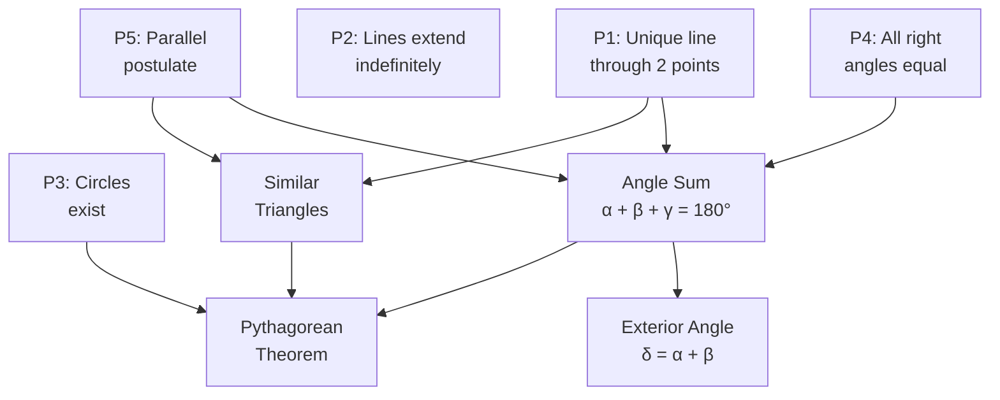

# Euclidean Geometry — Foundational Theorems

## 📋 Formal Statement

Euclidean geometry is the study of flat (planar) space governed by five postulates first stated by Euclid (~300 BCE). All classical geometry theorems follow logically from these five axioms.

**Euclid's Five Postulates** (modernised notation):

$$\text{P1: } \forall\, P, Q \in \mathbb{E}^2,\; \exists!\, \ell \text{ such that } P \in \ell \text{ and } Q \in \ell$$

$$\text{P2: } \text{Any line segment can be extended indefinitely in a straight line}$$

$$\text{P3: } \forall\, P \in \mathbb{E}^2,\; \forall\, r > 0,\; \exists!\, \text{circle } C(P, r)$$

$$\text{P4: } \text{All right angles are equal to one another}$$

$$\text{P5 (Parallel Postulate): } \forall\, \ell \text{ and point } P \notin \ell,\; \exists!\, m \parallel \ell \text{ through } P$$

**Key derived theorem — Angle Sum of a Triangle:**

$$\alpha + \beta + \gamma = 180°$$

**Key derived theorem — Exterior Angle:**

$$\delta = \alpha + \beta$$

---

## 🔣 Legend — Every Symbol Explained

| Symbol           | Name                       | Meaning                                                              | Domain                  |
| ---------------- | -------------------------- | -------------------------------------------------------------------- | ----------------------- |
| $\mathbb{E}^2$   | Euclidean plane            | The infinite flat 2-dimensional space where Euclidean geometry lives | —                       |
| $P, Q$           | Points                     | Locations in the plane; they have position but no size               | $P, Q \in \mathbb{E}^2$ |
| $\ell, m$        | Lines                      | Infinite straight paths through the plane                            | —                       |
| $\forall$        | For all                    | "For every …" — a universal quantifier                               | Logic                   |
| $\exists$        | There exists               | "There is at least one …" — an existential quantifier                | Logic                   |
| $\exists!$       | There exists exactly one   | "There is one and only one …"                                        | Logic                   |
| $\in$            | Element of                 | "$P \in \ell$" means "point $P$ lies on line $\ell$"                 | Set theory              |
| $\notin$         | Not an element of          | "$P \notin \ell$" means "point $P$ does not lie on line $\ell$"      | Set theory              |
| $r$              | Radius                     | The fixed distance from the centre of a circle to its edge           | $r > 0$                 |
| $C(P, r)$        | Circle                     | The set of all points exactly distance $r$ from centre $P$           | —                       |
| $\parallel$      | Parallel                   | Two lines that never meet and maintain constant distance             | —                       |
| $\alpha$ (alpha) | Angle alpha                | Interior angle at vertex $A$ of a triangle                           | $0° < \alpha < 180°$    |
| $\beta$ (beta)   | Angle beta                 | Interior angle at vertex $B$ of a triangle                           | $0° < \beta < 180°$     |
| $\gamma$ (gamma) | Angle gamma                | Interior angle at vertex $C$ of a triangle                           | $0° < \gamma < 180°$    |
| $\delta$ (delta) | Exterior angle             | Angle formed outside the triangle at one vertex                      | $0° < \delta < 360°$    |
| $180°$           | One hundred eighty degrees | A straight angle; half of a full rotation                            | Degrees                 |
| $+$              | Plus                       | Arithmetic addition                                                  | —                       |
| $=$              | Equals                     | Both sides are numerically identical                                 | —                       |
| $>$              | Greater than               | Strict inequality: left side is larger                               | —                       |

---

## 💬 Plain English Explanation

### The Five Postulates in Plain English

**Postulate 1 — Unique Line Through Two Points**
Pick any two dots on a page. You can always draw exactly one straight line connecting them — no more, no less.

**Postulate 2 — Lines Can Be Extended**
Any line segment (a piece of a line) can be stretched out as far as you like in either direction. Lines are infinite.

**Postulate 3 — Circles Exist**
Given any centre point and any positive distance (radius), you can draw a perfect circle.

**Postulate 4 — Right Angles Are Universal**
Every right angle (90°) is the same size everywhere in the plane. A square corner in Tokyo is identical to one in London.

**Postulate 5 — The Parallel Postulate**
Draw a line on paper. Pick a point not on that line. There is exactly one line through that point that runs parallel to (never crosses) the original line.

> **Why Postulate 5 matters:** For 2,000 years mathematicians tried to prove P5 from P1–P4. They failed — because it is genuinely independent. Dropping P5 gives **non-Euclidean geometries** (spherical, hyperbolic) used in Einstein's general relativity.

### Angle Sum of a Triangle

Every triangle, no matter its shape or size, has interior angles that add up to exactly 180°. This is a _consequence_ of the parallel postulate.

**Intuition:** Tear the three corners off any triangle and place them side by side — they always form a straight line (180°).

### Exterior Angle Theorem

An exterior angle of a triangle equals the sum of the two non-adjacent interior angles.

**Intuition:** When you "open up" one corner of a triangle outward, the outside angle captures exactly the combined "turning" of the other two corners.

---

## 🌍 Real-World Significance

| Application            | Connection to Euclidean geometry                                                                   |
| ---------------------- | -------------------------------------------------------------------------------------------------- |
| **Architecture**       | Floor plans, structural angles, and load calculations assume flat (Euclidean) space                |
| **Cartography**        | Small-scale maps treat Earth's surface as locally flat — Euclidean approximation                   |
| **Computer graphics**  | 2D rendering pipelines are built entirely on Euclidean plane geometry                              |
| **Robotics**           | Path planning on flat surfaces uses Euclidean distance and angle arithmetic                        |
| **Optics**             | Ray tracing for lenses and mirrors uses straight-line (Euclidean) paths                            |
| **General relativity** | Spacetime is _non_-Euclidean — understanding Euclid is the baseline for appreciating the departure |

---

## 📜 History

| Period           | Event                                                                                                                                                  |
| ---------------- | ------------------------------------------------------------------------------------------------------------------------------------------------------ |
| ~300 BCE         | **Euclid of Alexandria** writes _Elements_ — 13 books, ~465 propositions, all derived from 5 postulates                                                |
| ~300 BCE–1800 CE | _Elements_ is the most widely used mathematics textbook in history                                                                                     |
| 1829             | **Nikolai Lobachevsky** publishes hyperbolic geometry — the first non-Euclidean geometry — by replacing P5                                             |
| 1854             | **Bernhard Riemann** introduces spherical (elliptic) geometry                                                                                          |
| 1899             | **David Hilbert** publishes _Grundlagen der Geometrie_, giving a fully rigorous modern axiomatisation of Euclidean geometry (filling gaps Euclid left) |
| 1915             | **Albert Einstein** uses Riemannian geometry (non-Euclidean) for general relativity                                                                    |
| Present          | Euclidean geometry remains the foundation of engineering, architecture, and classical mathematics education                                            |

---

## 🖼️ Visual Proof — Angle Sum = 180°

**Proof using parallel lines:**

```
Draw triangle ABC. Extend side BC to point D.
Draw line CE parallel to AB through vertex C.

        A
       /\
      /  \
     /    \
    /  α β \
   /________\___D
  B    γ  C
         ╲
          ╲ (line CE parallel to AB)
           E

Angles on a straight line BCD:
  ∠ABC (= β) + ∠ACB (= γ) + ∠ACD = 180°

Since CE ∥ AB:
  ∠ACE = α  (alternate interior angles)
  ∠ACD = α

Therefore:
  α + β + γ = 180°  ✓
```

### Mermaid — Logical Dependency of Euclidean Theorems



---

## ✅ Lean 4 Status

| Item                        | Status                                                                 |
| --------------------------- | ---------------------------------------------------------------------- |
| Postulates (as axioms)      | ✅ Encoded in Mathlib4 via `EuclideanGeometry` and `InnerProductSpace` |
| Angle sum theorem           | ✅ `Mathlib.Geometry.Euclidean.Angle.Sphere`                           |
| Exterior angle theorem      | ✅ Derivable from angle sum in Mathlib4                                |
| Full Hilbert axiomatisation | ✅ `Mathlib.Geometry.Euclidean.Basic`                                  |

**Lean 4 sketch — angle sum:**

```lean4
-- Angle sum of a triangle in Euclidean space
-- Mathlib4 provides this via EuclideanGeometry
theorem triangle_angle_sum
    {V : Type*} [NormedAddCommGroup V] [InnerProductSpace ℝ V] [Fact (finrank ℝ V = 2)]
    (A B C : V) (hne : A ≠ B ∧ B ≠ C ∧ A ≠ C) :
    EuclideanGeometry.angle A B C +
    EuclideanGeometry.angle B C A +
    EuclideanGeometry.angle C A B = π := by
  exact EuclideanGeometry.angle_add_angle_add_angle_eq_pi hne.1 hne.2.1 hne.2.2
```

---

## 🔗 Related Theorems

- **Pythagorean Theorem** — follows from Euclid's _Elements_ Book I, Prop. 47
- **Triangle Properties** — angle sum, congruence criteria (SSS, SAS, ASA) all derive from these postulates
- **Circle Theorems** — inscribed angle theorem, tangent properties — all Euclidean
- **Non-Euclidean Geometry** — what happens when Postulate 5 is replaced
