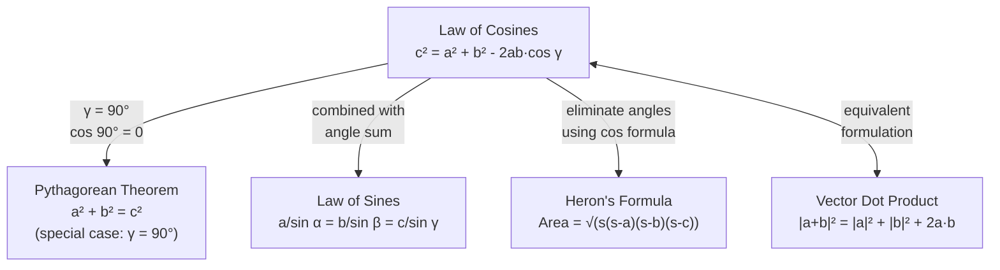

# Law of Cosines

## 📋 Formal Statement

For any triangle with sides $a$, $b$, $c$ and the angle $\gamma$ opposite side $c$:

$$c^2 = a^2 + b^2 - 2ab\cos\gamma$$

**All three symmetric forms** (each isolates a different side):

$$a^2 = b^2 + c^2 - 2bc\cos\alpha$$

$$b^2 = a^2 + c^2 - 2ac\cos\beta$$

$$c^2 = a^2 + b^2 - 2ab\cos\gamma$$

**Solved for the angle** (inverse form):

$$\cos\gamma = \frac{a^2 + b^2 - c^2}{2ab}$$

$$\gamma = \arccos\!\left(\frac{a^2 + b^2 - c^2}{2ab}\right)$$

---

## 🔣 Legend — Every Symbol Explained

| Symbol                        | Name                       | Meaning                                                                                                                                           | Units                          | Domain                                |
| ----------------------------- | -------------------------- | ------------------------------------------------------------------------------------------------------------------------------------------------- | ------------------------------ | ------------------------------------- |
| $a$                           | Side $a$                   | Length of the side opposite angle $\alpha$ (between vertices $B$ and $C$)                                                                         | Any length unit (cm, m, ft, …) | $a > 0$                               |
| $b$                           | Side $b$                   | Length of the side opposite angle $\beta$ (between vertices $A$ and $C$)                                                                          | Same unit as $a$               | $b > 0$                               |
| $c$                           | Side $c$                   | Length of the side opposite angle $\gamma$ (between vertices $A$ and $B$)                                                                         | Same unit as $a$               | $c > 0$                               |
| $a^2$                         | A squared                  | $a$ multiplied by itself: $a \times a$                                                                                                            | Square of the length unit      | —                                     |
| $b^2$                         | B squared                  | $b \times b$                                                                                                                                      | Square of the length unit      | —                                     |
| $c^2$                         | C squared                  | $c \times c$                                                                                                                                      | Square of the length unit      | —                                     |
| $\alpha$ (alpha)              | Angle alpha                | Interior angle at vertex $A$, opposite side $a$                                                                                                   | Degrees (°) or radians         | $0° < \alpha < 180°$                  |
| $\beta$ (beta)                | Angle beta                 | Interior angle at vertex $B$, opposite side $b$                                                                                                   | Degrees (°) or radians         | $0° < \beta < 180°$                   |
| $\gamma$ (gamma)              | Angle gamma                | Interior angle at vertex $C$, opposite side $c$                                                                                                   | Degrees (°) or radians         | $0° < \gamma < 180°$                  |
| $\cos$                        | Cosine                     | Trigonometric function: for angle $\theta$ in a right triangle, $\cos\theta = \frac{\text{adjacent}}{\text{hypotenuse}}$; ranges from $-1$ to $1$ | Dimensionless                  | $[-1, 1]$                             |
| $\cos\gamma$                  | Cosine of gamma            | The cosine function evaluated at angle $\gamma$                                                                                                   | Dimensionless                  | $(-1, 1)$ for $\gamma \in (0°, 180°)$ |
| $2ab$                         | Two times $a$ times $b$    | The product $2 \times a \times b$                                                                                                                 | Square of the length unit      | —                                     |
| $2ab\cos\gamma$               | Correction term            | The term that adjusts the Pythagorean theorem for non-right angles; equals $0$ when $\gamma = 90°$                                                | Square of the length unit      | —                                     |
| $-$                           | Minus                      | Arithmetic subtraction                                                                                                                            | —                              | —                                     |
| $+$                           | Plus                       | Arithmetic addition                                                                                                                               | —                              | —                                     |
| $=$                           | Equals                     | Both sides are numerically identical                                                                                                              | —                              | —                                     |
| $\frac{a^2 + b^2 - c^2}{2ab}$ | Cosine ratio               | The expression whose value equals $\cos\gamma$; used to find an unknown angle                                                                     | Dimensionless                  | $(-1, 1)$                             |
| $\arccos$                     | Arccosine (inverse cosine) | The function that takes a cosine value and returns the corresponding angle; $\arccos(\cos\theta) = \theta$                                        | Radians or degrees             | Output: $[0°, 180°]$                  |

> **What does cosine mean intuitively?**
> Cosine measures how much two directions "agree." When $\gamma = 0°$, $\cos\gamma = 1$ (fully aligned). When $\gamma = 90°$, $\cos\gamma = 0$ (perpendicular — no agreement). When $\gamma = 180°$, $\cos\gamma = -1$ (opposite directions). The correction term $-2ab\cos\gamma$ shrinks $c$ when the angle is acute and grows $c$ when the angle is obtuse.

---

## 💬 Plain English Explanation

### The Core Idea

The Pythagorean theorem ($a^2 + b^2 = c^2$) only works for right triangles. The Law of Cosines is its generalisation — it works for **any** triangle.

The key insight: the Pythagorean theorem is a _special case_ of the Law of Cosines. When $\gamma = 90°$:

$$c^2 = a^2 + b^2 - 2ab\underbrace{\cos 90°}_{= 0} = a^2 + b^2 \checkmark$$

The correction term $-2ab\cos\gamma$ adjusts for the "tilt" of the angle:

- **Acute angle** ($\gamma < 90°$): $\cos\gamma > 0$, so $c^2 < a^2 + b^2$ — the opposite side is shorter than the Pythagorean prediction.
- **Right angle** ($\gamma = 90°$): $\cos\gamma = 0$, so $c^2 = a^2 + b^2$ — exactly the Pythagorean theorem.
- **Obtuse angle** ($\gamma > 90°$): $\cos\gamma < 0$, so $c^2 > a^2 + b^2$ — the opposite side is longer than the Pythagorean prediction.

### When to Use It

| Known information                | Unknown    | Use                                    |
| -------------------------------- | ---------- | -------------------------------------- |
| Two sides + included angle (SAS) | Third side | $c^2 = a^2 + b^2 - 2ab\cos\gamma$      |
| All three sides (SSS)            | Any angle  | $\cos\gamma = \frac{a^2+b^2-c^2}{2ab}$ |

### Step-by-Step Example

**Problem:** A triangle has sides $a = 5$, $b = 7$, and included angle $\gamma = 60°$. Find $c$.

$$c^2 = 5^2 + 7^2 - 2(5)(7)\cos 60°$$
$$= 25 + 49 - 70 \times 0.5$$
$$= 74 - 35 = 39$$
$$c = \sqrt{39} \approx 6.24$$

---

## 🌍 Real-World Significance

| Application                | How the Law of Cosines is used                                                                   |
| -------------------------- | ------------------------------------------------------------------------------------------------ | ------- | ---- | ------- | ---- | ------- | ------ | ------- | --- | ------- | ----------- |
| **Navigation**             | Finding the distance between two ships given their positions and the angle between their courses |
| **Surveying**              | Computing distances across terrain when a direct measurement is impossible                       |
| **Structural engineering** | Calculating diagonal lengths in trusses and frames with non-right angles                         |
| **Robotics**               | Inverse kinematics: finding joint angles from end-effector position                              |
| **Astronomy**              | Computing distances in the solar system using angular measurements                               |
| **Computer graphics**      | Angle computation between vectors for lighting and shading calculations                          |
| **GPS**                    | Resolving position from distance measurements to satellites                                      |
| **Physics**                | Vector addition: $                                                                               | \vec{c} | ^2 = | \vec{a} | ^2 + | \vec{b} | ^2 - 2 | \vec{a} |     | \vec{b} | \cos\theta$ |

---

## 📜 History

| Period   | Event                                                                                                                                    |
| -------- | ---------------------------------------------------------------------------------------------------------------------------------------- |
| ~300 BCE | **Euclid's** _Elements_ Book II, Propositions 12–13 contain geometric equivalents of the Law of Cosines (without trigonometric notation) |
| ~150 CE  | **Ptolemy** uses equivalent results in his astronomical work _Almagest_                                                                  |
| ~1000 CE | **Al-Battani** (Islamic mathematician) states the theorem in spherical form                                                              |
| ~1150 CE | **Bhaskara II** (India) gives the planar form in _Lilavati_                                                                              |
| 1533     | **Regiomontanus** publishes _De Triangulis_ with the modern planar form                                                                  |
| 1748     | **Leonhard Euler** unifies trigonometric identities, placing the Law of Cosines in its modern algebraic framework                        |
| Present  | The Law of Cosines is a cornerstone of computational geometry, physics, and engineering                                                  |

---

## 🖼️ Visual Proof — Coordinate Geometry

**Proof:** Place the triangle with vertex $C$ at the origin, side $b$ along the positive $x$-axis.

```
y
│
│    A = (b·cos γ, b·sin γ)
│   ╱╲
│  ╱  ╲  c = ?
│ ╱ γ  ╲
│╱______╲
C=(0,0)  B=(a,0)
         x

Coordinates:
  C = (0, 0)
  B = (a, 0)
  A = (b cos γ, b sin γ)

Distance formula for c = |AB|:
  c² = (b cos γ - a)² + (b sin γ - 0)²
     = b²cos²γ - 2ab cos γ + a² + b²sin²γ
     = a² + b²(cos²γ + sin²γ) - 2ab cos γ
     = a² + b² - 2ab cos γ   ✓

(Used: cos²γ + sin²γ = 1, the Pythagorean identity)
```

### Mermaid — Relationship to Other Theorems



### Angle Sensitivity — How $\cos\gamma$ Affects $c$

```
Fixed: a = 5, b = 7

γ = 30°:  c² = 25 + 49 - 70·cos30° ≈ 74 - 60.6 = 13.4  →  c ≈ 3.66
γ = 60°:  c² = 25 + 49 - 70·cos60° = 74 - 35.0 = 39.0  →  c ≈ 6.24
γ = 90°:  c² = 25 + 49 - 70·cos90° = 74 -  0.0 = 74.0  →  c ≈ 8.60  (Pythagorean)
γ = 120°: c² = 25 + 49 - 70·cos120°= 74 + 35.0 = 109.0 →  c ≈ 10.44
γ = 150°: c² = 25 + 49 - 70·cos150°≈ 74 + 60.6 = 134.6 →  c ≈ 11.60

Smaller γ → shorter c (triangle "closes up")
Larger  γ → longer  c (triangle "opens up")
```

---

## ✅ Lean 4 Status

| Item             | Status                                                                                  |
| ---------------- | --------------------------------------------------------------------------------------- |
| Formal statement | ✅ Available in Mathlib4                                                                |
| Proof            | ✅ `EuclideanGeometry.dist_sq_eq_dist_sq_add_dist_sq_sub_two_mul_dist_mul_dist_mul_cos` |
| Verified         | ✅ Machine-checked                                                                      |

**Mathlib4 sketch:**

```lean4
-- Law of Cosines in Mathlib4
-- Expressed via inner product spaces (the natural generalisation)
theorem law_of_cosines
    {V : Type*} [NormedAddCommGroup V] [InnerProductSpace ℝ V]
    (A B C : V) :
    dist A B ^ 2 = dist B C ^ 2 + dist A C ^ 2 -
      2 * dist B C * dist A C * Real.cos (EuclideanGeometry.angle B C A) := by
  have h := EuclideanGeometry.dist_sq_eq_dist_sq_add_dist_sq_sub_two_mul_dist_mul_dist_mul_cos
              B C A
  linarith [h]
```

**Inverse form — finding an angle:**

```lean4
-- Given all three sides, compute angle γ
-- cos γ = (a² + b² - c²) / (2ab)
noncomputable def angle_from_sides (a b c : ℝ) (ha : a > 0) (hb : b > 0) : ℝ :=
  Real.arccos ((a^2 + b^2 - c^2) / (2 * a * b))
```

---

## 🔗 Related Theorems

- **Pythagorean Theorem** — special case when $\gamma = 90°$ and $\cos\gamma = 0$
- **Law of Sines** — complementary tool; use when you know an angle opposite a known side
- **Triangle Properties** — angle sum $\alpha + \beta + \gamma = 180°$ constrains which form to use
- **Dot Product** — the Law of Cosines is equivalent to $\vec{c} \cdot \vec{c} = (\vec{a} - \vec{b}) \cdot (\vec{a} - \vec{b})$ in vector algebra
- **Spherical Law of Cosines** — the analogue on the surface of a sphere: $\cos c = \cos a \cos b + \sin a \sin b \cos C$
