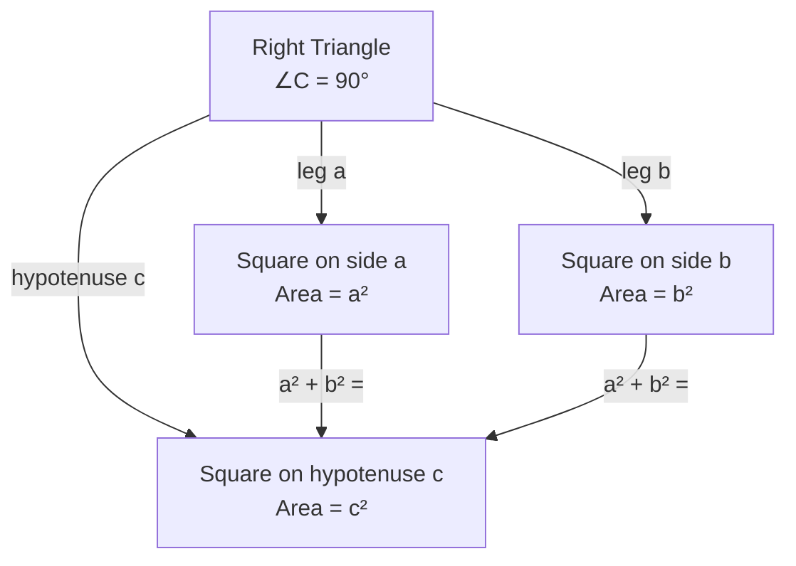

# Pythagorean Theorem

## 📋 Formal Statement

For any right triangle, the square of the length of the hypotenuse equals the sum of the squares of the lengths of the other two sides.

$$a^2 + b^2 = c^2$$

### Extended Form (with explicit constraint)

$$a^2 + b^2 = c^2 \quad \text{where } \angle C = 90°$$

---

## 🔣 Legend — Every Symbol Explained

| Symbol         | Name               | Meaning                                                                  | Units                                 | Domain  |
| -------------- | ------------------ | ------------------------------------------------------------------------ | ------------------------------------- | ------- |
| $a$            | Leg A              | Length of the first side adjacent to the right angle                     | Any length unit (cm, m, ft, …)        | $a > 0$ |
| $b$            | Leg B              | Length of the second side adjacent to the right angle                    | Same unit as $a$                      | $b > 0$ |
| $c$            | Hypotenuse         | Length of the side **opposite** the right angle; always the longest side | Same unit as $a$                      | $c > 0$ |
| $a^2$          | A squared          | $a$ multiplied by itself: $a \times a$                                   | Square of the length unit (e.g., cm²) | —       |
| $b^2$          | B squared          | $b$ multiplied by itself: $b \times b$                                   | Square of the length unit             | —       |
| $c^2$          | C squared          | $c$ multiplied by itself: $c \times c$                                   | Square of the length unit             | —       |
| $+$            | Plus / addition    | Arithmetic sum of two quantities                                         | —                                     | —       |
| $=$            | Equals             | Both sides have identical numerical value                                | —                                     | —       |
| $\angle C$     | Angle C            | The interior angle at vertex $C$ of the triangle                         | Degrees (°) or radians (rad)          | —       |
| $90°$          | Ninety degrees     | A right angle; one quarter of a full rotation                            | Degrees                               | —       |
| $\text{where}$ | Constraint keyword | Introduces a condition that must hold for the equation to apply          | —                                     | —       |

> **Tip — what is a "right angle"?** Place two rulers flat on a table so they meet at a corner like the corner of a page. That corner is exactly 90°. A triangle containing such a corner is called a _right triangle_.

---

## 💬 Plain English Explanation

Imagine you have a right triangle — a triangle with one perfectly square corner.

1. **Label the sides.** Call the two shorter sides (the ones that form the square corner) $a$ and $b$. Call the longest side (the one across from the square corner) $c$.
2. **Square each side.** Multiply each length by itself: $a \times a$, $b \times b$, $c \times c$.
3. **The relationship.** The two smaller squares added together always equal the big square: $a^2 + b^2 = c^2$.

**Concrete example.** A triangle with legs $a = 3$ cm and $b = 4$ cm:

$$3^2 + 4^2 = 9 + 16 = 25 = 5^2 \implies c = 5 \text{ cm}$$

This is the famous **3-4-5 right triangle**. No matter how you scale it, the relationship holds.

---

## 🌍 Real-World Significance

| Application           | How the theorem is used                                                             |
| --------------------- | ----------------------------------------------------------------------------------- |
| **Construction**      | Builders use the 3-4-5 rule to check that walls meet at true right angles           |
| **Navigation**        | GPS systems compute straight-line distances using the theorem in 2D and 3D          |
| **Computer graphics** | Pixel distances on screen are calculated with $\sqrt{a^2 + b^2}$                    |
| **Engineering**       | Structural load paths, cable lengths, and diagonal bracing all rely on it           |
| **Astronomy**         | Distances to nearby stars via parallax use right-triangle geometry                  |
| **Surveying**         | Land boundaries and elevation changes are resolved with right-triangle trigonometry |

---

## 📜 History

| Period       | Event                                                                                                |
| ------------ | ---------------------------------------------------------------------------------------------------- |
| ~2000 BCE    | Babylonian clay tablets (Plimpton 322) list Pythagorean triples, predating Pythagoras by 1,000 years |
| ~570–495 BCE | **Pythagoras of Samos** (Greek mathematician) and his school provide the first known _proof_         |
| ~300 BCE     | **Euclid** gives a rigorous proof in _Elements_, Book I, Proposition 47                              |
| ~200 BCE     | **Bhaskara I** (India) provides an elegant dissection proof                                          |
| 1940         | Over **370 distinct proofs** catalogued by Elisha Scott Loomis in _The Pythagorean Proposition_      |
| Present      | Generalises to **inner product spaces** and underpins all of Euclidean geometry                      |

---

## 🖼️ Visual Proof — Dissection (Bhaskara's Proof)

The idea: arrange four identical right triangles inside a large square to reveal the relationship.

```
Large square side = c (hypotenuse)

┌─────────────────────┐
│╲  b                 │
│  ╲                  │
│ a  ╲                │
│      ╲──────────────┤
│      │              │
│      │   c²         │
│      │  (inner      │
│      │   square)    │
│──────╲              │
│        ╲  a         │
│    b     ╲          │
│            ╲        │
└─────────────────────┘

Area of big square  = c²
Area of 4 triangles = 4 × (½ab) = 2ab
Area of inner square = (b − a)²  = b² − 2ab + a²

∴  c² = 2ab + (b − a)²
       = 2ab + b² − 2ab + a²
       = a² + b²   ✓
```

### Mermaid — Conceptual Relationship



---

## ✅ Lean 4 Status

| Item             | Status                                                                           |
| ---------------- | -------------------------------------------------------------------------------- |
| Formal statement | ✅ Available in Mathlib4 as `Mathlib.Geometry.Euclidean.Basic`                   |
| Proof            | ✅ `EuclideanGeometry.dist_sq_add_dist_sq_eq_dist_sq` (inner-product-space form) |
| Verified         | ✅ Machine-checked                                                               |

**Mathlib4 sketch** (illustrative):

```lean4
-- The Pythagorean theorem in Mathlib4 is expressed via inner product spaces.
-- For a right triangle with legs a, b and hypotenuse c:
theorem pythagorean {V : Type*} [SeminormedAddCommGroup V] [InnerProductSpace ℝ V]
    {a b c : V} (h : ⟪a, b⟫_ℝ = 0) :
    ‖a + b‖^2 = ‖a‖^2 + ‖b‖^2 := by
  rw [norm_add_sq_real, inner_comm, h, add_zero]
```

---

## 🔗 Related Theorems

- **Law of Cosines** — generalises this theorem to _any_ triangle (not just right triangles)
- **Euclidean Distance Formula** — direct application in coordinate geometry: $d = \sqrt{(x_2-x_1)^2 + (y_2-y_1)^2}$
- **Converse** — if $a^2 + b^2 = c^2$ then the triangle _must_ be a right triangle
- **3D Extension** — $d = \sqrt{a^2 + b^2 + c^2}$ for space diagonals
