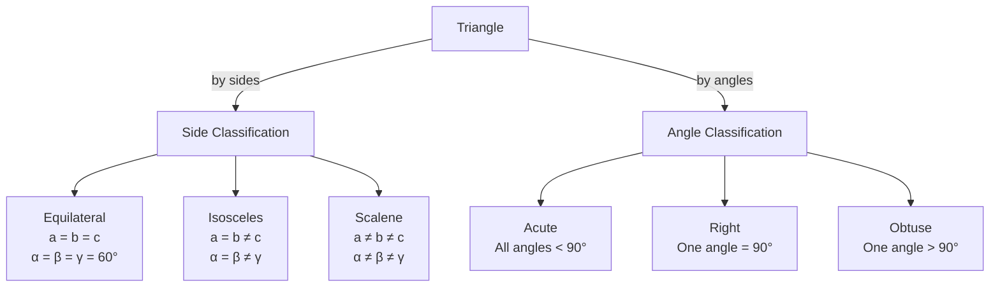

# Triangle Properties

## 📋 Formal Statements

A triangle is a polygon with exactly three vertices, three edges, and three interior angles. The following theorems hold for **all** triangles in Euclidean geometry.

### Theorem 1 — Angle Sum

$$\alpha + \beta + \gamma = 180°$$

### Theorem 2 — Triangle Inequality

$$a + b > c, \quad b + c > a, \quad a + c > b$$

### Theorem 3 — Exterior Angle Theorem

$$\delta = \alpha + \beta$$

### Theorem 4 — Law of Sines

$$\frac{a}{\sin \alpha} = \frac{b}{\sin \beta} = \frac{c}{\sin \gamma} = 2R$$

### Theorem 5 — Area Formulas

$$\text{Area} = \tfrac{1}{2}\,a\,b\,\sin\gamma = \tfrac{1}{2}\,b\,c\,\sin\alpha = \tfrac{1}{2}\,a\,c\,\sin\beta$$

$$\text{Area} = \sqrt{s(s-a)(s-b)(s-c)} \quad \text{(Heron's Formula)}$$

where $s = \dfrac{a+b+c}{2}$

### Theorem 6 — Congruence Criteria

Two triangles are congruent (identical in shape and size) if and only if one of the following holds:

| Criterion        | Abbreviation | Condition                                         |
| ---------------- | ------------ | ------------------------------------------------- |
| Side-Side-Side   | SSS          | All three pairs of sides are equal                |
| Side-Angle-Side  | SAS          | Two sides and the included angle are equal        |
| Angle-Side-Angle | ASA          | Two angles and the included side are equal        |
| Angle-Angle-Side | AAS          | Two angles and a non-included side are equal      |
| Hypotenuse-Leg   | HL           | Right triangles with equal hypotenuse and one leg |

---

## 🔣 Legend — Every Symbol Explained

| Symbol                 | Name                             | Meaning                                                                                                                  | Units                     | Domain               |
| ---------------------- | -------------------------------- | ------------------------------------------------------------------------------------------------------------------------ | ------------------------- | -------------------- |
| $\alpha$ (alpha)       | Angle alpha                      | Interior angle at vertex $A$, opposite side $a$                                                                          | Degrees (°) or radians    | $0° < \alpha < 180°$ |
| $\beta$ (beta)         | Angle beta                       | Interior angle at vertex $B$, opposite side $b$                                                                          | Degrees (°) or radians    | $0° < \beta < 180°$  |
| $\gamma$ (gamma)       | Angle gamma                      | Interior angle at vertex $C$, opposite side $c$                                                                          | Degrees (°) or radians    | $0° < \gamma < 180°$ |
| $\delta$ (delta)       | Exterior angle                   | Angle formed outside the triangle at vertex $C$, supplementary to $\gamma$                                               | Degrees (°)               | $0° < \delta < 360°$ |
| $a$                    | Side $a$                         | Length of the side opposite angle $\alpha$ (between vertices $B$ and $C$)                                                | Any length unit           | $a > 0$              |
| $b$                    | Side $b$                         | Length of the side opposite angle $\beta$ (between vertices $A$ and $C$)                                                 | Same unit as $a$          | $b > 0$              |
| $c$                    | Side $c$                         | Length of the side opposite angle $\gamma$ (between vertices $A$ and $B$)                                                | Same unit as $a$          | $c > 0$              |
| $180°$                 | One hundred eighty degrees       | A straight angle; half a full rotation                                                                                   | Degrees                   | —                    |
| $>$                    | Greater than                     | Strict inequality                                                                                                        | —                         | —                    |
| $+$                    | Plus                             | Arithmetic addition                                                                                                      | —                         | —                    |
| $\sin$                 | Sine                             | Trigonometric function: for angle $\theta$ in a right triangle, $\sin\theta = \frac{\text{opposite}}{\text{hypotenuse}}$ | Dimensionless             | $[-1, 1]$            |
| $\frac{a}{\sin\alpha}$ | Ratio                            | Side length divided by the sine of its opposite angle                                                                    | Length unit               | —                    |
| $=$                    | Equals                           | Both sides are numerically identical                                                                                     | —                         | —                    |
| $2R$                   | Diameter of circumscribed circle | Twice the radius $R$ of the circle passing through all three vertices                                                    | Same unit as $a$          | $R > 0$              |
| $R$                    | Circumradius                     | Radius of the circumscribed circle (the unique circle passing through all three vertices)                                | Same unit as $a$          | $R > 0$              |
| $\text{Area}$          | Area                             | The amount of flat surface enclosed by the triangle                                                                      | Square of the length unit | $\text{Area} > 0$    |
| $\tfrac{1}{2}$         | One half                         | The fraction $\frac{1}{2} = 0.5$                                                                                         | Dimensionless             | —                    |
| $s$                    | Semi-perimeter                   | Half the perimeter: $s = \frac{a+b+c}{2}$                                                                                | Same unit as $a$          | $s > 0$              |
| $s - a$                | Reduced semi-perimeter           | Semi-perimeter minus side $a$                                                                                            | Same unit as $a$          | $s - a > 0$          |
| $\sqrt{\phantom{x}}$   | Square root                      | The non-negative number whose square equals the argument                                                                 | —                         | Argument $\geq 0$    |

---

## 💬 Plain English Explanation

### Theorem 1 — Angle Sum = 180°

Every triangle's three interior angles always add up to a straight line (180°). This is true for tiny triangles and enormous ones, skinny ones and fat ones. It is a direct consequence of Euclid's parallel postulate.

**Memory aid:** Tear the three corners off any paper triangle and line them up — they always form a straight edge.

### Theorem 2 — Triangle Inequality

You cannot make a triangle from three sticks if one stick is longer than the other two combined. The three lengths must each be less than the sum of the other two.

**Example:** Sticks of length 3, 4, 5 → triangle exists ($3+4=7>5$ ✓). Sticks of length 1, 2, 10 → no triangle ($1+2=3 < 10$ ✗).

### Theorem 3 — Exterior Angle

If you extend one side of a triangle beyond a vertex, the angle formed outside equals the sum of the two interior angles that are _not_ at that vertex.

**Intuition:** The exterior angle "contains" the turning contributed by both remote interior angles.

### Theorem 4 — Law of Sines

In any triangle, the ratio of a side's length to the sine of its opposite angle is the same for all three sides — and equals the diameter of the circle that passes through all three vertices.

**Use:** Given two angles and one side, find all remaining sides.

### Theorem 5 — Area Formulas

- **Sine formula:** If you know two sides and the angle between them, multiply them together, take half, and multiply by the sine of that angle.
- **Heron's formula:** If you know all three sides but no angles, compute the semi-perimeter $s$ and use the square-root formula. No trigonometry required.

### Theorem 6 — Congruence Criteria

Two triangles are congruent (same shape, same size, just possibly flipped or rotated) when enough matching information is given. The criteria tell you the _minimum_ information needed to guarantee congruence.

---

## 🌍 Real-World Significance

| Application                    | Theorem used                                                                               |
| ------------------------------ | ------------------------------------------------------------------------------------------ |
| **Surveying**                  | Law of Sines to find distances across rivers or valleys                                    |
| **Navigation (triangulation)** | Three known points → determine unknown position using angle measurements                   |
| **Structural engineering**     | Triangle inequality ensures physical structures can close                                  |
| **Computer graphics**          | Every 3D surface is approximated by triangles (meshes); area formulas compute surface area |
| **Astronomy**                  | Stellar parallax uses triangle geometry to measure star distances                          |
| **Architecture**               | Congruence criteria verify that prefabricated components will fit together                 |
| **GPS**                        | Trilateration (3D version of triangulation) uses triangle properties                       |

---

## 📜 History

| Period   | Event                                                                                                               |
| -------- | ------------------------------------------------------------------------------------------------------------------- |
| ~300 BCE | **Euclid's** _Elements_ proves angle sum, exterior angle, and congruence criteria (Books I–IV)                      |
| ~250 BCE | **Archimedes** derives area formulas for triangles                                                                  |
| ~60 CE   | **Heron of Alexandria** publishes his area formula in _Metrica_                                                     |
| ~628 CE  | **Brahmagupta** generalises Heron's formula to cyclic quadrilaterals                                                |
| ~1100 CE | **Al-Biruni** and Islamic mathematicians systematise the Law of Sines                                               |
| 1595     | **François Viète** gives the Law of Sines in modern algebraic form                                                  |
| Present  | Triangle properties are the atomic building blocks of computational geometry, graphics, and finite element analysis |

---

## 🖼️ Visual Proof — Angle Sum via Parallel Line

```
        A
       /\
      /  \
   α /    \ β
    /      \
   /________\
  B    γ    C ────────── D
             ╲
              ╲ (line through C parallel to AB)
               E

  Since CE ∥ AB:
    ∠ACE = α  (alternate interior angles with transversal AC)
    ∠DCE = β  (corresponding angles with transversal BC)

  Angles on straight line BCD:
    γ + α + β = 180°  ✓
```

### Mermaid — Triangle Classification



### Heron's Formula — Step-by-Step

```
Given: a = 5, b = 6, c = 7

Step 1: Compute semi-perimeter
  s = (5 + 6 + 7) / 2 = 9

Step 2: Compute each factor
  s - a = 9 - 5 = 4
  s - b = 9 - 6 = 3
  s - c = 9 - 7 = 2

Step 3: Multiply
  s(s-a)(s-b)(s-c) = 9 × 4 × 3 × 2 = 216

Step 4: Take square root
  Area = √216 ≈ 14.70 square units
```

---

## ✅ Lean 4 Status

| Theorem             | Status                                                             |
| ------------------- | ------------------------------------------------------------------ |
| Angle sum           | ✅ `EuclideanGeometry.angle_add_angle_add_angle_eq_pi` in Mathlib4 |
| Triangle inequality | ✅ `dist_triangle` in `Mathlib.Topology.MetricSpace.Basic`         |
| Exterior angle      | ✅ Derivable from angle sum                                        |
| Law of Sines        | ✅ `EuclideanGeometry.law_of_sines` in Mathlib4                    |
| Heron's formula     | ✅ `Mathlib.Geometry.Euclidean.Triangle`                           |
| Congruence criteria | ✅ SSS, SAS, ASA in `Mathlib.Geometry.Euclidean.Congruence`        |

**Lean 4 sketch — triangle inequality:**

```lean4
-- Triangle inequality is built into metric spaces in Mathlib4
-- For Euclidean distance:
example (A B C : EuclideanSpace ℝ (Fin 2)) :
    dist A C ≤ dist A B + dist B C :=
  dist_triangle A B C
```

---

## 🔗 Related Theorems

- **Pythagorean Theorem** — special case of the Law of Cosines for right triangles
- **Law of Cosines** — generalises the Pythagorean theorem to all triangles
- **Circle Theorems** — the circumscribed circle (circumcircle) appears in the Law of Sines
- **Euclidean Geometry** — all triangle properties derive from Euclid's five postulates
