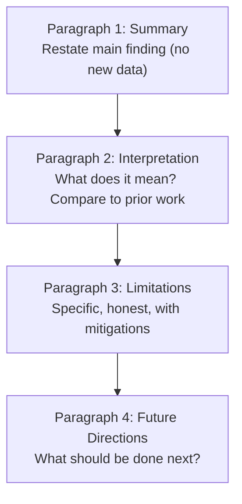

# Discussion Section Writing

The Discussion interprets your findings. It answers: "What do these results mean, and why should anyone care?" It is the most intellectually demanding section and the most commonly written poorly.

---

## ## Four-Paragraph Structure



---

## ## Paragraph 1: Summary

**Purpose:** Orient the reader. Restate the main finding in 1–2 sentences. Do not introduce new data.

**Template:**

```
In this [study type], we found that [main finding stated as a complete sentence with key statistic].
[Optional: secondary finding in 1 sentence.]
```

**Example:**

> In this multicenter randomized trial, early CRRT did not reduce 28-day mortality compared with standard care (RR 0.92, 95% CI 0.76–1.11). Secondary outcomes including ICU-free days and ventilator-free days were also similar between groups.

**Anti-patterns:**

- "We conducted a study to investigate..." (restates the Introduction)
- "Our results showed many interesting findings..." (vague)
- Introducing a new result not in the Results section

---

## ## Paragraph 2: Interpretation and Context

**Purpose:** Explain what the finding means and how it fits with prior work.

**Structure:**

1. Interpret the primary finding (mechanism, implication)
2. Compare to prior studies — agree or disagree, and explain why
3. Explain any unexpected findings

**Template:**

```
[Interpretation of main finding — mechanism or implication.]
[Comparison to prior work: "This is consistent with / contrasts with [citation], which found [finding]."]
[Explanation of discrepancy if results differ from prior work.]
```

**Example:**

> The absence of a mortality benefit from early CRRT may reflect the heterogeneity of SA-AKI — patients with early spontaneous recovery may be harmed by unnecessary CRRT, offsetting benefit in those who would not recover. This finding is consistent with the AKIKI trial (Gaudry et al., 2016), which found no benefit from early versus delayed RRT initiation, but contrasts with the STARRT-AKI trial (STARRT-AKI Investigators, 2020), which found a trend toward harm with early initiation. The discrepancy may reflect differences in patient selection: our trial enrolled patients with KDIGO stage 2–3 AKI, whereas STARRT-AKI included stage 1.

**Comparison language:**

| Relationship | Phrasing                                                                            |
| ------------ | ----------------------------------------------------------------------------------- |
| Consistent   | "This is consistent with [citation], which found..."                                |
| Extends      | "Our findings extend [citation] by demonstrating..."                                |
| Contrasts    | "This contrasts with [citation], which reported... The discrepancy may reflect..."  |
| Explains     | "Our results may explain the mechanism underlying [citation]'s observation that..." |

---

## ## Paragraph 3: Limitations

**Purpose:** Acknowledge specific weaknesses honestly. Vague limitations ("small sample size") are worse than specific ones.

**Rules:**

- Be specific: name the limitation, its direction of bias, and its magnitude if estimable
- Suggest mitigations where possible
- Do not apologize — limitations are inherent to all research

**Template:**

```
Several limitations warrant consideration.
[Limitation 1: specific description, direction of bias, mitigation.]
[Limitation 2: ...]
[Limitation 3: ...]
Despite these limitations, [strength that partially addresses the concern].
```

**Example:**

> Several limitations warrant consideration. First, the open-label design may have introduced performance bias, as clinicians aware of treatment assignment may have managed co-interventions differently; however, the primary outcome (mortality) is objective and unlikely to be affected by knowledge of assignment. Second, our trial was conducted at academic medical centers, which may limit generalizability to community hospitals with different CRRT expertise. Third, we did not assess long-term renal outcomes beyond 28 days, leaving open the question of whether early CRRT affects recovery of kidney function. Despite these limitations, the multicenter design, pre-specified analysis plan, and 90% follow-up rate strengthen confidence in the primary result.

**Common limitations by study type:**

| Study type    | Common limitations                                              |
| ------------- | --------------------------------------------------------------- |
| RCT           | Open-label, single center, short follow-up, surrogate outcomes  |
| Cohort        | Confounding by indication, loss to follow-up, measurement error |
| ML study      | Distribution shift, lack of external validation, label noise    |
| Meta-analysis | Publication bias, heterogeneity, ecological fallacy             |

---

## ## Paragraph 4: Future Directions

**Purpose:** Tell the reader what should be done next. Be specific.

**Template:**

```
Future research should [specific next step] to [specific goal].
[Additional direction if warranted.]
```

**Example:**

> Future trials should evaluate whether specific subgroups — particularly patients with oliguria persisting beyond 12 hours or those with concurrent metabolic acidosis — derive benefit from early CRRT. Biomarker-guided patient selection (e.g., TIMP-2 × IGFBP7) may identify patients most likely to benefit and warrants prospective evaluation.

**Anti-patterns:**

- "More research is needed." (Too vague)
- "Future studies with larger sample sizes should be conducted." (Uninformative)
- Proposing a study identical to the one just completed

---

## ## Conclusion Paragraph

After the four Discussion paragraphs, a brief Conclusion (1–3 sentences) closes the paper:

```
In conclusion, [main finding restated]. [Clinical/practical implication in 1 sentence.]
```

**Example:**

> In conclusion, early CRRT initiation did not reduce 28-day mortality in patients with sepsis-associated AKI. These findings do not support routine early CRRT in this population, and clinicians should continue to individualize the timing of renal replacement therapy based on clinical trajectory.

---

## ## Common Errors

| Error                                                | Fix                                                        |
| ---------------------------------------------------- | ---------------------------------------------------------- |
| Restating all results in Discussion                  | Summarize only the main finding; details are in Results    |
| Overclaiming ("proves," "demonstrates definitively") | Use hedged language: "suggests," "is consistent with"      |
| Vague limitations ("small sample")                   | Specify: "N = 120 limits power to detect effects < 0.3 SD" |
| No comparison to prior work                          | Cite and engage with at least 3–5 relevant prior studies   |
| Proposing future work identical to current study     | Propose the logical next step, not a replication           |
| Introducing new results                              | All data must appear in Results first                      |

---

## ## Hedging Language Reference

| Certainty level | Language                                                              |
| --------------- | --------------------------------------------------------------------- |
| High            | "demonstrates," "establishes," "confirms"                             |
| Moderate        | "suggests," "indicates," "is consistent with"                         |
| Low             | "raises the possibility that," "may reflect," "could be explained by" |
| Speculative     | "one possible explanation is," "we speculate that"                    |

Use hedging that matches your evidence strength. Overclaiming damages credibility; underclaiming buries your contribution.

---

## ## See Also

- [manuscript-structure.md](manuscript-structure.md) — Full IMRAD structure
- [results-section.md](results-section.md) — Results presentation
- [../../research/systematic-review.md](../../research/systematic-review.md) — Finding prior work to compare
- [../../research/synthesis-methods.md](../../research/synthesis-methods.md) — Synthesizing evidence
