# IMRAD Manuscript Structure

IMRAD (Introduction, Methods, Results, Discussion) is the standard structure for empirical research manuscripts across biology, medicine, psychology, and most natural sciences. It answers four questions in order:

| Section      | Question answered   |
| ------------ | ------------------- |
| Introduction | Why did we do this? |
| Methods      | How did we do it?   |
| Results      | What did we find?   |
| Discussion   | What does it mean?  |

---

## ## Full Structure

```mermaid
flowchart TD
    accTitle: IMRAD Manuscript Structure
    accDescr: Hierarchical breakdown of the IMRAD structure showing all major sections and their subsections.

    MS[Manuscript] --> TL[Title]
    MS --> AB[Abstract]
    MS --> KW[Keywords]
    MS --> IN[Introduction]
    MS --> ME[Methods]
    MS --> RE[Results]
    MS --> DI[Discussion]
    MS --> CN[Conclusion]
    MS --> RF[References]
    MS --> SP[Supplementary]

    IN --> IN1[Background]
    IN --> IN2[Gap / Problem]
    IN --> IN3[Objective / Hypothesis]

    ME --> ME1[Study design]
    ME --> ME2[Participants / Materials]
    ME --> ME3[Procedures]
    ME --> ME4[Statistical analysis]

    RE --> RE1[Primary outcomes]
    RE --> RE2[Secondary outcomes]
    RE --> RE3[Figures and tables]

    DI --> DI1[Interpretation]
    DI --> DI2[Comparison to prior work]
    DI --> DI3[Limitations]
    DI --> DI4[Future directions]
```

---

## ## Section-by-Section Guide

### Title

**Length:** 10–15 words. **Style:** Specific, informative, no abbreviations.

| Pattern                             | Example                                                                     |
| ----------------------------------- | --------------------------------------------------------------------------- |
| Outcome + Intervention + Population | "Reduced Mortality with Early Remdesivir in Hospitalized COVID-19 Adults"   |
| Finding + Method                    | "Single-Cell RNA Sequencing Reveals Heterogeneity in Pancreatic Beta Cells" |
| Question form (avoid)               | "Does Exercise Improve Cognition?"                                          |

### Abstract

See [abstract-writing.md](abstract-writing.md) for full guidance.

**Structured abstract format (most journals):**

- **Background:** 1–2 sentences on the problem
- **Objective:** 1 sentence stating the research question
- **Methods:** 2–3 sentences on design, participants, key measures
- **Results:** 2–3 sentences on primary findings with key statistics
- **Conclusion:** 1–2 sentences on implications

**Word limit:** 150–300 words (check journal requirements).

### Introduction (≈ 500–800 words)

Three-paragraph structure:

1. **Broad context** — Why does this topic matter? (2–3 sentences)
2. **Specific gap** — What is unknown or contested? Cite 3–5 key papers. (3–5 sentences)
3. **This study** — What you did, why, and what you hypothesized. (2–3 sentences)

**Common errors:**

- Reviewing the entire literature (save for Discussion)
- Burying the objective in the last sentence of a long paragraph
- Stating the hypothesis after the results are known without acknowledging it

### Methods

See [methods-section.md](methods-section.md) for full guidance.

**Subsections (adapt to study type):**

1. Study design and setting
2. Participants / subjects / materials
3. Procedures / interventions
4. Outcome measures
5. Statistical analysis

**Reproducibility standard:** A reader with domain expertise should be able to replicate the study from the Methods alone.

### Results

See [results-section.md](results-section.md) for full guidance.

**Rules:**

- Report findings in the same order as the Methods
- State the result, then direct the reader to the figure/table: "Accuracy improved by 4.2 pp (Figure 2)"
- Include effect sizes and confidence intervals, not just p-values
- Do not interpret in Results — save for Discussion

### Discussion

See [discussion-section.md](discussion-section.md) for full guidance.

**Four-paragraph structure:**

1. **Summary** — Restate the main finding in 1–2 sentences (no new data)
2. **Interpretation** — What does the finding mean? How does it fit with prior work?
3. **Limitations** — Be specific and honest; suggest mitigations
4. **Future directions** — What should be done next?

### Conclusion

1–3 sentences. Restate the main finding and its significance. Do not introduce new information.

---

## ## Word Count Targets by Journal Type

| Journal type     | Total       | Intro | Methods | Results | Discussion |
| ---------------- | ----------- | ----- | ------- | ------- | ---------- |
| Nature / Science | 2,000–3,000 | 300   | 500     | 500     | 700        |
| NEJM / Lancet    | 3,000–4,000 | 500   | 800     | 800     | 900        |
| PLOS ONE         | 4,000–8,000 | 600   | 1,200   | 1,200   | 1,500      |
| Conference paper | 6,000–8,000 | 800   | 1,500   | 1,500   | 1,500      |

---

## ## Reporting Guidelines by Study Type

| Study type           | Guideline | Checklist                                                 |
| -------------------- | --------- | --------------------------------------------------------- |
| Randomized trial     | CONSORT   | [consort-statement.org](http://www.consort-statement.org) |
| Observational study  | STROBE    | [strobe-statement.org](https://www.strobe-statement.org)  |
| Systematic review    | PRISMA    | [prisma-statement.org](http://www.prisma-statement.org)   |
| Diagnostic accuracy  | STARD     | [stard-statement.org](https://www.stard-statement.org)    |
| Qualitative research | COREQ     | [equator-network.org](https://www.equator-network.org)    |
| Animal studies       | ARRIVE    | [arriveguidelines.org](https://arriveguidelines.org)      |

---

## ## See Also

- [abstract-writing.md](abstract-writing.md) — Abstract templates
- [methods-section.md](methods-section.md) — Methods writing guide
- [results-section.md](results-section.md) — Results presentation
- [discussion-section.md](discussion-section.md) — Discussion writing
- [../../templates/scientific/](../../templates/scientific/) — Grant proposals, study protocols
- [../../research/systematic-review.md](../../research/systematic-review.md) — Systematic review workflow
