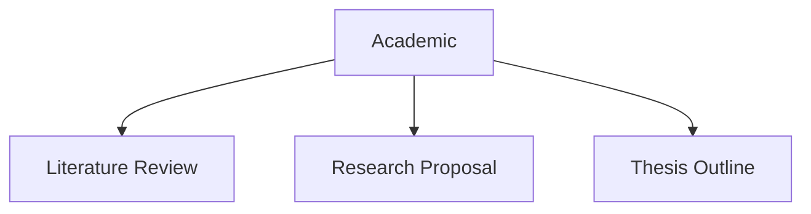

# Academic

Academic research templates for scholarly writing.

## Templates

| Template                                     | Description                 |
| -------------------------------------------- | --------------------------- |
| [literature_review.md](literature_review.md) | Literature review structure |
| [research_proposal.md](research_proposal.md) | Research proposal format    |
| [thesis_outline.md](thesis_outline.md)       | Thesis/dissertation outline |

## Structure

See [Parent](../SKILL.md) for all categories.
