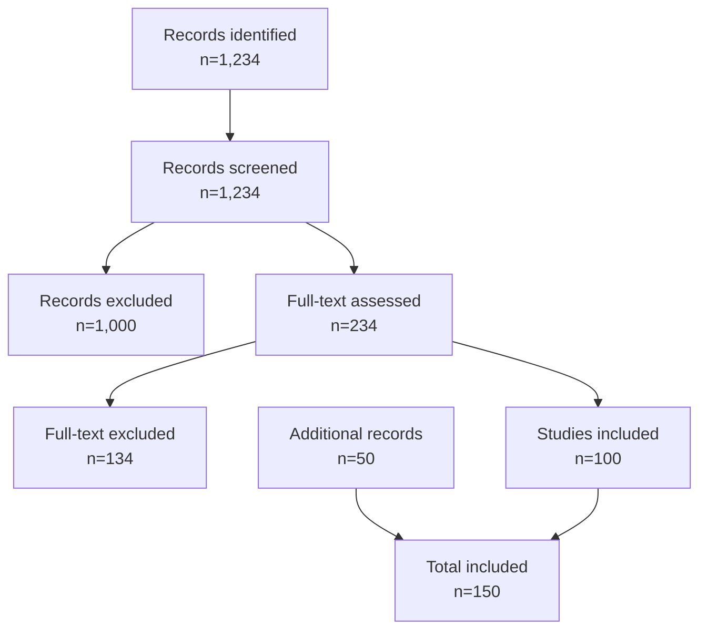
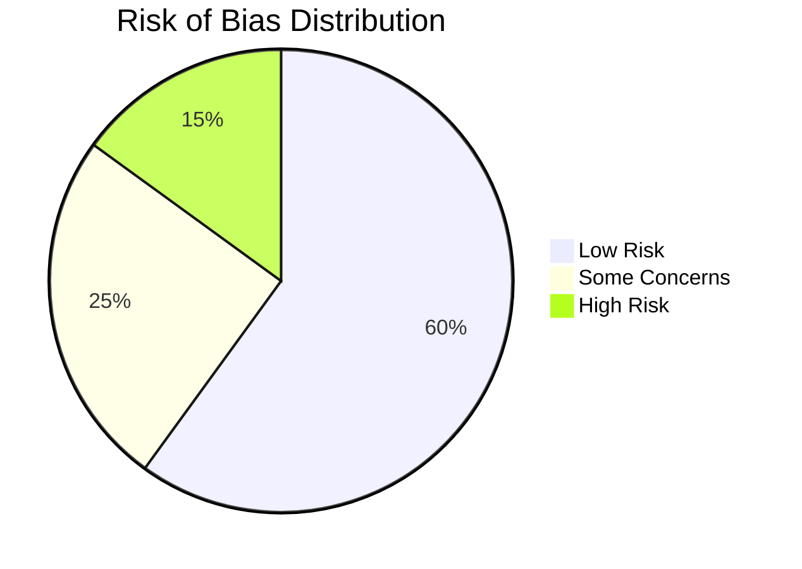
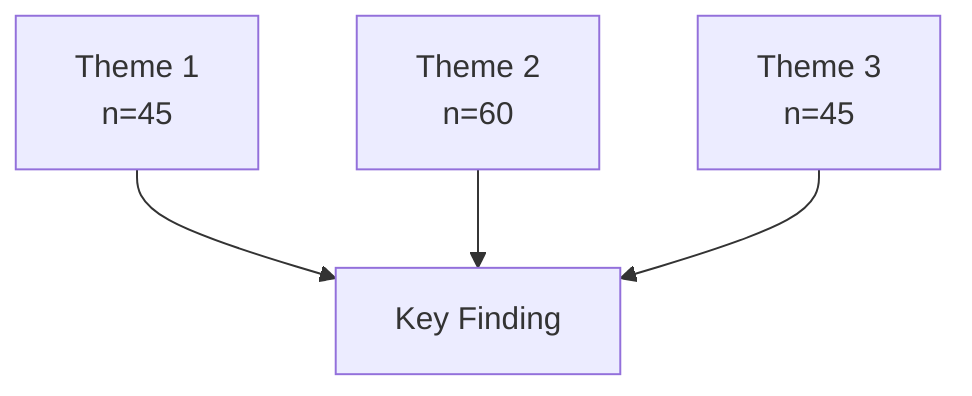
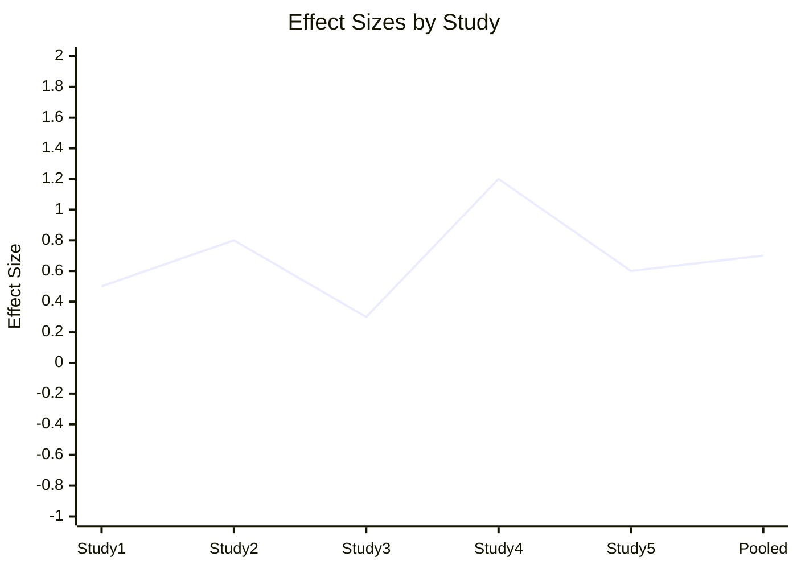

# Literature Review

<!-- Systematic literature review following PRISMA guidelines -->

---

## Document Control

| Field            | Value                                            |
| ---------------- | ------------------------------------------------ |
| **Review ID**    | LR-[YYYY]-[NNN]                                  |
| **Version**      | [X.Y.Z]                                          |
| **Date**         | [YYYY-MM-DD]                                     |
| **Author**       | [Name]                                           |
| **Review Type**  | Systematic / Narrative / Scoping / Meta-analysis |
| **Registration** | PROSPERO: [Number]                               |
| **Status**       | Protocol / In Progress / Complete                |

---

## Executive Summary

### Review Overview

| Attribute               | Value           |
| ----------------------- | --------------- |
| **Research Question**   | [Question]      |
| **Databases Searched**  | [N]             |
| **Articles Identified** | [N]             |
| **Articles Included**   | [N]             |
| **Date Range**          | [Start] - [End] |

### Key Findings

1. [Finding 1]
2. [Finding 2]
3. [Finding 3]

---

## PRISMA Flow Diagram



---

## Research Question

### PICO Framework

| Element          | Description   |
| ---------------- | ------------- |
| **P**opulation   | [Description] |
| **I**ntervention | [Description] |
| **C**omparison   | [Description] |
| **O**utcome      | [Description] |

### Review Questions

**Primary Question:**
[Main review question]

**Secondary Questions:**

1. [Question 1]
2. [Question 2]
3. [Question 3]

---

## Methodology

### Search Strategy

| Database       | Platform  | Date   | Results |
| -------------- | --------- | ------ | ------- |
| PubMed         | NCBI      | [Date] | [N]     |
| Web of Science | Clarivate | [Date] | [N]     |
| Scopus         | Elsevier  | [Date] | [N]     |
| PsycINFO       | APA       | [Date] | [N]     |

### Search Terms

**PubMed/MEDLINE:**

```
("term 1"[MeSH] OR "term 1"[Title/Abstract]) AND
("term 2"[MeSH] OR "term 2"[Title/Abstract]) AND
("term 3"[MeSH] OR "term 3"[Title/Abstract])
```

### Inclusion Criteria

1. [Criterion 1]
2. [Criterion 2]
3. [Criterion 3]

### Exclusion Criteria

1. [Criterion 1]
2. [Criterion 2]
3. [Criterion 3]

### Study Selection

| Reviewer | Role                     |
| -------- | ------------------------ |
| [Name 1] | Title/abstract screening |
| [Name 2] | Full-text review         |
| [Name 3] | Data extraction          |

**Agreement:**

- Cohen's kappa: [Value]
- Disagreements resolved by: [Method]

---

## Data Extraction

### Extraction Form

| Field        | Description |
| ------------ | ----------- |
| Study ID     | [Format]    |
| Authors      | [Format]    |
| Year         | [Format]    |
| Design       | [Format]    |
| Sample       | [Format]    |
| Intervention | [Format]    |
| Outcomes     | [Format]    |
| Results      | [Format]    |
| Quality      | [Format]    |

### Extracted Data

| Study    | Year   | Design   | N   | Key Finding |
| -------- | ------ | -------- | --- | ----------- |
| [Author] | [Year] | [Design] | [N] | [Finding]   |

---

## Quality Assessment

### Risk of Bias

| Tool             | Application    |
| ---------------- | -------------- |
| Cochrane RoB 2   | RCTs           |
| ROBINS-I         | Non-randomized |
| Newcastle-Ottawa | Observational  |
| CASP             | Qualitative    |

### Quality Summary



| Domain        | Low Risk | Some Concerns | High Risk |
| ------------- | -------- | ------------- | --------- |
| Randomization | [N]      | [N]           | [N]       |
| Blinding      | [N]      | [N]           | [N]       |
| Outcome       | [N]      | [N]           | [N]       |

---

## Synthesis

### Thematic Analysis



### Themes

#### Theme 1: [Theme Name]

**Description:**
[Description of theme]

**Supporting Evidence:**
| Study | Finding | Weight |
| ------- | --------- | -------- |
| [Study] | [Finding] | High |

#### Theme 2: [Theme Name]

**Description:**
[Description]

**Supporting Evidence:**
| Study | Finding | Weight |
| ------- | --------- | -------- |
| [Study] | [Finding] | Medium |

---

## Meta-Analysis (if applicable)

### Effect Sizes

| Study     | Effect Size | 95% CI | Weight |
| --------- | ----------- | ------ | ------ |
| [Study 1] | [ES]        | [CI]   | [W]%   |
| [Study 2] | [ES]        | [CI]   | [W]%   |

### Forest Plot



### Heterogeneity

| Statistic | Value   | Interpretation |
| --------- | ------- | -------------- |
| $I^2$     | [X]%    | [Low/Mod/High] |
| Q         | [Value] | [p-value]      |
| $\tau^2$  | [Value] | [Variance]     |

**Heterogeneity Formula:**

$$I^2 = \frac{Q - df}{Q} \times 100$$

---

## Discussion

### Summary of Findings

[Overview of key findings]

### Strengths

1. [Strength 1]
2. [Strength 2]

### Limitations

1. [Limitation 1]
2. [Limitation 2]

### Implications

| Stakeholder   | Implication   |
| ------------- | ------------- |
| Researchers   | [Implication] |
| Practitioners | [Implication] |
| Policy        | [Implication] |

### Future Research

1. [Recommendation 1]
2. [Recommendation 2]

---

## Conclusion

[Summary of review conclusions]

---

## References

[Complete reference list in required format]

---

## Appendices

### A. Search Strategies

[Complete search strings]

### B. Data Extraction Form

[Full extraction template]

### C. Quality Assessment

[Detailed assessments]

---

_Last updated: [Date]_

---

## See Also

- [Research Proposal](./research_proposal.md) — Research planning
- [Thesis Outline](./thesis_outline.md) — Thesis structure
- [Systematic Review](../../research/systematic-review.md) — Review methodology
