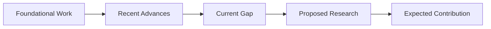
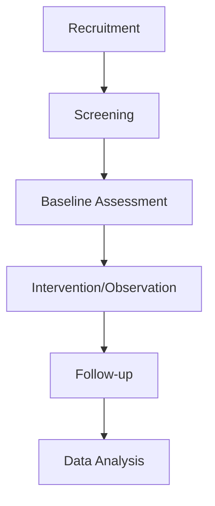
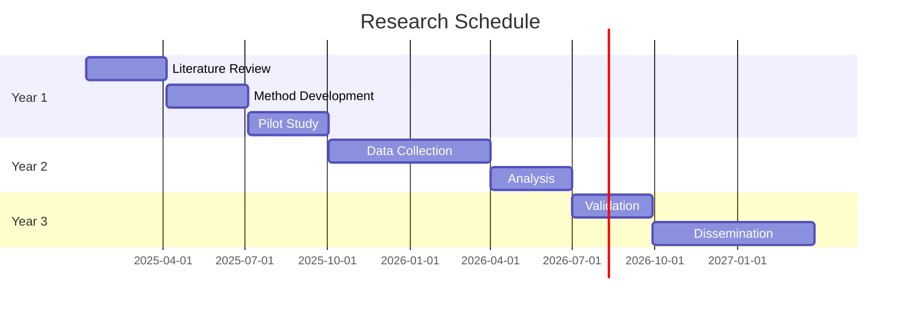

# Research Proposal

<!-- Academic research proposal following funding agency guidelines -->

---

## Document Control

| Field                      | Value                     |
| -------------------------- | ------------------------- |
| **Proposal ID**            | PROP-[YYYY]-[NNN]         |
| **Version**                | [X.Y.Z]                   |
| **Date**                   | [YYYY-MM-DD]              |
| **Principal Investigator** | [Name]                    |
| **Institution**            | [Institution]             |
| **Funding Agency**         | NSF / NIH / ERC / [Other] |
| **Program**                | [Program name]            |
| **Due Date**               | [YYYY-MM-DD]              |

---

## Executive Summary

### Proposal Overview

| Attribute         | Value             |
| ----------------- | ----------------- |
| **Project Title** | [Title]           |
| **Duration**      | [N] months/years  |
| **Total Budget**  | $[N]              |
| **Key Personnel** | [N] investigators |
| **Keywords**      | [5-10 keywords]   |

### Summary Statement

[250-word summary of the proposed research, including: problem statement, objectives, methodology, and expected outcomes. Written for a general scientific audience.]

---

## Introduction

### Background

[Context and background information establishing the research area. Cite key literature to demonstrate knowledge of the field.]

### Problem Statement

**Current Gap:**
[Description of the knowledge gap or problem being addressed]

**Significance:**
[Why this problem matters - scientific, societal, or practical importance]

**Research Question:**
[Central question this proposal addresses]

### Preliminary Data

| Finding     | Evidence   | Implication   |
| ----------- | ---------- | ------------- |
| [Finding 1] | [Evidence] | [Implication] |
| [Finding 2] | [Evidence] | [Implication] |

---

## Literature Review

### Current State of Knowledge

### Key Studies

| Study          | Finding   | Limitation   | Our Contribution |
| -------------- | --------- | ------------ | ---------------- |
| [Author, Year] | [Finding] | [Limitation] | [Contribution]   |
| [Author, Year] | [Finding] | [Limitation] | [Contribution]   |

### Theoretical Framework

[Theoretical basis for the proposed research]

---

## Research Objectives

### Primary Objective

[Single, overarching objective of the research]

### Specific Aims

**Aim 1:** [Specific, measurable objective]

- Hypothesis: [Testable hypothesis]
- Expected outcome: [Predicted result]

**Aim 2:** [Specific, measurable objective]

- Hypothesis: [Testable hypothesis]
- Expected outcome: [Predicted result]

**Aim 3:** [Specific, measurable objective]

- Hypothesis: [Testable hypothesis]
- Expected outcome: [Predicted result]

### Research Questions

1. [Question 1]
2. [Question 2]
3. [Question 3]

---

## Methodology

### Research Design

| Aspect      | Approach                         | Justification    |
| ----------- | -------------------------------- | ---------------- |
| Design      | [Experimental/Observational/etc] | [Why]            |
| Population  | [Sample description]             | [Why]            |
| Sample size | [N]                              | [Power analysis] |
| Duration    | [Time]                           | [Why]            |

### Data Collection

### Instruments

| Instrument     | Purpose   | Validity   | Reliability |
| -------------- | --------- | ---------- | ----------- |
| [Instrument 1] | [Purpose] | [Evidence] | [Evidence]  |
| [Instrument 2] | [Purpose] | [Evidence] | [Evidence]  |

### Analysis Plan

**Statistical Methods:**

| Analysis  | Method   | Software   |
| --------- | -------- | ---------- |
| Primary   | [Method] | [Software] |
| Secondary | [Method] | [Software] |

**Sample Size Justification:**

$$n = \frac{(Z_{\alpha/2} + Z_{\beta})^2 \cdot 2\sigma^2}{\delta^2} = [N]$$

---

## Timeline

| Phase | Activities   | Duration   | Milestone   |
| ----- | ------------ | ---------- | ----------- |
| 1     | [Activities] | [Duration] | [Milestone] |
| 2     | [Activities] | [Duration] | [Milestone] |
| 3     | [Activities] | [Duration] | [Milestone] |

---

## Expected Outcomes

### Anticipated Results

| Aim | Expected Finding | Impact   |
| --- | ---------------- | -------- |
| 1   | [Finding]        | [Impact] |
| 2   | [Finding]        | [Impact] |
| 3   | [Finding]        | [Impact] |

### Contributions to Knowledge

1. **Theoretical:** [Contribution]
2. **Methodological:** [Contribution]
3. **Practical:** [Contribution]

### Dissemination Plan

| Output                   | Target        | Timeline   |
| ------------------------ | ------------- | ---------- |
| Journal articles         | [Journals]    | [Timeline] |
| Conference presentations | [Conferences] | [Timeline] |
| Data sharing             | [Repository]  | [Timeline] |

---

## Budget

### Budget Summary

| Category  | Year 1   | Year 2   | Year 3   | Total    |
| --------- | -------- | -------- | -------- | -------- |
| Personnel | $[N]     | $[N]     | $[N]     | $[N]     |
| Equipment | $[N]     | $[N]     | $[N]     | $[N]     |
| Supplies  | $[N]     | $[N]     | $[N]     | $[N]     |
| Travel    | $[N]     | $[N]     | $[N]     | $[N]     |
| Other     | $[N]     | $[N]     | $[N]     | $[N]     |
| **Total** | **$[N]** | **$[N]** | **$[N]** | **$[N]** |

### Personnel

| Name   | Role    | % Effort | Salary | Benefits | Total |
| ------ | ------- | -------- | ------ | -------- | ----- |
| [Name] | PI      | [X]%     | $[N]   | $[N]     | $[N]  |
| [Name] | Co-I    | [X]%     | $[N]   | $[N]     | $[N]  |
| [Name] | Postdoc | [X]%     | $[N]   | $[N]     | $[N]  |

---

## Resources

### Facilities

| Resource     | Description   | Availability   |
| ------------ | ------------- | -------------- |
| [Resource 1] | [Description] | [Availability] |
| [Resource 2] | [Description] | [Availability] |

### Equipment

| Equipment     | Current  | Needed | Source   |
| ------------- | -------- | ------ | -------- |
| [Equipment 1] | [Status] | [Need] | [Source] |
| [Equipment 2] | [Status] | [Need] | [Source] |

### Collaborations

| Collaborator | Institution   | Contribution   |
| ------------ | ------------- | -------------- |
| [Name]       | [Institution] | [Contribution] |

---

## Risk Management

| Risk              | Likelihood | Impact | Mitigation     |
| ----------------- | ---------- | ------ | -------------- |
| Recruitment delay | Medium     | High   | Multiple sites |
| Technical failure | Low        | High   | Backup systems |
| Personnel change  | Medium     | Medium | Cross-training |

---

## Ethics

### Human Subjects

- IRB approval: [Status]
- Informed consent: [Process]
- Risk assessment: [Minimal/Greater than minimal]

### Animal Use

- IACUC approval: [Status]
- Species: [Species]
- Numbers: [N]

### Data Management

- Data sharing plan: [Plan]
- Repository: [Repository]
- Timeline: [Timeline]

---

## Appendices

### A. CVs

[Investigator CVs]

### B. Letters of Support

[Collaboration letters]

### C. Preliminary Data

[Figures and tables]

---

_Last updated: [Date]_

---

## See Also

- [Thesis Outline](./thesis_outline.md) — Thesis structure
- [Literature Review](./literature_review.md) — Literature synthesis
- [Grant Proposal](../scientific/grant_proposal.md) — Funding application
