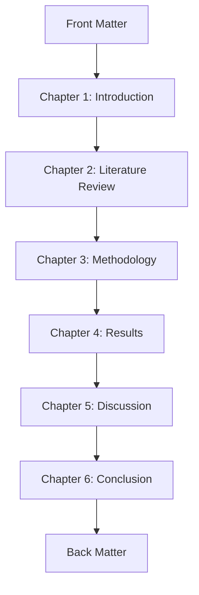
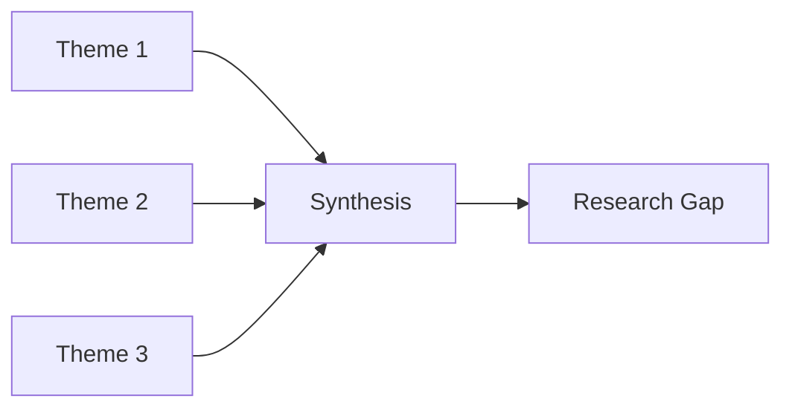
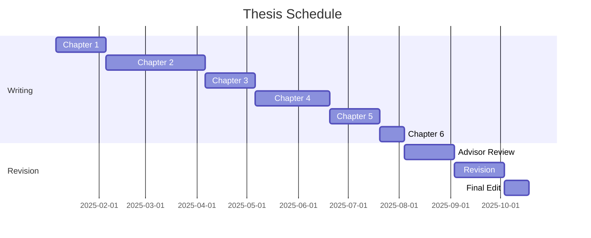

# Thesis Outline

<!-- Comprehensive thesis structure and organization -->

---

## Document Control

| Field           | Value                          |
| --------------- | ------------------------------ |
| **Thesis ID**   | TH-[YYYY]-[NNN]                |
| **Version**     | [X.Y.Z]                        |
| **Date**        | [YYYY-MM-DD]                   |
| **Author**      | [Student Name]                 |
| **Degree**      | PhD / Master's / Bachelor's    |
| **Program**     | [Program]                      |
| **Institution** | [Institution]                  |
| **Advisor**     | [Advisor Name]                 |
| **Status**      | Draft / In Progress / Complete |

---

## Executive Summary

### Thesis Overview

| Attribute               | Value     |
| ----------------------- | --------- |
| **Working Title**       | [Title]   |
| **Degree**              | [Degree]  |
| **Expected Completion** | [Date]    |
| **Word Count Target**   | [N] words |
| **Chapters**            | [N]       |

### Abstract

[300-word summary of the thesis including: background, research questions, methodology, key findings, and contributions.]

---

## Thesis Structure

### Overview Diagram

---

## Front Matter

### Title Page

- Full title
- Author name
- Degree statement
- Institution
- Date

### Abstract

[250-350 word summary]

### Acknowledgments

[Recognition of contributions]

### Table of Contents

[Auto-generated]

### List of Figures

[Auto-generated]

### List of Tables

[Auto-generated]

---

## Chapter 1: Introduction

### 1.1 Background

[Context and background]

### 1.2 Problem Statement

[Research problem]

### 1.3 Research Questions

**Primary Question:**
[Main research question]

**Secondary Questions:**

1. [Question 1]
2. [Question 2]
3. [Question 3]

### 1.4 Significance

[Why this research matters]

### 1.5 Scope and Delimitations

**In Scope:**

- [Item 1]
- [Item 2]

**Out of Scope:**

- [Item 1]
- [Item 2]

### 1.6 Thesis Organization

[Overview of remaining chapters]

---

## Chapter 2: Literature Review

### 2.1 Theoretical Framework

[Theoretical foundation]

### 2.2 Historical Context

[Evolution of the field]

### 2.3 Current State of Research

### 2.4 Research Gap

[What is missing]

### 2.5 Conceptual Framework

[Visual model]

---

## Chapter 3: Methodology

### 3.1 Research Design

| Aspect   | Decision           | Justification |
| -------- | ------------------ | ------------- |
| Paradigm | [Qual/Quant/Mixed] | [Why]         |
| Approach | [Approach]         | [Why]         |
| Strategy | [Strategy]         | [Why]         |

### 3.2 Research Context

[Setting and participants]

### 3.3 Data Collection

| Method     | Purpose   | Sample |
| ---------- | --------- | ------ |
| [Method 1] | [Purpose] | [N]    |
| [Method 2] | [Purpose] | [N]    |

### 3.4 Data Analysis

[Analytical approach]

### 3.5 Ethical Considerations

[Ethics approval and procedures]

### 3.6 Validity and Reliability

[Quality assurance]

---

## Chapter 4: Results

### 4.1 Participant Characteristics

| Characteristic   | N   | %    |
| ---------------- | --- | ---- |
| [Characteristic] | [N] | [X]% |

### 4.2 Findings by Research Question

**RQ1:** [Question]

| Finding   | Evidence   | Significance   |
| --------- | ---------- | -------------- |
| [Finding] | [Evidence] | [Significance] |

### 4.3 Additional Findings

[Emergent themes]

### 4.4 Summary of Results

[Chapter summary]

---

## Chapter 5: Discussion

### 5.1 Interpretation of Findings

[Meaning of results]

### 5.2 Connection to Literature

| Finding   | Literature | Agreement/Contrast |
| --------- | ---------- | ------------------ |
| [Finding] | [Citation] | [Relationship]     |

### 5.3 Theoretical Implications

[Contribution to theory]

### 5.4 Practical Implications

[Real-world applications]

### 5.5 Limitations

[Study limitations]

---

## Chapter 6: Conclusion

### 6.1 Summary of Key Findings

[Main takeaways]

### 6.2 Contributions

| Type           | Contribution   |
| -------------- | -------------- |
| Theoretical    | [Contribution] |
| Methodological | [Contribution] |
| Practical      | [Contribution] |

### 6.3 Recommendations for Future Research

1. [Recommendation 1]
2. [Recommendation 2]
3. [Recommendation 3]

### 6.4 Concluding Remarks

[Final thoughts]

---

## Back Matter

### References

[Complete bibliography]

### Appendices

| Appendix | Content   |
| -------- | --------- |
| A        | [Content] |
| B        | [Content] |

### Index

[Optional]

---

## Timeline

| Milestone        | Target Date | Status |
| ---------------- | ----------- | ------ |
| Proposal defense | [Date]      | ⬜     |
| Chapter 1 draft  | [Date]      | ⬜     |
| Chapter 2 draft  | [Date]      | ⬜     |
| Full draft       | [Date]      | ⬜     |
| Defense          | [Date]      | ⬜     |
| Final submission | [Date]      | ⬜     |

---

## Style Guidelines

### Formatting

| Element  | Specification           |
| -------- | ----------------------- |
| Font     | Times New Roman 12pt    |
| Spacing  | Double-spaced           |
| Margins  | 1 inch all sides        |
| Citation | APA 7th / MLA / Chicago |

### Writing Tips

1. Write for your audience
2. Use active voice
3. Be precise and concise
4. Cite sources properly
5. Revise iteratively

---

_Last updated: [Date]_

---

## See Also

- [Research Proposal](./research_proposal.md) — Proposal development
- [Literature Review](./literature_review.md) — Literature synthesis
- [Statistical Analysis](../scientific/statistical_analysis.md) — Data analysis
