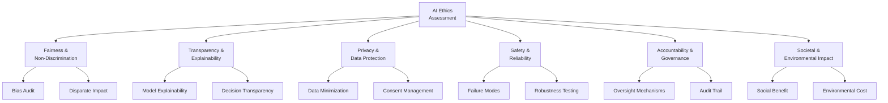
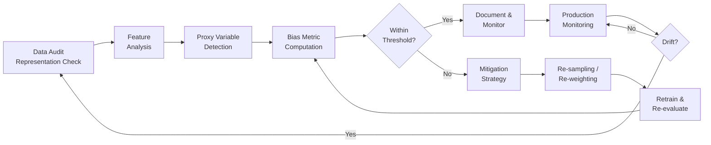
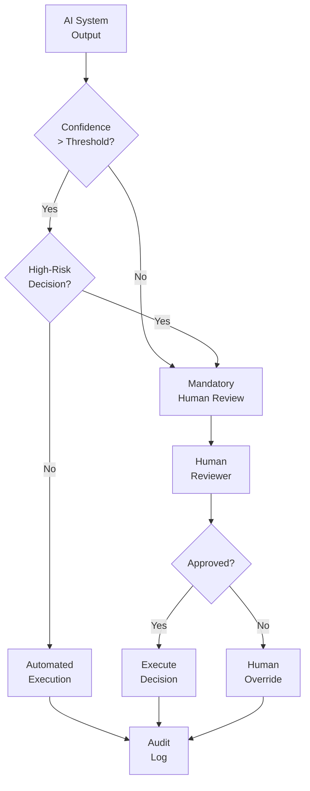

# AI Ethics Review

## Document Control

| Field               | Value                                              |
| ------------------- | -------------------------------------------------- |
| **Document ID**     | AER-001                                            |
| **Version**         | 1.0                                                |
| **Classification**  | Confidential                                       |
| **Author**          | `[Author Name]`                                    |
| **Reviewer**        | `[Ethics Board Reviewer]`                          |
| **Approver**        | `[Approver Name]`                                  |
| **Created**         | `YYYY-MM-DD`                                       |
| **Last Updated**    | `YYYY-MM-DD`                                       |
| **Review Deadline** | `YYYY-MM-DD`                                       |
| **Status**          | Pending Review / Approved / Conditional / Rejected |

---

## System Under Review

| Attribute               | Details                                                             |
| ----------------------- | ------------------------------------------------------------------- |
| **System Name**         | `[AI System Name]`                                                  |
| **System Type**         | `[Classification / Generation / Recommendation / Decision Support]` |
| **Deployment Stage**    | `[Development / Staging / Production]`                              |
| **Affected Population** | `[Description of who is affected]`                                  |
| **Decision Authority**  | `[Fully Automated / Human-in-the-Loop / Advisory Only]`             |
| **Business Owner**      | `[Name / Team]`                                                     |
| **Technical Owner**     | `[Name / Team]`                                                     |

---

## Ethics Assessment Framework

### Assessment Dimensions

---

## Fairness & Bias Assessment

### Protected Attributes Evaluated

| Attribute            | Included in Training | Proxy Risk | Mitigation      |
| -------------------- | -------------------- | ---------- | --------------- |
| Race / Ethnicity     | `[Yes/No/Proxy]`     | `[H/M/L]`  | `[Description]` |
| Gender               | `[Yes/No/Proxy]`     | `[H/M/L]`  | `[Description]` |
| Age                  | `[Yes/No/Proxy]`     | `[H/M/L]`  | `[Description]` |
| Disability           | `[Yes/No/Proxy]`     | `[H/M/L]`  | `[Description]` |
| Socioeconomic Status | `[Yes/No/Proxy]`     | `[H/M/L]`  | `[Description]` |
| Geographic Location  | `[Yes/No/Proxy]`     | `[H/M/L]`  | `[Description]` |

### Bias Metrics

| Metric                    | Group A vs B | Threshold | Result | Status        |
| ------------------------- | ------------ | --------- | ------ | ------------- |
| Demographic Parity Ratio  | `[Groups]`   | > 0.8     | `___`  | `[Pass/Fail]` |
| Equalized Odds Ratio      | `[Groups]`   | > 0.8     | `___`  | `[Pass/Fail]` |
| Predictive Parity Ratio   | `[Groups]`   | > 0.8     | `___`  | `[Pass/Fail]` |
| Calibration Difference    | `[Groups]`   | < 0.1     | `___`  | `[Pass/Fail]` |
| False Positive Rate Ratio | `[Groups]`   | > 0.8     | `___`  | `[Pass/Fail]` |
| False Negative Rate Ratio | `[Groups]`   | > 0.8     | `___`  | `[Pass/Fail]` |

### Bias Review Process

---

## Transparency & Explainability

### Explainability Methods

| Method                      | Applied    | Scope          | Results Summary |
| --------------------------- | ---------- | -------------- | --------------- |
| SHAP Values                 | `[Yes/No]` | Global + Local | `[Summary]`     |
| LIME                        | `[Yes/No]` | Local          | `[Summary]`     |
| Feature Importance          | `[Yes/No]` | Global         | `[Summary]`     |
| Counterfactual Explanations | `[Yes/No]` | Local          | `[Summary]`     |
| Attention Visualization     | `[Yes/No]` | Local          | `[Summary]`     |
| Decision Rules Extraction   | `[Yes/No]` | Global         | `[Summary]`     |

### User-Facing Transparency

| Requirement                     | Implementation  | Status           |
| ------------------------------- | --------------- | ---------------- |
| Users informed AI is in use     | `[Description]` | `[Done/Pending]` |
| Explanation of decision factors | `[Description]` | `[Done/Pending]` |
| Appeal / override mechanism     | `[Description]` | `[Done/Pending]` |
| Opt-out option available        | `[Description]` | `[Done/Pending]` |
| Model limitations disclosed     | `[Description]` | `[Done/Pending]` |

---

## Privacy & Data Protection

### Data Processing Assessment

| Data Category         | Volume     | Retention  | Legal Basis | Encryption |
| --------------------- | ---------- | ---------- | ----------- | ---------- |
| Personal Identifiers  | `[Volume]` | `[Period]` | `[Basis]`   | `[Yes/No]` |
| Behavioral Data       | `[Volume]` | `[Period]` | `[Basis]`   | `[Yes/No]` |
| Sensitive Attributes  | `[Volume]` | `[Period]` | `[Basis]`   | `[Yes/No]` |
| Derived/Inferred Data | `[Volume]` | `[Period]` | `[Basis]`   | `[Yes/No]` |

### Privacy Compliance Checklist

- [ ] Data Protection Impact Assessment (DPIA) completed
- [ ] Privacy-by-design principles applied
- [ ] Data minimization verified
- [ ] Purpose limitation documented
- [ ] Consent mechanisms implemented (if applicable)
- [ ] Right to erasure supported
- [ ] Cross-border transfer assessed
- [ ] Data processing agreements in place

---

## Safety & Reliability

### Failure Mode Analysis

| Failure Mode                  | Probability | Impact    | Detection Method | Mitigation |
| ----------------------------- | ----------- | --------- | ---------------- | ---------- |
| Model produces harmful output | `[H/M/L]`   | `[H/M/L]` | `[Method]`       | `[Action]` |
| Adversarial manipulation      | `[H/M/L]`   | `[H/M/L]` | `[Method]`       | `[Action]` |
| Data poisoning                | `[H/M/L]`   | `[H/M/L]` | `[Method]`       | `[Action]` |
| Unexpected edge cases         | `[H/M/L]`   | `[H/M/L]` | `[Method]`       | `[Action]` |
| Cascading errors              | `[H/M/L]`   | `[H/M/L]` | `[Method]`       | `[Action]` |

### Human Oversight Requirements

---

## Accountability & Governance

### Accountability Chain

| Decision Level        | Responsible Party   | Authority          | Escalation Path |
| --------------------- | ------------------- | ------------------ | --------------- |
| Individual prediction | ML Engineer on-call | Monitor & alert    | Team Lead       |
| Model performance     | ML Team Lead        | Retrain / rollback | Director        |
| Ethical concern       | Ethics Board        | Suspend deployment | VP / C-Suite    |
| Regulatory inquiry    | Legal/Compliance    | Full investigation | Board           |

### Audit Requirements

| Audit Type        | Frequency   | Scope                    | Performed By     |
| ----------------- | ----------- | ------------------------ | ---------------- |
| Bias audit        | Quarterly   | All protected attributes | Internal Ethics  |
| Performance audit | Monthly     | All metrics + subgroups  | ML Team          |
| Security audit    | Semi-annual | Model + infrastructure   | Security Team    |
| Compliance audit  | Annual      | Regulatory alignment     | External Auditor |

---

## Risk Summary

### Overall Risk Rating

| Dimension       | Rating              | Confidence | Notes     |
| --------------- | ------------------- | ---------- | --------- |
| Fairness        | `[Low/Medium/High]` | `[H/M/L]`  | `[Notes]` |
| Transparency    | `[Low/Medium/High]` | `[H/M/L]`  | `[Notes]` |
| Privacy         | `[Low/Medium/High]` | `[H/M/L]`  | `[Notes]` |
| Safety          | `[Low/Medium/High]` | `[H/M/L]`  | `[Notes]` |
| Accountability  | `[Low/Medium/High]` | `[H/M/L]`  | `[Notes]` |
| Societal Impact | `[Low/Medium/High]` | `[H/M/L]`  | `[Notes]` |

---

## Review Decision

### Ethics Board Determination

| Decision             | `[Approved / Conditional Approval / Rejected / Deferred]` |
| -------------------- | --------------------------------------------------------- |
| **Conditions**       | `[List any conditions for approval]`                      |
| **Required Actions** | `[List mandatory actions before/after deployment]`        |
| **Review Date**      | `YYYY-MM-DD`                                              |
| **Next Review**      | `YYYY-MM-DD`                                              |

---

## Approval & Sign-Off

| Role               | Name              | Signature         | Date         |
| ------------------ | ----------------- | ----------------- | ------------ |
| Ethics Board Chair | `_______________` | `_______________` | `YYYY-MM-DD` |
| ML Team Lead       | `_______________` | `_______________` | `YYYY-MM-DD` |
| Legal / Compliance | `_______________` | `_______________` | `YYYY-MM-DD` |
| Business Owner     | `_______________` | `_______________` | `YYYY-MM-DD` |

---

## Revision History

| Version | Date         | Author     | Changes                |
| ------- | ------------ | ---------- | ---------------------- |
| 0.1     | `YYYY-MM-DD` | `[Author]` | Initial ethics review  |
| 0.2     | `YYYY-MM-DD` | `[Author]` | Added bias metrics     |
| 1.0     | `YYYY-MM-DD` | `[Author]` | Board-approved version |
