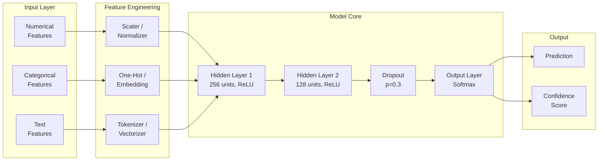
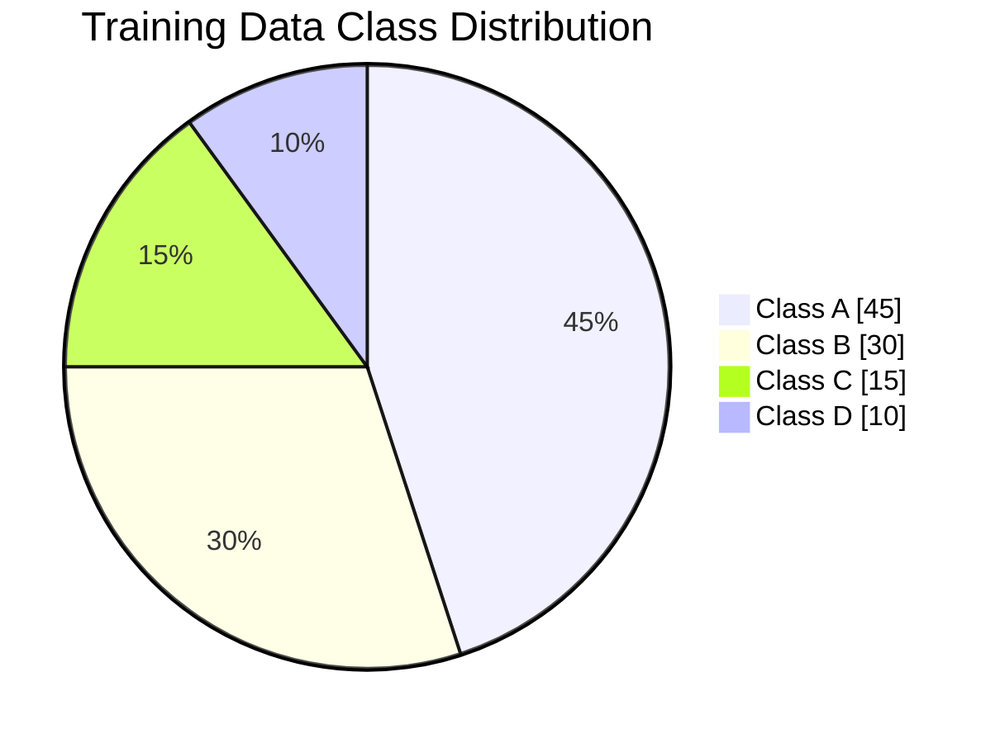
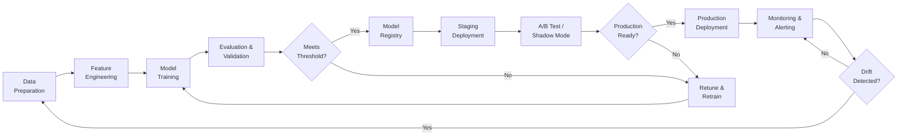

# ML Model Card

## Document Control

| Field                 | Value                                           |
| --------------------- | ----------------------------------------------- |
| **Document ID**       | MLC-001                                         |
| **Version**           | 1.0                                             |
| **Classification**    | Internal                                        |
| **Author**            | `[Author Name]`                                 |
| **Reviewer**          | `[Reviewer Name]`                               |
| **Approver**          | `[Approver Name]`                               |
| **Created**           | `YYYY-MM-DD`                                    |
| **Last Updated**      | `YYYY-MM-DD`                                    |
| **Model Registry ID** | `[Registry ID]`                                 |
| **Status**            | Development / Staging / Production / Deprecated |

---

## Model Overview

| Attribute         | Details                                             |
| ----------------- | --------------------------------------------------- |
| **Model Name**    | `[Model Name]`                                      |
| **Model Version** | `[v1.0.0]`                                          |
| **Model Type**    | `[Classification / Regression / Clustering / etc.]` |
| **Framework**     | `[PyTorch / TensorFlow / scikit-learn / etc.]`      |
| **Task**          | `[Brief description of the task]`                   |
| **Owner**         | `[Team / Individual]`                               |
| **Contact**       | `[Email / Slack channel]`                           |

### Intended Use

- **Primary Use Cases**: `[Description of intended use]`
- **Target Users**: `[Description of intended users]`
- **Out-of-Scope Uses**: `[Explicitly state what this model should NOT be used for]`

---

## Model Architecture

### Architecture Diagram

### Hyperparameters

| Parameter     | Value | Tuning Method         |
| ------------- | ----- | --------------------- |
| Learning Rate | `___` | Grid Search           |
| Batch Size    | `___` | Fixed                 |
| Epochs        | `___` | Early Stopping        |
| Dropout Rate  | `___` | Bayesian Optimization |
| Hidden Units  | `___` | Grid Search           |
| Optimizer     | `___` | Fixed                 |
| Loss Function | `___` | Fixed                 |

---

## Training Data

### Dataset Summary

| Attribute             | Value                        |
| --------------------- | ---------------------------- |
| **Dataset Name**      | `[Name]`                     |
| **Total Samples**     | `___`                        |
| **Training Split**    | `___` (\_\_\_%)              |
| **Validation Split**  | `___` (\_\_\_%)              |
| **Test Split**        | `___` (\_\_\_%)              |
| **Date Range**        | `YYYY-MM-DD` to `YYYY-MM-DD` |
| **Collection Method** | `[Description]`              |

### Feature Inventory

| Feature     | Type        | Description     | Importance Rank |
| ----------- | ----------- | --------------- | --------------- |
| `feature_1` | Numerical   | `[Description]` | 1               |
| `feature_2` | Categorical | `[Description]` | 2               |
| `feature_3` | Text        | `[Description]` | 3               |
| `feature_4` | Numerical   | `[Description]` | 4               |
| `feature_5` | Boolean     | `[Description]` | 5               |

### Class Distribution

---

## Performance Metrics

### Primary Metrics

| Metric            | Training | Validation | Test  | Production |
| ----------------- | -------- | ---------- | ----- | ---------- |
| Accuracy          | `___`    | `___`      | `___` | `___`      |
| Precision (macro) | `___`    | `___`      | `___` | `___`      |
| Recall (macro)    | `___`    | `___`      | `___` | `___`      |
| F1 Score (macro)  | `___`    | `___`      | `___` | `___`      |
| AUC-ROC           | `___`    | `___`      | `___` | `___`      |
| Log Loss          | `___`    | `___`      | `___` | `___`      |

### Performance by Subgroup

| Subgroup | Samples | Accuracy | Precision | Recall | F1    |
| -------- | ------- | -------- | --------- | ------ | ----- |
| Group A  | `___`   | `___`    | `___`     | `___`  | `___` |
| Group B  | `___`   | `___`    | `___`     | `___`  | `___` |
| Group C  | `___`   | `___`    | `___`     | `___`  | `___` |
| Group D  | `___`   | `___`    | `___`     | `___`  | `___` |

### Confusion Matrix Summary

|                     | Predicted Positive | Predicted Negative |
| ------------------- | ------------------ | ------------------ |
| **Actual Positive** | TP: `___`          | FN: `___`          |
| **Actual Negative** | FP: `___`          | TN: `___`          |

---

## Model Lifecycle

### Training & Deployment Pipeline

### Retraining Schedule

| Trigger           | Condition                            | Action                      |
| ----------------- | ------------------------------------ | --------------------------- |
| Scheduled         | Every `[N]` weeks                    | Full retrain on latest data |
| Performance Drift | Accuracy drops > `___`%              | Alert + retrain evaluation  |
| Data Drift        | Distribution shift > `___` threshold | Alert + investigation       |
| Feature Change    | New features available               | Feature selection + retrain |

---

## Operational Requirements

### Inference Specifications

| Attribute           | Requirement               |
| ------------------- | ------------------------- |
| **Latency (P50)**   | < `___` ms                |
| **Latency (P99)**   | < `___` ms                |
| **Throughput**      | `___` requests/second     |
| **Memory**          | < `___` GB                |
| **GPU Required**    | Yes / No                  |
| **Model Size**      | `___` MB                  |
| **Batch Inference** | Supported / Not supported |

### Monitoring Metrics

| Metric                        | Alert Threshold | Check Frequency |
| ----------------------------- | --------------- | --------------- |
| Prediction latency P99        | > `___` ms      | Every minute    |
| Error rate                    | > `___`%        | Every minute    |
| Feature drift (PSI)           | > `___`         | Daily           |
| Prediction distribution shift | > `___`         | Daily           |
| Input validation failures     | > `___`%        | Hourly          |

---

## Limitations & Risks

### Known Limitations

| Limitation       | Impact     | Mitigation     |
| ---------------- | ---------- | -------------- |
| `[Limitation 1]` | `[Impact]` | `[Mitigation]` |
| `[Limitation 2]` | `[Impact]` | `[Mitigation]` |
| `[Limitation 3]` | `[Impact]` | `[Mitigation]` |

### Risk Assessment

| Risk              | Likelihood | Impact    | Risk Level | Mitigation |
| ----------------- | ---------- | --------- | ---------- | ---------- |
| Model bias        | `[H/M/L]`  | `[H/M/L]` | `[H/M/L]`  | `[Action]` |
| Data poisoning    | `[H/M/L]`  | `[H/M/L]` | `[H/M/L]`  | `[Action]` |
| Concept drift     | `[H/M/L]`  | `[H/M/L]` | `[H/M/L]`  | `[Action]` |
| Adversarial input | `[H/M/L]`  | `[H/M/L]` | `[H/M/L]`  | `[Action]` |

---

## Ethical Considerations

- **Fairness**: `[How fairness was evaluated and ensured]`
- **Transparency**: `[How model decisions can be explained]`
- **Privacy**: `[How user privacy is protected]`
- **Accountability**: `[Who is responsible for model decisions]`

---

## Approval & Sign-Off

| Role              | Name              | Signature         | Date         |
| ----------------- | ----------------- | ----------------- | ------------ |
| ML Engineer       | `_______________` | `_______________` | `YYYY-MM-DD` |
| ML Lead / Manager | `_______________` | `_______________` | `YYYY-MM-DD` |
| Ethics Reviewer   | `_______________` | `_______________` | `YYYY-MM-DD` |
| Product Owner     | `_______________` | `_______________` | `YYYY-MM-DD` |

---

## Revision History

| Version | Date         | Author     | Changes                   |
| ------- | ------------ | ---------- | ------------------------- |
| 0.1     | `YYYY-MM-DD` | `[Author]` | Initial model card        |
| 0.2     | `YYYY-MM-DD` | `[Author]` | Added performance metrics |
| 1.0     | `YYYY-MM-DD` | `[Author]` | Production release        |
