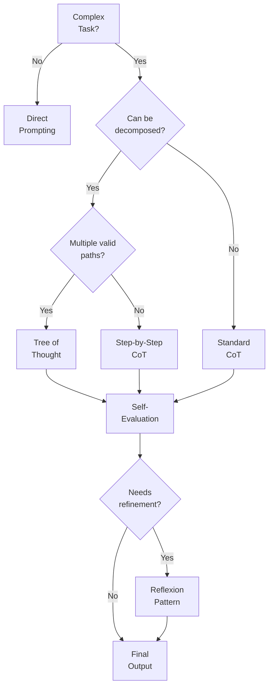
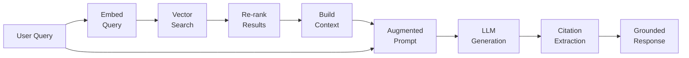
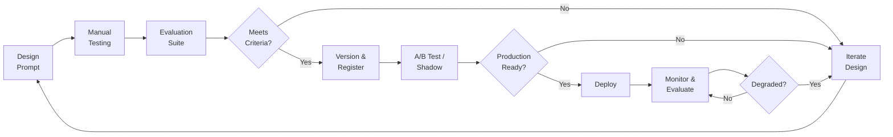

# Prompt Engineering Guide

## Document Control

| Field              | Value                              |
| ------------------ | ---------------------------------- |
| **Document ID**    | PEG-001                            |
| **Version**        | 1.0                                |
| **Classification** | Internal                           |
| **Author**         | `[Author Name]`                    |
| **Reviewer**       | `[Reviewer Name]`                  |
| **Approver**       | `[Approver Name]`                  |
| **Created**        | `YYYY-MM-DD`                       |
| **Last Updated**   | `YYYY-MM-DD`                       |
| **Target LLM(s)**  | `[GPT-4 / Claude / Gemini / etc.]` |
| **Status**         | Draft / In Review / Approved       |

---

## Executive Summary

This guide documents prompt engineering patterns, evaluation strategies, and best practices for `[Project/System Name]`. It serves as the canonical reference for designing, testing, and maintaining LLM prompts across the organization.

---

## Prompt Pattern Taxonomy

### Pattern Categories

```mermaid
mindmap
    accTitle: Prompt Engineering Pattern Taxonomy
    accDescr: Hierarchical classification of prompt patterns by category

    root((Prompt<br/>Patterns))
        Structural
            System/User/Assistant
            Few-Shot Templates
            Chain of Thought
            Template Literals
        Reasoning
            Step-by-Step
            Tree of Thought
            Self-Consistency
            Reflexion
        Output Control
            Format Specification
            Schema Enforcement
            Length Constraints
            Tone Calibration
        Context Management
            Retrieval Augmented
            Sliding Window
            Summarization
            Memory Injection
        Safety
            Guardrails
            Content Filtering
            Refusal Patterns
            Red Team Prompts
```

---

## Core Patterns

### Pattern 1: System Role Definition

**Purpose**: Establish consistent behavior and persona for the LLM.

**Template**:

```
You are a [ROLE] with expertise in [DOMAIN].

Your responsibilities:
- [Responsibility 1]
- [Responsibility 2]
- [Responsibility 3]

Constraints:
- [Constraint 1]
- [Constraint 2]

Output format: [FORMAT SPECIFICATION]
```

**When to Use**: Every production prompt should begin with a system role.

| Attribute   | Guideline                                     |
| ----------- | --------------------------------------------- |
| Specificity | Be precise about domain and expertise level   |
| Constraints | Explicitly state what the model should NOT do |
| Format      | Always specify expected output format         |
| Tone        | Define communication style when relevant      |

---

### Pattern 2: Few-Shot Learning

**Purpose**: Demonstrate expected behavior through examples.

**Template**:

```
[System Role]

Here are examples of the expected input and output:

Example 1:
Input: [Example input 1]
Output: [Example output 1]

Example 2:
Input: [Example input 2]
Output: [Example output 2]

Now process the following:
Input: [Actual input]
Output:
```

**Selection Criteria for Examples**:

| Criterion | Description                                |
| --------- | ------------------------------------------ |
| Diversity | Cover different cases and edge conditions  |
| Relevance | Match the expected production distribution |
| Clarity   | Unambiguous input-output relationships     |
| Count     | 3-5 examples typically optimal             |
| Ordering  | Place most relevant example last           |

---

### Pattern 3: Chain of Thought (CoT)

**Purpose**: Improve reasoning accuracy on complex tasks.

**Decision Flow**:



**Template**:

```
[System Role]

Think through this step by step:

1. First, identify [what to analyze]
2. Then, consider [relevant factors]
3. Next, evaluate [criteria]
4. Finally, provide [conclusion/output]

Show your reasoning for each step.

Task: [Task description]
```

---

### Pattern 4: Retrieval-Augmented Generation (RAG)

**Purpose**: Ground LLM responses in retrieved factual context.

**Architecture**:



**Template**:

```
[System Role]

Use ONLY the following context to answer the question.
If the context does not contain enough information, say so.
Always cite your sources using [Source N] notation.

Context:
---
[Retrieved Document 1]
Source: [Reference 1]
---
[Retrieved Document 2]
Source: [Reference 2]
---

Question: [User question]

Answer (with citations):
```

---

### Pattern 5: Output Schema Enforcement

**Purpose**: Ensure structured, parseable output.

**Template**:

```
[System Role]

Respond ONLY with valid JSON matching this exact schema:
{
  "field_1": "string - description",
  "field_2": number,
  "field_3": ["array", "of", "strings"],
  "field_4": {
    "nested_field": "string"
  }
}

Do not include any text before or after the JSON.
Do not wrap in markdown code blocks.

Input: [Input data]
```

---

## Prompt Development Lifecycle

### Development Process



---

## Evaluation Framework

### Evaluation Dimensions

| Dimension         | Description           | Metric                 | Target  |
| ----------------- | --------------------- | ---------------------- | ------- |
| Accuracy          | Factual correctness   | Human rating (1-5)     | > 4.0   |
| Relevance         | Addresses the query   | Human rating (1-5)     | > 4.2   |
| Completeness      | Covers all aspects    | Checklist coverage %   | > 90%   |
| Format Compliance | Matches output schema | Parse success rate     | > 99%   |
| Safety            | No harmful content    | Violation rate         | 0%      |
| Latency           | Response time         | P95 latency (ms)       | < `___` |
| Cost              | Token consumption     | Avg tokens per request | < `___` |

### Evaluation Dataset Structure

| Field                 | Description             | Example                |
| --------------------- | ----------------------- | ---------------------- |
| `test_id`             | Unique identifier       | `PEG-TC-001`           |
| `category`            | Test category           | `edge_case`            |
| `input`               | Test input              | `[Example input]`      |
| `expected_output`     | Gold-standard reference | `[Expected output]`    |
| `evaluation_criteria` | Rubric for scoring      | `[Criteria list]`      |
| `tags`                | Metadata tags           | `[reasoning, complex]` |

---

## Anti-Patterns & Troubleshooting

### Common Anti-Patterns

```mermaid
mindmap
    accTitle: Prompt Anti-Patterns
    accDescr: Common mistakes to avoid in prompt engineering

    root((Anti-<br/>Patterns))
        Vagueness
            Ambiguous role
            No format spec
            Missing constraints
        Overloading
            Too many tasks
            Conflicting instructions
            Information overload
        Fragility
            Input-dependent behavior
            No error handling
            Hardcoded values
        Neglect
            No evaluation
            No versioning
            No monitoring
```

### Troubleshooting Guide

| Symptom                         | Likely Cause                     | Fix                              |
| ------------------------------- | -------------------------------- | -------------------------------- |
| Inconsistent output format      | Missing format specification     | Add explicit schema + examples   |
| Hallucinated facts              | No grounding context             | Add RAG or citation requirements |
| Verbose responses               | No length constraint             | Add word/token limits            |
| Off-topic answers               | Weak system prompt               | Strengthen role + constraints    |
| Poor reasoning                  | Direct prompting on complex task | Add Chain of Thought             |
| Refusal to answer valid queries | Over-constrained guardrails      | Relax safety filters             |
| Prompt injection vulnerability  | No input sanitization            | Add input validation layer       |

---

## Prompt Versioning & Registry

### Version Control

| Prompt ID | Name                    | Version | Model    | Status      | Last Updated |
| --------- | ----------------------- | ------- | -------- | ----------- | ------------ |
| PRM-001   | Customer Support Router | v2.3    | GPT-4    | Production  | `YYYY-MM-DD` |
| PRM-002   | Document Summarizer     | v1.1    | Claude 3 | Staging     | `YYYY-MM-DD` |
| PRM-003   | Code Review Assistant   | v3.0    | GPT-4    | Production  | `YYYY-MM-DD` |
| PRM-004   | Data Extraction         | v1.0    | Claude 3 | Development | `YYYY-MM-DD` |

### Change Management

| Change Type             | Review Required     | Testing Required   | Approval          |
| ----------------------- | ------------------- | ------------------ | ----------------- |
| Typo / formatting fix   | Peer review         | Smoke test         | Team lead         |
| Constraint modification | Peer review         | Full eval suite    | Team lead         |
| New prompt creation     | Design review       | Full eval + A/B    | Product + ML lead |
| Model migration         | Architecture review | Full eval + shadow | Director          |

---

## Security Considerations

### Prompt Injection Defenses

| Defense Layer         | Implementation                         | Status           |
| --------------------- | -------------------------------------- | ---------------- |
| Input sanitization    | Strip control characters, limit length | `[Done/Pending]` |
| Instruction hierarchy | System > user prompt separation        | `[Done/Pending]` |
| Output validation     | Schema enforcement + content filter    | `[Done/Pending]` |
| Rate limiting         | Per-user and per-endpoint limits       | `[Done/Pending]` |
| Monitoring            | Log all prompts + flag anomalies       | `[Done/Pending]` |
| Red teaming           | Quarterly adversarial testing          | `[Done/Pending]` |

---

## Approval & Sign-Off

| Role              | Name              | Signature         | Date         |
| ----------------- | ----------------- | ----------------- | ------------ |
| AI/ML Lead        | `_______________` | `_______________` | `YYYY-MM-DD` |
| Product Owner     | `_______________` | `_______________` | `YYYY-MM-DD` |
| Security Reviewer | `_______________` | `_______________` | `YYYY-MM-DD` |

---

## Revision History

| Version | Date         | Author     | Changes                    |
| ------- | ------------ | ---------- | -------------------------- |
| 0.1     | `YYYY-MM-DD` | `[Author]` | Initial guide              |
| 0.2     | `YYYY-MM-DD` | `[Author]` | Added evaluation framework |
| 1.0     | `YYYY-MM-DD` | `[Author]` | Approved for publication   |
