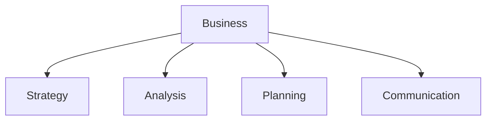

# Business

Business strategy, analysis, and planning templates.

## Templates

| Template                                             | Description                |
| ---------------------------------------------------- | -------------------------- |
| [pitch_deck.md](pitch_deck.md)                       | Investor presentations     |
| [business_model_canvas.md](business_model_canvas.md) | Business model design      |
| [swot_analysis.md](swot_analysis.md)                 | Strategic analysis         |
| [executive_summary.md](executive_summary.md)         | Executive briefings        |
| [meeting_agenda.md](meeting_agenda.md)               | Meeting planning           |
| [okr_template.md](okr_template.md)                   | Objectives and key results |

## Structure

See [Parent](../SKILL.md) for all categories.
