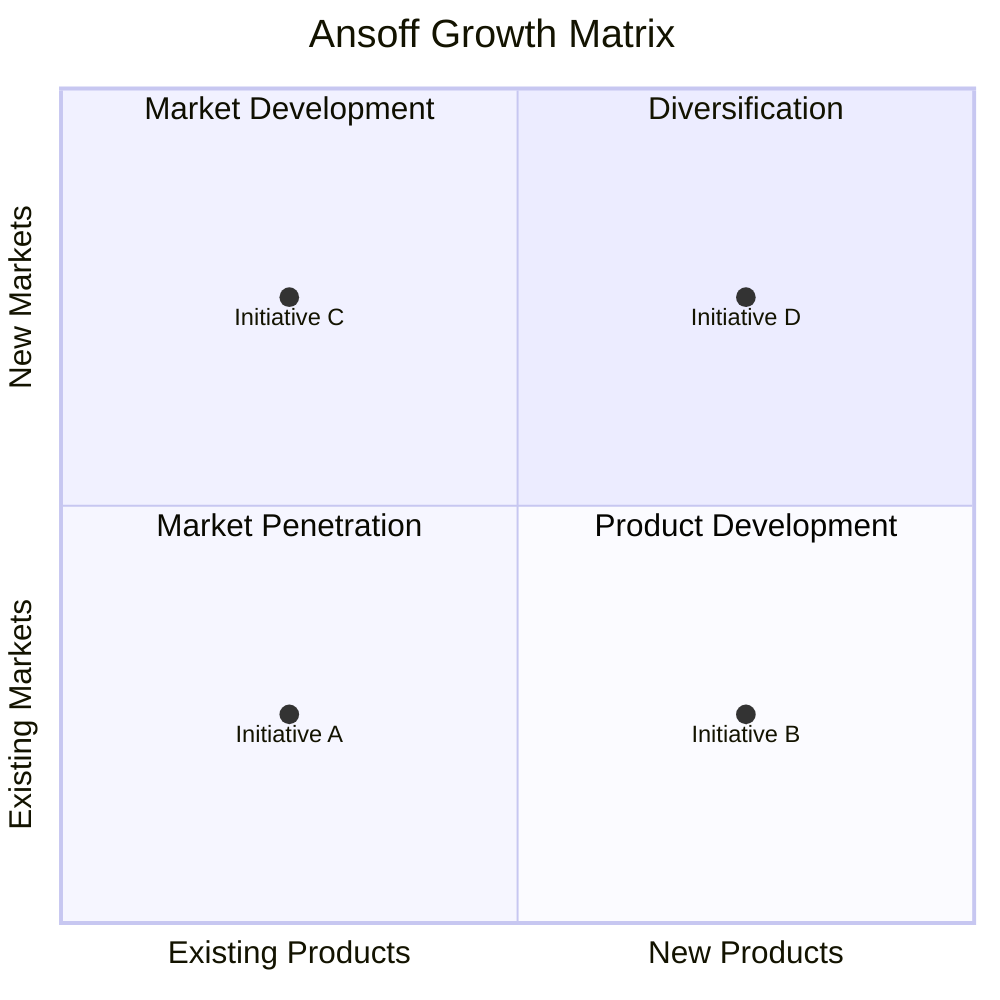
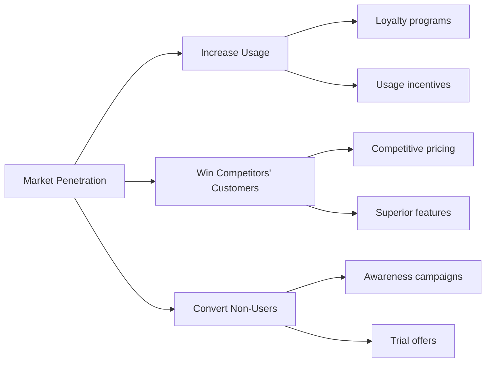
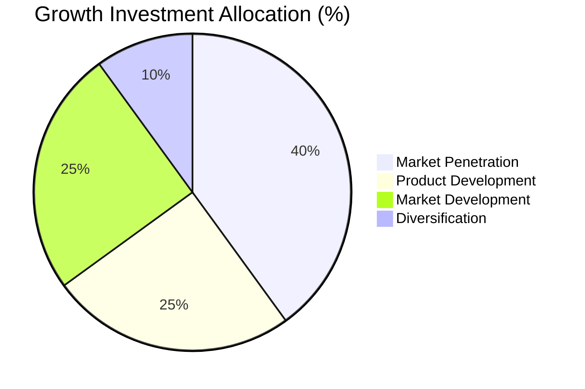

# Ansoff Growth Matrix

> **Framework**: Igor Ansoff's Product-Market Expansion Grid
> **Purpose**: Identify growth strategies based on product-market combinations

---

## Document Control

| Field              | Value                                |
| ------------------ | ------------------------------------ |
| **Document Title** | Ansoff Growth Matrix                 |
| **Organization**   | `[Organization Name]`                |
| **Business Unit**  | `[Business Unit or Product Line]`    |
| **Version**        | 1.0                                  |
| **Date**           | `YYYY-MM-DD`                         |
| **Author(s)**      | `[Name(s)]`                          |
| **Reviewed By**    | `[Name(s)]`                          |
| **Approved By**    | `[Name]`                             |
| **Classification** | `[Public / Internal / Confidential]` |

---

## Ansoff Matrix Overview

---

## Current Position

| Metric                                   | Value   |
| ---------------------------------------- | ------- |
| **Total Addressable Market (TAM)**       | `$[X]B` |
| **Serviceable Addressable Market (SAM)** | `$[X]M` |
| **Serviceable Obtainable Market (SOM)**  | `$[X]M` |
| **Current Revenue**                      | `$[X]M` |
| **Market Share**                         | `[X]%`  |
| **Year-over-Year Growth**                | `[X]%`  |
| **Target Growth Rate**                   | `[X]%`  |
| **Growth Gap**                           | `$[X]M` |

---

## Strategy 1: Market Penetration

> Grow with existing products in existing markets. **Risk Level**: Low

| Initiative       | Target Segment | Tactic     | Investment | Expected Revenue | ROI    | Timeline   |
| ---------------- | -------------- | ---------- | ---------- | ---------------- | ------ | ---------- |
| `[Initiative 1]` | `[Segment]`    | `[Tactic]` | `$[X]M`    | `$[X]M`          | `[X]%` | `[Months]` |
| `[Initiative 2]` | `[Segment]`    | `[Tactic]` | `$[X]M`    | `$[X]M`          | `[X]%` | `[Months]` |

**Key Metrics**:
| KPI | Current | Target | Timeline |
|---|---|---|---|
| Market Share | `[X]%` | `[X]%` | `[Date]` |
| Customer Retention Rate | `[X]%` | `[X]%` | `[Date]` |
| Average Revenue Per User | `$[X]` | `$[X]` | `[Date]` |
| Customer Acquisition Cost | `$[X]` | `$[X]` | `[Date]` |

---

## Strategy 2: Product Development

> Develop new products for existing markets. **Risk Level**: Medium

| Initiative       | Product / Feature | Target Market | Development Cost | Time-to-Market | Expected Revenue | Risk                |
| ---------------- | ----------------- | ------------- | ---------------- | -------------- | ---------------- | ------------------- |
| `[Initiative 1]` | `[Product]`       | `[Market]`    | `$[X]M`          | `[X] months`   | `$[X]M`          | High / Medium / Low |
| `[Initiative 2]` | `[Product]`       | `[Market]`    | `$[X]M`          | `[X] months`   | `$[X]M`          | `[Risk]`            |

**Product Development Pipeline**:

| Stage     | Product     | Status     | Gate Decision      | Next Milestone |
| --------- | ----------- | ---------- | ------------------ | -------------- |
| Concept   | `[Product]` | `[Status]` | Go / No-Go / Pivot | `[Milestone]`  |
| Prototype | `[Product]` | `[Status]` | `[Decision]`       | `[Milestone]`  |
| Testing   | `[Product]` | `[Status]` | `[Decision]`       | `[Milestone]`  |
| Launch    | `[Product]` | `[Status]` | `[Decision]`       | `[Milestone]`  |

**Key Metrics**:
| KPI | Target | Measurement |
|---|---|---|
| Time-to-Market | `[X] months` | From concept to launch |
| Adoption Rate (6 months) | `[X]%` | % of existing customers adopting |
| R&D Efficiency | `[X]:1` | Revenue per R&D dollar |
| Cannibalization Rate | `< [X]%` | Impact on existing products |

---

## Strategy 3: Market Development

> Enter new markets with existing products. **Risk Level**: Medium

| Initiative       | New Market              | Entry Mode                                 | Investment | Market Size | Expected Share | Timeline   |
| ---------------- | ----------------------- | ------------------------------------------ | ---------- | ----------- | -------------- | ---------- |
| `[Initiative 1]` | `[Geography / Segment]` | `[Direct / Partner / Franchise / Digital]` | `$[X]M`    | `$[X]M`     | `[X]%`         | `[Months]` |
| `[Initiative 2]` | `[Geography / Segment]` | `[Entry Mode]`                             | `$[X]M`    | `$[X]M`     | `[X]%`         | `[Months]` |

**Market Entry Assessment**:

| Criterion                  | Market A            | Market B  | Market C  |
| -------------------------- | ------------------- | --------- | --------- |
| Market Size                | `$[X]M`             | `$[X]M`   | `$[X]M`   |
| Growth Rate                | `[X]%`              | `[X]%`    | `[X]%`    |
| Competitive Intensity      | High / Medium / Low | `[Level]` | `[Level]` |
| Regulatory Barriers        | High / Medium / Low | `[Level]` | `[Level]` |
| Cultural Fit               | High / Medium / Low | `[Level]` | `[Level]` |
| Infrastructure Readiness   | High / Medium / Low | `[Level]` | `[Level]` |
| **Overall Attractiveness** | `[Score]`           | `[Score]` | `[Score]` |

---

## Strategy 4: Diversification

> New products in new markets. **Risk Level**: High

| Initiative       | Product     | Target Market | Type                | Investment | Expected Revenue | Synergies     |
| ---------------- | ----------- | ------------- | ------------------- | ---------- | ---------------- | ------------- |
| `[Initiative 1]` | `[Product]` | `[Market]`    | Related / Unrelated | `$[X]M`    | `$[X]M`          | `[Synergies]` |
| `[Initiative 2]` | `[Product]` | `[Market]`    | `[Type]`            | `$[X]M`    | `$[X]M`          | `[Synergies]` |

**Diversification Assessment**:

| Question                               | Answer   | Implications    |
| -------------------------------------- | -------- | --------------- |
| Is the new industry attractive?        | Yes / No | `[Implication]` |
| What is the cost of entry?             | `$[X]M`  | `[Implication]` |
| Will the new business be better off?   | Yes / No | `[Implication]` |
| Will the parent company be better off? | Yes / No | `[Implication]` |

---

## Growth Strategy Portfolio

| Strategy            | Investment       | Expected Revenue | Risk Level | Priority |
| ------------------- | ---------------- | ---------------- | ---------- | -------- |
| Market Penetration  | `$[X]M` (`[X]%`) | `$[X]M`          | Low        | `[1-4]`  |
| Product Development | `$[X]M` (`[X]%`) | `$[X]M`          | Medium     | `[1-4]`  |
| Market Development  | `$[X]M` (`[X]%`) | `$[X]M`          | Medium     | `[1-4]`  |
| Diversification     | `$[X]M` (`[X]%`) | `$[X]M`          | High       | `[1-4]`  |
| **Total**           | **`$[X]M`**      | **`$[X]M`**      |            |          |

---

## Implementation Roadmap

| Quarter | Milestone     | Strategy     | Owner     | Budget  | Success Criteria |
| ------- | ------------- | ------------ | --------- | ------- | ---------------- |
| Q1      | `[Milestone]` | `[Strategy]` | `[Owner]` | `$[X]M` | `[Criteria]`     |
| Q2      | `[Milestone]` | `[Strategy]` | `[Owner]` | `$[X]M` | `[Criteria]`     |
| Q3      | `[Milestone]` | `[Strategy]` | `[Owner]` | `$[X]M` | `[Criteria]`     |
| Q4      | `[Milestone]` | `[Strategy]` | `[Owner]` | `$[X]M` | `[Criteria]`     |

---

## Revision History

| Version | Date         | Author     | Changes       |
| ------- | ------------ | ---------- | ------------- |
| 1.0     | `YYYY-MM-DD` | `[Author]` | Initial draft |
