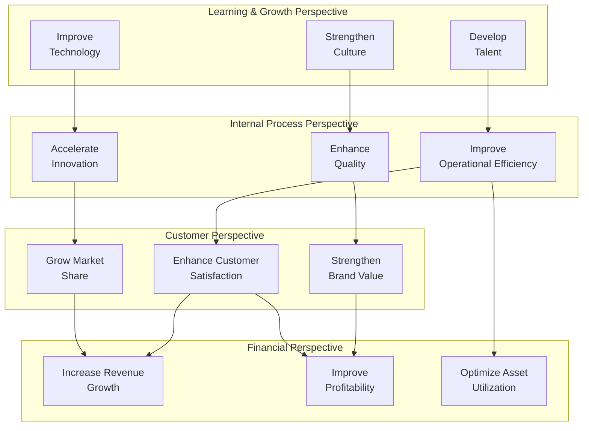

# Balanced Scorecard

> **Framework**: Kaplan & Norton Balanced Scorecard
> **Purpose**: Translate strategy into measurable objectives across four perspectives

---

## Document Control

| Field               | Value                                |
| ------------------- | ------------------------------------ |
| **Document Title**  | Balanced Scorecard                   |
| **Organization**    | `[Organization Name]`                |
| **Business Unit**   | `[Business Unit]`                    |
| **Strategy Period** | `[FY YYYY - FY YYYY]`                |
| **Version**         | 1.0                                  |
| **Date**            | `YYYY-MM-DD`                         |
| **Author(s)**       | `[Name(s)]`                          |
| **Reviewed By**     | `[Name(s)]`                          |
| **Approved By**     | `[Name]`                             |
| **Classification**  | `[Public / Internal / Confidential]` |

---

## Strategy Map

---

## Mission, Vision & Strategy

| Element         | Statement                                        |
| --------------- | ------------------------------------------------ |
| **Mission**     | `[Why the organization exists]`                  |
| **Vision**      | `[What the organization aspires to become]`      |
| **Strategy**    | `[How the organization will achieve its vision]` |
| **Core Values** | `[Guiding principles]`                           |

---

## Financial Perspective

> "To succeed financially, how should we appear to our shareholders?"

| Objective        | KPI     | Measure  | Baseline | Target | Actual | Status                         | Initiative     |
| ---------------- | ------- | -------- | -------- | ------ | ------ | ------------------------------ | -------------- |
| `[Objective F1]` | `[KPI]` | `[Unit]` | `[X]`    | `[X]`  | `[X]`  | On Track / At Risk / Off Track | `[Initiative]` |
| `[Objective F2]` | `[KPI]` | `[Unit]` | `[X]`    | `[X]`  | `[X]`  | `[Status]`                     | `[Initiative]` |
| `[Objective F3]` | `[KPI]` | `[Unit]` | `[X]`    | `[X]`  | `[X]`  | `[Status]`                     | `[Initiative]` |

**Strategic Themes**: Revenue Growth | Cost Optimization | Asset Utilization | Risk Management

**Financial Targets Summary**:
| Metric | Prior Year | Current Year Target | Growth |
|---|---|---|---|
| Revenue | `$[X]M` | `$[X]M` | `[X]%` |
| Operating Income | `$[X]M` | `$[X]M` | `[X]%` |
| EBITDA Margin | `[X]%` | `[X]%` | `[X]pp` |
| ROIC | `[X]%` | `[X]%` | `[X]pp` |
| Free Cash Flow | `$[X]M` | `$[X]M` | `[X]%` |

---

## Customer Perspective

> "To achieve our vision, how should we appear to our customers?"

| Objective        | KPI     | Measure  | Baseline | Target | Actual | Status                         | Initiative     |
| ---------------- | ------- | -------- | -------- | ------ | ------ | ------------------------------ | -------------- |
| `[Objective C1]` | `[KPI]` | `[Unit]` | `[X]`    | `[X]`  | `[X]`  | On Track / At Risk / Off Track | `[Initiative]` |
| `[Objective C2]` | `[KPI]` | `[Unit]` | `[X]`    | `[X]`  | `[X]`  | `[Status]`                     | `[Initiative]` |
| `[Objective C3]` | `[KPI]` | `[Unit]` | `[X]`    | `[X]`  | `[X]`  | `[Status]`                     | `[Initiative]` |

**Customer Value Proposition**: `[Operational Excellence / Customer Intimacy / Product Leadership]`

**Customer Metrics Dashboard**:
| Metric | Q1 | Q2 | Q3 | Q4 | Annual Target |
|---|---|---|---|---|---|
| Net Promoter Score | `[X]` | `[X]` | `[X]` | `[X]` | `[X]` |
| Customer Satisfaction | `[X]%` | `[X]%` | `[X]%` | `[X]%` | `[X]%` |
| Customer Retention | `[X]%` | `[X]%` | `[X]%` | `[X]%` | `[X]%` |
| Market Share | `[X]%` | `[X]%` | `[X]%` | `[X]%` | `[X]%` |
| Customer Lifetime Value | `$[X]` | `$[X]` | `$[X]` | `$[X]` | `$[X]` |

---

## Internal Process Perspective

> "To satisfy shareholders and customers, what business processes must we excel at?"

| Objective        | KPI     | Measure  | Baseline | Target | Actual | Status                         | Initiative     |
| ---------------- | ------- | -------- | -------- | ------ | ------ | ------------------------------ | -------------- |
| `[Objective I1]` | `[KPI]` | `[Unit]` | `[X]`    | `[X]`  | `[X]`  | On Track / At Risk / Off Track | `[Initiative]` |
| `[Objective I2]` | `[KPI]` | `[Unit]` | `[X]`    | `[X]`  | `[X]`  | `[Status]`                     | `[Initiative]` |
| `[Objective I3]` | `[KPI]` | `[Unit]` | `[X]`    | `[X]`  | `[X]`  | `[Status]`                     | `[Initiative]` |

**Process Categories**:

| Category              | Key Processes | Maturity (1-5) | Target Maturity |
| --------------------- | ------------- | -------------- | --------------- |
| Operations Management | `[Processes]` | `[X]`          | `[X]`           |
| Customer Management   | `[Processes]` | `[X]`          | `[X]`           |
| Innovation            | `[Processes]` | `[X]`          | `[X]`           |
| Regulatory & Social   | `[Processes]` | `[X]`          | `[X]`           |

---

## Learning & Growth Perspective

> "To achieve our vision, how will we sustain our ability to change and improve?"

| Objective        | KPI     | Measure  | Baseline | Target | Actual | Status                         | Initiative     |
| ---------------- | ------- | -------- | -------- | ------ | ------ | ------------------------------ | -------------- |
| `[Objective L1]` | `[KPI]` | `[Unit]` | `[X]`    | `[X]`  | `[X]`  | On Track / At Risk / Off Track | `[Initiative]` |
| `[Objective L2]` | `[KPI]` | `[Unit]` | `[X]`    | `[X]`  | `[X]`  | `[Status]`                     | `[Initiative]` |
| `[Objective L3]` | `[KPI]` | `[Unit]` | `[X]`    | `[X]`  | `[X]`  | `[Status]`                     | `[Initiative]` |

**Capital Categories**:

| Capital Type         | Current State  | Target State | Gap     | Investment |
| -------------------- | -------------- | ------------ | ------- | ---------- |
| Human Capital        | `[Assessment]` | `[Target]`   | `[Gap]` | `$[X]M`    |
| Information Capital  | `[Assessment]` | `[Target]`   | `[Gap]` | `$[X]M`    |
| Organization Capital | `[Assessment]` | `[Target]`   | `[Gap]` | `$[X]M`    |

---

## Scorecard Summary Dashboard

| Perspective       | Objectives | On Track  | At Risk   | Off Track | Overall Score |
| ----------------- | ---------- | --------- | --------- | --------- | ------------- |
| Financial         | `[X]`      | `[X]`     | `[X]`     | `[X]`     | `[X]%`        |
| Customer          | `[X]`      | `[X]`     | `[X]`     | `[X]`     | `[X]%`        |
| Internal Process  | `[X]`      | `[X]`     | `[X]`     | `[X]`     | `[X]%`        |
| Learning & Growth | `[X]`      | `[X]`     | `[X]`     | `[X]`     | `[X]%`        |
| **Total**         | **`[X]`**  | **`[X]`** | **`[X]`** | **`[X]`** | **`[X]%`**    |

---

## Strategic Initiatives Portfolio

| #   | Initiative     | Perspective(s) | Budget  | Timeline        | Owner     | Status     |
| --- | -------------- | -------------- | ------- | --------------- | --------- | ---------- |
| 1   | `[Initiative]` | `[F/C/I/L]`    | `$[X]M` | `[Start - End]` | `[Owner]` | `[Status]` |
| 2   | `[Initiative]` | `[F/C/I/L]`    | `$[X]M` | `[Start - End]` | `[Owner]` | `[Status]` |
| 3   | `[Initiative]` | `[F/C/I/L]`    | `$[X]M` | `[Start - End]` | `[Owner]` | `[Status]` |

---

## Review Cadence

| Review Type        | Frequency | Participants           | Focus                                   |
| ------------------ | --------- | ---------------------- | --------------------------------------- |
| Operational Review | Monthly   | Department Heads       | KPI performance, tactical adjustments   |
| Strategic Review   | Quarterly | Executive Team         | Strategy alignment, initiative progress |
| Annual Review      | Annually  | Board + Executive Team | Strategy refresh, target setting        |

---

## Revision History

| Version | Date         | Author     | Changes       |
| ------- | ------------ | ---------- | ------------- |
| 1.0     | `YYYY-MM-DD` | `[Author]` | Initial draft |
