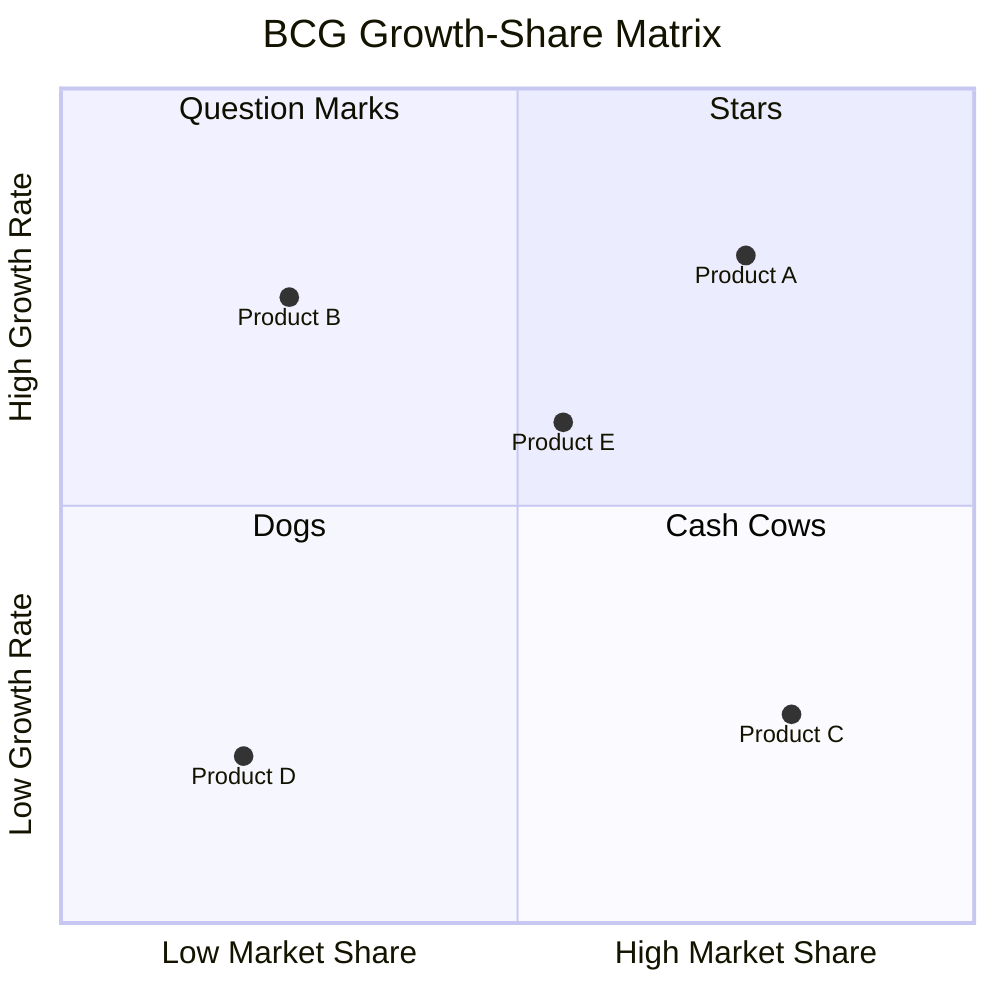
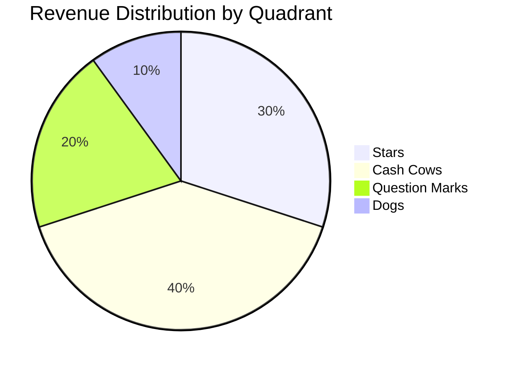
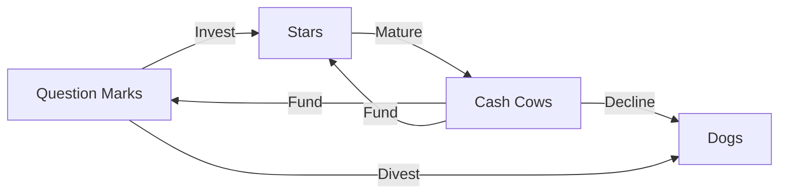

# BCG Growth-Share Matrix

> **Framework**: Boston Consulting Group Growth-Share Matrix
> **Purpose**: Portfolio analysis tool for resource allocation across business units or products

---

## Document Control

| Field               | Value                                       |
| ------------------- | ------------------------------------------- |
| **Document Title**  | BCG Growth-Share Matrix                     |
| **Organization**    | `[Organization Name]`                       |
| **Portfolio Scope** | `[Business units / Product lines / Brands]` |
| **Version**         | 1.0                                         |
| **Date**            | `YYYY-MM-DD`                                |
| **Author(s)**       | `[Name(s)]`                                 |
| **Reviewed By**     | `[Name(s)]`                                 |
| **Approved By**     | `[Name]`                                    |
| **Classification**  | `[Public / Internal / Confidential]`        |

---

## BCG Matrix Visualization

---

## Portfolio Data

| Product / BU  | Revenue ($M) | Market Growth Rate (%) | Relative Market Share | BCG Quadrant                          | Profit Margin (%) |
| ------------- | ------------ | ---------------------- | --------------------- | ------------------------------------- | ----------------- |
| `[Product A]` | `$[X]`       | `[X]%`                 | `[X]`                 | Star / Question Mark / Cash Cow / Dog | `[X]%`            |
| `[Product B]` | `$[X]`       | `[X]%`                 | `[X]`                 | `[Quadrant]`                          | `[X]%`            |
| `[Product C]` | `$[X]`       | `[X]%`                 | `[X]`                 | `[Quadrant]`                          | `[X]%`            |
| `[Product D]` | `$[X]`       | `[X]%`                 | `[X]`                 | `[Quadrant]`                          | `[X]%`            |
| `[Product E]` | `$[X]`       | `[X]%`                 | `[X]`                 | `[Quadrant]`                          | `[X]%`            |

> **Relative Market Share** = Company's market share / Largest competitor's market share
> **High Growth Threshold** = `[X]%` (typically 10% or industry average)
> **High Share Threshold** = `[X]` (typically 1.0 relative share)

---

## Quadrant Analysis

### Stars (High Growth, High Share)

> Invest to maintain market leadership; future cash cows.

| Product / BU | Revenue | Growth Rate | Market Share | Investment Required | Strategy                                |
| ------------ | ------- | ----------- | ------------ | ------------------- | --------------------------------------- |
| `[Product]`  | `$[X]M` | `[X]%`      | `[X]`        | `$[X]M`             | Invest aggressively / Maintain position |

**Cash Flow Profile**: `[Net consumer or net generator]`
**Key Actions**:

- `[Action 1]`
- `[Action 2]`

### Cash Cows (Low Growth, High Share)

> Harvest profits to fund stars and question marks.

| Product / BU | Revenue | Growth Rate | Market Share | Cash Generated | Strategy                      |
| ------------ | ------- | ----------- | ------------ | -------------- | ----------------------------- |
| `[Product]`  | `$[X]M` | `[X]%`      | `[X]`        | `$[X]M`        | Harvest / Maintain / Optimize |

**Cash Flow Profile**: `[Net generator]`
**Key Actions**:

- `[Action 1]`
- `[Action 2]`

### Question Marks (High Growth, Low Share)

> Invest selectively or divest; requires analysis to determine potential.

| Product / BU | Revenue | Growth Rate | Market Share | Investment Needed | Potential  | Decision        |
| ------------ | ------- | ----------- | ------------ | ----------------- | ---------- | --------------- |
| `[Product]`  | `$[X]M` | `[X]%`      | `[X]`        | `$[X]M`           | High / Low | Invest / Divest |

**Cash Flow Profile**: `[Net consumer]`
**Key Actions**:

- `[Action 1]`
- `[Action 2]`

### Dogs (Low Growth, Low Share)

> Divest, liquidate, or reposition.

| Product / BU | Revenue | Growth Rate | Market Share | Cash Flow | Strategy                                 |
| ------------ | ------- | ----------- | ------------ | --------- | ---------------------------------------- |
| `[Product]`  | `$[X]M` | `[X]%`      | `[X]`        | `$[X]M`   | Divest / Liquidate / Niche repositioning |

**Cash Flow Profile**: `[Neutral or net consumer]`
**Key Actions**:

- `[Action 1]`
- `[Action 2]`

---

## Portfolio Balance Assessment

| Metric                 | Stars  | Cash Cows | Question Marks | Dogs   | Total  |
| ---------------------- | ------ | --------- | -------------- | ------ | ------ |
| **Count**              | `[X]`  | `[X]`     | `[X]`          | `[X]`  | `[X]`  |
| **Revenue ($M)**       | `$[X]` | `$[X]`    | `$[X]`         | `$[X]` | `$[X]` |
| **Revenue Share (%)**  | `[X]%` | `[X]%`    | `[X]%`         | `[X]%` | 100%   |
| **Investment ($M)**    | `$[X]` | `$[X]`    | `$[X]`         | `$[X]` | `$[X]` |
| **Net Cash Flow ($M)** | `$[X]` | `$[X]`    | `$[X]`         | `$[X]` | `$[X]` |

**Portfolio Health**: `[Healthy / Needs Rebalancing / At Risk]`

**Assessment**: `[Commentary on balance between cash generation and investment needs]`

---

## Strategic Movement Plan

> Planned trajectory for each product/BU over the next 3-5 years.

| Product / BU | Current Quadrant | Target Quadrant | Timeline    | Key Milestones | Investment |
| ------------ | ---------------- | --------------- | ----------- | -------------- | ---------- |
| `[Product]`  | `[Current]`      | `[Target]`      | `[X] years` | `[Milestones]` | `$[X]M`    |
| `[Product]`  | `[Current]`      | `[Target]`      | `[X] years` | `[Milestones]` | `$[X]M`    |

---

## Resource Allocation Strategy

| Priority | Source of Funds         | Recipient             | Amount  | Rationale     |
| -------- | ----------------------- | --------------------- | ------- | ------------- |
| 1        | `[Cash Cow: Product X]` | `[Star: Product Y]`   | `$[X]M` | `[Rationale]` |
| 2        | `[Cash Cow: Product X]` | `[Q-Mark: Product Z]` | `$[X]M` | `[Rationale]` |
| 3        | `[Divest: Product W]`   | `[Star: Product Y]`   | `$[X]M` | `[Rationale]` |

---

## Monitoring KPIs

| KPI                   | Product/BU  | Current | Target | Review Frequency |
| --------------------- | ----------- | ------- | ------ | ---------------- |
| Market Growth Rate    | `[All]`     | `[X]%`  | N/A    | Quarterly        |
| Relative Market Share | `[Product]` | `[X]`   | `[X]`  | Quarterly        |
| Revenue Growth        | `[Product]` | `[X]%`  | `[X]%` | Monthly          |
| Cash Flow Margin      | `[Product]` | `[X]%`  | `[X]%` | Monthly          |
| ROI on Investment     | `[Product]` | `[X]%`  | `[X]%` | Quarterly        |

---

## Revision History

| Version | Date         | Author     | Changes       |
| ------- | ------------ | ---------- | ------------- |
| 1.0     | `YYYY-MM-DD` | `[Author]` | Initial draft |
