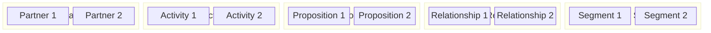
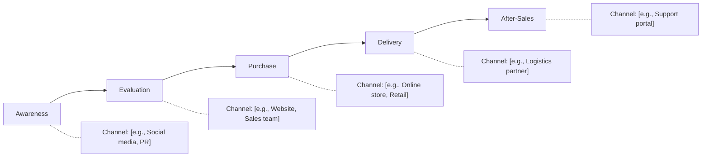
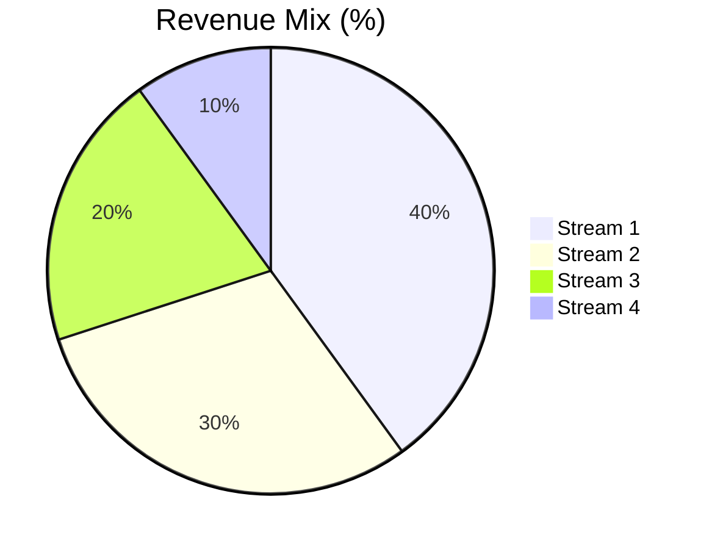

# Business Model Canvas

> **Framework**: Osterwalder & Pigneur Business Model Canvas
> **Purpose**: Map the nine building blocks of a business model on a single page

---

## Document Control

| Field                       | Value                                |
| --------------------------- | ------------------------------------ |
| **Document Title**          | Business Model Canvas                |
| **Organization**            | `[Organization Name]`                |
| **Business Unit / Product** | `[Unit or Product Name]`             |
| **Version**                 | 1.0                                  |
| **Date**                    | `YYYY-MM-DD`                         |
| **Author(s)**               | `[Name(s)]`                          |
| **Reviewed By**             | `[Name(s)]`                          |
| **Approved By**             | `[Name]`                             |
| **Classification**          | `[Public / Internal / Confidential]` |

---

## Business Model Overview

---

## 1. Customer Segments

> Define the different groups of people or organizations the enterprise aims to reach and serve.

| Segment       | Description     | Size (TAM) | Revenue Contribution | Priority            |
| ------------- | --------------- | ---------- | -------------------- | ------------------- |
| `[Segment 1]` | `[Description]` | `$[X]M`    | `[X]%`               | High / Medium / Low |
| `[Segment 2]` | `[Description]` | `$[X]M`    | `[X]%`               | High / Medium / Low |
| `[Segment 3]` | `[Description]` | `$[X]M`    | `[X]%`               | High / Medium / Low |

**Segmentation Criteria**: `[Mass market / Niche / Segmented / Diversified / Multi-sided platform]`

### Customer Personas

| Attribute           | Persona A | Persona B |
| ------------------- | --------- | --------- |
| **Name / Role**     |           |           |
| **Demographics**    |           |           |
| **Goals**           |           |           |
| **Pain Points**     |           |           |
| **Buying Behavior** |           |           |

---

## 2. Value Propositions

> Describe the bundle of products and services that create value for a specific customer segment.

| Value Element | Description     | Target Segment | Differentiation                    |
| ------------- | --------------- | -------------- | ---------------------------------- |
| `[Element 1]` | `[Description]` | `[Segment]`    | `[Unique / Parity / Table-stakes]` |
| `[Element 2]` | `[Description]` | `[Segment]`    | `[Unique / Parity / Table-stakes]` |

**Value Drivers**: `[Newness / Performance / Customization / Design / Brand / Price / Cost Reduction / Risk Reduction / Accessibility / Convenience]`

---

## 3. Channels

> Describe how the company communicates with and reaches its customer segments to deliver a value proposition.

| Phase       | Channel     | Type (Owned/Partner) | Cost per Acquisition | Effectiveness  |
| ----------- | ----------- | -------------------- | -------------------- | -------------- |
| Awareness   | `[Channel]` | `[Type]`             | `$[X]`               | `[Rating 1-5]` |
| Evaluation  | `[Channel]` | `[Type]`             | `$[X]`               | `[Rating 1-5]` |
| Purchase    | `[Channel]` | `[Type]`             | `$[X]`               | `[Rating 1-5]` |
| Delivery    | `[Channel]` | `[Type]`             | `$[X]`               | `[Rating 1-5]` |
| After-Sales | `[Channel]` | `[Type]`             | `$[X]`               | `[Rating 1-5]` |

---

## 4. Customer Relationships

> Describe the types of relationships a company establishes with specific customer segments.

| Segment       | Relationship Type | Acquisition Cost | Retention Rate | Lifetime Value |
| ------------- | ----------------- | ---------------- | -------------- | -------------- |
| `[Segment 1]` | `[Type]`          | `$[X]`           | `[X]%`         | `$[X]`         |
| `[Segment 2]` | `[Type]`          | `$[X]`           | `[X]%`         | `$[X]`         |

**Relationship Types**: `[Personal assistance / Dedicated / Self-service / Automated / Communities / Co-creation]`

---

## 5. Revenue Streams

> Represent the cash a company generates from each customer segment.

| Revenue Stream | Type     | Pricing Mechanism | Current Revenue | Growth Rate |
| -------------- | -------- | ----------------- | --------------- | ----------- |
| `[Stream 1]`   | `[Type]` | `[Mechanism]`     | `$[X]M`         | `[X]%`      |
| `[Stream 2]`   | `[Type]` | `[Mechanism]`     | `$[X]M`         | `[X]%`      |

**Revenue Types**: `[Asset sale / Usage fee / Subscription / Licensing / Brokerage / Advertising]`

**Pricing**: `[Fixed (list / feature / segment / volume) / Dynamic (negotiation / yield / auction / real-time)]`

### Revenue Composition

---

## 6. Key Resources

> Describe the most important assets required to make a business model work.

| Resource       | Type                                        | Owned/Leased | Strategic Importance              | Cost   |
| -------------- | ------------------------------------------- | ------------ | --------------------------------- | ------ |
| `[Resource 1]` | Physical / Intellectual / Human / Financial | `[Status]`   | Critical / Important / Supporting | `$[X]` |
| `[Resource 2]` | Physical / Intellectual / Human / Financial | `[Status]`   | Critical / Important / Supporting | `$[X]` |

---

## 7. Key Activities

> Describe the most important things a company must do to make its business model work.

| Activity       | Category                                | Frequency     | Owner     | KPI     |
| -------------- | --------------------------------------- | ------------- | --------- | ------- |
| `[Activity 1]` | Production / Problem-solving / Platform | `[Frequency]` | `[Owner]` | `[KPI]` |
| `[Activity 2]` | Production / Problem-solving / Platform | `[Frequency]` | `[Owner]` | `[KPI]` |

---

## 8. Key Partnerships

> Describe the network of suppliers and partners that make the business model work.

| Partner       | Partnership Type | Motivation     | Key Resources/Activities Provided | Risk Level          |
| ------------- | ---------------- | -------------- | --------------------------------- | ------------------- |
| `[Partner 1]` | `[Type]`         | `[Motivation]` | `[Resources]`                     | High / Medium / Low |
| `[Partner 2]` | `[Type]`         | `[Motivation]` | `[Resources]`                     | High / Medium / Low |

**Partnership Types**: `[Strategic alliance / Coopetition / Joint venture / Buyer-supplier]`

**Motivations**: `[Optimization & economy of scale / Reduction of risk / Acquisition of resources & activities]`

---

## 9. Cost Structure

> Describe all costs incurred to operate a business model.

| Cost Category | Type             | Amount  | % of Total | Trend                            |
| ------------- | ---------------- | ------- | ---------- | -------------------------------- |
| `[Cost 1]`    | Fixed / Variable | `$[X]M` | `[X]%`     | Increasing / Stable / Decreasing |
| `[Cost 2]`    | Fixed / Variable | `$[X]M` | `[X]%`     | Increasing / Stable / Decreasing |

**Cost Structure Type**: `[Cost-driven / Value-driven]`

**Characteristics**: `[Economies of scale / Economies of scope]`

### Unit Economics

| Metric                              | Value        |
| ----------------------------------- | ------------ |
| **Customer Acquisition Cost (CAC)** | `$[X]`       |
| **Lifetime Value (LTV)**            | `$[X]`       |
| **LTV:CAC Ratio**                   | `[X]:1`      |
| **Payback Period**                  | `[X] months` |
| **Gross Margin**                    | `[X]%`       |
| **Contribution Margin**             | `[X]%`       |

---

## Business Model KPIs

| KPI                             | Current | Target | Status                         |
| ------------------------------- | ------- | ------ | ------------------------------ |
| Monthly Recurring Revenue (MRR) | `$[X]`  | `$[X]` | On Track / At Risk / Off Track |
| Customer Acquisition Cost       | `$[X]`  | `$[X]` | On Track / At Risk / Off Track |
| Customer Lifetime Value         | `$[X]`  | `$[X]` | On Track / At Risk / Off Track |
| Churn Rate                      | `[X]%`  | `[X]%` | On Track / At Risk / Off Track |
| Net Promoter Score              | `[X]`   | `[X]`  | On Track / At Risk / Off Track |
| Gross Margin                    | `[X]%`  | `[X]%` | On Track / At Risk / Off Track |

---

## Business Model Risks & Assumptions

| #   | Assumption     | Risk if Wrong | Validation Method | Status                            |
| --- | -------------- | ------------- | ----------------- | --------------------------------- |
| 1   | `[Assumption]` | `[Impact]`    | `[Method]`        | Validated / Testing / Unvalidated |
| 2   | `[Assumption]` | `[Impact]`    | `[Method]`        | Validated / Testing / Unvalidated |

---

## Revision History

| Version | Date         | Author     | Changes       |
| ------- | ------------ | ---------- | ------------- |
| 1.0     | `YYYY-MM-DD` | `[Author]` | Initial draft |
