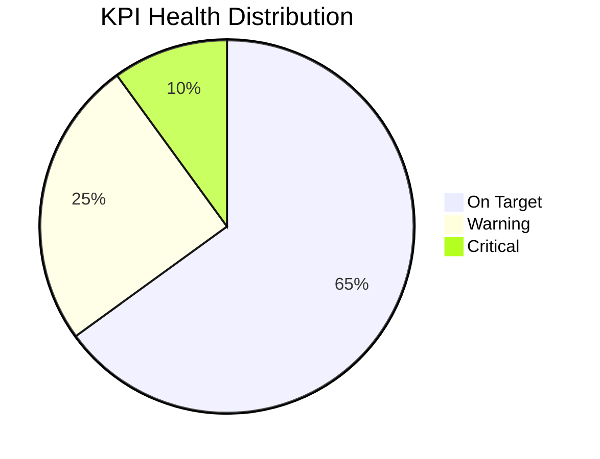

# KPI Dashboard

> **Framework**: Key Performance Indicator tracking and visualization
> **Purpose**: Monitor organizational performance through measurable metrics with clear targets and trends

---

## Document Control

| Field                     | Value                                |
| ------------------------- | ------------------------------------ |
| **Document Title**        | KPI Dashboard                        |
| **Organization**          | `[Organization Name]`                |
| **Department / Function** | `[Department Name]`                  |
| **Reporting Period**      | `[Month / Quarter / Year]`           |
| **Version**               | 1.0                                  |
| **Date**                  | `YYYY-MM-DD`                         |
| **Author(s)**             | `[Name(s)]`                          |
| **Reviewed By**           | `[Name(s)]`                          |
| **Approved By**           | `[Name]`                             |
| **Classification**        | `[Public / Internal / Confidential]` |

---

## Executive Summary

| Category   | KPIs Tracked | On Target | Warning   | Critical  | Overall Health       |
| ---------- | ------------ | --------- | --------- | --------- | -------------------- |
| Financial  | `[X]`        | `[X]`     | `[X]`     | `[X]`     | Green / Yellow / Red |
| Customer   | `[X]`        | `[X]`     | `[X]`     | `[X]`     | Green / Yellow / Red |
| Operations | `[X]`        | `[X]`     | `[X]`     | `[X]`     | Green / Yellow / Red |
| People     | `[X]`        | `[X]`     | `[X]`     | `[X]`     | Green / Yellow / Red |
| **Total**  | **`[X]`**    | **`[X]`** | **`[X]`** | **`[X]`** | **`[Status]`**       |

---

## Financial KPIs

| #   | KPI                      | Owner     | Unit   | Period     | Target | Actual | Variance   | Trend            | Status                         |
| --- | ------------------------ | --------- | ------ | ---------- | ------ | ------ | ---------- | ---------------- | ------------------------------ |
| F1  | Revenue                  | `[Owner]` | `$M`   | `[Period]` | `[X]`  | `[X]`  | `[+/-X%]`  | Up / Flat / Down | On Target / Warning / Critical |
| F2  | Gross Profit Margin      | `[Owner]` | `%`    | `[Period]` | `[X]`  | `[X]`  | `[+/-Xpp]` | `[Trend]`        | `[Status]`                     |
| F3  | Operating Expense Ratio  | `[Owner]` | `%`    | `[Period]` | `[X]`  | `[X]`  | `[+/-Xpp]` | `[Trend]`        | `[Status]`                     |
| F4  | EBITDA                   | `[Owner]` | `$M`   | `[Period]` | `[X]`  | `[X]`  | `[+/-X%]`  | `[Trend]`        | `[Status]`                     |
| F5  | Cash Flow (Operating)    | `[Owner]` | `$M`   | `[Period]` | `[X]`  | `[X]`  | `[+/-X%]`  | `[Trend]`        | `[Status]`                     |
| F6  | Accounts Receivable Days | `[Owner]` | `Days` | `[Period]` | `[X]`  | `[X]`  | `[+/-X]`   | `[Trend]`        | `[Status]`                     |
| F7  | Revenue per Employee     | `[Owner]` | `$K`   | `[Period]` | `[X]`  | `[X]`  | `[+/-X%]`  | `[Trend]`        | `[Status]`                     |

### Financial Trend

| Metric       | Month 1 | Month 2 | Month 3 | QTD     | YTD     |
| ------------ | ------- | ------- | ------- | ------- | ------- |
| Revenue      | `$[X]M` | `$[X]M` | `$[X]M` | `$[X]M` | `$[X]M` |
| Gross Margin | `[X]%`  | `[X]%`  | `[X]%`  | `[X]%`  | `[X]%`  |
| EBITDA       | `$[X]M` | `$[X]M` | `$[X]M` | `$[X]M` | `$[X]M` |

---

## Customer KPIs

| #   | KPI                          | Owner     | Unit    | Period     | Target | Actual | Variance   | Trend     | Status     |
| --- | ---------------------------- | --------- | ------- | ---------- | ------ | ------ | ---------- | --------- | ---------- |
| C1  | Net Promoter Score (NPS)     | `[Owner]` | `Score` | `[Period]` | `[X]`  | `[X]`  | `[+/-X]`   | `[Trend]` | `[Status]` |
| C2  | Customer Satisfaction (CSAT) | `[Owner]` | `%`     | `[Period]` | `[X]`  | `[X]`  | `[+/-Xpp]` | `[Trend]` | `[Status]` |
| C3  | Customer Retention Rate      | `[Owner]` | `%`     | `[Period]` | `[X]`  | `[X]`  | `[+/-Xpp]` | `[Trend]` | `[Status]` |
| C4  | Customer Acquisition Cost    | `[Owner]` | `$`     | `[Period]` | `[X]`  | `[X]`  | `[+/-X%]`  | `[Trend]` | `[Status]` |
| C5  | Customer Lifetime Value      | `[Owner]` | `$`     | `[Period]` | `[X]`  | `[X]`  | `[+/-X%]`  | `[Trend]` | `[Status]` |
| C6  | Churn Rate                   | `[Owner]` | `%`     | `[Period]` | `[X]`  | `[X]`  | `[+/-Xpp]` | `[Trend]` | `[Status]` |
| C7  | First Response Time          | `[Owner]` | `Hours` | `[Period]` | `[X]`  | `[X]`  | `[+/-X%]`  | `[Trend]` | `[Status]` |

---

## Operational KPIs

| #   | KPI                   | Owner     | Unit         | Period     | Target | Actual | Variance   | Trend     | Status     |
| --- | --------------------- | --------- | ------------ | ---------- | ------ | ------ | ---------- | --------- | ---------- |
| O1  | On-Time Delivery Rate | `[Owner]` | `%`          | `[Period]` | `[X]`  | `[X]`  | `[+/-Xpp]` | `[Trend]` | `[Status]` |
| O2  | Process Cycle Time    | `[Owner]` | `Hours/Days` | `[Period]` | `[X]`  | `[X]`  | `[+/-X%]`  | `[Trend]` | `[Status]` |
| O3  | Defect Rate           | `[Owner]` | `%`          | `[Period]` | `[X]`  | `[X]`  | `[+/-Xpp]` | `[Trend]` | `[Status]` |
| O4  | Capacity Utilization  | `[Owner]` | `%`          | `[Period]` | `[X]`  | `[X]`  | `[+/-Xpp]` | `[Trend]` | `[Status]` |
| O5  | System Uptime         | `[Owner]` | `%`          | `[Period]` | `[X]`  | `[X]`  | `[+/-Xpp]` | `[Trend]` | `[Status]` |
| O6  | Inventory Turnover    | `[Owner]` | `Ratio`      | `[Period]` | `[X]`  | `[X]`  | `[+/-X]`   | `[Trend]` | `[Status]` |

---

## People / HR KPIs

| #   | KPI                           | Owner     | Unit    | Period     | Target | Actual | Variance   | Trend     | Status     |
| --- | ----------------------------- | --------- | ------- | ---------- | ------ | ------ | ---------- | --------- | ---------- |
| P1  | Employee Engagement Score     | `[Owner]` | `Score` | `[Period]` | `[X]`  | `[X]`  | `[+/-X]`   | `[Trend]` | `[Status]` |
| P2  | Voluntary Turnover Rate       | `[Owner]` | `%`     | `[Period]` | `[X]`  | `[X]`  | `[+/-Xpp]` | `[Trend]` | `[Status]` |
| P3  | Time-to-Fill (Open Positions) | `[Owner]` | `Days`  | `[Period]` | `[X]`  | `[X]`  | `[+/-X]`   | `[Trend]` | `[Status]` |
| P4  | Training Hours per Employee   | `[Owner]` | `Hours` | `[Period]` | `[X]`  | `[X]`  | `[+/-X]`   | `[Trend]` | `[Status]` |
| P5  | eNPS (Employee NPS)           | `[Owner]` | `Score` | `[Period]` | `[X]`  | `[X]`  | `[+/-X]`   | `[Trend]` | `[Status]` |
| P6  | Absenteeism Rate              | `[Owner]` | `%`     | `[Period]` | `[X]`  | `[X]`  | `[+/-Xpp]` | `[Trend]` | `[Status]` |

---

## KPI Threshold Definitions

| Status        | Symbol | Threshold Rule                 | Action Required                             |
| ------------- | ------ | ------------------------------ | ------------------------------------------- |
| **On Target** | Green  | Within `[X]%` of target        | Continue current approach                   |
| **Warning**   | Yellow | `[X-Y]%` deviation from target | Investigate root cause, develop action plan |
| **Critical**  | Red    | `> [Y]%` deviation from target | Immediate escalation and corrective action  |

---

## Trend Analysis & Commentary

### Top Performers (Above Target)

| KPI     | Performance          | Key Driver | Sustainability         |
| ------- | -------------------- | ---------- | ---------------------- |
| `[KPI]` | `[+X%]` above target | `[Driver]` | Sustainable / One-time |

### Areas of Concern (Below Target)

| KPI     | Performance          | Root Cause | Corrective Action | Owner     | Due Date     |
| ------- | -------------------- | ---------- | ----------------- | --------- | ------------ |
| `[KPI]` | `[-X%]` below target | `[Cause]`  | `[Action]`        | `[Owner]` | `YYYY-MM-DD` |

---

## Data Sources & Refresh Schedule

| KPI Category | Data Source     | Refresh Frequency        | Last Updated | Data Owner |
| ------------ | --------------- | ------------------------ | ------------ | ---------- |
| Financial    | `[System/Tool]` | Daily / Weekly / Monthly | `YYYY-MM-DD` | `[Owner]`  |
| Customer     | `[System/Tool]` | `[Frequency]`            | `YYYY-MM-DD` | `[Owner]`  |
| Operations   | `[System/Tool]` | `[Frequency]`            | `YYYY-MM-DD` | `[Owner]`  |
| People       | `[System/Tool]` | `[Frequency]`            | `YYYY-MM-DD` | `[Owner]`  |

---

## Review Cadence

| Review              | Frequency | Audience           | Focus                             |
| ------------------- | --------- | ------------------ | --------------------------------- |
| Flash Report        | Daily     | Operations team    | Real-time operational KPIs        |
| Management Review   | Weekly    | Department heads   | All category KPIs, trend analysis |
| Executive Dashboard | Monthly   | C-Suite            | Strategic KPIs, commentary        |
| Board Report        | Quarterly | Board of Directors | Financial + strategic KPIs        |

---

## Revision History

| Version | Date         | Author     | Changes       |
| ------- | ------------ | ---------- | ------------- |
| 1.0     | `YYYY-MM-DD` | `[Author]` | Initial draft |
