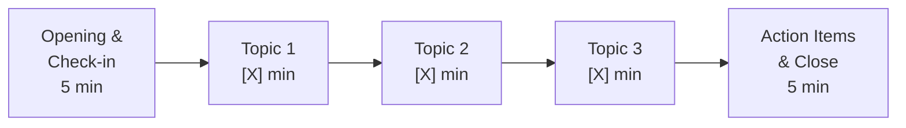

# Meeting Agenda

> **Purpose**: Structured meeting planning to ensure productive, time-efficient discussions with clear outcomes

---

## Document Control

| Field                 | Value                                                                     |
| --------------------- | ------------------------------------------------------------------------- |
| **Meeting Title**     | `[Meeting Title]`                                                         |
| **Meeting Type**      | `[Status Update / Decision / Brainstorm / Planning / Review / All-Hands]` |
| **Date**              | `YYYY-MM-DD`                                                              |
| **Time**              | `HH:MM - HH:MM [Timezone]`                                                |
| **Duration**          | `[X] minutes`                                                             |
| **Location**          | `[Room / Video Link]`                                                     |
| **Facilitator**       | `[Name]`                                                                  |
| **Note-taker**        | `[Name]`                                                                  |
| **Version**           | 1.0                                                                       |
| **Distribution Date** | `YYYY-MM-DD`                                                              |

---

## Attendees

| Name     | Role             | Required / Optional | Confirmed            |
| -------- | ---------------- | ------------------- | -------------------- |
| `[Name]` | `[Role / Title]` | Required            | Yes / No / Tentative |
| `[Name]` | `[Role / Title]` | Required            | Yes / No / Tentative |
| `[Name]` | `[Role / Title]` | Optional            | Yes / No / Tentative |
| `[Name]` | `[Role / Title]` | Optional            | Yes / No / Tentative |

**Quorum Required**: Yes / No | **Minimum**: `[X]` attendees

---

## Meeting Objective

> `[Clear, specific statement of what this meeting aims to achieve]`

**Success Criteria**: `[How we know the meeting was successful]`

---

## Pre-Meeting Preparation

| #   | Action Item           | Owner          | Due Before Meeting | Status         |
| --- | --------------------- | -------------- | ------------------ | -------------- |
| 1   | `[Read document X]`   | `[All / Name]` | `YYYY-MM-DD`       | Done / Pending |
| 2   | `[Prepare data on Y]` | `[Name]`       | `YYYY-MM-DD`       | Done / Pending |
| 3   | `[Review proposal Z]` | `[All / Name]` | `YYYY-MM-DD`       | Done / Pending |

---

## Agenda

| #   | Time    | Duration  | Topic                            | Type                      | Presenter       | Materials    |
| --- | ------- | --------- | -------------------------------- | ------------------------- | --------------- | ------------ |
| 1   | `HH:MM` | 5 min     | Opening & check-in               | Inform                    | `[Facilitator]` | --           |
| 2   | `HH:MM` | `[X]` min | `[Topic 1]`                      | Inform / Discuss / Decide | `[Name]`        | `[Link/Doc]` |
| 3   | `HH:MM` | `[X]` min | `[Topic 2]`                      | Inform / Discuss / Decide | `[Name]`        | `[Link/Doc]` |
| 4   | `HH:MM` | `[X]` min | `[Topic 3]`                      | Inform / Discuss / Decide | `[Name]`        | `[Link/Doc]` |
| 5   | `HH:MM` | `[X]` min | Open discussion / Q&A            | Discuss                   | `[All]`         | --           |
| 6   | `HH:MM` | 5 min     | Action items, next steps & close | Decide                    | `[Facilitator]` | --           |

**Total Duration**: `[X]` minutes

---

## Topic Details

### Topic 1: `[Topic Title]`

**Objective**: `[What should be accomplished for this topic]`
**Type**: Inform / Discuss / Decide
**Background**: `[Brief context]`
**Key Questions**:

1. `[Question 1]`
2. `[Question 2]`

**Decision Required**: Yes / No
**Decision Framework**: `[Consensus / Majority / Owner decides after input]`

---

### Topic 2: `[Topic Title]`

**Objective**: `[What should be accomplished for this topic]`
**Type**: Inform / Discuss / Decide
**Background**: `[Brief context]`
**Key Questions**:

1. `[Question 1]`
2. `[Question 2]`

---

### Topic 3: `[Topic Title]`

**Objective**: `[What should be accomplished for this topic]`
**Type**: Inform / Discuss / Decide
**Background**: `[Brief context]`
**Key Questions**:

1. `[Question 1]`
2. `[Question 2]`

---

## Parking Lot

> Topics raised but deferred to keep the meeting focused.

| #   | Topic     | Raised By | Deferred To                                |
| --- | --------- | --------- | ------------------------------------------ |
| 1   | `[Topic]` | `[Name]`  | `[Next meeting / Offline / Specific date]` |

---

## Meeting Ground Rules

- Start and end on time
- One speaker at a time
- Stay on topic (use parking lot for tangents)
- Phones on silent, cameras on (virtual)
- Decisions documented in real time
- `[Additional rule]`

---

## Post-Meeting

- [ ] Minutes distributed within `[X]` hours
- [ ] Action items assigned with due dates
- [ ] Next meeting scheduled: `YYYY-MM-DD`
- [ ] Follow-up materials shared

---

## Revision History

| Version | Date         | Author     | Changes       |
| ------- | ------------ | ---------- | ------------- |
| 1.0     | `YYYY-MM-DD` | `[Author]` | Initial draft |
