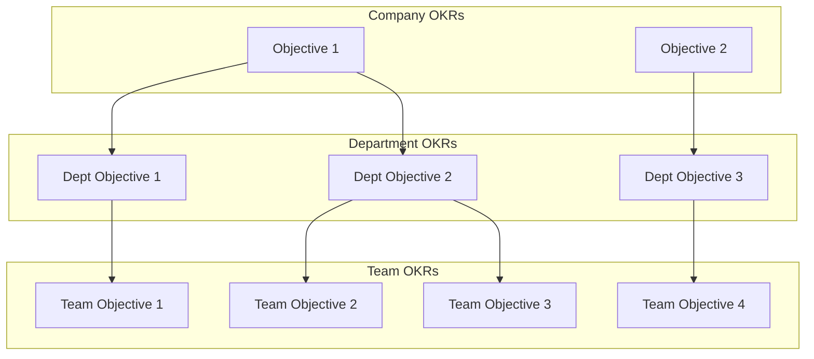
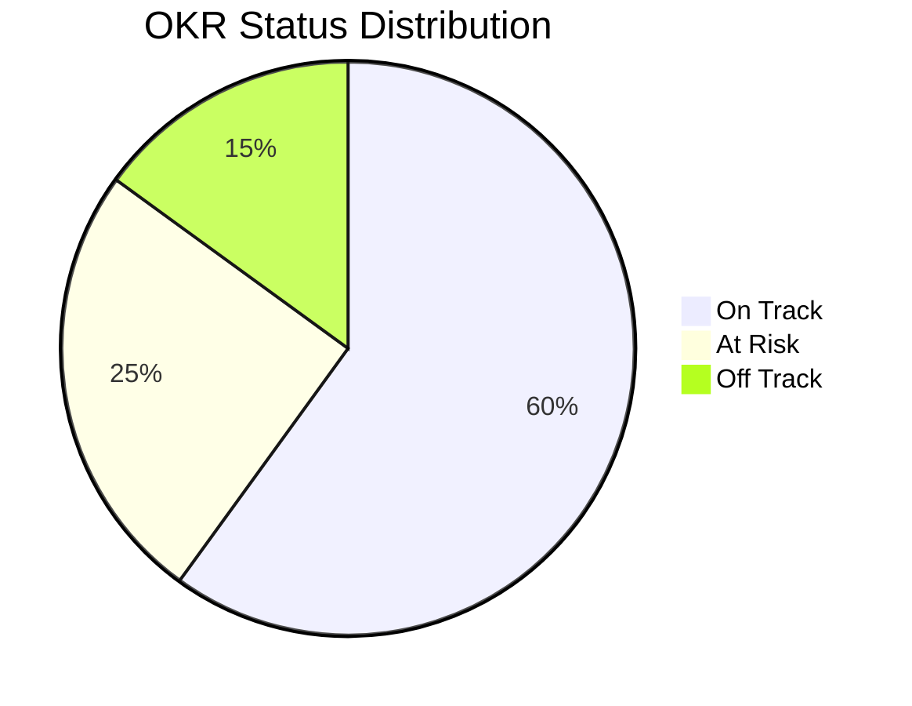

# OKR Template

> **Framework**: Objectives and Key Results
> **Purpose**: Align organizational goals with measurable outcomes across teams

---

## Document Control

| Field              | Value                                        |
| ------------------ | -------------------------------------------- |
| **Document Title** | Objectives and Key Results (OKRs)            |
| **Organization**   | `[Organization Name]`                        |
| **Period**         | `[Q1/Q2/Q3/Q4 FY YYYY]`                      |
| **Level**          | `[Company / Department / Team / Individual]` |
| **Version**        | 1.0                                          |
| **Date**           | `YYYY-MM-DD`                                 |
| **Author(s)**      | `[Name(s)]`                                  |
| **Reviewed By**    | `[Name(s)]`                                  |
| **Approved By**    | `[Name]`                                     |
| **Classification** | `[Public / Internal / Confidential]`         |

---

## OKR Alignment Cascade

---

## Company-Level OKRs

### Objective 1: `[Inspiring, qualitative goal]`

**Owner**: `[Executive Name]` | **Confidence**: `[X/10]` | **Status**: On Track / At Risk / Off Track

| #      | Key Result             | Metric   | Start | Target | Current | Progress | Status                         |
| ------ | ---------------------- | -------- | ----- | ------ | ------- | -------- | ------------------------------ |
| KR 1.1 | `[Measurable outcome]` | `[Unit]` | `[X]` | `[X]`  | `[X]`   | `[X]%`   | On Track / At Risk / Off Track |
| KR 1.2 | `[Measurable outcome]` | `[Unit]` | `[X]` | `[X]`  | `[X]`   | `[X]%`   | `[Status]`                     |
| KR 1.3 | `[Measurable outcome]` | `[Unit]` | `[X]` | `[X]`  | `[X]`   | `[X]%`   | `[Status]`                     |

**Initiatives**:
| Initiative | Owner | Due Date | Dependencies | Status |
|---|---|---|---|---|
| `[Initiative]` | `[Owner]` | `YYYY-MM-DD` | `[Dependencies]` | Not Started / In Progress / Complete |
| `[Initiative]` | `[Owner]` | `YYYY-MM-DD` | `[Dependencies]` | `[Status]` |

---

### Objective 2: `[Inspiring, qualitative goal]`

**Owner**: `[Executive Name]` | **Confidence**: `[X/10]` | **Status**: On Track / At Risk / Off Track

| #      | Key Result             | Metric   | Start | Target | Current | Progress | Status     |
| ------ | ---------------------- | -------- | ----- | ------ | ------- | -------- | ---------- |
| KR 2.1 | `[Measurable outcome]` | `[Unit]` | `[X]` | `[X]`  | `[X]`   | `[X]%`   | `[Status]` |
| KR 2.2 | `[Measurable outcome]` | `[Unit]` | `[X]` | `[X]`  | `[X]`   | `[X]%`   | `[Status]` |
| KR 2.3 | `[Measurable outcome]` | `[Unit]` | `[X]` | `[X]`  | `[X]`   | `[X]%`   | `[Status]` |

---

### Objective 3: `[Inspiring, qualitative goal]`

**Owner**: `[Executive Name]` | **Confidence**: `[X/10]` | **Status**: On Track / At Risk / Off Track

| #      | Key Result             | Metric   | Start | Target | Current | Progress | Status     |
| ------ | ---------------------- | -------- | ----- | ------ | ------- | -------- | ---------- |
| KR 3.1 | `[Measurable outcome]` | `[Unit]` | `[X]` | `[X]`  | `[X]`   | `[X]%`   | `[Status]` |
| KR 3.2 | `[Measurable outcome]` | `[Unit]` | `[X]` | `[X]`  | `[X]`   | `[X]%`   | `[Status]` |
| KR 3.3 | `[Measurable outcome]` | `[Unit]` | `[X]` | `[X]`  | `[X]`   | `[X]%`   | `[Status]` |

---

## Department-Level OKRs

### Department: `[Department Name]`

**Department Head**: `[Name]` | **Aligned to Company Objective(s)**: `[#]`

#### Objective D1: `[Department objective]`

| #       | Key Result             | Metric   | Start | Target | Current | Progress | Status     |
| ------- | ---------------------- | -------- | ----- | ------ | ------- | -------- | ---------- |
| KR D1.1 | `[Measurable outcome]` | `[Unit]` | `[X]` | `[X]`  | `[X]`   | `[X]%`   | `[Status]` |
| KR D1.2 | `[Measurable outcome]` | `[Unit]` | `[X]` | `[X]`  | `[X]`   | `[X]%`   | `[Status]` |
| KR D1.3 | `[Measurable outcome]` | `[Unit]` | `[X]` | `[X]`  | `[X]`   | `[X]%`   | `[Status]` |

---

## Team-Level OKRs

### Team: `[Team Name]`

**Team Lead**: `[Name]` | **Aligned to Department Objective(s)**: `[#]`

#### Objective T1: `[Team objective]`

| #       | Key Result             | Metric   | Start | Target | Current | Progress | Status     |
| ------- | ---------------------- | -------- | ----- | ------ | ------- | -------- | ---------- |
| KR T1.1 | `[Measurable outcome]` | `[Unit]` | `[X]` | `[X]`  | `[X]`   | `[X]%`   | `[Status]` |
| KR T1.2 | `[Measurable outcome]` | `[Unit]` | `[X]` | `[X]`  | `[X]`   | `[X]%`   | `[Status]` |
| KR T1.3 | `[Measurable outcome]` | `[Unit]` | `[X]` | `[X]`  | `[X]`   | `[X]%`   | `[Status]` |

---

## OKR Scoring Guide

| Score         | Meaning                                | Color  |
| ------------- | -------------------------------------- | ------ |
| **0.0 - 0.3** | Failed to make real progress           | Red    |
| **0.4 - 0.6** | Made progress but fell short           | Yellow |
| **0.7 - 1.0** | Delivered (0.7 = ideal stretch target) | Green  |
| **> 1.0**     | Target was not ambitious enough        | Blue   |

---

## OKR Health Dashboard

| Level      | Total KRs | On Track  | At Risk   | Off Track | Avg Score |
| ---------- | --------- | --------- | --------- | --------- | --------- |
| Company    | `[X]`     | `[X]`     | `[X]`     | `[X]`     | `[X]`     |
| Department | `[X]`     | `[X]`     | `[X]`     | `[X]`     | `[X]`     |
| Team       | `[X]`     | `[X]`     | `[X]`     | `[X]`     | `[X]`     |
| **Total**  | **`[X]`** | **`[X]`** | **`[X]`** | **`[X]`** | **`[X]`** |

---

## Check-in Cadence

| Frequency | Activity                    | Participants       | Duration |
| --------- | --------------------------- | ------------------ | -------- |
| Weekly    | KR progress update          | Team members       | 15 min   |
| Bi-weekly | OKR check-in meeting        | Team + Manager     | 30 min   |
| Monthly   | Department OKR review       | Dept leaders       | 60 min   |
| Quarterly | OKR scoring & retrospective | All stakeholders   | 2 hours  |
| Quarterly | OKR planning (next quarter) | Leadership + Teams | Half-day |

---

## OKR Quality Checklist

| Criterion                   | Objective | Key Result |
| --------------------------- | --------- | ---------- |
| Inspiring and memorable?    | Yes / No  | N/A        |
| Qualitative (not a metric)? | Yes / No  | N/A        |
| Time-bound?                 | Yes / No  | Yes / No   |
| Measurable with a number?   | N/A       | Yes / No   |
| Ambitious (70% achievable)? | Yes / No  | Yes / No   |
| Outcome (not output/task)?  | N/A       | Yes / No   |
| 3-5 KRs per objective?      | N/A       | Yes / No   |
| Aligned to parent OKR?      | Yes / No  | Yes / No   |

---

## Retrospective Notes

### What Went Well

- `[Item 1]`
- `[Item 2]`

### What Could Be Improved

- `[Item 1]`
- `[Item 2]`

### Learnings for Next Quarter

- `[Learning 1]`
- `[Learning 2]`

---

## Revision History

| Version | Date         | Author     | Changes       |
| ------- | ------------ | ---------- | ------------- |
| 1.0     | `YYYY-MM-DD` | `[Author]` | Initial draft |
