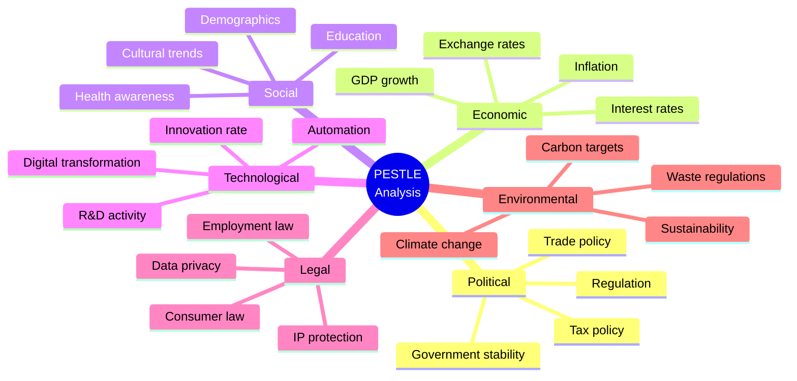

# PESTLE Analysis

> **Framework**: Political, Economic, Social, Technological, Legal, Environmental
> **Purpose**: Systematically analyze macro-environmental factors affecting the organization

---

## Document Control

| Field              | Value                                      |
| ------------------ | ------------------------------------------ |
| **Document Title** | PESTLE Analysis                            |
| **Organization**   | `[Organization Name]`                      |
| **Subject**        | `[Market / Region / Product / Initiative]` |
| **Version**        | 1.0                                        |
| **Date**           | `YYYY-MM-DD`                               |
| **Author(s)**      | `[Name(s)]`                                |
| **Reviewed By**    | `[Name(s)]`                                |
| **Approved By**    | `[Name]`                                   |
| **Classification** | `[Public / Internal / Confidential]`       |

---

## PESTLE Overview

---

## Political Factors

| #   | Factor     | Description     | Impact (1-5) | Probability         | Time Horizon          | Implication for Organization |
| --- | ---------- | --------------- | ------------ | ------------------- | --------------------- | ---------------------------- |
| P1  | `[Factor]` | `[Description]` | `[X]`        | High / Medium / Low | Short / Medium / Long | `[Implication]`              |
| P2  | `[Factor]` | `[Description]` | `[X]`        | `[Prob]`            | `[Horizon]`           | `[Implication]`              |
| P3  | `[Factor]` | `[Description]` | `[X]`        | `[Prob]`            | `[Horizon]`           | `[Implication]`              |

**Key Considerations**:

- Government stability and policy direction
- Trade agreements, tariffs, and barriers
- Tax policy changes
- Political relationships with key markets
- Lobbying and political influence landscape

---

## Economic Factors

| #   | Factor     | Current Value | Trend                     | Impact (1-5) | Implication for Organization |
| --- | ---------- | ------------- | ------------------------- | ------------ | ---------------------------- |
| E1  | `[Factor]` | `[Value]`     | Rising / Stable / Falling | `[X]`        | `[Implication]`              |
| E2  | `[Factor]` | `[Value]`     | `[Trend]`                 | `[X]`        | `[Implication]`              |
| E3  | `[Factor]` | `[Value]`     | `[Trend]`                 | `[X]`        | `[Implication]`              |

**Key Economic Indicators**:

| Indicator                         | Current  | Forecast | Source     |
| --------------------------------- | -------- | -------- | ---------- |
| GDP Growth Rate                   | `[X]%`   | `[X]%`   | `[Source]` |
| Inflation Rate                    | `[X]%`   | `[X]%`   | `[Source]` |
| Interest Rate                     | `[X]%`   | `[X]%`   | `[Source]` |
| Unemployment Rate                 | `[X]%`   | `[X]%`   | `[Source]` |
| Exchange Rate (`[Currency pair]`) | `[Rate]` | `[Rate]` | `[Source]` |
| Consumer Confidence Index         | `[X]`    | `[X]`    | `[Source]` |

---

## Social Factors

| #   | Factor     | Description     | Impact (1-5) | Trend Direction              | Implication for Organization |
| --- | ---------- | --------------- | ------------ | ---------------------------- | ---------------------------- |
| S1  | `[Factor]` | `[Description]` | `[X]`        | Growing / Stable / Declining | `[Implication]`              |
| S2  | `[Factor]` | `[Description]` | `[X]`        | `[Trend]`                    | `[Implication]`              |
| S3  | `[Factor]` | `[Description]` | `[X]`        | `[Trend]`                    | `[Implication]`              |

**Demographic Data**:

| Metric                     | Value  | Change (YoY) |
| -------------------------- | ------ | ------------ |
| Population (target market) | `[X]`  | `[X]%`       |
| Median Age                 | `[X]`  | `[Trend]`    |
| Urbanization Rate          | `[X]%` | `[X]%`       |
| Education Level (tertiary) | `[X]%` | `[X]%`       |
| Internet Penetration       | `[X]%` | `[X]%`       |
| Social Media Usage         | `[X]%` | `[X]%`       |

---

## Technological Factors

| #   | Factor     | Description     | Impact (1-5) | Adoption Stage                          | Implication for Organization |
| --- | ---------- | --------------- | ------------ | --------------------------------------- | ---------------------------- |
| T1  | `[Factor]` | `[Description]` | `[X]`        | Emerging / Growing / Mature / Declining | `[Implication]`              |
| T2  | `[Factor]` | `[Description]` | `[X]`        | `[Stage]`                               | `[Implication]`              |
| T3  | `[Factor]` | `[Description]` | `[X]`        | `[Stage]`                               | `[Implication]`              |

---

## Legal Factors

| #   | Factor             | Jurisdiction     | Compliance Status                   | Impact (1-5) | Deadline | Implication for Organization |
| --- | ------------------ | ---------------- | ----------------------------------- | ------------ | -------- | ---------------------------- |
| L1  | `[Regulation/Law]` | `[Jurisdiction]` | Compliant / Partial / Non-compliant | `[X]`        | `[Date]` | `[Implication]`              |
| L2  | `[Regulation/Law]` | `[Jurisdiction]` | `[Status]`                          | `[X]`        | `[Date]` | `[Implication]`              |
| L3  | `[Regulation/Law]` | `[Jurisdiction]` | `[Status]`                          | `[X]`        | `[Date]` | `[Implication]`              |

**Regulatory Landscape**:

- Employment law changes: `[Description]`
- Consumer protection updates: `[Description]`
- Data privacy regulations: `[Description]`
- Industry-specific regulations: `[Description]`
- Intellectual property considerations: `[Description]`

---

## Environmental Factors

| #   | Factor     | Description     | Impact (1-5) | Regulatory Pressure | Implication for Organization |
| --- | ---------- | --------------- | ------------ | ------------------- | ---------------------------- |
| EN1 | `[Factor]` | `[Description]` | `[X]`        | High / Medium / Low | `[Implication]`              |
| EN2 | `[Factor]` | `[Description]` | `[X]`        | `[Pressure]`        | `[Implication]`              |
| EN3 | `[Factor]` | `[Description]` | `[X]`        | `[Pressure]`        | `[Implication]`              |

**Sustainability Metrics**:

| Metric                       | Current     | Target      | Deadline |
| ---------------------------- | ----------- | ----------- | -------- |
| Carbon Emissions (Scope 1+2) | `[X] tCO2e` | `[X] tCO2e` | `[Year]` |
| Renewable Energy Usage       | `[X]%`      | `[X]%`      | `[Year]` |
| Waste Reduction              | `[X]%`      | `[X]%`      | `[Year]` |
| Water Usage                  | `[X] m³`    | `[X] m³`    | `[Year]` |

---

## Impact Heat Map

| Factor            | Impact  | Probability | Priority  |
| ----------------- | ------- | ----------- | --------- |
| **Political**     |         |             |           |
| P1                | `[1-5]` | `[1-5]`     | `[I x P]` |
| **Economic**      |         |             |           |
| E1                | `[1-5]` | `[1-5]`     | `[I x P]` |
| **Social**        |         |             |           |
| S1                | `[1-5]` | `[1-5]`     | `[I x P]` |
| **Technological** |         |             |           |
| T1                | `[1-5]` | `[1-5]`     | `[I x P]` |
| **Legal**         |         |             |           |
| L1                | `[1-5]` | `[1-5]`     | `[I x P]` |
| **Environmental** |         |             |           |
| EN1               | `[1-5]` | `[1-5]`     | `[I x P]` |

**Priority Scale**: 1-5 = Monitor | 6-15 = Plan | 16-25 = Act Immediately

---

## Strategic Implications

| PESTLE Factor | Opportunity     | Threat     | Recommended Action | Owner     | Timeline |
| ------------- | --------------- | ---------- | ------------------ | --------- | -------- |
| `[Factor]`    | `[Opportunity]` | `[Threat]` | `[Action]`         | `[Owner]` | `[Date]` |
| `[Factor]`    | `[Opportunity]` | `[Threat]` | `[Action]`         | `[Owner]` | `[Date]` |

---

## Monitoring Plan

| Factor Category | Key Indicators | Data Source | Review Frequency    | Responsible |
| --------------- | -------------- | ----------- | ------------------- | ----------- |
| Political       | `[Indicators]` | `[Source]`  | Monthly / Quarterly | `[Owner]`   |
| Economic        | `[Indicators]` | `[Source]`  | Monthly / Quarterly | `[Owner]`   |
| Social          | `[Indicators]` | `[Source]`  | Monthly / Quarterly | `[Owner]`   |
| Technological   | `[Indicators]` | `[Source]`  | Monthly / Quarterly | `[Owner]`   |
| Legal           | `[Indicators]` | `[Source]`  | Monthly / Quarterly | `[Owner]`   |
| Environmental   | `[Indicators]` | `[Source]`  | Monthly / Quarterly | `[Owner]`   |

---

## Revision History

| Version | Date         | Author     | Changes       |
| ------- | ------------ | ---------- | ------------- |
| 1.0     | `YYYY-MM-DD` | `[Author]` | Initial draft |
