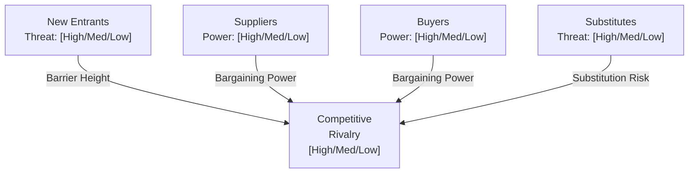

# Porter's Five Forces Analysis

> **Framework**: Michael Porter's Five Forces of Competitive Position
> **Purpose**: Analyze the competitive intensity and attractiveness of an industry

---

## Document Control

| Field                 | Value                                |
| --------------------- | ------------------------------------ |
| **Document Title**    | Porter's Five Forces Analysis        |
| **Organization**      | `[Organization Name]`                |
| **Industry / Market** | `[Industry Name]`                    |
| **Version**           | 1.0                                  |
| **Date**              | `YYYY-MM-DD`                         |
| **Author(s)**         | `[Name(s)]`                          |
| **Reviewed By**       | `[Name(s)]`                          |
| **Approved By**       | `[Name]`                             |
| **Classification**    | `[Public / Internal / Confidential]` |

---

## Five Forces Overview



---

## Force 1: Threat of New Entrants

**Overall Assessment**: `[High / Medium / Low]` | **Score**: `[1-5]`

| Barrier to Entry               | Strength (1-5) | Description     | Trend                            |
| ------------------------------ | -------------- | --------------- | -------------------------------- |
| Economies of Scale             | `[X]`          | `[Description]` | Increasing / Stable / Decreasing |
| Capital Requirements           | `[X]`          | `[Description]` | `[Trend]`                        |
| Brand Identity / Loyalty       | `[X]`          | `[Description]` | `[Trend]`                        |
| Switching Costs                | `[X]`          | `[Description]` | `[Trend]`                        |
| Access to Distribution         | `[X]`          | `[Description]` | `[Trend]`                        |
| Proprietary Technology / IP    | `[X]`          | `[Description]` | `[Trend]`                        |
| Government Policy / Regulation | `[X]`          | `[Description]` | `[Trend]`                        |
| Expected Retaliation           | `[X]`          | `[Description]` | `[Trend]`                        |
| **Weighted Average**           | **`[X]`**      |                 |                                  |

**Recent / Potential Entrants**:

| Entrant     | Origin                                    | Competitive Approach | Threat Level        |
| ----------- | ----------------------------------------- | -------------------- | ------------------- |
| `[Company]` | `[Adjacent industry / Startup / Foreign]` | `[Approach]`         | High / Medium / Low |

**Strategic Response**: `[Description of defensive strategy]`

---

## Force 2: Bargaining Power of Suppliers

**Overall Assessment**: `[High / Medium / Low]` | **Score**: `[1-5]`

| Factor                           | Score (1-5) | Description                            |
| -------------------------------- | ----------- | -------------------------------------- |
| Number of Suppliers              | `[X]`       | `[Few = high power, Many = low power]` |
| Switching Costs                  | `[X]`       | `[Description]`                        |
| Uniqueness of Supply             | `[X]`       | `[Description]`                        |
| Forward Integration Threat       | `[X]`       | `[Description]`                        |
| Importance of Volume to Supplier | `[X]`       | `[Description]`                        |
| Substitute Inputs Available      | `[X]`       | `[Description]`                        |
| **Weighted Average**             | **`[X]`**   |                                        |

**Key Suppliers**:

| Supplier     | Input Provided | % of Supply | Relationship              | Risk Level          |
| ------------ | -------------- | ----------- | ------------------------- | ------------------- |
| `[Supplier]` | `[Input]`      | `[X]%`      | Strategic / Transactional | High / Medium / Low |

**Mitigation Strategies**: `[Description]`

---

## Force 3: Bargaining Power of Buyers

**Overall Assessment**: `[High / Medium / Low]` | **Score**: `[1-5]`

| Factor                      | Score (1-5) | Description     |
| --------------------------- | ----------- | --------------- |
| Buyer Concentration         | `[X]`       | `[Description]` |
| Buyer Volume                | `[X]`       | `[Description]` |
| Switching Costs             | `[X]`       | `[Description]` |
| Price Sensitivity           | `[X]`       | `[Description]` |
| Product Differentiation     | `[X]`       | `[Description]` |
| Backward Integration Threat | `[X]`       | `[Description]` |
| Information Availability    | `[X]`       | `[Description]` |
| **Weighted Average**        | **`[X]`**   |                 |

**Key Buyer Segments**:

| Segment     | Revenue Share | Bargaining Power    | Retention Rate | Strategy     |
| ----------- | ------------- | ------------------- | -------------- | ------------ |
| `[Segment]` | `[X]%`        | High / Medium / Low | `[X]%`         | `[Strategy]` |

---

## Force 4: Threat of Substitutes

**Overall Assessment**: `[High / Medium / Low]` | **Score**: `[1-5]`

| Factor                         | Score (1-5) | Description     |
| ------------------------------ | ----------- | --------------- |
| Number of Substitutes          | `[X]`       | `[Description]` |
| Relative Price-Performance     | `[X]`       | `[Description]` |
| Switching Costs                | `[X]`       | `[Description]` |
| Buyer Propensity to Substitute | `[X]`       | `[Description]` |
| **Weighted Average**           | **`[X]`**   |                 |

**Substitute Products / Services**:

| Substitute     | Provider     | Price Comparison | Performance Comparison          | Trend                        |
| -------------- | ------------ | ---------------- | ------------------------------- | ---------------------------- |
| `[Substitute]` | `[Provider]` | `[+X% / -X%]`    | `[Better / Comparable / Worse]` | Growing / Stable / Declining |

---

## Force 5: Competitive Rivalry

**Overall Assessment**: `[High / Medium / Low]` | **Score**: `[1-5]`

| Factor                  | Score (1-5) | Description     |
| ----------------------- | ----------- | --------------- |
| Number of Competitors   | `[X]`       | `[Description]` |
| Industry Growth Rate    | `[X]`       | `[Description]` |
| Product Differentiation | `[X]`       | `[Description]` |
| Exit Barriers           | `[X]`       | `[Description]` |
| Fixed Cost Intensity    | `[X]`       | `[Description]` |
| Strategic Stakes        | `[X]`       | `[Description]` |
| **Weighted Average**    | **`[X]`**   |                 |

**Competitive Landscape**:

| Competitor       | Market Share | Strategy                       | Strengths     | Weaknesses     |
| ---------------- | ------------ | ------------------------------ | ------------- | -------------- |
| `[Competitor 1]` | `[X]%`       | Cost / Differentiation / Focus | `[Strengths]` | `[Weaknesses]` |
| `[Competitor 2]` | `[X]%`       | `[Strategy]`                   | `[Strengths]` | `[Weaknesses]` |
| **Our Position** | `[X]%`       | `[Strategy]`                   | `[Strengths]` | `[Weaknesses]` |

---

## Five Forces Summary

## Five Forces Summary


---
config:
  radar:
    axisLabelFontSize: 14
---
radar-beta
  title "Five Forces Intensity"
  axis "New Entrants" , "Supplier Power" , "Buyer Power" , "Substitutes" , "Rivalry"
  line "Current" {3, 2, 4, 3, 4}
  line "Projected (3yr)" {4, 3, 4, 4, 5}
```

| Force                               | Score (1-5) | Trend                            | Industry Attractiveness Impact |
| ----------------------------------- | ----------- | -------------------------------- | ------------------------------ |
| Threat of New Entrants              | `[X]`       | Increasing / Stable / Decreasing | `[Description]`                |
| Supplier Power                      | `[X]`       | `[Trend]`                        | `[Description]`                |
| Buyer Power                         | `[X]`       | `[Trend]`                        | `[Description]`                |
| Threat of Substitutes               | `[X]`       | `[Trend]`                        | `[Description]`                |
| Competitive Rivalry                 | `[X]`       | `[Trend]`                        | `[Description]`                |
| **Overall Industry Attractiveness** | **`[Avg]`** |                                  | **`[High / Medium / Low]`**    |

---

## Strategic Recommendations

| Priority | Recommendation     | Force Addressed | Investment | Expected Impact | Timeline     |
| -------- | ------------------ | --------------- | ---------- | --------------- | ------------ |
| 1        | `[Recommendation]` | `[Force]`       | `$[X]`     | `[Impact]`      | `[Timeline]` |
| 2        | `[Recommendation]` | `[Force]`       | `$[X]`     | `[Impact]`      | `[Timeline]` |
| 3        | `[Recommendation]` | `[Force]`       | `$[X]`     | `[Impact]`      | `[Timeline]` |

---

## Industry KPIs to Monitor

| KPI                     | Current | Industry Avg | Target | Frequency |
| ----------------------- | ------- | ------------ | ------ | --------- |
| Market Share            | `[X]%`  | `[X]%`       | `[X]%` | Quarterly |
| Customer Retention Rate | `[X]%`  | `[X]%`       | `[X]%` | Monthly   |
| Gross Margin            | `[X]%`  | `[X]%`       | `[X]%` | Quarterly |
| R&D Spend (% Revenue)   | `[X]%`  | `[X]%`       | `[X]%` | Annually  |
| New Entrant Watch Count | `[X]`   | N/A          | N/A    | Quarterly |

---

## Revision History

| Version | Date         | Author     | Changes       |
| ------- | ------------ | ---------- | ------------- |
| 1.0     | `YYYY-MM-DD` | `[Author]` | Initial draft |
