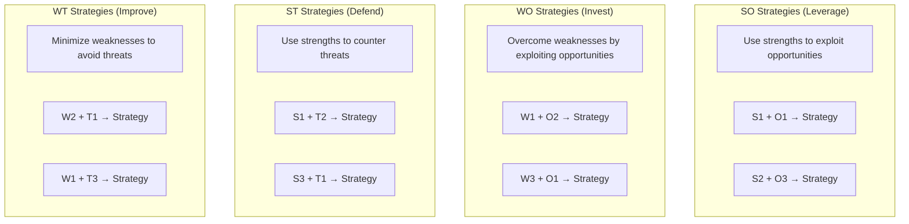

# SWOT Analysis

> **Framework**: Strengths, Weaknesses, Opportunities, Threats
> **Purpose**: Evaluate internal capabilities and external environment for strategic planning

---

## Document Control

| Field              | Value                                    |
| ------------------ | ---------------------------------------- |
| **Document Title** | SWOT Analysis                            |
| **Organization**   | `[Organization Name]`                    |
| **Subject**        | `[Product / Business Unit / Initiative]` |
| **Version**        | 1.0                                      |
| **Date**           | `YYYY-MM-DD`                             |
| **Author(s)**      | `[Name(s)]`                              |
| **Reviewed By**    | `[Name(s)]`                              |
| **Approved By**    | `[Name]`                                 |
| **Classification** | `[Public / Internal / Confidential]`     |

---

## SWOT Matrix

```mermaid
quadrantChart
    title SWOT Strategic Position
    x-axis Internal Weakness --> Internal Strength
    y-axis External Threat --> External Opportunity
    quadrant-1 Leverage (SO)
    quadrant-2 Invest (WO)
    quadrant-3 Improve (WT)
    quadrant-4 Defend (ST)
    Factor A: [0.8, 0.7]
    Factor B: [0.3, 0.8]
    Factor C: [0.7, 0.3]
    Factor D: [0.2, 0.2]
```

---

## Internal Analysis

### Strengths

> Internal attributes and resources that support a successful outcome.

| #   | Strength     | Category                                          | Impact (1-5) | Sustainability      | Evidence |
| --- | ------------ | ------------------------------------------------- | ------------ | ------------------- | -------- |
| S1  | `[Strength]` | People / Process / Technology / Brand / Financial | `[X]`        | High / Medium / Low | `[Data]` |
| S2  | `[Strength]` | `[Category]`                                      | `[X]`        | `[Level]`           | `[Data]` |
| S3  | `[Strength]` | `[Category]`                                      | `[X]`        | `[Level]`           | `[Data]` |
| S4  | `[Strength]` | `[Category]`                                      | `[X]`        | `[Level]`           | `[Data]` |
| S5  | `[Strength]` | `[Category]`                                      | `[X]`        | `[Level]`           | `[Data]` |

### Weaknesses

> Internal attributes and resources that work against a successful outcome.

| #   | Weakness     | Category                                          | Impact (1-5) | Addressability                      | Mitigation Plan |
| --- | ------------ | ------------------------------------------------- | ------------ | ----------------------------------- | --------------- |
| W1  | `[Weakness]` | People / Process / Technology / Brand / Financial | `[X]`        | Quick Fix / Medium-term / Long-term | `[Plan]`        |
| W2  | `[Weakness]` | `[Category]`                                      | `[X]`        | `[Level]`                           | `[Plan]`        |
| W3  | `[Weakness]` | `[Category]`                                      | `[X]`        | `[Level]`                           | `[Plan]`        |
| W4  | `[Weakness]` | `[Category]`                                      | `[X]`        | `[Level]`                           | `[Plan]`        |
| W5  | `[Weakness]` | `[Category]`                                      | `[X]`        | `[Level]`                           | `[Plan]`        |

---

## External Analysis

### Opportunities

> External factors the organization could exploit to its advantage.

| #   | Opportunity     | Source                                    | Probability         | Impact (1-5) | Time Horizon          | Investment Required |
| --- | --------------- | ----------------------------------------- | ------------------- | ------------ | --------------------- | ------------------- |
| O1  | `[Opportunity]` | Market / Technology / Regulatory / Social | High / Medium / Low | `[X]`        | Short / Medium / Long | `$[X]`              |
| O2  | `[Opportunity]` | `[Source]`                                | `[Prob]`            | `[X]`        | `[Horizon]`           | `$[X]`              |
| O3  | `[Opportunity]` | `[Source]`                                | `[Prob]`            | `[X]`        | `[Horizon]`           | `$[X]`              |
| O4  | `[Opportunity]` | `[Source]`                                | `[Prob]`            | `[X]`        | `[Horizon]`           | `$[X]`              |
| O5  | `[Opportunity]` | `[Source]`                                | `[Prob]`            | `[X]`        | `[Horizon]`           | `$[X]`              |

### Threats

> External factors that could jeopardize the organization's success.

| #   | Threat     | Source                                           | Probability         | Impact (1-5) | Time Horizon                      | Response Plan |
| --- | ---------- | ------------------------------------------------ | ------------------- | ------------ | --------------------------------- | ------------- |
| T1  | `[Threat]` | Competitive / Regulatory / Economic / Technology | High / Medium / Low | `[X]`        | Immediate / Short / Medium / Long | `[Plan]`      |
| T2  | `[Threat]` | `[Source]`                                       | `[Prob]`            | `[X]`        | `[Horizon]`                       | `[Plan]`      |
| T3  | `[Threat]` | `[Source]`                                       | `[Prob]`            | `[X]`        | `[Horizon]`                       | `[Plan]`      |
| T4  | `[Threat]` | `[Source]`                                       | `[Prob]`            | `[X]`        | `[Horizon]`                       | `[Plan]`      |
| T5  | `[Threat]` | `[Source]`                                       | `[Prob]`            | `[X]`        | `[Horizon]`                       | `[Plan]`      |

---

## TOWS Strategic Matrix

> Cross-reference SWOT factors to generate strategic options.



| Strategy Type     | SWOT Cross-Reference | Strategic Option         | Priority            | Owner     |
| ----------------- | -------------------- | ------------------------ | ------------------- | --------- |
| **SO (Leverage)** | S`[X]` + O`[X]`      | `[Strategy description]` | High / Medium / Low | `[Owner]` |
| **WO (Invest)**   | W`[X]` + O`[X]`      | `[Strategy description]` | High / Medium / Low | `[Owner]` |
| **ST (Defend)**   | S`[X]` + T`[X]`      | `[Strategy description]` | High / Medium / Low | `[Owner]` |
| **WT (Improve)**  | W`[X]` + T`[X]`      | `[Strategy description]` | High / Medium / Low | `[Owner]` |

---

## Weighted SWOT Scoring

| Factor              | Weight (0-1) | Rating (1-5) | Weighted Score |
| ------------------- | ------------ | ------------ | -------------- |
| **Strengths**       |              |              |                |
| S1: `[Strength]`    | `[X]`        | `[X]`        | `[W x R]`      |
| S2: `[Strength]`    | `[X]`        | `[X]`        | `[W x R]`      |
| **Subtotal**        | **1.0**      |              | **`[Sum]`**    |
| **Weaknesses**      |              |              |                |
| W1: `[Weakness]`    | `[X]`        | `[X]`        | `[W x R]`      |
| W2: `[Weakness]`    | `[X]`        | `[X]`        | `[W x R]`      |
| **Subtotal**        | **1.0**      |              | **`[Sum]`**    |
| **Internal Score**  |              |              | **`[S - W]`**  |
| **Opportunities**   |              |              |                |
| O1: `[Opportunity]` | `[X]`        | `[X]`        | `[W x R]`      |
| O2: `[Opportunity]` | `[X]`        | `[X]`        | `[W x R]`      |
| **Subtotal**        | **1.0**      |              | **`[Sum]`**    |
| **Threats**         |              |              |                |
| T1: `[Threat]`      | `[X]`        | `[X]`        | `[W x R]`      |
| T2: `[Threat]`      | `[X]`        | `[X]`        | `[W x R]`      |
| **Subtotal**        | **1.0**      |              | **`[Sum]`**    |
| **External Score**  |              |              | **`[O - T]`**  |

**Strategic Position**: Internal `[Score]` / External `[Score]` → Quadrant: `[SO / WO / ST / WT]`

---

## Action Plan

| #   | Action     | Derived From             | Owner     | Deadline     | Resources | Status                               |
| --- | ---------- | ------------------------ | --------- | ------------ | --------- | ------------------------------------ |
| 1   | `[Action]` | `[SO/WO/ST/WT strategy]` | `[Owner]` | `YYYY-MM-DD` | `$[X]`    | Not Started / In Progress / Complete |
| 2   | `[Action]` | `[Strategy ref]`         | `[Owner]` | `YYYY-MM-DD` | `$[X]`    | `[Status]`                           |

---

## Monitoring Metrics

| Metric                          | Baseline | Target | Frequency           | Owner     |
| ------------------------------- | -------- | ------ | ------------------- | --------- |
| `[KPI for strength leverage]`   | `[X]`    | `[X]`  | Monthly / Quarterly | `[Owner]` |
| `[KPI for weakness mitigation]` | `[X]`    | `[X]`  | Monthly / Quarterly | `[Owner]` |
| `[KPI for opportunity capture]` | `[X]`    | `[X]`  | Monthly / Quarterly | `[Owner]` |
| `[KPI for threat monitoring]`   | `[X]`    | `[X]`  | Monthly / Quarterly | `[Owner]` |

---

## Revision History

| Version | Date         | Author     | Changes       |
| ------- | ------------ | ---------- | ------------- |
| 1.0     | `YYYY-MM-DD` | `[Author]` | Initial draft |
