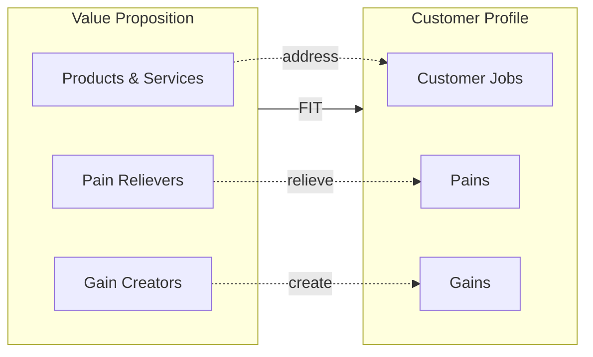
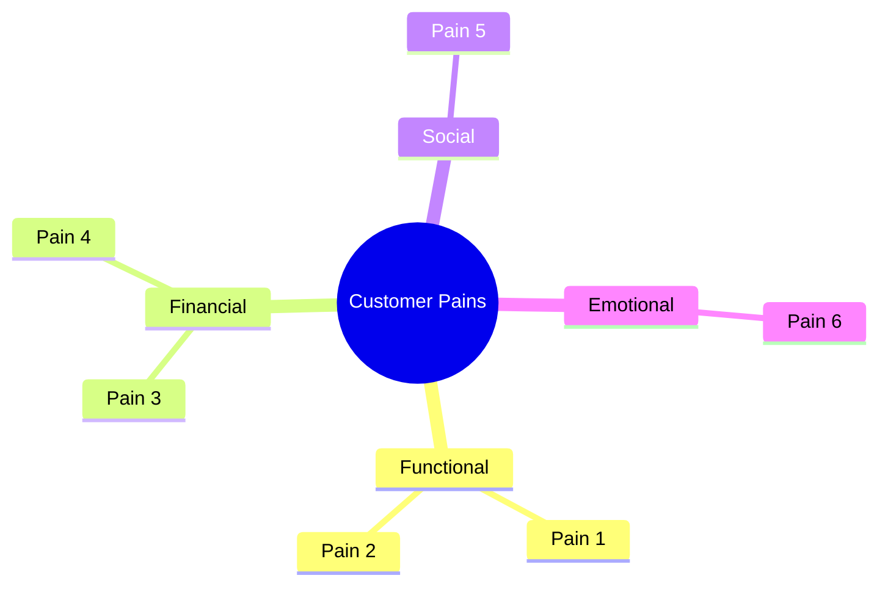
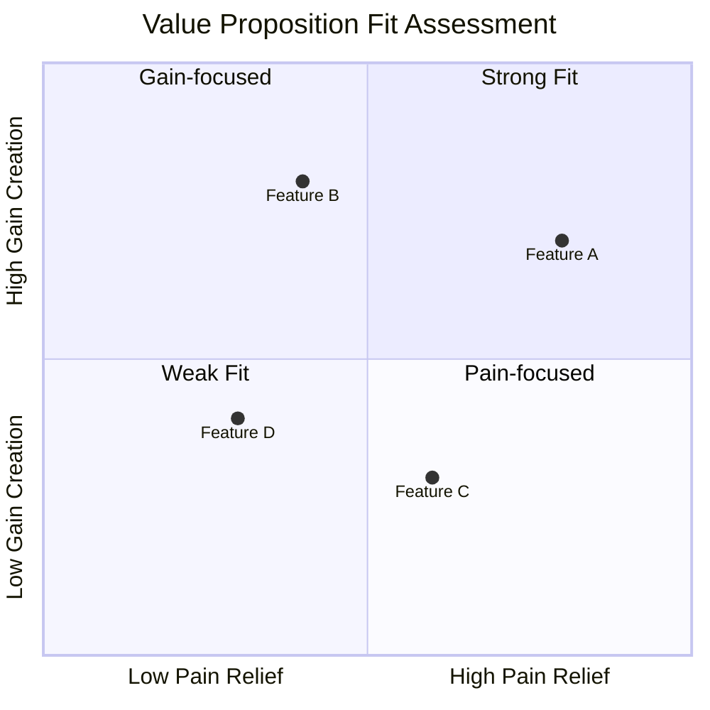

# Value Proposition Canvas

> **Framework**: Strategyzer Value Proposition Design
> **Purpose**: Ensure product-market fit by mapping customer needs to value creation

---

## Document Control

| Field                 | Value                                |
| --------------------- | ------------------------------------ |
| **Document Title**    | Value Proposition Canvas             |
| **Organization**      | `[Organization Name]`                |
| **Product / Service** | `[Product or Service Name]`          |
| **Version**           | 1.0                                  |
| **Date**              | `YYYY-MM-DD`                         |
| **Author(s)**         | `[Name(s)]`                          |
| **Reviewed By**       | `[Name(s)]`                          |
| **Approved By**       | `[Name]`                             |
| **Classification**    | `[Public / Internal / Confidential]` |

---

## Canvas Overview

---

## Customer Profile

### Customer Jobs

> What tasks are customers trying to complete? What problems are they trying to solve?

#### Functional Jobs

| #   | Job Description     | Importance (1-5) | Satisfaction (1-5) | Opportunity Score                            |
| --- | ------------------- | ---------------- | ------------------ | -------------------------------------------- |
| F1  | `[Job description]` | `[X]`            | `[X]`              | `[Importance + (Importance - Satisfaction)]` |
| F2  | `[Job description]` | `[X]`            | `[X]`              | `[Score]`                                    |
| F3  | `[Job description]` | `[X]`            | `[X]`              | `[Score]`                                    |

#### Social Jobs

| #   | Job Description                        | Importance (1-5) | Current Solution     |
| --- | -------------------------------------- | ---------------- | -------------------- |
| S1  | `[How customers want to be perceived]` | `[X]`            | `[Current approach]` |
| S2  | `[Status/influence goals]`             | `[X]`            | `[Current approach]` |

#### Emotional Jobs

| #   | Job Description           | Importance (1-5) | Current Solution     |
| --- | ------------------------- | ---------------- | -------------------- |
| E1  | `[Desired feeling/state]` | `[X]`            | `[Current approach]` |
| E2  | `[Security/comfort need]` | `[X]`            | `[Current approach]` |

### Customer Pains

> What annoys customers before, during, and after trying to get a job done?

| #   | Pain Description     | Severity (1-5) | Frequency                             | Type                                |
| --- | -------------------- | -------------- | ------------------------------------- | ----------------------------------- |
| P1  | `[Pain description]` | `[X]`          | Daily / Weekly / Monthly / Occasional | Undesired outcome / Obstacle / Risk |
| P2  | `[Pain description]` | `[X]`          | `[Frequency]`                         | `[Type]`                            |
| P3  | `[Pain description]` | `[X]`          | `[Frequency]`                         | `[Type]`                            |

### Customer Gains

> What outcomes and benefits do customers expect, desire, or would be surprised by?

| #   | Gain Description     | Type                                       | Impact (1-5) | Expected / Desired / Unexpected |
| --- | -------------------- | ------------------------------------------ | ------------ | ------------------------------- |
| G1  | `[Gain description]` | Required / Expected / Desired / Unexpected | `[X]`        | `[Type]`                        |
| G2  | `[Gain description]` | `[Type]`                                   | `[X]`        | `[Type]`                        |
| G3  | `[Gain description]` | `[Type]`                                   | `[X]`        | `[Type]`                        |

---

## Value Map

### Products & Services

> List all products, services, and features your value proposition is built around.

| #   | Product/Service/Feature | Type                                        | Relevance to Jobs | Priority                                  |
| --- | ----------------------- | ------------------------------------------- | ----------------- | ----------------------------------------- |
| 1   | `[Product/service]`     | Physical / Digital / Intangible / Financial | `[Job #]`         | Must-have / Nice-to-have / Differentiator |
| 2   | `[Product/service]`     | `[Type]`                                    | `[Job #]`         | `[Priority]`                              |
| 3   | `[Product/service]`     | `[Type]`                                    | `[Job #]`         | `[Priority]`                              |

### Pain Relievers

> How exactly do your products and services alleviate specific customer pains?

| Pain Addressed | Pain Reliever    | Effectiveness (1-5) | Evidence             |
| -------------- | ---------------- | ------------------- | -------------------- |
| P1: `[Pain]`   | `[How relieved]` | `[X]`               | `[Data/testimonial]` |
| P2: `[Pain]`   | `[How relieved]` | `[X]`               | `[Data/testimonial]` |
| P3: `[Pain]`   | `[How relieved]` | `[X]`               | `[Data/testimonial]` |

### Gain Creators

> How exactly do your products and services create customer gains?

| Gain Addressed | Gain Creator    | Impact (1-5) | Evidence             |
| -------------- | --------------- | ------------ | -------------------- |
| G1: `[Gain]`   | `[How created]` | `[X]`        | `[Data/testimonial]` |
| G2: `[Gain]`   | `[How created]` | `[X]`        | `[Data/testimonial]` |
| G3: `[Gain]`   | `[How created]` | `[X]`        | `[Data/testimonial]` |

---

## Fit Assessment

### Fit Scorecard

### Fit Level

| Level                    | Description                                                      | Status                               |
| ------------------------ | ---------------------------------------------------------------- | ------------------------------------ |
| **Problem-Solution Fit** | Evidence that customers have jobs, pains, and gains that matter  | Achieved / In Progress / Not Started |
| **Product-Market Fit**   | Evidence that products & services address jobs, pains, and gains | Achieved / In Progress / Not Started |
| **Business Model Fit**   | Evidence of a scalable and profitable business model             | Achieved / In Progress / Not Started |

### Fit Matrix

| Customer Need | Our Solution        | Fit Score (1-5) | Competitive Advantage |
| ------------- | ------------------- | --------------- | --------------------- |
| Job: `[J1]`   | `[Product/Feature]` | `[X]`           | `[Advantage]`         |
| Pain: `[P1]`  | `[Pain Reliever]`   | `[X]`           | `[Advantage]`         |
| Gain: `[G1]`  | `[Gain Creator]`    | `[X]`           | `[Advantage]`         |

---

## Competitive Comparison

| Dimension              | Our Value Proposition | Competitor A       | Competitor B       |
| ---------------------- | --------------------- | ------------------ | ------------------ |
| Primary Jobs Addressed | `[Jobs]`              | `[Jobs]`           | `[Jobs]`           |
| Key Pain Relievers     | `[Relievers]`         | `[Relievers]`      | `[Relievers]`      |
| Key Gain Creators      | `[Creators]`          | `[Creators]`       | `[Creators]`       |
| Unique Differentiation | `[Differentiator]`    | `[Differentiator]` | `[Differentiator]` |
| Price Point            | `$[X]`                | `$[X]`             | `$[X]`             |
| NPS Score              | `[X]`                 | `[X]`              | `[X]`              |

---

## Validation Plan

| Hypothesis       | Test Method                             | Success Metric | Timeline  | Status                                              |
| ---------------- | --------------------------------------- | -------------- | --------- | --------------------------------------------------- |
| `[Hypothesis 1]` | `[Interview / Survey / A-B test / MVP]` | `[Metric]`     | `[Weeks]` | Not Started / In Progress / Validated / Invalidated |
| `[Hypothesis 2]` | `[Method]`                              | `[Metric]`     | `[Weeks]` | `[Status]`                                          |

---

## Metrics & KPIs

| Metric                       | Current    | Target     | Measurement Frequency |
| ---------------------------- | ---------- | ---------- | --------------------- |
| Customer Satisfaction (CSAT) | `[X]`      | `[X]`      | Monthly               |
| Net Promoter Score (NPS)     | `[X]`      | `[X]`      | Quarterly             |
| Feature Adoption Rate        | `[X]%`     | `[X]%`     | Weekly                |
| Time-to-Value                | `[X] days` | `[X] days` | Monthly               |
| Pain Resolution Rate         | `[X]%`     | `[X]%`     | Monthly               |

---

## Revision History

| Version | Date         | Author     | Changes       |
| ------- | ------------ | ---------- | ------------- |
| 1.0     | `YYYY-MM-DD` | `[Author]` | Initial draft |
