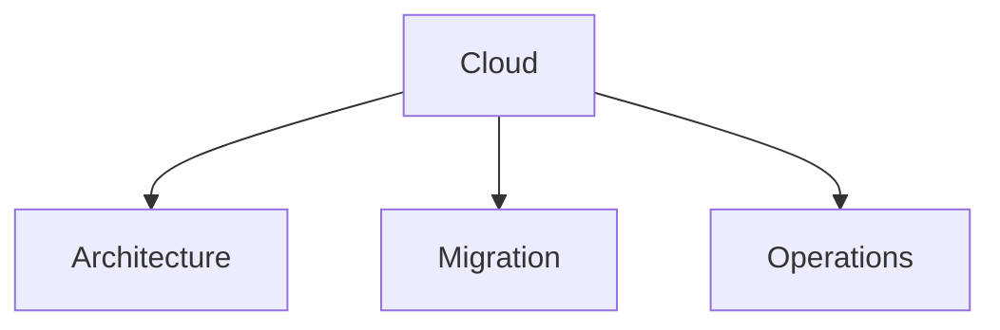

# Cloud

Cloud infrastructure and migration documentation.

## Templates

| Template                                                     | Description              |
| ------------------------------------------------------------ | ------------------------ |
| [cloud_architecture_review.md](cloud_architecture_review.md) | Architecture reviews     |
| [migration_plan.md](migration_plan.md)                       | Cloud migration planning |
| [dr_plan.md](dr_plan.md)                                     | Disaster recovery        |
| [cost_analysis.md](cost_analysis.md)                         | Cloud cost optimization  |
| [infrastructure_diagram.md](infrastructure_diagram.md)       | Infrastructure docs      |

## Structure

See [Parent](../SKILL.md) for all categories.
